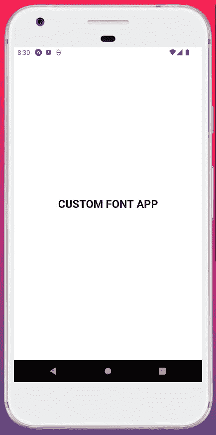
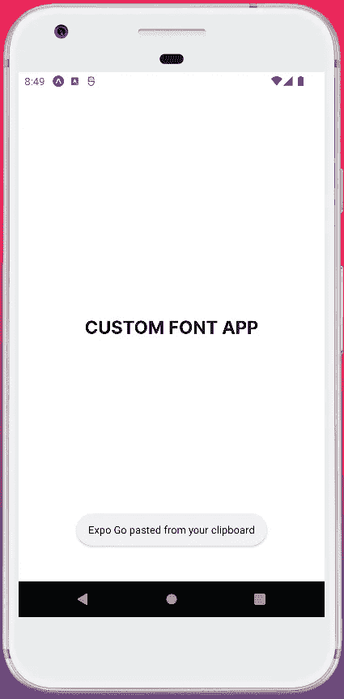

# 如何将自定义 Google 字体与 React Native Expo、NativeBase、TypeScript 配合使用？

> 原文：<https://javascript.plainenglish.io/how-to-use-custom-google-font-with-react-native-expo-nativebase-and-typescript-3a504340f7d2?source=collection_archive---------13----------------------->

## React Native Expo、Nativebase 和 TypeScript 使用自定义 Google 字体的指南。


# 介绍

最近，我开始用 NativeBase 做一个 React 原生项目。我觉得自定义字体指南可能有点难以理解，所以我写这篇博客是为了让事情变得更简单！

# 先决条件

为了跟进这个博客，你应该知道一些事情-

*   反应基础
*   反应本地基础
*   世博会基础知识
*   打字稿基础

# 我正在使用的东西

*   VS 代码:用于编写代码
*   Node.js:对于不同的命令& npm
*   包装:
*   expo ts 模板:用于创建带有类型脚本的 React 本机应用程序
*   expo 字体:用于在 Expo 中使用字体
*   @ Expo-Google-fonts/inter:Google font inter

# 用 Expo 和 TypeScript 初始化应用程序

让我们使用来启动应用程序—(如果 Expo 在全局包中不可用，请安装 Expo)

```
expo init custom-font-with-ts
```

将会开放

```
? Choose a template: » - Use arrow-keys. Return to submit.
    ----- Managed workflow -----
    blank               a minimal app as clean as an empty canvas
>   blank (TypeScript)  same as blank but with TypeScript configuration
    tabs (TypeScript)   several example screens and tabs using react-navigation and TypeScript
    ----- Bare workflow -----
    minimal             bare and minimal, just the essentials to get you started
```

选择`blank (TypeScript)`因为我们将使用 typescript！这需要一些时间。完成后，让我们使用以下代码安装我们的 UI 组件库`nativbase`:

```
yarn add native-base
expo install react-native-svg react-native-safe-area-context
```

安装完成。现在让我们进入`App.tsx`文件并添加`native-base`。该文件将如下所示:

```
import { NativeBaseProvider, Box } from "native-base";export default function App() {
  return (
    <NativeBaseProvider>
      <Box flex={1} bg="#fff" alignItems="center" justifyContent="center">
        Hello world
      </Box>
    </NativeBaseProvider>
  );
}
```

让我们使用`yarn start`来运行它。我们可以在 android、ios 或网络上运行它。我将在 android 中运行它，它看起来像:



作为默认字体系列，它使用以下字体:

```
font-family: -apple-system, BlinkMacSystemFont, "Segoe UI", Roboto, Helvetica, Arial, sans-serif;
```

# 添加谷歌字体

现在让我们在这里添加一些自定义的谷歌字体！我们正在使用 Expo，所以我们需要按照 Expo 的方式安装自定义的谷歌字体:

```
expo install expo-font @expo-google-fonts/inter
```

我用的是国际字体，所以我把它安装在这里。您可以根据需要使用其他字体。点击此处查看 Expo 提供的谷歌字体:

[](https://github.com/expo/google-fonts) [## GitHub - expo/google-fonts:使用 fonts.google.com 上 1000 多种字体(及其变体)中的任何一种

### 在您的世博会应用程序@ Expo-Google-fonts packages for Expo 中使用来自 fonts.google.com 的 1052 种字体和变体中的任何一种

github.com](https://github.com/expo/google-fonts) 

现在我们必须将字体加载到我们的`App.tsx`中。

```
import {
  useFonts,
  Inter_100Thin,
  Inter_200ExtraLight,
  Inter_300Light,
  Inter_400Regular,
  Inter_500Medium,
  Inter_600SemiBold,
  Inter_700Bold,
  Inter_800ExtraBold,
  Inter_900Black,
} from "@expo-google-fonts/inter";
import { NativeBaseProvider, Box, Text } from "native-base";export default function App() {
  let [fontsLoaded] = useFonts({
    Inter_100Thin,
    Inter_200ExtraLight,
    Inter_300Light,
    Inter_400Regular,
    Inter_500Medium,
    Inter_600SemiBold,
    Inter_700Bold,
    Inter_800ExtraBold,
    Inter_900Black,
  }); if (!fontsLoaded) {
    return <></>;
  } return (
    <NativeBaseProvider>
      <Box flex={1} bg="#fff" alignItems="center" justifyContent="center">
        <Text fontSize="2xl" fontWeight="700" textTransform="uppercase">
          Custom Font App
        </Text>
      </Box>
    </NativeBaseProvider>
  );
}
```

我们可以添加自定义字体，但它们现在没有被使用。如果我们查看应用程序，我们将使用查找正在使用的旧字体。所以我们需要通过改变原生基地的主题来改进它！

让我们一起做吧。在根目录下添加一个`theme.ts`文件，并在那里添加字体:

```
import { extendTheme } from "native-base";export const theme = extendTheme({
  fontConfig: {
    Inter: {
      100: {
        normal: "Inter_100Thin",
      },
      200: {
        normal: "Inter_200ExtraLight",
      },
      300: {
        normal: "Inter_300Light",
      },
      400: {
        normal: "Inter_400Regular",
      },
      500: {
        normal: "Inter_500Medium",
      },
      600: {
        normal: "Inter_600SemiBold",
      },
      700: {
        normal: "Inter_700Bold",
      },
      800: {
        normal: "Inter_800ExtraBold",
      },
      900: {
        normal: "Inter_900Black",
      },
    },
  }, *// Make sure values below matches any of the keys in `fontConfig`*
  fonts: {
    heading: "Inter",
    body: "Inter",
    mono: "Inter",
  },
});
```

现在只需将主题与我们当前的`App.tsx`联系起来:

```
import { theme } from "./theme";
...
<NativeBaseProvider theme={theme}>
...
</NativeBaseProvider>
```

现在，我们可以在应用程序中看到新字体。让我们通过`yarn start`重新运行它，看看结果:



这就是我们如何使用 Expo React Native 和 NativeBase 轻松添加谷歌字体的方法！

# 源代码

你可以从这里找到它:

[](https://github.com/nerdjfpb/custom-font-with-ts) [## GitHub-nerdjfpb/custom-font-with-ts:一个为那些正在寻找指南的人准备的基本博客…

### 一个基本的博客，为那些正在寻找一个指南来连接 expo 内的新谷歌字体的人提供…

github.com](https://github.com/nerdjfpb/custom-font-with-ts) 

# 想让项目更上一层楼吗？

探索我如何构建与团队合作的 react 代码(这将节省大量时间)

[](https://blog.nerdjfpb.com/how-to-add-eslint-prettier-and-husky-git-hook-in-react-js-2022/) [## 如何在 React JS 2022 | Nerdjfpb 写作中添加 ESlint、Prettier、Husky (Git Hook)

### 今天我们要让我们的生活轻松一点！作为开发人员，我们必须在团队中工作(在大多数情况下)…

blog.nerdjfpb.com](https://blog.nerdjfpb.com/how-to-add-eslint-prettier-and-husky-git-hook-in-react-js-2022/) 

# 有问题吗？

将 dm 放在— [Twitter](https://twitter.com/nerdjfpb) 上。

# 想成为一个令人惊叹的编程社区的一员并参与免费编程活动吗？

加入我们的[不和谐服务器](https://discord.gg/WBvHdMCYC7)。

# 想为你的下一个项目雇用我吗？

帮我接 [LinkedIn](https://www.linkedin.com/in/nerdjfpb/) 。

*更多内容看* [***说白了就是 io***](https://plainenglish.io/) *。报名参加我们的* [***免费周报***](http://newsletter.plainenglish.io/) *。关注我们关于*[***Twitter***](https://twitter.com/inPlainEngHQ)*和*[***LinkedIn***](https://www.linkedin.com/company/inplainenglish/)*。加入我们的* [***社区***](https://discord.gg/GtDtUAvyhW) *。*