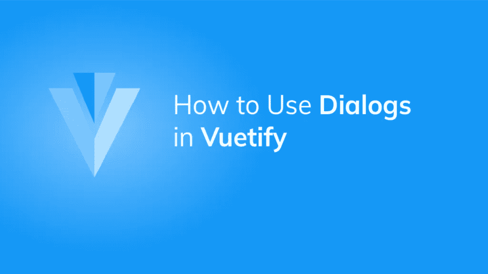
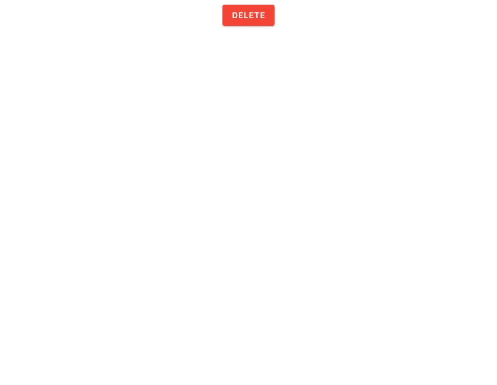
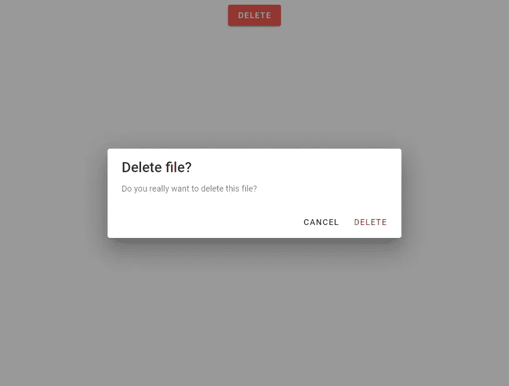
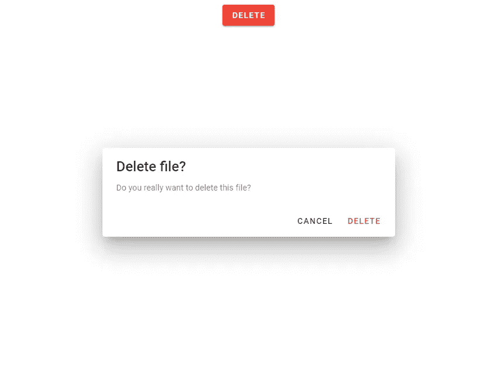
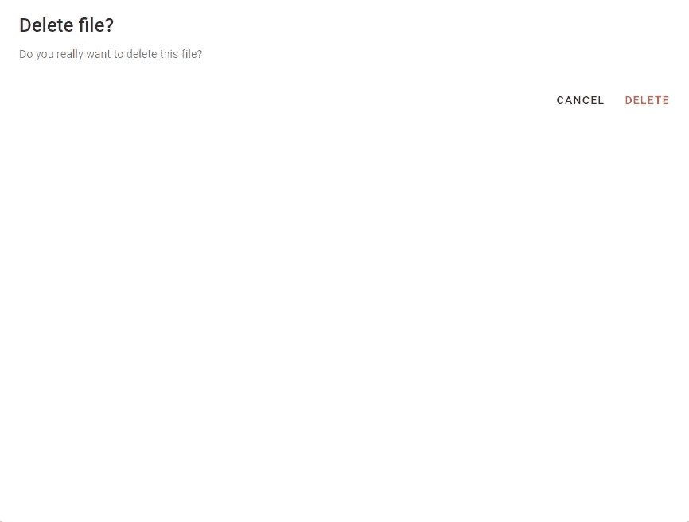

# 如何用 Vuetify 创建对话框

> 原文：<https://javascript.plainenglish.io/how-to-use-dialogs-in-vuetify-856256b680a4?source=collection_archive---------25----------------------->



我们可以使用对话框与用户互动。它们传递信息，并允许对它们采取某些行动。Vuetify 提供了用于创建对话框的`v-dialog`组件。在本文中，让我们看看如何在实践中使用这个组件。

在下面的代码中，我们创建了一个对话框和一个[红色](https://codingbeautydev.com/blog/how-to-use-buttons-in-vuetify/)[的](https://codingbeautydev.com/blog/how-to-use-color-in-vuetify/)按钮:

```
<template>
  <v-app>
    <div class="text-center">
      <v-dialog v-model="dialog" width="500">
        <template v-slot:activator="{ on, attrs }">
          <v-btn v-bind="attrs" v-on="on" class="mt-2" color="red" dark>
            Delete
          </v-btn>
        </template> <v-card>
          <v-card-title class="text-h5"> Delete file? </v-card-title> <v-card-text> Do you really want to delete this file? </v-card-text> <v-card-actions>
            <v-spacer></v-spacer>
            <v-btn text @click="dialog = false"> Cancel </v-btn>
            <v-btn color="red" text @click="dialog = false"> Delete </v-btn>
          </v-card-actions>
        </v-card>
      </v-dialog>
    </div>
  </v-app>
</template><script>
export default {
  name: 'App',
  data: () => ({
    dialog: false,
  }),
};
</script>
```

我们已经将[按钮](https://codingbeautydev.com/blog/how-to-use-buttons-in-vuetify/)放置在`v-dialog`组件的`activator`槽中。这个槽提供了一些道具- `on`和`attrs`，我们用来设置[按钮](https://codingbeautydev.com/blog/how-to-use-buttons-in-vuetify/)的道具和事件处理程序。我们使用一个[卡](https://codingbeautydev.com/blog/how-to-use-cards-in-vuetify/)来创建对话框的主体。



点击[按钮](https://codingbeautydev.com/blog/how-to-use-buttons-in-vuetify/)时出现对话框:



# 使用“隐藏-覆盖”道具

对话框打开时有一个覆盖，正如我们在上面的图像中看到的。我们可以通过将`hide-overlay`属性设置为`true`来隐藏这个覆盖:

```
<template>
  <v-app>
    <div class="text-center">
      <v-dialog v-model="dialog" width="500" hide-overlay>
        <template v-slot:activator="{ on, attrs }">
          <v-btn v-bind="attrs" v-on="on" class="mt-2" color="red" dark>
            Delete
          </v-btn>
        </template> <v-card>
          <v-card-title class="text-h5"> Delete file? </v-card-title> <v-card-text> Do you really want to delete this file? </v-card-text> <v-card-actions>
            <v-spacer></v-spacer>
            <v-btn text @click="dialog = false"> Cancel </v-btn>
            <v-btn color="red" text @click="dialog = false"> Delete </v-btn>
          </v-card-actions>
        </v-card>
      </v-dialog>
    </div>
  </v-app>
</template>
```

它看起来像这样:



# 用美化来美化

使用 Vuetify 材料设计框架创建优雅 web 应用程序的完整指南。


在这里免费下载[](https://mailchi.mp/583226ee0d7b/beautify-with-vuetify)****！****

# **创建全屏对话框**

**通过将`fullscreen`属性设置为`true`，我们可以让对话框覆盖页面的整个视窗:**

```
<template>
  <v-app>
    <div class="text-center">
      <v-dialog v-model="dialog" width="500" fullscreen>
        <template v-slot:activator="{ on, attrs }">
          <v-btn v-bind="attrs" v-on="on" class="mt-2" color="red" dark>
            Delete
          </v-btn>
        </template> <v-card>
          <v-card-title class="text-h5"> Delete file? </v-card-title> <v-card-text> Do you really want to delete this file? </v-card-text> <v-card-actions>
            <v-spacer></v-spacer>
            <v-btn text @click="dialog = false"> Cancel </v-btn>
            <v-btn color="red" text @click="dialog = false"> Delete </v-btn>
          </v-card-actions>
        </v-card>
      </v-dialog>
    </div>
  </v-app>
</template>
...
```

****

# **使用自定义对话框过渡**

**我们可以使用`transition`道具自定义对话框出现在屏幕上的过渡。在下面的代码中，我们将其设置为`dialog-bottom-transition`，这将使对话框在打开时从底部滑入:**

```
<template>
  <v-app>
    <div class="text-center">
      <v-dialog
        v-model="dialog"
        width="500"
        transition="dialog-bottom-transition"
      >
        <template v-slot:activator="{ on, attrs }">
          <v-btn v-bind="attrs" v-on="on" class="mt-2" color="red" dark>
            Delete
          </v-btn>
        </template> <v-card>
          <v-card-title class="text-h5"> Delete file? </v-card-title> <v-card-text> Do you really want to delete this file? </v-card-text> <v-card-actions>
            <v-spacer></v-spacer>
            <v-btn text @click="dialog = false"> Cancel </v-btn>
            <v-btn color="red" text @click="dialog = false"> Delete </v-btn>
          </v-card-actions>
        </v-card>
      </v-dialog>
    </div>
  </v-app>
</template>
...
```

**如果我们想让它从顶部滑入，我们可以将相同的道具设置为`dialog-top-transition`:**

```
<template>
  <v-app>
    <div class="text-center">
      <v-dialog
        v-model="dialog"
        width="500"
        transition="dialog-bottom-transition"
      >
        <template v-slot:activator="{ on, attrs }">
          <v-btn v-bind="attrs" v-on="on" class="mt-2" color="red" dark>
            Delete
          </v-btn>
        </template> <v-card>
          <v-card-title class="text-h5"> Delete file? </v-card-title> <v-card-text> Do you really want to delete this file? </v-card-text> <v-card-actions>
            <v-spacer></v-spacer>
            <v-btn text @click="dialog = false"> Cancel </v-btn>
            <v-btn color="red" text @click="dialog = false"> Delete </v-btn>
          </v-card-actions>
        </v-card>
      </v-dialog>
    </div>
  </v-app>
</template>
...
```

# **如何让对话持久化**

**默认情况下，可以通过单击或点击对话框外部的某个地方来关闭 Vuetify 对话框。如果我们不想这样，我们可以将`persistent`属性设置为 true:**

```
<template>
  <v-app>
    <div class="text-center">
      <v-dialog
        v-model="dialog"
        width="500"
        persistent
      >
        <template v-slot:activator="{ on, attrs }">
          <v-btn v-bind="attrs" v-on="on" class="mt-2" color="red" dark>
            Delete
          </v-btn>
        </template> <v-card>
          <v-card-title class="text-h5"> Delete file? </v-card-title> <v-card-text> Do you really want to delete this file? </v-card-text> <v-card-actions>
            <v-spacer></v-spacer>
            <v-btn text @click="dialog = false"> Cancel </v-btn>
            <v-btn color="red" text @click="dialog = false"> Delete </v-btn>
          </v-card-actions>
        </v-card>
      </v-dialog>
    </div>
  </v-app>
</template>
...
```

# **摘要**

**Vuetify 提供了用于在用户界面中创建对话框的`v-dialog`组件。我们可以改变这些对话框的某些属性，比如让它们全屏显示，或者改变它们在屏幕上的过渡。**

**[*注册*](http://eepurl.com/hRfyJL) *获取我们的每周时事通讯，了解我们最新的精彩内容！***

***在*[*codingbeautydev.com*](https://codingbeautydev.com/blog/vuetify-dialog/)*获取更新文章。***