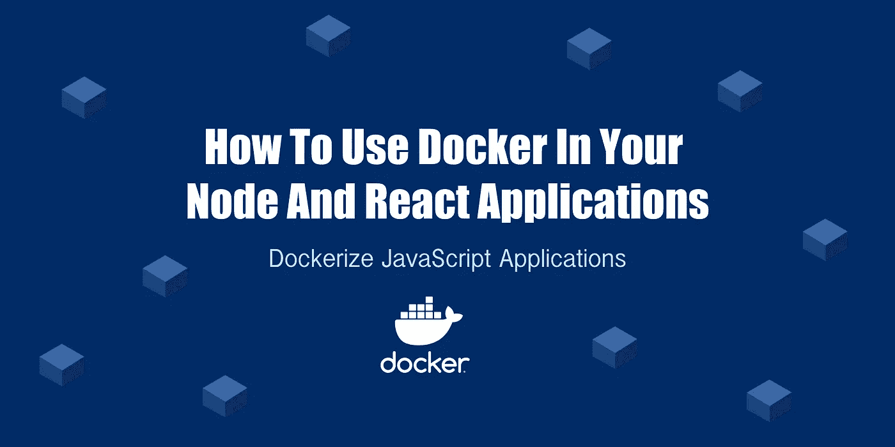

# 如何在 Node.js 和 React 应用程序中使用 Docker

> 原文：<https://javascript.plainenglish.io/how-to-use-docker-in-your-node-and-react-applications-8dd3cbd44853?source=collection_archive---------9----------------------->

## 如何在 Docker 容器中创建和运行 Node.js-Express 后端和 React 前端。



Docker 让开发人员能够将他们所有的应用程序打包到容器中。这些容器可以在任何安装了 Docker 的机器上运行，应用程序也是一样的。这是在多个系统上运行一个代码库克隆的好方法，并且你可以确定它们都是一样的。

当使用 Docker 时，CI/CD 工作流和 DevOps 测试环境明显更好，Docker 本质上是一组可以共享的软件工具。Kubernetes 是另一个用于操作多个 Docker 容器的工具，但是规模要大得多。

在本教程中，我们将学习如何在 Docker 容器中创建和运行 Node.js-Express 后端和 React 前端。

# 在 Docker 中运行 Node.js-Express 后端

开始之前，请确保您的计算机上安装并运行了 Docker。

现在使用命令行导航到一个目录，比如你的桌面，然后运行下面的命令。

```
mkdir my-app-docker
cd my-app-docker
touch docker-compose.yml
mkdir api
cd api
npm init -y
npm i express
touch app.js Dockerfile .dockerignore
cd ..
```

我们设置了一个名为 api 的后端，并创建了一些 Docker 文件。现在，在代码编辑器中打开项目，并将下面的代码添加到相应的文件中。

将此放入`docker-compose.yml`文件。小心 YAML 格式，否则，你会得到 Docker 错误，当你试图运行它。

```
version: '3.8'
services:
  api:
    build: ./api
    container_name: api_backend
    ports:
      - '4000:4000'
    volumes:
      - ./api:/app
      - ./app/node_modules
```

将此添加到`app.js`文件中:

```
const express = require('express');const app = express();const port = process.env.PORT || 4000;app.get('/', (req, res) => {
  res.send('Home Route');
});app.listen(port, () =>
  console.log(`Server running on port ${port}, http://localhost:${port}`)
);
```

现在将这一行添加到`.dockerignore`文件中:

```
node_modules
```

接下来，将这段代码添加到`Dockerfile`文件中:

```
FROM node:16-alpineWORKDIR /appCOPY package.json .RUN npm installCOPY . .EXPOSE 4000CMD ["node", "app.js"]
```

最后，将这个运行脚本添加到`package.json`文件中:

```
"scripts": {"start": "node app.js"},
```

**(可选)使用 Nodemon 让服务器在发生变化时自动重启**

如果您想让服务器在每次更改后端文件时都重新启动，那么您可以将其配置为使用 Nodemon。

你所要做的就是更新 **api** 文件夹中的`Dockerfile`和`package.json`文件。

使用以下代码更新`Dockerfile`中的代码。我们现在开始安装 Nodemon，并使用 **dev** 作为运行命令。

```
FROM node:16-alpineRUN npm install -g nodemonWORKDIR /appCOPY package.json .RUN npm installCOPY . .EXPOSE 4000CMD ["npm", "run", "dev"]
```

现在用 Nodemon 的运行脚本更新`package.json`文件。

```
"scripts": {"start": "node app.js","dev": "nodemon -L app.js"},
```

我们刚刚创建了一个运行在端口 4000 上的基本 Node.js-Express 应用程序。该端口还映射到 docker 中的 4000，这使我们可以在 Docker 容器中运行它。

# 启动服务器

要像 normal 一样使用 Node 在 Docker 容器之外运行服务器，只需在命令行中运行下面的代码。您需要确保您在 api 文件夹中。如果你去 [http://localhost:4000](http://localhost:4000/) 你应该会在你的浏览器窗口看到回家的路线。

```
npm run start
```

让 Node.js-Express 应用程序在 Docker 中运行需要不同的命令。首先，您需要在根文件夹中找到`docker-compose.yml`文件。现在运行下面的命令，它应该在 Docker 容器中运行。

不要忘记首先停止节点服务器的运行，因为在端口 4000 上只能运行一个服务器。

```
docker-compose up
```

如果你访问 http://localhost:4000 ，你应该会在你的浏览器窗口看到回家的路线。

你可以用下面的命令停止服务器，或者你可以使用 Docker 应用程序停止容器的运行。

```
docker-compose down
```

# 在 Docker 中运行 React 前端

现在让我们创建一个反应前端！使用命令行进入 my-app-docker 的根文件夹。运行下面的命令来设置项目。

```
npx create-react-app client
cd client
touch .dockerignore Dockerfile
```

现在将下面的代码添加到它们对应的文件中。

将这一行添加到`.dockerignore`文件中。

```
node_modules
```

把这段代码放到`Dockerfile`文件中。

```
FROM node:17-alpineWORKDIR /appCOPY package.json .RUN npm installCOPY . .EXPOSE 3000CMD ["npm", "start"]
```

最后，用下面的代码更新根文件夹中的`docker-compose.yml`。我们在底部添加了一个客户端部分，用于设置 React 在 Docker 容器中的运行。小心 YAML 格式，否则，你会得到 Docker 错误，当你试图运行它。

```
version: '3.8'
services:
  api:
    build: ./api
    container_name: api_backend
    ports:
      - '4000:4000'
    volumes:
      - ./api:/app
      - ./app/node_modules
  client:
    build: ./client
    container_name: client_frontend
    ports:
      - '3000:3000'
    volumes:
      - ./client:/app
      - ./app/node_modules
    stdin_open: true
    tty: true
```

# 启动服务器

要像 normal 一样使用 Node 在 Docker 容器之外运行服务器，只需在命令行中运行下面的代码。确保您在客户端文件夹中。如果你去 [http://localhost:3000](http://localhost:3000/) 你应该会在你的浏览器窗口看到回家的路线。

```
npm run start
```

让 React 应用程序在 Docker 中运行需要不同的命令。首先，你需要在根文件夹中找到`docker-compose.yml`文件。现在运行下面的命令，它应该在 Docker 容器中运行。

不要忘记首先停止 React 应用服务器的运行，因为在端口 3000 上只能运行一个服务器。

```
docker-compose up
```

如果你去 [http://localhost:3000](http://localhost:3000/) 你应该会在你的浏览器窗口看到回家的路线。

你可以用下面的命令停止服务器，或者你可以使用 Docker 应用程序停止容器的运行。

```
docker-compose down
```

通过这种设置，您可以在 Docker 中同时运行 Node.js 后端和 React 前端！如果您遇到任何错误，那么您可能需要打开您的 Docker 桌面应用程序，并删除任何与此项目相关的图像。然后你可以试着再次运行`docker-compose up`命令，希望这一次一切都像预期的那样工作。

*更多内容尽在* [***说白了. io***](https://plainenglish.io/) *。报名参加我们的* [***免费周报***](http://newsletter.plainenglish.io/) *。关注我们关于* [***推特***](https://twitter.com/inPlainEngHQ) *和*[***LinkedIn***](https://www.linkedin.com/company/inplainenglish/)*。查看我们的* [***社区不和谐***](https://discord.gg/GtDtUAvyhW) *加入我们的* [***人才集体***](https://inplainenglish.pallet.com/talent/welcome) *。*