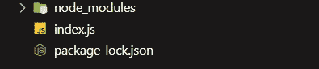
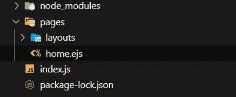
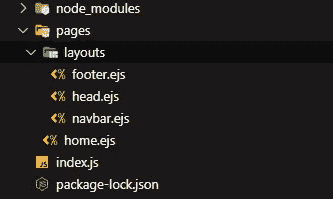
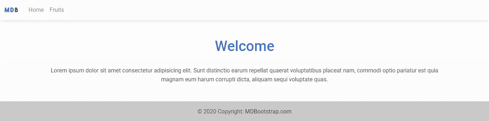
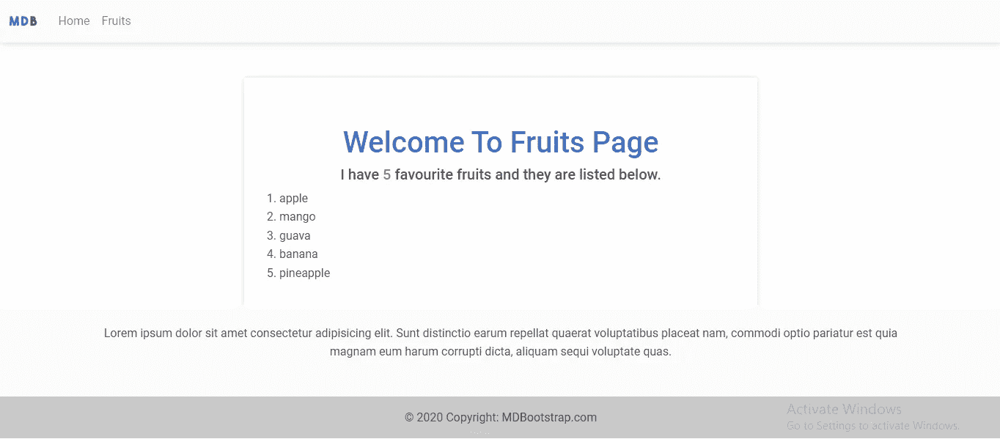
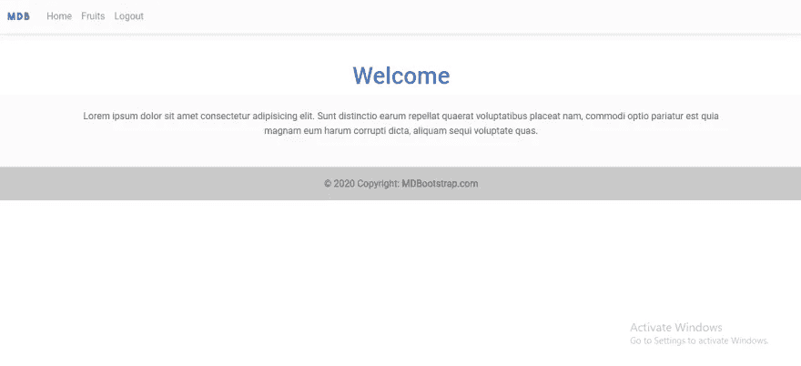
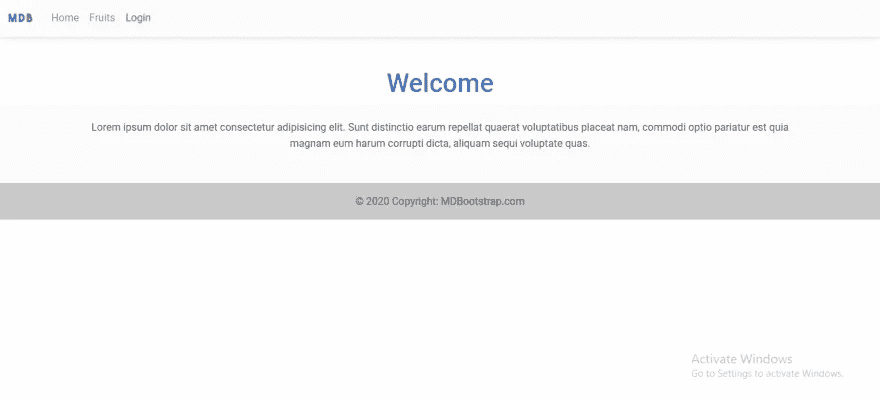

# 如何在 Node.js 中使用嵌入式 JavaScript (EJS)作为模板引擎

> 原文：<https://javascript.plainenglish.io/how-to-use-embedded-javascript-ejs-as-a-template-engine-in-nodejs-full-explanation-80f0d3b92fed?source=collection_archive---------4----------------------->

## 什么是模板引擎？模板引擎是一种使您能够在应用程序中使用静态模板文件的机制。


Photo By Joan Gamell on Unsplash

在我们开始之前，让我们了解什么是模板引擎。

模板引擎是一种使您能够在应用程序中使用静态模板文件的机制。它将 web 模板文件中的变量替换为实际值(在运行时)，然后将模板转换为 HTML 文件，并与动态数据一起发送给客户端。

所以我们可以说，它帮助我们创建动态 HTML 内容！

在本文中，我将向您展示如何使用 EJS 作为 Node.js 应用程序的模板引擎。我还将使用 MDB 的 CDN 链接作为我们的 CSS 框架。

# 安装快速和 EJS

首先，创建一个文件夹(想怎么命名就怎么命名)，然后创建一个`index.js`文件。

现在你需要通过终端安装`express`:

```
$ npm install express
```

一旦安装了 Express，安装`ejs`，这是我们的模板引擎:

```
$ npm install ejs
```

现在你的文件夹结构应该看起来像下面的图片:



# 设置您的应用

我们需要导入`express` & `ejs`，然后配置我们的应用程序使用快速功能。

在您的`index.js`文件中，键入以下代码:

现在我们需要创建一个`pages`文件夹来存储我们的 HTML 页面。这个文件夹将有一个名为`layouts`的子文件夹，它将存储我们的 HTML 页面的子部分，如导航栏和页脚。

一旦你创建了`pages`文件夹，创建一个文件并命名为`home.ejs`。该文件将成为我们主页的模板:



现在我们需要告诉 express 使用`ejs`作为我们的模板引擎(视图引擎),因为我们的`views`目录将会不同，我们将告诉 express 使用`./pages`文件夹作为我们的`views`目录。

*`*views*`*目录是存储您所有模板文件的目录。**

*让我们创建一个简单的 HTML 页面，欢迎我们进入应用程序的主页。*

*复制下面的 HTML 并粘贴到`pages/home.ejs`文件中，这是我们主页的模板:*

# *创建路线*

*在`index.js`文件中，我们将创建一个到主页的路径，并呈现负责主页的 HTML 模板。*

*我将使用`render`方法来渲染负责主页的模板。*

*该方法接受两个参数，它们是:*

*   *我们试图呈现的 HTML 页面的文件名*
*   *我们希望发送到页面数据*

*确保您试图渲染的文件存在于视图目录中，即`/pages`文件夹*

*因为我想在用户导航到我们网站的根目录时将文件`home.ejs`呈现为主页，所以我会这样做*

*注意，我们没有在 render 方法中提供`home.ejs`文件的扩展名。*

*现在，在我们启动我们的应用程序之前，我们需要让它监听所提供的端口号。*

*下面是`index.js`的完整代码:*

# *启动您的应用程序*

*使用终端，启动您的应用程序:*

```
*$ node index.js*
```

*然后在你的浏览器上访问这个网址`localhost:5000`*

*如果您正确地遵循了这些步骤，您应该会看到欢迎页面:*

**

*如果你已经到了这一步，这里有一轮掌声，因为你即将理解`ejs`是如何工作的。*

**

# *创建页面布局*

*现在我们需要为所有页面创建 3 个布局。这些布局将存在于`./pages/layouts/`目录下的不同文件中*

*因此，在这个目录`./pages/layouts/`中，创建一个`head.ejs`文件并添加下面的代码:*

*仅仅看一下上面的代码，你就应该知道它是放在网页的`head`标签里面的内容。*

*仍然在`./pages/layouts/`目录中，创建一个`navbar.ejs`文件并添加以下代码:*

*最后，在同一个目录中创建一个`footer.ejs`文件，然后添加下面的代码:*

*目前，我们的主页，也就是`home.ejs`文件没有吸引力。*

*让我们包括布局；使用 ejs 的页眉、导航栏和页脚。*

*要在页面中包含布局，请将下面的代码放在希望布局呈现的任何位置:*

```
*<%- include('PATH_TO_LAYOUT') %>*
```

*这意味着无论您将代码放在哪里，它都将导入指定的布局并在那里呈现。*

*这也意味着您对布局所做的任何更改都会影响包含它的任何页面。*

*所以在`home.ejs`文件中，我会做这样的事情:*

*为了确保我们在同一页上，这是我的文件夹结构。*

**

*现在让我们重新加载我们的浏览器并检查到目前为止的进度:*

**

*你可以证明，用最少的代码，我们仍然能够生成一个完整的主页。*

*让我们继续前进！*

**

# *编写动态 HTML*

*现在，我们准备将数据从后端发送到前端。*

*让我们创建一个呈现`fruits`页面的路径。该页面还将从后端接收水果进行显示。*

*回想一下，`render`方法接受两个参数，它们是:*

*   *我们试图呈现的 HTML 页面的文件名*
*   *我们希望发送到页面数据*

*所以在我的例子中，我希望将水果数组作为数据发送到页面。*

*现在在`./pages/`目录下创建一个新的`fruits.ejs`模板，然后添加下面的代码:*

# *是解释的时候了*

*如果您查看上面的代码片段，您会注意到这段代码`<%= fruitsAry.length %>`类似于用来包含布局的代码。*

*除了这个允许我们直接访问和打印渲染数据。*

*所以我下面有一个小语法来演示它是如何工作的:*

*   *如果您想执行代码或访问呈现的数据而不将其打印出来，请执行以下操作:*

```
*<% CODE_TO_EXECUTE %>*
```

*   *但是，如果您想执行代码或访问呈现的数据&并将其打印出来，请执行以下操作:*

```
*<%= CODE_TO_EXECUTE %>
//or
<%- CODE_TO_EXECUTE %>*
```

*   *不要忘记在页面上包含布局的语法:*

```
*<%- include("PATH_TO_LAYOUT") %>*
```

*有了这个`<% for(let i=0; i < fruitsAry.length; i++){ ... }%>`，我们能够嵌入 JavaScript 代码(这就是为什么它被称为嵌入式 JavaScript，对吗？)使用一个`for loop`遍历从后端发送的水果数组，然后为数组中的每个水果创建一个列表项。*

*重启服务器，然后在浏览器上访问该 URL`localhost:5000/fruits`*

**

*太神奇了…对吧？*

**

# *让我们写一个条件语句*

*就像我上面解释的将 JavaScript 直接嵌入模板文件一样，也可以在这个文件中编写条件语句。*

*比方说，我有一个变量`loggedIn`来检查用户是否登录了我们的应用程序，也就是说，如果用户登录了，这个变量的值将是`true`，如果用户没有登录，这个值将是`false`。*

*现在我想使用这个变量有条件地在我的导航栏上显示两个链接中的一个，它们是`login`和`logout`。如果用户未登录，您将在导航栏上看到`login`，如果用户已登录，您将看到`logout`。*

*在`./layouts/navbar`文件中，将下面的代码添加到水果的导航项之后。*

*现在，我们需要修改我们的服务器文件`./index.js`并将变量`loggedIn`添加到全局空间，以便它可以被我们应用程序中的所有页面访问。*

*就在到主页的路径之前，添加以下代码*

```
*//make variable globally accessible
global.loggedIn = false //default value is false*
```

*现在让我们为登录和注销页面创建路由。如果您点击登录，它会将全局变量设置为`true`，如果您点击注销，它会将全局变量设置为`false`*

*就在到`fruits`页面的路线之后，添加以下代码*

*现在让我们重新加载服务器并进行测试。*

*这是当我点击登录链接时在我的导航栏上发生的事情*

**

*你会在导航栏上看到`logout`链接，而不是`login`*

*现在让我们点击`logout`链接*

**

*太棒了。有一个`login`链接。*

# *结论*

*我们已经在本文中介绍了如此多的细节。以下是我们到目前为止所做工作的总结:*

*   *在你可以在你的应用中使用`ejs`模板引擎之前，你必须告诉 express 使用它作为你的视图引擎。*
*   *如果您有不同的`views`目录，告诉 express 使用它，然后确保它包含您的模板。*
*   *使用布局来存储其他页面需要的页面部分。例如导航条、页脚等。*
*   *`render`方法接受两个参数。*
*   *第一个是您试图呈现的模板。*
*   *第二个是您想要发送到该模板的数据。该数据必须作为`object`传递。*
*   *您开始使用语法`<% ... %>`在模板中嵌入 JavaScript。*
*   *要在页面上包含布局，必须使用语法`<%- include('PATH_TO_LAYOUT_FILE') %>`指定布局文件的路径。*
*   *要访问和打印从后端发送的数据，使用语法`<%= THE_OBJECT_KEY %>`或`<%- THE_OBJECT_KEY %>`，其中`the_object_key`是从`res.render( 'SOME_TEMPLATE', { KEY : VALUE } )`发送的密钥。*

*目前就这些。如果您想要这篇文章的源代码，请访问下面的我的 GitHub repo:*

*[](https://github.com/Octagon-simon/ejs-class) [## GitHub - Octagon-simon/ejs-class:学习如何使用嵌入式 javascript (ejs)作为模板引擎…

### 此时您不能执行该操作。您已使用另一个标签页或窗口登录。您已在另一个选项卡中注销，或者…

github.com](https://github.com/Octagon-simon/ejs-class) 

如果您有任何问题、建议或贡献，请随时在下面留言，我会处理的。

你喜欢这篇文章吗？[考虑给我小费](https://www.paypal.com/donate/?hosted_button_id=ZYK9PQ8UFRTA4)😁

感谢您的阅读。* 

**更多内容请看*[***plain English . io***](https://plainenglish.io/)*。报名参加我们的* [***免费周报***](http://newsletter.plainenglish.io/) *。关注我们关于*[***Twitter***](https://twitter.com/inPlainEngHQ)[***LinkedIn***](https://www.linkedin.com/company/inplainenglish/)*[***YouTube***](https://www.youtube.com/channel/UCtipWUghju290NWcn8jhyAw)*[***不和***](https://discord.gg/GtDtUAvyhW) *。对增长黑客感兴趣？检查* [***电路***](https://circuit.ooo/) *。****