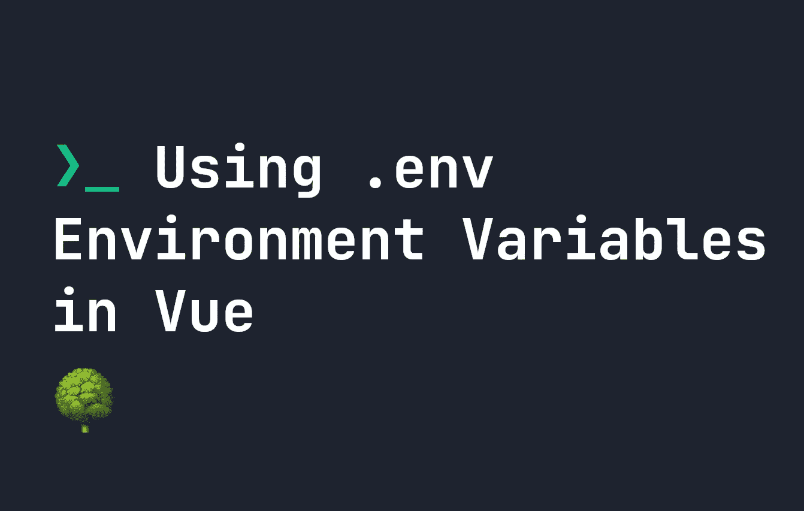

# 如何使用。Vue.js 中的 env 环境变量

> 原文：<https://javascript.plainenglish.io/how-to-use-env-environment-variables-in-vue-js-790cdc10f7aa?source=collection_archive---------7----------------------->

## 在本指南中，我们将讨论如何使用。Vue 中的 env 变量，以及如何在？每个环境的 env 文件。



当我们创建 Node.js 应用程序时，通常我们还会创建一个存储所有环境变量的`.env`文件。这个文件通常是私有的，可以用来存储 API 键、URL 和其他特定于一个环境的东西。

Vue.js 也允许我们使用`.env`变量，但是它的工作方式略有不同。那么我们来看看如何在 Vue.js 中使用`.env`变量

**注意**:在本指南中，我假设你已经安装了`vue-cli-service`。您可以使用`npm install -g @vue/cli`将它安装到您的项目中。Vue CLI ( `vue-cli-service`)让我们能够在运行应用程序时使用`.env`。

# 使用。Vue.js 中的 env 变量

在 Vue CLI 中，`.env`的工作方式与您预期的差不多。在您的基本目录中，您可以制作一个`.env`文件，如下所示:

# 典型的 Vue.js 文件夹结构。包封/包围（动词 envelop 的简写）

```
|- public <-- Our public folder
|- src <-- Our src folder 
|- .env <-- Our .env file
```

在我们的`.env`文件本身中，我们可以开始定义我们的`.env`变量。Vue CLI 实际上支持`.env`文件的几种不同名称:

```
.env                # loaded on all projects
.env.local          # loaded on all projects, but ignored by git by default
.env.[mode]         # only loaded in a specific mode
.env.[mode].local   # only loaded in a specific mode, but ignored by git by default
```

你可能会注意到，我们上面有这个**模式**的概念。Vue CLI 中的模式是您正在使用的环境。在特定模式下构建 Vue.js 应用程序的最简单方法是像这样运行`vue-cli-service`:

```
vue-cli-service build --mode development
```

如果我们运行这个命令，那么 Vue.js 将加载`.env`、`.env.local`、`.env.development`、`.env.development.local`——假设它们可用。这意味着我们可以拥有一个定制的`.env`文件，这取决于我们配置代码的环境。

除此之外，很高兴知道 Vue CLI 有 3 种标准的触发方式`test`、`development`和`production`:

```
vue-cli-service serve     # mode will be 'development'
vue-cli-service test:unit # mode will be 'test'
vue-cli-service build     # mode will be 'production
```

# 用你的。环境文件

现在已经清楚了如何制作`.env`文件，以及它们放在哪里，让我们来看看它们的内容。普通 Node.js `.env`和 Vue CLI 的区别在于 Vue.js 只会加载以`VUE_APP_`开头的变量。所以如果我们的`.env`内容看起来像这样:

```
VUE_APP_API_KEY = 123-123-123-123
VUE_APP_API_BASE = https://some-app.fjolt.com/api/
topSecretCode = someSecretName
```

那么只有`VUE_APP_API_KEY`和`VUE_APP_API_BASE`可以在我们的 Vue.js 应用程序中使用。**所有其他变量将被忽略**。除了任何以`VUE_APP_`开头的变量，您还可以访问:

*   `NODE_ENV` -取决于使用哪个`--mode`的环境。
*   `BASE_URL` -在`vue.config.js`中的`publicPath`变量中配置的 URL。

# 用你的。Vue.js 应用程序中的 env 变量

现在我们知道了如何创建我们的`.env`文件的内容，在我们的文件中使用它们是非常容易的。您可以通过`process.env`从您的`.env`文件中访问任何有效变量。因此，如果您想在代码中使用`VUE_APP_API_KEY`，您可以用 JavaScript 编写:

```
console.log(process.env.VUE_APP_API_KEY)
```

**记住** —所有的`.env`变量都需要前面的`VUE_APP_`才能工作。因此，如果有些东西似乎没有运行，仔细检查你有那个。

# 结论

`.env`文件是按环境存储应用数据的好方法，使用 Vue CLI 这样的工具非常简单。我希望你喜欢 Vue.js 中的这个`.env`指南。如果你想要更多的 Vue.js 内容，请在这里查看我的所有文章:

[](https://fjolt.com/category/vue) [## Fjolt - Vue

### Vue 的内容和教程

fjolt.com](https://fjolt.com/category/vue) 

*更多内容请看* [***说白了就是***](https://plainenglish.io/) *。报名参加我们的* [***免费每周简讯***](http://newsletter.plainenglish.io/) *。关注我们关于*[***Twitter***](https://twitter.com/inPlainEngHQ)，[***LinkedIn***](https://www.linkedin.com/company/inplainenglish/)*，*[***YouTube***](https://www.youtube.com/channel/UCtipWUghju290NWcn8jhyAw)*，以及* [***不和***](https://discord.gg/GtDtUAvyhW)**。**