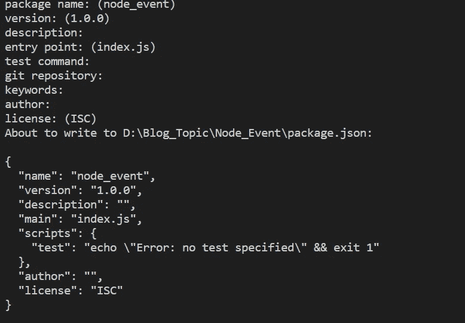
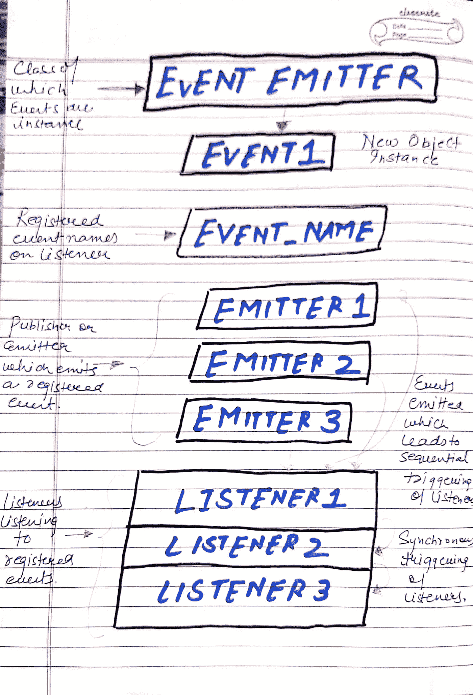

# 如何在 Node.js 中使用事件

> 原文：<https://javascript.plainenglish.io/how-to-use-events-in-node-js-5301675f5fd1?source=collection_archive---------5----------------------->

## 探索 Node.js 基于事件的体系结构


Photo by [Pankaj Patel](https://unsplash.com/@pankajpatel?utm_source=medium&utm_medium=referral) on [Unsplash](https://unsplash.com?utm_source=medium&utm_medium=referral)

我们经常听到 Node.js 有一个事件驱动的架构或者是基于事件的，但是这个基于事件的模型到底是什么呢？今天，在这篇文章中，我们将尝试解码相同。

## ***外行人术语中的事件***

假设你去一家必胜客吃了一份美味的披萨。最初，厨师会无所事事，什么也不做，但他/她一接到“准备比萨饼”的命令，就会立即行动。

一旦顾客进来并发出“准备比萨饼”的命令，厨师就开始为顾客准备同样的东西。

所以，这里“准备比萨饼”作为一个事件。顾客是事件的发布者或发出者，厨师基本上是事件的倾听者。

一旦事件从发布者发出，侦听器就会开始对其进行操作。

现在，一旦你对事件的方式和内容有了一个基本的了解，让我们从技术的角度来看更多的细节。

## ***技术流程***

初始化节点应用程序。

```
npm init
```

按原样输入默认值，您将拥有您的节点项目设置。



Project_Default

为了在我们的应用程序中使用事件，我们需要导入事件模块，并从那里导入 EventEmitter 类。

```
import { EventEmitter } from 'events';
```

所有发出事件的对象都是 EventEmitter 类的实例。

所以，让我们创建一个实例。

```
const events = new EventEmitter();
```

一旦创建了实例，为了注册监听器，我们在 EventEmitter 类中使用了**"*" on "***方法，通过该方法可以注册监听器。

```
events.on('prepare pizza', function () {console.log('Pizza is being prepared');});
```

这里，第一个参数是事件名称，第二个参数是关于一旦事件发出后需要做什么的函数。

好了，我们已经准备好了我们的侦听器，但是如果我们不发出事件，这是没有用的(因为厨师知道如何准备比萨饼，但只有当客户要求时才会准备)，同样的事情可以使用导入的类中的 **" *emit"*** 方法来完成。

```
events.emit('prepare pizza');
```

一旦我们使用 emit，所有监听事件的侦听器都会被触发，并相应地采取行动。让我们看看完整的代码:

```
import { EventEmitter } from 'events';const events = new EventEmitter();events.on('prepare pizza', function () {console.log('Pizza is being prepared');});events.emit('prepare pizza');// Output - Pizza is being prepared
```

## ***同步执行监听器***

我们还可以在同一个实例上注册多个侦听器，在这种情况下，相同的侦听器会按顺序或以同步模式执行。

```
import { EventEmitter } from 'events';const events = new EventEmitter();events.on('prepare pizza', function () {console.log('Pizza is being prepared - Step 1');});events.on('prepare pizza', function () {console.log('Pizza is being prepared - Step 2');});events.on('prepare pizza', function () {console.log('Pizza is being prepared - Step 3');});events.emit('prepare pizza');// Output Pizza is being prepared - Step 1
Pizza is being prepared - Step 2
Pizza is being prepared - Step 3
```

## ***事件发射器带参数***

回到上面的比萨饼和顾客的类比，不同的顾客希望他们的比萨饼上有不同的浇头，即需要定制或需要传递定制值，并且在下订单时将传递相同的浇头。

同样，在发出事件时可以传递额外的参数，并且可以在侦听器中访问这些参数。

```
events.on('prepare pizza', function (topping) {console.log(`Pizza is being prepared with ${topping.toppings}`);});events.emit('prepare pizza', { toppings: 'Olive' });events.emit('prepare pizza', { toppings: 'Mushroom' });
```

这里，我们在第二个参数中传递了不同的参数，在侦听器中使用了相同的参数，输出如下:

```
Pizza is being prepared with Olive
Pizza is being prepared with Mushroom
```

## ***多个事件发射器实例***

我们还可以在同一个代码库中拥有多个事件发射器实例。

让我们更好地理解它:

多个事件实例就像有多个必胜客实例一样。现在，一个餐厅中的顾客将与另一个餐厅中的顾客不同，并且存在订单变化，即“ ***【准备-比萨饼”*** 在两个餐厅中将是相同的，这将仅触发该特定餐厅的厨师准备已经下订单的比萨饼。

类似地，我们可以有多个事件发射器实例，但是监听器将只监听从同一个实例对象发出的事件。

让我们通过一个例子来更好地理解它:

```
import { EventEmitter } from 'events';const event1 = new EventEmitter();const event2 = new EventEmitter();event1.on('prepare pizza', function (topping) {console.log(`Pizza is being prepared with ${topping.toppings} from event 1`);});event2.on('prepare pizza', function (topping) {console.log(`Pizza is being prepared with ${topping.toppings} from event2`);});event1.emit('prepare pizza', { toppings: 'Olive' });Output - Pizza is being prepared with Olive from event 1
```

可以看出，即使我们有两个不同实例的同名侦听器，也只会侦听为其发出事件的那个实例。

同样，如果我们从多个实例发出相同名称的事件，那么只有注册了侦听器的那个实例会起作用。

```
import { EventEmitter } from 'events';const event1 = new EventEmitter();const event2 = new EventEmitter();event2.on('prepare pizza', function (topping) {console.log(`Pizza is being prepared with ${topping.toppings} from event2`);});event1.emit('prepare pizza', { toppings: 'Olive' });event2.emit('prepare pizza', { toppings: 'Mushroom' });Output - Pizza is being prepared with Mushroom from event2
```

简而言之，这是关于事件在 Node.js 中如何工作的基础知识。请注意，它们在节点的整体架构中起着关键作用，并广泛用于 HTTP、fs、sockets 和更多作为节点主干的模块。
因此，对事件如何运作有一个基本的了解变得更加重要。

在结束之前，这里有一个用我们的餐馆类比的图片描述，帮助你以一种更整洁的方式记住这个概念。



Event_Nodejs

让我知道，如果你有任何疑问和关注，或者如果你想让我写任何其他文章。

关于我——我是一个编程爱好者，喜欢阅读和写作前端设计、JavaScript 和 UI/UX 相关的东西。点击[这里](https://medium.com/@avinash.dev21987)阅读我所有的文章，并让我知道你的反馈。

*更多内容看* [***说白了。报名参加我们的***](https://plainenglish.io/) **[***免费周报***](http://newsletter.plainenglish.io/) *。关注我们关于**[***推特***](https://twitter.com/inPlainEngHQ)[***领英***](https://www.linkedin.com/company/inplainenglish/) *，以及* [***不和***](https://discord.gg/GtDtUAvyhW) *。****