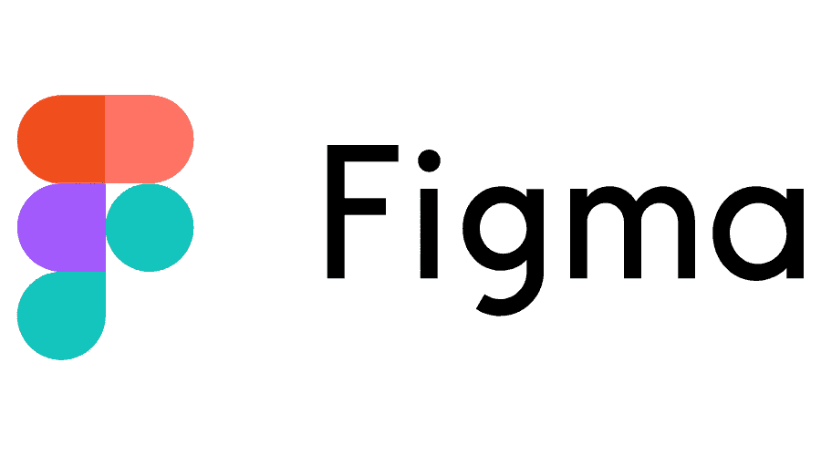

# 如何将 Figma 用作无头 WordPress

> 原文：<https://javascript.plainenglish.io/how-to-use-figma-as-a-headless-wordpress-21c51418ae3d?source=collection_archive---------7----------------------->

## WordPress 被广泛认为是世界上最受欢迎的内容管理系统之一——fig ma 让它变得更好。

WordPress 被广泛认为是世界上最流行的内容管理系统之一。

事实上，截至 2021 年末，WordPress 为全球前 100 万网站中的 35%提供了支持。大约 25%的网站。

为什么这么受欢迎？

首先，它是免费下载和使用的。但是，如果你想定制它，WordPress 确实会对它的一些模板和插件收取费用。尤其是最好的。

除了免费，WordPress 的无处不在意味着如果你是互联网上的内容创作者，你可能以前用过它。

如果您还没有，那也没关系，因为它非常用户友好。此外，它足够灵活，不仅可以像博客一样发挥作用，还可以用于许多不同的项目。

然而，使用 WordPress 也有严重的缺点。

一个是安全性，因为它太受欢迎了。黑客用的逻辑是，如果流行，弄清楚如何黑进去更有意义。然后，一旦发现，这个过程可以重复。

另一个缺点是 WordPress 网站下载速度慢。这意味着观众在等待网站加载，可能会变得不感兴趣并离开。他们使用多余的代码和沉重的主题肯定会损害他们网站的速度。

最后，插件的必要性是第三个缺点。一次使用许多插件会导致加载时间缓慢。最重要的是，许多重要的插件只有通过支付年费才能获得。这意味着你的“免费”网站一年的运营时间要长得多。

Figma 是一个协作设计工具，它允许各种各样的专业人员在一个项目上一起工作。[如其网站](https://www.figma.com/blog/inside-figma-enterprise-explained/)所述，

*“我们真诚地相信，听取每个人的意见并表达他们的观点会产生设计更周到的产品，因此我们鼓励在开发过程的所有阶段进行合作。”*

比方说，一个项目可以包括一个网站的用户界面。开发者最关心的是什么。Figma 采取的方法本质上是包容性和协作性的，这是我们在 Fathym 的共同价值观的一部分。我们可以挖掘它。

因此，让我们深入了解 Figma、FireJet 和 Fathym 如何合作来支持您的网站。

Figma 的奇妙之处在于它的易用性和直观性。如果你曾经和一个团队一起使用过白板，画过笔记和图片；就那样。

除了更好。好多了。

因为都是线上，弥合了队友之间的身体差距。它鼓励团队合作，让团队有更好的结果。

“易用性非常好，”前端工程师杰克·佩尼亚勒(Jack Penhale)在谈到该平台时表示。“非常适合初学者。”

由于易于使用，组织中任何人都可以开始协作，并分享他们的见解和想法。

用户界面的最终目标是用户友好、令人兴奋和有趣！

那么，为什么不从那里开始，倒推呢？Figma 就是这么做的。

现在，从设计师到营销人员，甚至是开发人员或首席执行官，每个人都可以参与其中，帮助展示他们的愿景。协作模式的好处在于，考虑到一些公司的专业化程度，人们可能会对最佳创意的来源感到惊讶。

可能是那个后端工程师害羞内向吧。或者可以想象，你的营销人员有一个总体设计的粗略想法，然后一群人帮助将它完善成最终产品。

在这个尽可能吸引最多人的世界里，团队合作让梦想成真。

最重要的是，Figma 允许您测试新站点、设计流程，甚至在部署之前找到一些“痛点”。这样，开发者知道当他们在后端建立网站时要寻找什么。

而且在开发方面可以节省时间。因为所有的决策者都在一起，所以他们可以在将设计发送给工程师以在后端实现之前签署并达成一致。

例如，工程师 Jack Penhale 在一个项目的设计上花了几个小时，却被要求更改。“相反，团队可以在 20-30 分钟内在 Figma 中提出想法，并就一些令人敬畏的事情达成一致，”他解释道。

首先从设计开始本质上意味着应用程序的外观、感觉和功能是由那些决策者看到、参与和签署的。也意味着拿一个更精更细的产品去活，来换客户的反馈，质量更高。

Figma 的另一个优点是不需要下载。

开发者——内容创建者、首席技术官或人力资源人员——可以在浏览器中免费运行 Figma，而且运行起来非常流畅。

不必下载额外的程序也意味着不必同时运行另一个程序，它将所有的东西都放在浏览器的一个地方。

正如杰克解释的那样，他更喜欢它而不是竞争对手的创意平台，因为它不需要下载，而且是免费的，把所有东西都链接到他的谷歌账户上“更方便”

当然，团队越大，直接跳到网站上开始设计就变得越容易，大大节省了时间。

就像你在麦片盒子里得到的像詹姆斯·邦德一样的魔法戒指一样，Firejet 是 Figma 的资产解码器。

它把你在 UI 中漂亮的设计作品反*成*代码。这有点颠倒了这个过程，这就是它的特别之处。

FireJet 在他们的网站上解释说:“我们是一个定制 web 应用程序开发人员的团队，他们认为我们的流程可以简化。所以我们开始建立一个内部工具。因此，我们想出了 FireJet。”

他们专注于将 Figma 出色设计的用户体验转化为他们所谓的“人类可读代码”

他们的[网站解释道:“理解容易，对导出的代码进行修改也不会有任何麻烦。”。](https://www.firejet.io)

“有时，计算机把东西放进代码，但它是一团乱麻，”前端工程师杰克·佩尼亚勒解释典型的代码，而不是“人类可读的。”

他说的是一页又一页的代码，即使是最训练有素的开发人员也无法理解。至少，不会很快，也许根本不会。

FireJet 的代码很容易阅读，因此在需要时很容易更改/修复，它被转换成 React JavaScript。

这是个好消息！ [ReactJs 是目前最受欢迎的 JavaScript 框架(库)之一](https://www.fathym.com/blog/articles/2022/april/2022-04-13-micro-frontend-popularity)，这意味着许多开发人员已经具备了使用它的知识和经验。

但是，一个人不一定要成为开发者才能建立一个网站。不再是了。使用 FireJet 为 Figma 创建了一个无代码工作流。

正如 Figma 致力于让任何人都能接触到设计一样，我们 Fathym 也努力在网站开发方面做到同样的事情。

现在你仍然可以使用 WordPress 来输入你的博客的所有书面内容，但是用你在 Figma 中创建的超凡脱俗的设计来显示它。使用我们的微前端，你可以简单地从一个路径跳转并运行你的博客的“头部”,并在后端使用 API 将其连接到你的 WordPress。

我们邀请您今天免费参加[fat hym](https://www.fathym.com/dashboard)并尝试一下我们的社交 UI 和微前端。

*原载于*[*https://www.fathym.com*](https://www.fathym.com/blog/articles/2022/may/2022-05-13-use-figma-as-headless-wordpress)*。*

*更多内容请看*[***plain English . io***](https://plainenglish.io/)*。报名参加我们的* [***免费周报***](http://newsletter.plainenglish.io/) *。关注我们关于*[***Twitter***](https://twitter.com/inPlainEngHQ)*和*[***LinkedIn***](https://www.linkedin.com/company/inplainenglish/)*。查看我们的* [***社区不和谐***](https://discord.gg/GtDtUAvyhW) *加入我们的* [***人才集体***](https://inplainenglish.pallet.com/talent/welcome) *。*