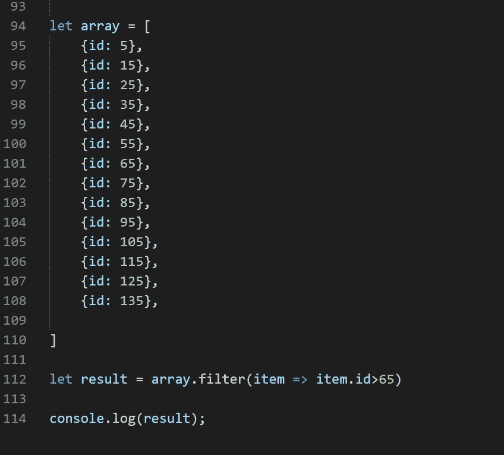
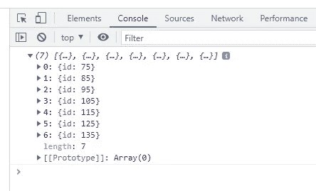
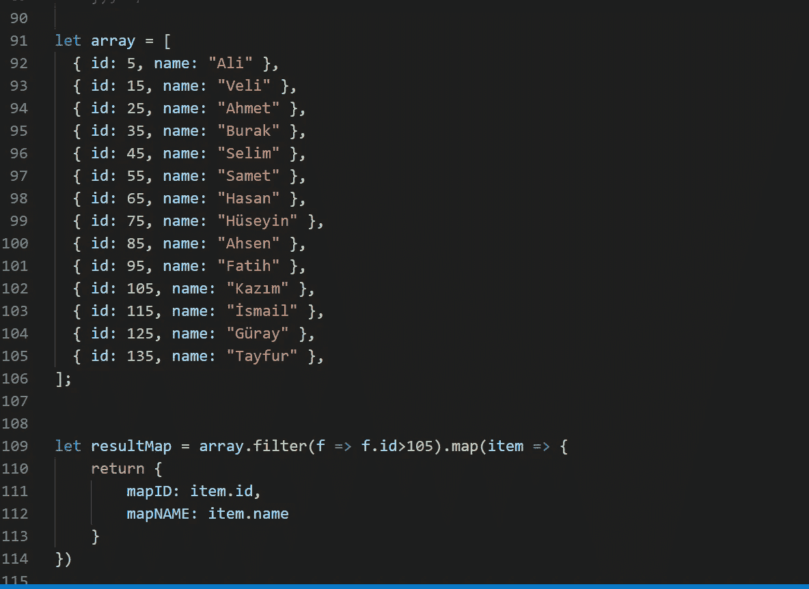
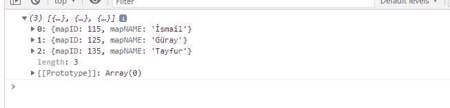
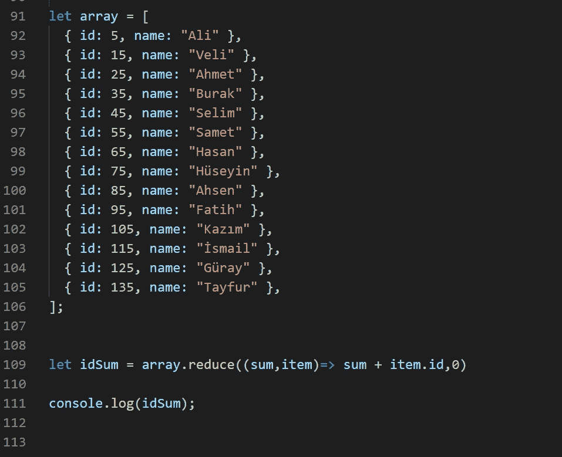

# 如何在 JavaScript 中使用 filter()、map()和 reduce()函数

> 原文：<https://javascript.plainenglish.io/how-to-use-filter-map-and-reduce-a60fce1e6957?source=collection_archive---------1----------------------->

## JavaScript 中的 filter()、map()和 reduce()函数


Power of Filter() — Map () — Reduce() array functions.

`map()`、 `filter()`和`reduce()`是三个方便我们对数组操作的函数。

在本文中，我将举例说明如何使用这三个函数来简化我们对数组的操作。

## 过滤功能

`filter()`方法接受一个回调函数并返回一个新数组。

> filter()方法创建一个新数组，其中填充了通过函数测试的元素。
> 
> filter()方法不执行空元素的函数。
> 
> filter()方法不改变原始数组。

简而言之，如果我们想对一个数组进行过滤，我们可以使用 filter()函数。

**语法:**

```
 filter((element) => { /* ... */ } )
```

***例如:***

我们有一个名为`*array*` 的数组来保存`id` 信息。



An Array Containing Id Numbers

在我们的例子中，我想过滤 id 大于 65 的元素。

我们编写过滤函数，并将其赋给名为 result 的变量。我们将这个变量打印到屏幕上



Result Array

我们已经成功筛选了 id 大于 65 的元素。

## 地图功能

我们使用`map()`函数按照我们想要的格式重建一个数组。

> * Map()通过为每个数组元素调用一个函数来创建一个新数组。
> 
> * Map()为数组中的每个元素调用一次函数。
> 
> * Map()不执行空元素的函数。
> 
> * Map()不改变原始数组。

`**map()**`方法**创建一个新的数组**,其中填充了调用数组中每个元素的函数的结果。

**语法:**

```
 map((element) => { /* ... */ })
```

**例如:**

我们有一个名为`*array*` 的数组来保存`id`和`name`信息。



An Array Containing Id Numbers and Name Informations

我想获取 id 大于 105 的信息的`id`和`name`字段。保留`mapId`中的`id`信息和`nameMap`中的`name`信息。

我们编写过滤器和映射函数，然后将它赋给名为 resultMap 的变量。我们将这个变量打印到屏幕上。



resultMap Array

我们已经成功地过滤和映射了 id 大于 105 的元素。

## 减少功能

`reduce()`函数的目的是将原始数组的所有元素缩减为单个的原始值或对象值。

> * Reduce()方法为数组元素执行一个 reducer 函数。
> 
> Reduce()方法返回单个值:函数的累计结果。
> 
> Reduce()方法不执行空数组元素的函数。
> 
> Reduce()方法不改变原始数组。

`**reduce()**`方法对数组的每个元素执行用户提供的“reducer”回调函数，依次传递前一个元素的计算返回值。对数组的所有元素运行缩减器的最终结果是一个值。

**语法:**

```
 reduce((previousValue, currentValue) => { /* ... */ } )
```

**示例:**

我们有一个名为`*array*` 的数组来保存`id`和`name`信息。



An Array Containing Id Numbers and Name Informations

我想找出名为`array`的数组中 id 的总和。

我们编写 Reduce()函数，然后将它赋给名为 idSum 的变量。我们将这个变量打印到屏幕上。


Value of idSum

我们已经成功地减少了带有 id 的元素。

# 结论

我们回顾了入门级的`filter()`、`map()`和`reduce()`功能。如果使用正确，它们会使我们的操作变得更加容易。


[https://www.c-sharpcorner.com/article/simplify-map-reduce-and-filter-in-typescript/](https://www.c-sharpcorner.com/article/simplify-map-reduce-and-filter-in-typescript/)

# 参考

*   [https://www.w3schools.com/](https://www.w3schools.com/)
*   [https://developer.mozilla.org/](https://developer.mozilla.org/)

*更多内容看* [***说白了就是***](http://plainenglish.io/) *。报名参加我们的* [***免费每周简讯***](http://newsletter.plainenglish.io/) *。在我们的* [***社区不和谐***](https://discord.gg/GtDtUAvyhW) *获得独家获取写作机会和建议。*