# 如何使用 GitHub 动作通知 Slack 对特定分支的推送和合并的拉取请求

> 原文：<https://javascript.plainenglish.io/how-to-use-github-actions-to-notify-slack-on-push-and-on-merged-pull-requests-to-a-specific-branch-995c04f5f74e?source=collection_archive---------0----------------------->

# 推送通知

我知道你可能想知道，“这有多简单？”我必须说非常简单。如果你想了解工作流、步骤和工作的全部内容，你可以参考 [this](https://omoladeekpeni.medium.com/github-actions-workflows-steps-and-jobs-7ba625f84939) ，在这里我用简单的术语解释了每个术语的含义。

假设您的 github 存储库中已经有一个. github/workflows 文件夹。在这种情况下，你可以从 GitHub 仓库中的**动作**选项卡开始，点击**新工作流**，如下图所示。

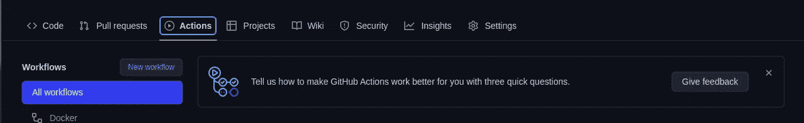

对于没有。github/workflows 文件夹，您可以将 github 资源库克隆到您的本地计算机上，并创建一个名为。github”和另一个名为“workflows”的文件夹。

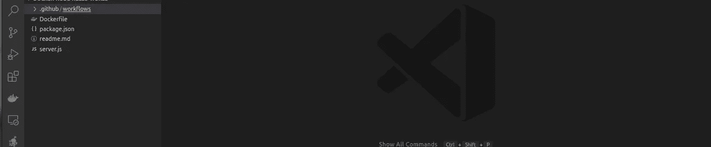

# 松弛配置

现在，Slack 必须配置为允许通知。导航至[https://api.slack.com/apps](https://api.slack.com/apps)并点击**创建新应用。**


一旦点击，它会给出两个选项。也就是说，要么从头开始创建应用程序，要么从应用程序清单创建应用程序。**从零开始**才是应该选择的。

为您的应用程序设置一个**应用程序名称**。我将我的设置为 Github Actions，然后**选择一个工作区来开发你的应用**，我为它选择了“占位符”。也就是说，我的空闲时间中已经有了一个工作空间。

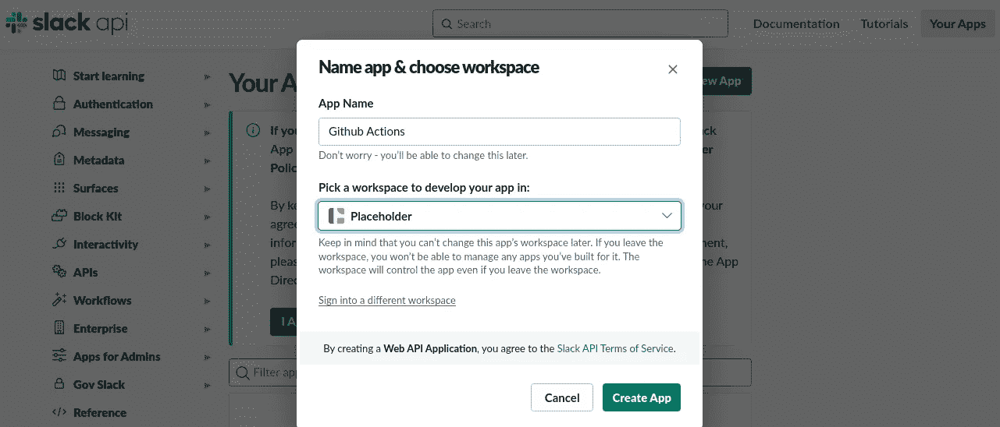

设置详细信息并点击**创建应用程序后，**导航至左侧边栏的**应用程序主页**。点击**查看范围，添加**为你的机器人设置权限。

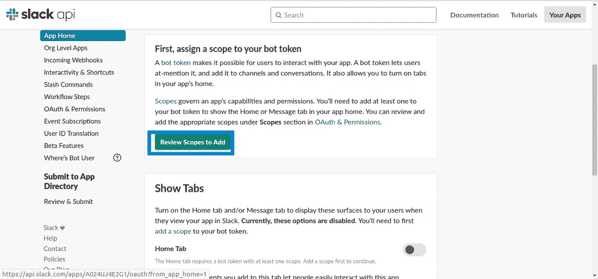

之后，向下滚动并点击**在 Scopes 下添加一个 OAuth 范围**并选择必要的权限。因为我们希望我们的机器人能够加入一个频道并在其中编写通知，所以选择范围" **channels:join"** 和" **chat:write"** ，如图所示。

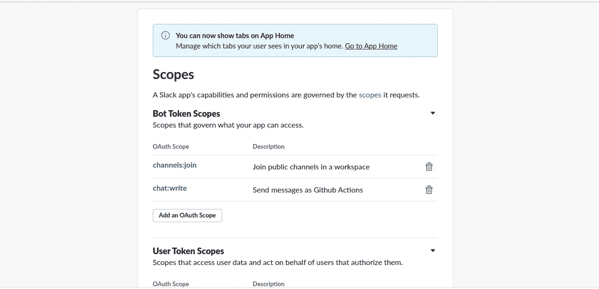

下一步是在工作区中安装我们的 bot。在同一页面上向上滚动，在**工作区的 OAuth 令牌**下，单击**安装到工作区。**

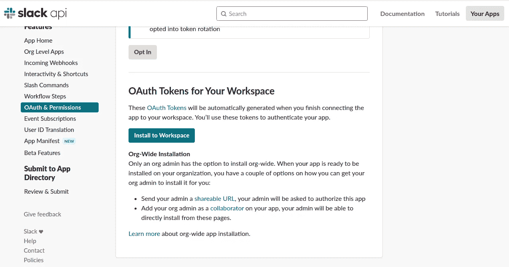

一旦你被重定向到下图中的页面，点击**允许。**

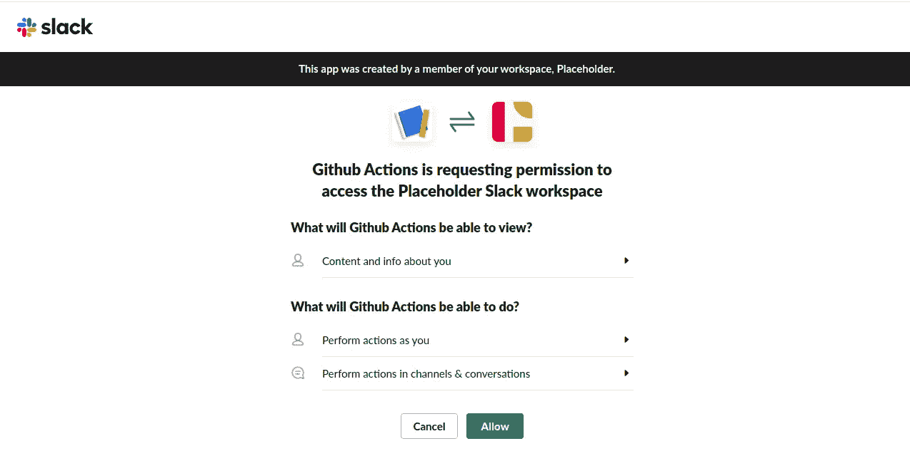

现在，您的 slack bot 已经准备好在“占位符”工作区中运行了。下一步是复制 **Bot 用户 OAuth 令牌**。它将被粘贴到你的 GitHub 秘密储存库中。

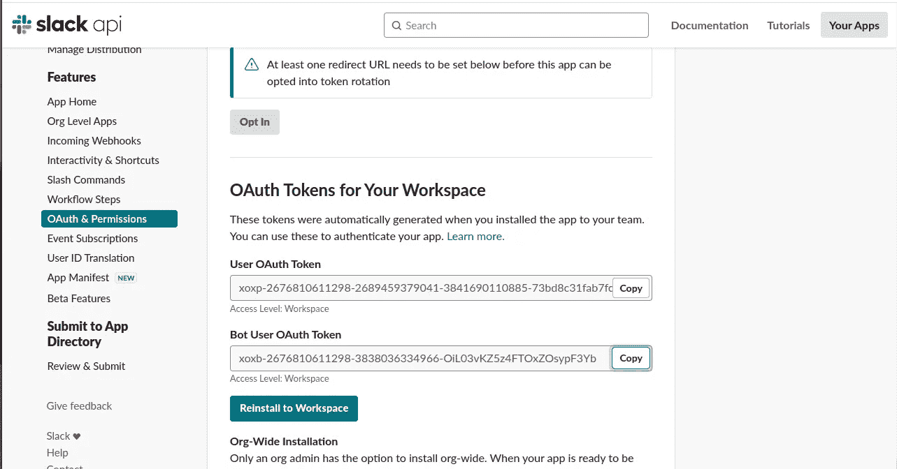

# Github 仓库机密

现在，转到 Github 库并将其作为一个秘密添加。关于保存 Github 秘密的更多细节，可以查看[这里](https://docs.github.com/en/actions/security-guides/encrypted-secrets#creating-encrypted-secrets-for-a-repository)。在你的 Github 库的设置页面上，点击**秘密** → **动作**，然后**点击新的库秘密**

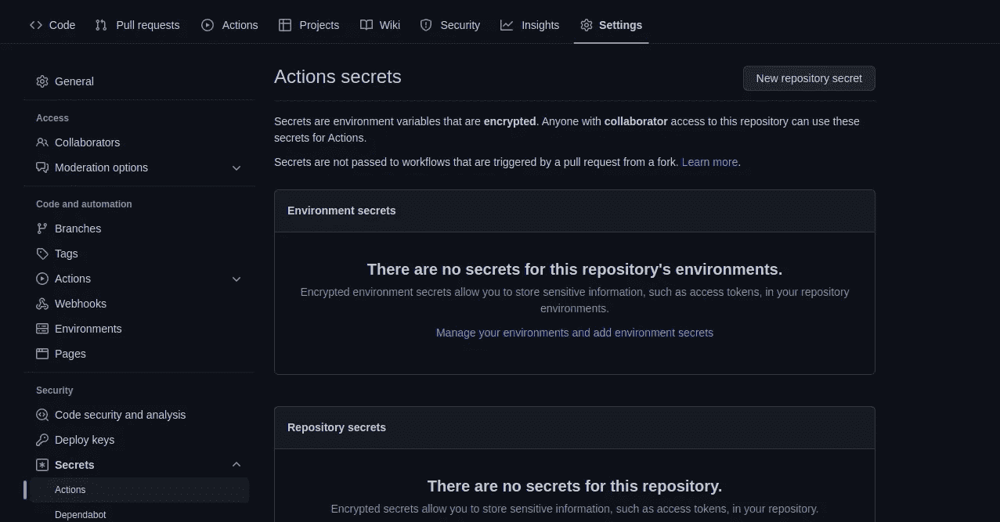

将您复制的 **Bot 用户 OAuth 令牌**值粘贴到**值**部分，并将 **SLACK_BOT_TOKEN** 设置为**名称**，如下图所示。

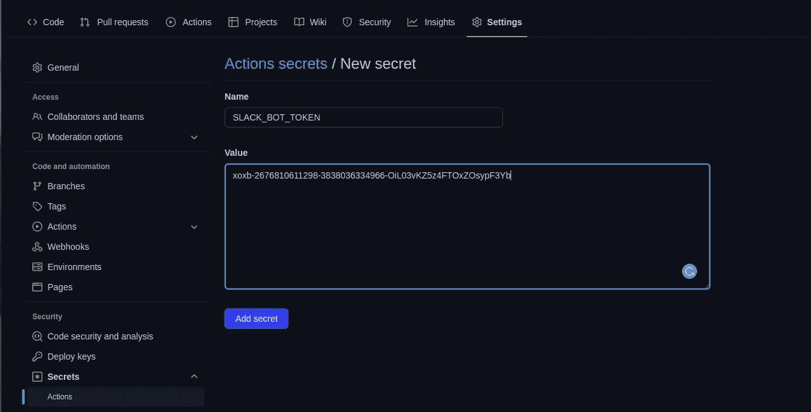

现在，点击**添加秘密**。

回到 slack，你会看到在 Github secret 步骤之前的步骤之后，Github Actions 被添加为一个应用程序。下图是它看起来的样子

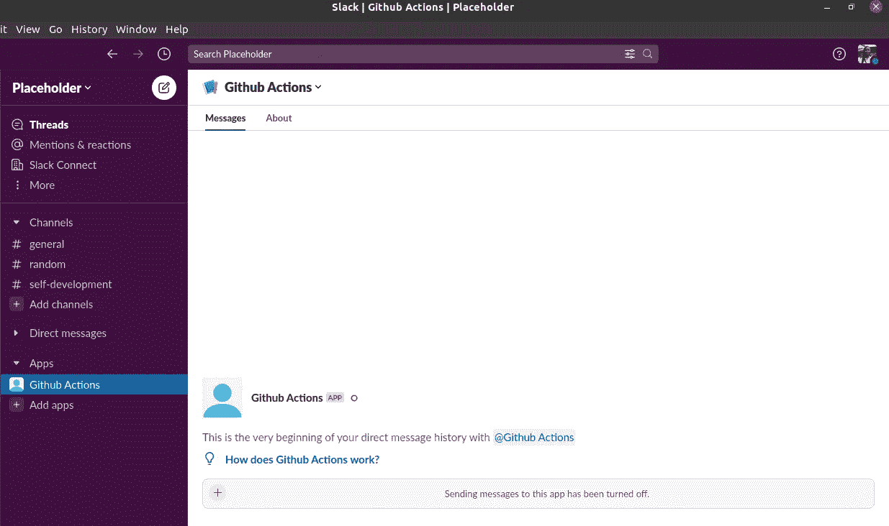

在工作区创建一个单独的 slack 频道，并邀请 slack bot 应用程序加入该频道。所指的空闲通道是通知将被发送到的地方。点击频道详情，邀请 Github Actions slack bot 应用加入。

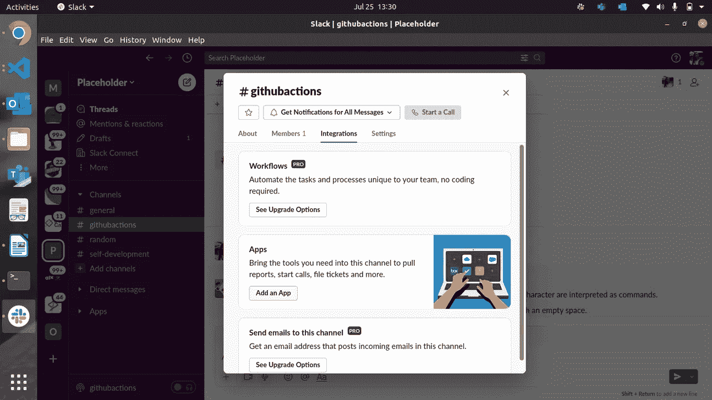

点击**添加应用**然后将机器人添加到频道。

就像你之前把 **SLACK_BOT_TOKEN** 添加到你上面的 Github 库机密一样，我们也会添加你新创建的 SLACK 频道的频道 id。可以在频道的“关于”页面的下部找到频道 id。

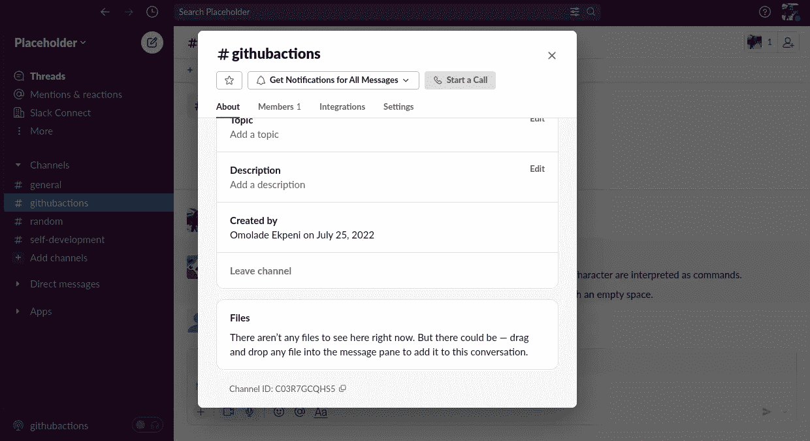

继续在 Github 存储库 secrets 上保存频道 id，名称为 **SLACK_CHANNEL_ID** 。我们很快就会利用这些储存库的秘密。

# 工作流中的作业设置

在您的工作流程文件夹中，创建一个文件并命名。记得用 YAML 语法保存它。它应该有一个. yml 或。yaml 文件扩展名如下。

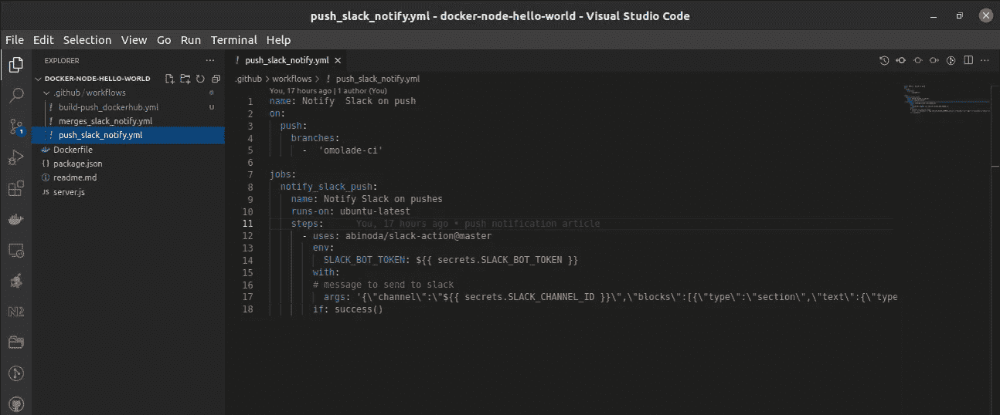

```
name: Notify  Slack on push
on:
  push:
    branches:
      -  'omolade-ci'  

jobs:
  notify_slack_push:
    name: Notify Slack on pushes
    runs-on: ubuntu-latest
    steps:
      - uses: abinoda/slack-action@master
        env:
          SLACK_BOT_TOKEN: ${{ secrets.SLACK_BOT_TOKEN }}
        with:
        # message to send to slack
          args: '{\"channel\":\"${{ secrets.SLACK_CHANNEL_ID }}\",\"blocks\":[{\"type\":\"section\",\"text\":{\"type\":\"mrkdwn\",\"text\":\"*Repository pushed to:* ${{ github.event.repository.name }}\"}},{\"type\":\"section\",\"text\":{\"type\":\"mrkdwn\",\"text\":\"*Pusher:* ${{ github.event.pusher.name }}\n*Commit Message:* ${{ github.event.head_commit.message }}\"}},{\"type\":\"section\",\"text\":{\"type\":\"mrkdwn\",\"text\":\"<${{ github.event.repository.html_url }}|View Repository>\"}}]}' 
        if: success()
```

第 2–5 行解释了只有当我们推进到 o molde-ci 分支时，工作流才会被触发。如果希望它是主分支，也可以指定“main”。你可以在这里阅读更多关于修改你的工作流程以适应你需要的分支[的内容。记得我们的秘密吗？，它们是在第 14 行和第 17 行中被引用的。](https://docs.github.com/en/actions/using-workflows/workflow-syntax-for-github-actions#onpull_requestpull_request_targetbranchesbranches-ignore)

您可以修改自定义消息以满足您的通知需求。现在，将您的更改推送到存储库并进行测试，看看当您推送到工作流中指定的分支时，是否收到了延迟通知。Tada，成功了！

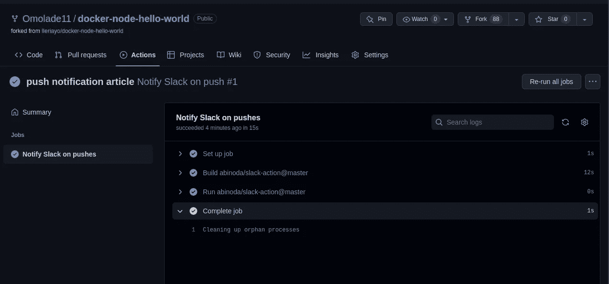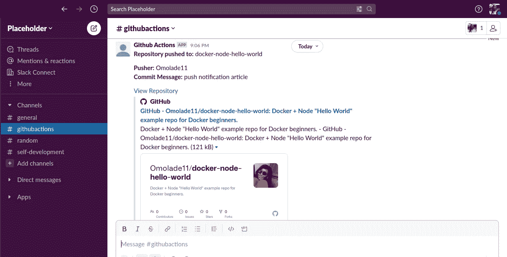

# 关于合并拉取请求的通知

不用麻烦了，这不会像**推送通知**那么长。我们只会修改我们的工作流程文件以满足我们的需求。除此之外，包括松弛配置、安装和 GitHub 秘密在内的其他一切仍然存在。

我们的工作流触发器不会像前者那样“推送”，我们的工作会有一个运行条件，我们的 args(通知正文)也会改变。

```
name: Notify Slack on merged pull requests
on:
  pull_request:
    types:
      - closed
    branches:    
      - 'omolade-ci'

jobs:
  notify_merged_pull_request:
    name: Notify Slack on merged pull requests
    runs-on: ubuntu-latest
    if: ${{ github.base_ref == 'omolade-ci' && github.event.pull_request.merged == true }}
    steps:
      - uses: abinoda/slack-action@master
        env:
          SLACK_BOT_TOKEN: ${{ secrets.SLACK_BOT_TOKEN }}
        with:
          args: '{\"channel\":\"${{ secrets.SLACK_CHANNEL_ID }}\",\"blocks\":[{\"type\":\"section\",\"text\":{\"type\":\"mrkdwn\",\"text\":\"*Merged Pull Request:* ${{ github.event.pull_request.title }}\"}},{\"type\":\"section\",\"text\":{\"type\":\"mrkdwn\",\"text\":\"*Pull Request by :* ${{ github.event.pull_request.user.login }}\n*Merged at:* ${{ github.event.pull_request.merged_at }}\"}},{\"type\":\"section\",\"text\":{\"type\":\"mrkdwn\",\"text\":\"<${{ github.event.pull_request.html_url }}|View Merged Pull Request>\"}}]}' 
        if: success()
```

第 2–5 行说明，只有当 omolade-ci 分支上有一个已关闭的请求时，才应触发工作流。请记住，拉取请求可以在不合并的情况下关闭。由于我们正在寻找合并的拉请求，第 13 行解释了如果 notify_merged_pull_request 作业是 omolade-ci 分支，并且拉请求已经被合并，而不仅仅是如第 5 行所述的那样关闭，那么它应该运行。有关 Github 工作流事件触发器的更多详细信息，请在此处查看。对于拉式请求合并，在此处勾选。这个也管用！！！干杯，伙计🍾🥂!！。

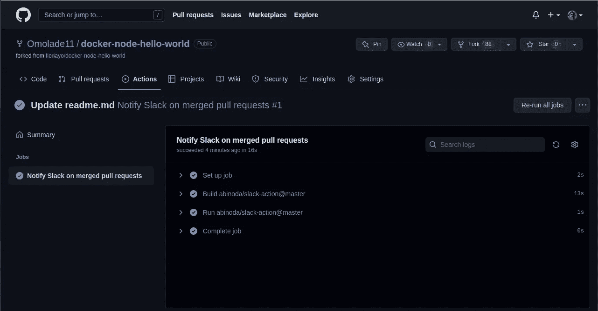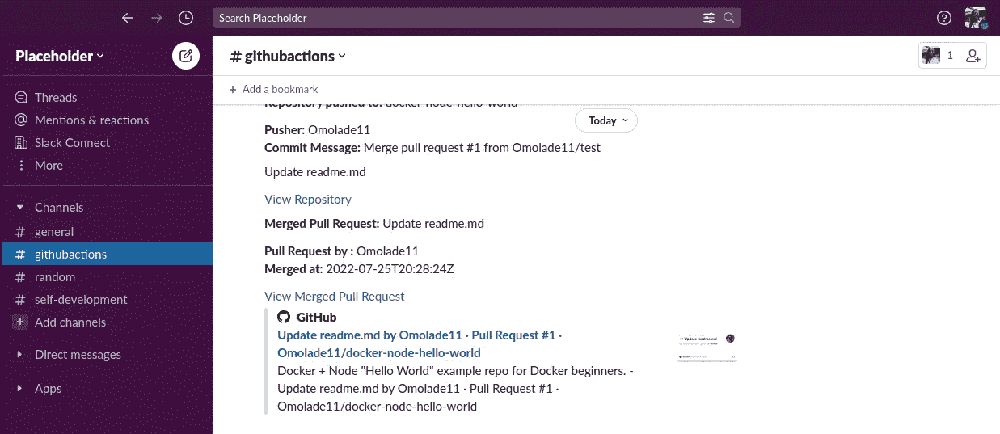

要进一步定制您的通知信息，请点击[查看](https://docs.github.com/en/developers/webhooks-and-events/webhooks/webhook-events-and-payloads#push)。您可以查看该[信息库](https://github.com/Omolade11/docker-node-hello-world)的 [omolade-ci 分支](https://github.com/Omolade11/docker-node-hello-world/tree/omolade-ci/.github/workflows)中的工作流。

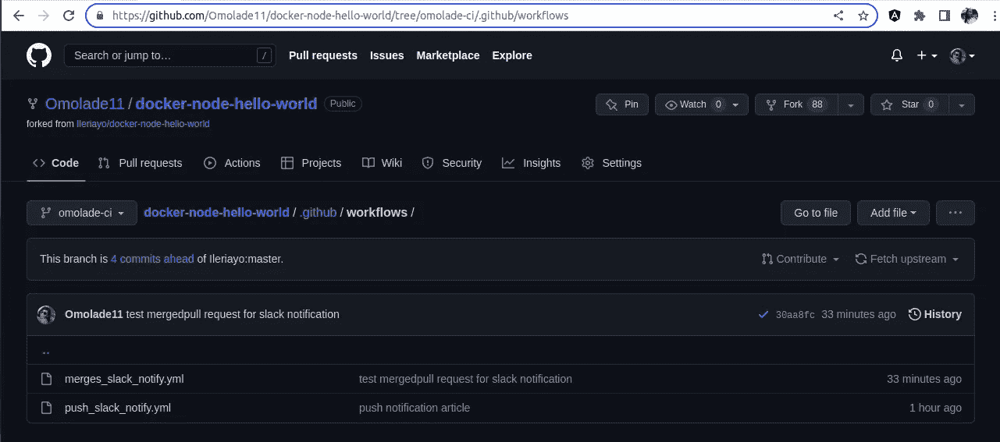

# 结论

总之，当我们将提交推送到指定的分支时，第一个工作流将运行，我们将收到通知。但是，当我们在指定的分支上收到合并的请求时，第二个工作流将运行，我们也会收到通知。这可以作为 DevOps 发烧友的一个项目。我希望你觉得这篇文章很有帮助，因为我会感谢你的评论，我会在[推特](https://twitter.com/OmoladeEkpeni)和 Gmail 上通过[omoladeekpeni@gmail.com](mailto:omoladeekpeni@gmail.com)回答你的问题。

*更多内容请看*[***plain English . io***](https://plainenglish.io/)*。报名参加我们的* [***免费周报***](http://newsletter.plainenglish.io/) *。关注我们关于*[***Twitter***](https://twitter.com/inPlainEngHQ)**和*[***LinkedIn***](https://www.linkedin.com/company/inplainenglish/)*。查看我们的* [***社区不和谐***](https://discord.gg/GtDtUAvyhW) *加入我们的* [***人才集体***](https://inplainenglish.pallet.com/talent/welcome) *。**