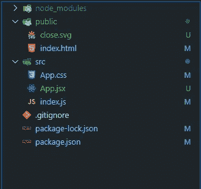
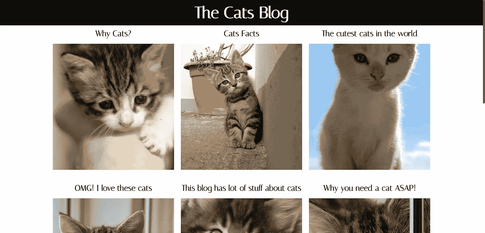

# 如何使用谷歌电子表格作为数据库(包括免费博客托管)

> 原文：<https://javascript.plainenglish.io/how-to-use-google-spreadsheets-as-a-database-free-blog-hosting-included-5f439909d185?source=collection_archive---------10----------------------->

## 多亏了 Papa Parse & GitHub，你可以完全免费地托管最便宜的简单静态博客和数据库。


Photo by [Ilya Pavlov](https://unsplash.com/@ilyapavlov?utm_source=medium&utm_medium=referral) on [Unsplash](https://unsplash.com?utm_source=medium&utm_medium=referral)

我们都有这样一个朋友，他有自己的小型超级利基博客，但大多数时候，这个博客要么关闭，要么超级慢。

这里的问题是，这些人中的大多数对管理网站知之甚少，甚至一无所知，他们经常向我们寻求建议，大多数时候是“用 WordPress”。

但是如果你想有一个稳定的博客，由于它的规模、成本和支持，有时甚至 WordPress 也是一种痛苦。

为了解决这个问题，我想出了一个最便宜、最简单的计划，完全免费(不包括注册域名的费用，第一年可以低至 0.99 美元)托管一个简单的静态博客和一个数据库。

现在让我们创建我们的新博客，我将把它命名为[猫博客](https://reda-codes.github.io/TheCatsBlog/)因为为什么不呢。

对于我将使用的博客模板，为了保持简单，我将创建一个管理一切的单一组件应用程序。



React app directory layout

对于数据库，进入[谷歌电子表格](https://docs.google.com/spreadsheets)并创建一个包含所有你想导入的数据的表格。

在我的例子中，我创建了一个包含 Id、Title、Body 和 Image 的虚拟表。


Google spreadsheets data table

# 将数据导入我们的网站

为了导入数据，我们将使用一个叫做[的工具。](https://www.papaparse.com/)

在您的项目文件夹终端运行:

```
npm i papaparse
```

瞧啊。你有工具让我们得到一些数据！

```
const Papa = require(“papaparse”);const filePrasing = () => new Promise((resolve)=> { Papa.parse(“**YOUR GOOGLE SPREADSHEETS LINK**", { download: true, header: true, newline: “”, complete: function(results, file) {resolve(results.data);}
  })
})const getData = async() => {const data = await filePrasing();return data}
```

**注意:为了让 Papa Parse 解析您的工作表，它必须以 CSV 格式公开共享。**

现在，在调用 getdata()之后，Papa Parse 将从我们的电子表格中获取数据，并返回一个承诺，在一个对象中包含我们的所有数据。

```
[
 {
   “ID”: “1”,
   “title”: “ARTICLE TITLE”,
   “body”: “<p>ARTICLE BODY IN HTML</p>”,
   “image”: “[I](https://placekitten.com/400/500)MAGE LINK"
 },
 {
   “ID”: “2”,
   “title”: “ARTICLE TITLE”,
   “body”: “<p>ARTICLE BODY IN HTML</p>”,
   “image”: “[I](https://placekitten.com/800/600)MAGE LINK”
 }
]
```

为了使用 react 做到这一点，我将使用 react 钩子 useState 来管理我们的状态，并在网站渲染时使用 useEffect 来更新状态。

```
/* our data variable */const [data, setData] = useState([])useEffect(() => { getData().then((res)=> setData([…res]))}, []);/* our data variable */
```

# 博客布局

对于博客布局，我们的组件映射我们的状态，并在前端显示数据。同样为了保持简单，当用户点击一篇文章时，它会显示在一个包含文章正文的弹出窗口上，因为 react 是一个单页应用程序框架。


blog layout code

**注意:要获得以上所有代码，请访问 GitHub 上的** [**项目资源库**](https://github.com/Reda-codes/TheCatsBlog) **。**

# 最终结果



最后，我们的[博客](https://reda-codes.github.io/TheCatsBlog/)已经完成并开始运行，剩下的唯一事情就是托管它。

# 免费博客托管

由于我们的博客是一个静态网页，每次加载时都会从我们的谷歌电子表格中获取数据，我们可以免费将其托管在 [GitHub pages](https://reda-codes.github.io/TheCatsBlog/) 上，如果你想为你的博客创建一个自定义域，GitHub 可以免费提供。

这个项目只是一个如何使用谷歌电子表格作为数据库的演示，而不是一个 react 教程，如果你使用其他需要服务器的框架，你可以建立一个更复杂的博客。

把这个项目的所有代码头拿到[**GitHub 上的项目库**](https://github.com/Reda-codes/TheCatsBlog) **。**

*更多内容看* [***说白了。报名参加我们的***](https://plainenglish.io/)***[***免费周报***](http://newsletter.plainenglish.io/) *。关注我们*[***Twitter***](https://twitter.com/inPlainEngHQ)*和*[***LinkedIn***](https://www.linkedin.com/company/inplainenglish/)*。加入我们的**[***社区不和谐***](https://discord.gg/GtDtUAvyhW) *。*****