# 如何使用 HarperDB 自定义函数来构建您的整个后端

> 原文：<https://javascript.plainenglish.io/how-to-use-harperdb-custom-functions-to-build-your-entire-backend-20c1a24fed26?source=collection_archive---------14----------------------->

## 关于如何使用 HarperDB 自定义函数以及如何将它们连接到 React 前端的教程。


# 什么是 HarperDB

当 HarperDB 刚开始时，它们是一个分布式数据库平台。本质上，这意味着任何人都可以构建一个云实例来创建一个在线存储数据的数据库。这些数据库支持 SQL 和 NoSQL 功能，这使它们非常通用，因为它们有一个可以满足每个人的解决方案。

HarperDB 的 3.0 版本像任何传统数据库一样工作。在典型的全栈应用程序中，开发人员会将他们的 API 代码托管在某个服务器上。该服务器将对 HarperDB 云平台进行 API 调用，基本上允许开发人员连接到他们的数据库实例并检索他们想要的数据。

# HarperDB 自定义函数

到 2021 年底，HarperDB 发布了 3.1 版，为平台引入了一个新特性。HarperDB 从一个分布式数据库发展成为一个分布式应用程序开发平台。基本上，这意味着您现在可以在具有完整 CRUD 功能的同一平台上托管您的数据库和服务器 API！这是一个能够满足您所有后端需求的单一解决方案。

HarperDB 现在提供了与 AWS Lambda 函数非常相似的定制函数。基本的方法是用代码编写业务逻辑，然后决定何时使用它。这意味着，与传统方法相比，这种服务应该要快得多，因为数据不需要在不同的网络和服务器之间移动。这一切都在一个地方，使它更容易维护。

自定义函数使用 Node.js 和 Fastify，这意味着它们几乎只是 Node.js 项目。这种奖励本质上给了你访问整个 npm 生态系统的机会，促进了你的开发工作流程。

# 如何使用 HarperDB 自定义函数

在本教程中，我将简要介绍如何在 HarperDB 上使用自定义函数。我们将创建一个名为**古代文明时间轴**的应用程序。这只是一个简单的网站，使用新的自定义功能从 HarperDB 数据库中检索一些数据。

这将是技术堆栈:

前端:HTML，CSS，TypeScript，React
后端:Node.js，HarperDB

# 先决条件

首先，如果你还没有账户，你需要创建一个 [HarperDB](https://harperdb.io/) 账户。

## 步骤 1 —创建帐户

注册一个免费账户


## 步骤 2——创建一个新的组织

创建一个新组织


添加新组织

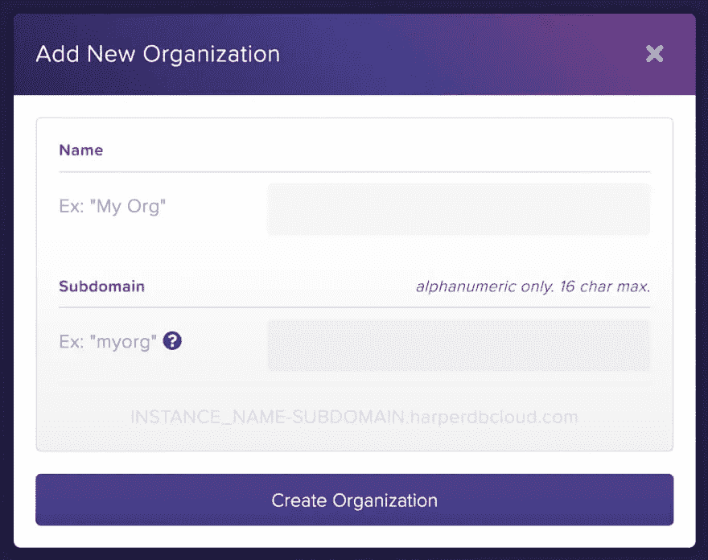

## 步骤 3 —创建一个新的 HarperDB 云实例

创建新的 HarperDB 云实例


点击左侧按钮**创建 AWS 或威瑞森波长实例**


为 AWS 上的 HarperDB Cloud 选择选项，然后单击实例信息按钮。

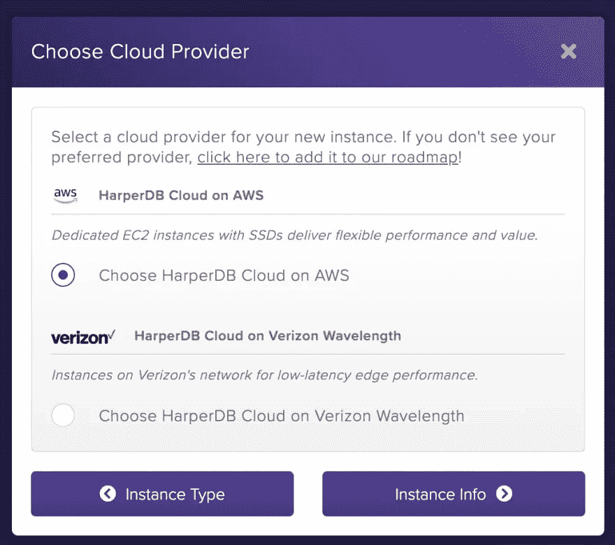

创建实例名和用户凭据，然后单击“实例详细信息”按钮。

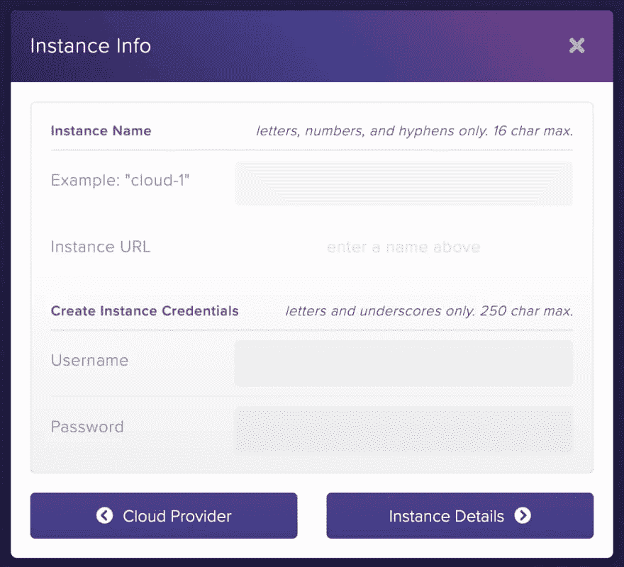

选择可用 RAM 和存储大小的选项。选择您喜欢的区域，然后单击按钮确认实例详细信息。请注意，在您拥有的组织中，您只能拥有一个免费的云实例。

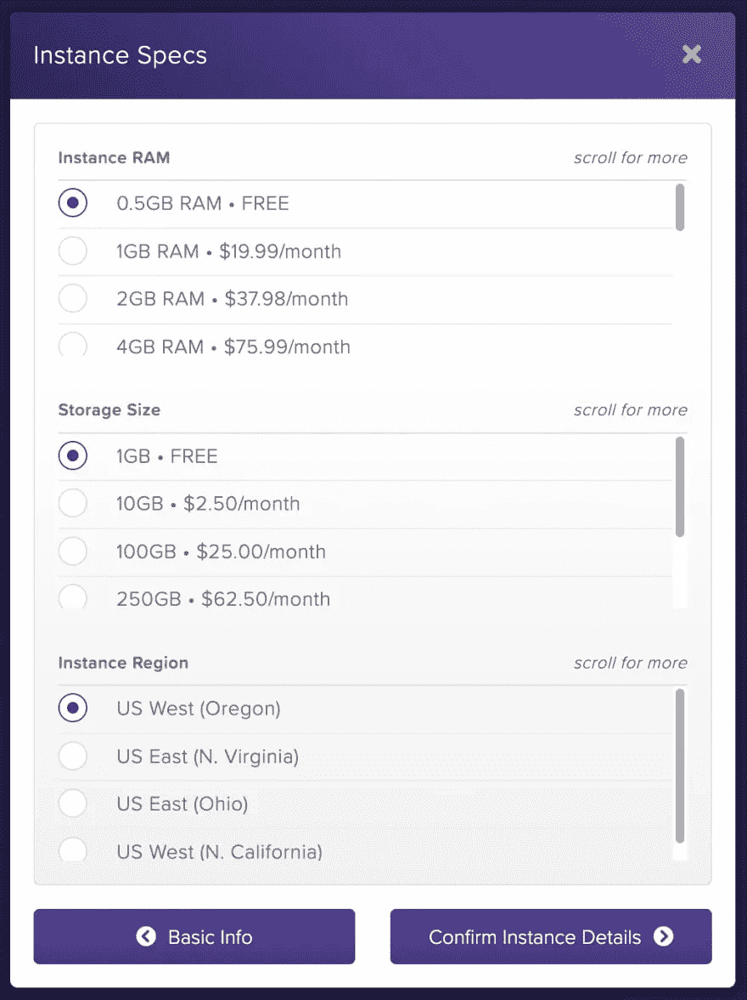

同意条款，然后单击“添加实例”按钮。


## 步骤 4 —查看您的 HarperDB 云实例

现在你应该有一个组织了

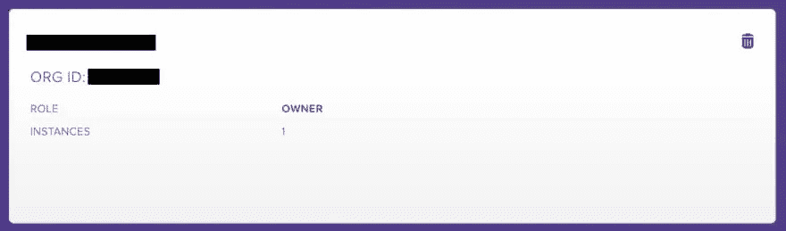

当你点击你的组织，你应该看到你的云实例

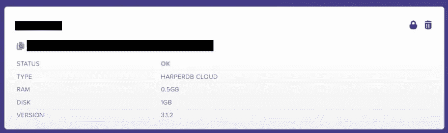

点击它，你会看到数据库屏幕

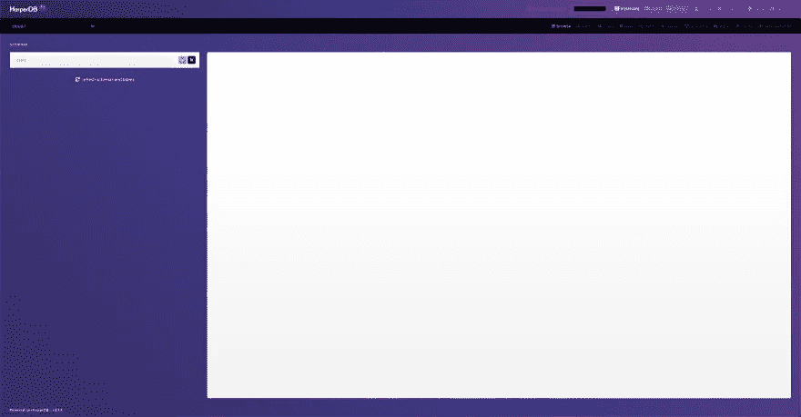

# 在 HarperDB 上创建后端数据库和 API

# 数据库设置

现在创建一个名为 **timeline** 的模式，并将表和散列属性命名为 **history** 。

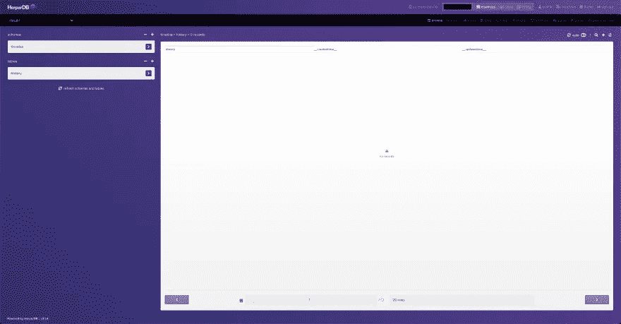

转到这个 [repo](https://github.com/andrewbaisden/harperdb-civilizations/blob/main/frontend/src/data/civilisation.sql) 并复制 SQL 查询。现在转到 HarperDB 上的查询链接，将 SQL 查询复制并粘贴到其中。最后，单击 execute 按钮运行查询。这将把数据添加到数据库中。这个查询非常大，因为我使用 Figma 创建了一些定制的 SVG 图像，然后将它们转换成 Base64 格式存储在数据库中。

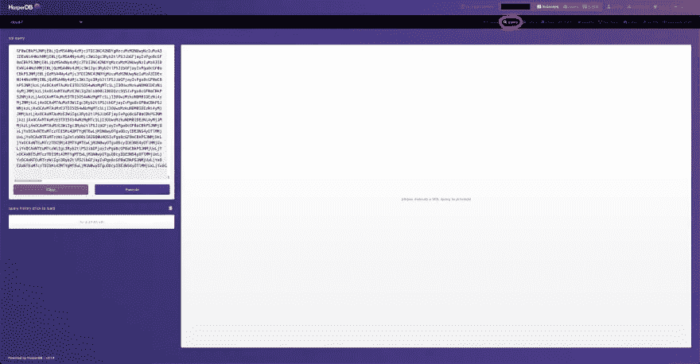

单击 browse 按钮返回到数据库表屏幕，您应该会看到一个充满数据的表。如果您将鼠标光标放在图像图标上，您可以看到图像的样子。

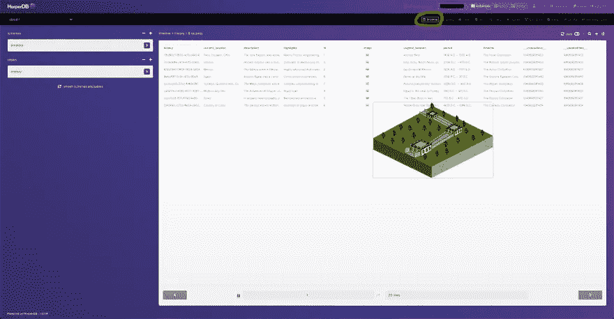

# API 设置

您现在应该有一个数据库，其中有一个充满数据的表。下一步是创建一个自定义函数，这样我们就可以使用 REST GET 请求获取数据。单击函数链接，然后单击启用自定义函数按钮。

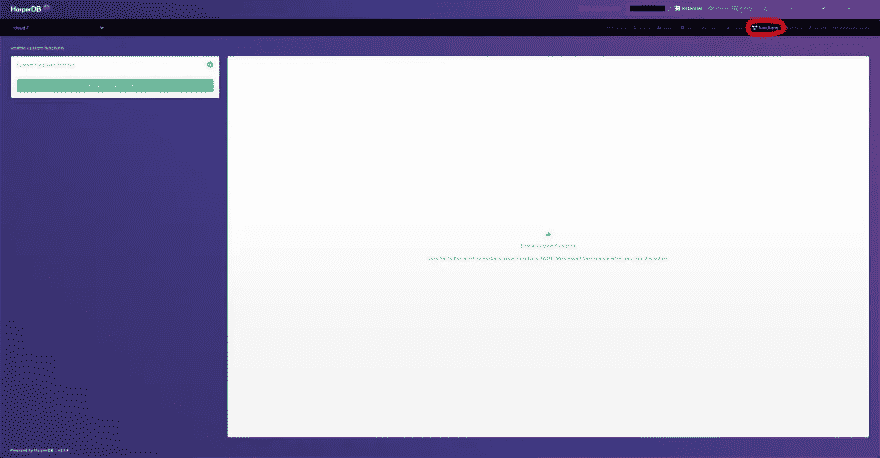

你现在应该在功能屏幕上。给你的项目命名为 **api** ，然后用下面的代码替换编辑器中的所有代码。您应该在左下角看到一个自定义函数服务器 url 的链接。将链接复制到您的浏览器中，并在末尾添加端点 **api** 。端点应该以 JSON 的形式返回数据库数据。

```
'use strict';const customValidation = require('../helpers/example');// eslint-disable-next-line no-unused-vars,require-await
module.exports = async (server, { hdbCore, logger }) => {
    // GET, WITH NO preValidation AND USING hdbCore.requestWithoutAuthentication
    // BYPASSES ALL CHECKS: DO NOT USE RAW USER-SUBMITTED VALUES IN SQL STATEMENTS
    server.route({
        url: '/',
        method: 'GET',
        handler: (request) => {
            request.body = {
                operation: 'sql',
                sql: 'SELECT * FROM timeline.history ORDER BY id',
            };
            return hdbCore.requestWithoutAuthentication(request);
        },
    });
};
```

这是我的端点的结构:

[https://functions-cloud-1-abaisden.harperdbcloud.com/api](https://functions-cloud-1-abaisden.harperdbcloud.com/api)

# 创建前端 React 应用程序

我们将在前端使用 create-react-app 和 TypeScript。为 React 前端创建一个项目文件夹，然后使用您的终端在该文件夹中运行下面的命令。

```
npx create-react-app my-app --template typescript
cd my-app
npm start
```

您应该在 web 浏览器中看到默认的 React 样板文件。在代码编辑器中打开刚刚创建的项目。将`app.css`和`app.tsx`中的代码替换为下面的代码，删除`index.css`中的所有代码并留空。

不要忘记在`App.tsx`中添加你自己的 API URL 来替换我放在那里的那个。这是你需要在`App.tsx`里面寻找的线

```
// Replace this API URL with your Custom Functions Server URL
const API = 'https://functions-cloud-1-test.harperdbcloud.com/api';
```

# App.css

```
@import url('https://fonts.googleapis.com/css2?family=League+Spartan:wght@400;500;700&display=swap');*,
*::before,
*::after {
    margin: 0;
    padding: 0;
    box-sizing: border-box;
}html {
    font-size: 16px;
}body {
    font-size: 1.6rem;
    font-family: 'League Spartan', sans-serif;
    color: black;
    background-color: white;
}header {
    text-align: center;
}header h1 {
    text-align: center;
    margin-top: 1rem;
    text-transform: uppercase;
    font-size: 4rem;
}.container {
    padding: 2rem;
}.civilisation-container {
    display: flex;
    flex-flow: column nowrap;
    align-items: center;
}.civilisation {
    display: flex;
    flex-flow: column nowrap;
    text-align: center;
    align-items: center;
    border: 0.2rem solid black;
    border-radius: 1rem;
    padding: 1rem;
}.civilisation h1 {
    text-transform: uppercase;
    margin-top: 2rem;
}.civilisation img {
    width: 100%;
    max-width: 20rem;
    margin: 2rem 0 2rem 0;
}.civilisation ul li {
    list-style: none;
}.civilisation p {
    margin: 2rem 0 2rem 0;
    font-size: 1.8rem;
    line-height: 2rem;
}.timeline-line {
    background: black;
    height: 4rem;
    width: 1rem;
}
```

# App.tsx

```
import { useState, useEffect } from 'react';
import './App.css';const App = () => {
    interface timeline {
        current_location: string;
        description: string;
        highlights: string;
        history: string;
        id: number;
        image: string;
        original_location: string;
        period: string;
        timeline: string;
        __createdtime__: number;
        __updatedtime__: number;
    } useEffect(() => {
        const getApi = () => {
            // Replace this API URL with your Custom Functions Server URL
            const API = 'https://functions-cloud-1-test.harperdbcloud.com/api'; fetch(API)
                .then((response) => {
                    return response.json();
                })
                .then((data) => {
                    console.log(data);
                    setLoading(false);
                    setData(data);
                })
                .catch((err) => {
                    console.log(err);
                });
        }; getApi();
    }, []);
    const [loading, setLoading] = useState<boolean>(false);
    const [data, setData] = useState<timeline[]>([]);
    return (
        <>
            <header>
                <h1>Human Civilization</h1>
                <p>An Ancient Civilizations Timeline for 8 of the most influential cultures in human history</p>
            </header> <div className="container">
                {loading ? (
                    <div>
                        <h1>Loading...</h1>
                    </div>
                ) : (
                    <div>
                        {data.map((civilisation) => (
                            <div className="civilisation-container">
                                <div className="civilisation" key={civilisation.id}>
                                    <h1>{civilisation.timeline}</h1>
                                    
                                    <ul>
                                        <li>
                                            <strong>Period: </strong>
                                            {civilisation.period}
                                        </li>
                                        <li>
                                            <strong>Original Location:</strong> {civilisation.original_location}
                                        </li>
                                        <li>
                                            <strong>Current Location:</strong> {civilisation.current_location}
                                        </li>
                                        <li>
                                            <strong>Highlights: </strong>
                                            {civilisation.highlights}
                                        </li>
                                    </ul>
                                    <p>{civilisation.description}</p>
                                </div>
                                <div className="timeline-line"></div>
                            </div>
                        ))}
                    </div>
                )}
            </div>
        </>
    );
};export default App;
```

假设你做了所有正确的事情，你应该能够在你的浏览器中看到应用程序的工作。恭喜您，您刚刚学习了如何使用 HarperDB 自定义函数，以及如何将它们连接到 React 前端。我们在本教程中介绍了如何执行 GET 请求，当然，如果您阅读了文档，也可以执行完整的 CRUD 请求。

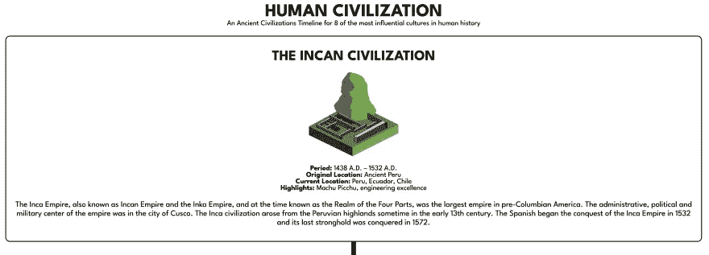