# 如何使用 JavaScript 类进行面向对象编程

> 原文：<https://javascript.plainenglish.io/how-to-use-javascript-classes-for-object-oriented-programming-8f300d5f71a5?source=collection_archive---------6----------------------->

## 你不会相信这有多容易

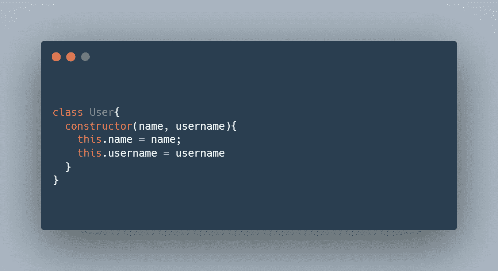

Created Using [carbon.now.sh](https://carbon.now.sh/)

嘿朋友们，

今天，我们将讨论 JavaScript 类。您将学习如何创建类以及何时应该使用它们。我保证——与我的其他演练类似——我的解释会尽可能简单。我们希望每个人都成功。

此外，在这个过程中，你将学习面向对象编程。我已经申请了很多前端工程和软件工程的工作。每个人似乎都喜欢面向对象编程，所以让我们确保你也加入这一行列。

让我们开始吧。

# 为什么上课？为什么是 OOP(面向对象编程)？

想象你是一名老师。你班上有五个学生。你想在你的程序中代表他们。

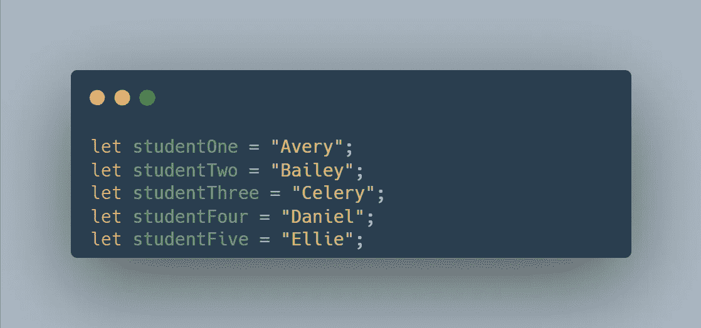

很酷，对吧？如果您想添加每个学生的更多信息，该怎么办？比如他们的年龄或者姓氏？

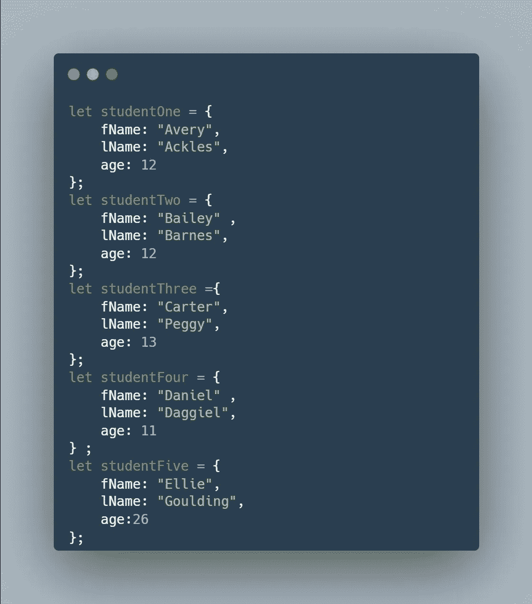

**很长…**

它确实有效，但是非常冗长。这个长度的主要原因是代码的重复。例如，如果我们想再增加 20 名学生，我们将额外编写 100 行代码。我们不想那样。

为了解决这个问题，我们有了面向对象的编程。而这种范式，或者说编码风格，是通过类实现的。(*你也可以使用函数，但是我们将使用类。)*

所以让我们把上面的代码转换成一个类。

# 创建类

创建类将允许我们创建对象。记得我们有五个学生吗？因此，在这个场景中，创建一个类将允许我们创建五个学生。

## 创建一个类

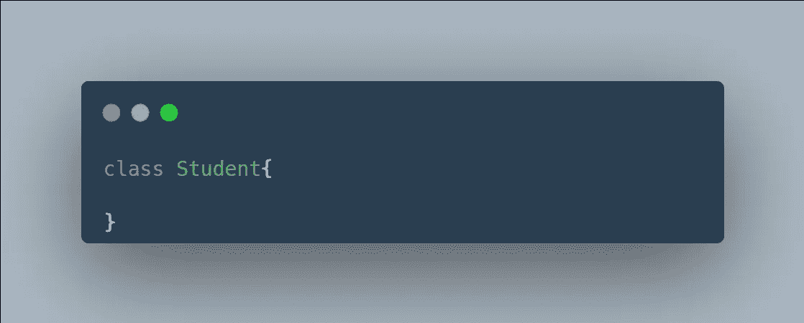

上面，我们创建了一个名为`Student`的类

*请注意，当你创建类时，标准是你的类名以大写字母开头。*

## 创建构造函数

每次创建一个类，你都需要创建一个**构造函数**。构造函数基本上是一个当你实例化一个对象时被调用的函数。换句话说，当您从类中创建一个 student 对象时，将调用构造函数。如果这没有意义，那么当您运行代码时，它就有意义了。我保证一切都会好的。

让我们创建一个构造函数。

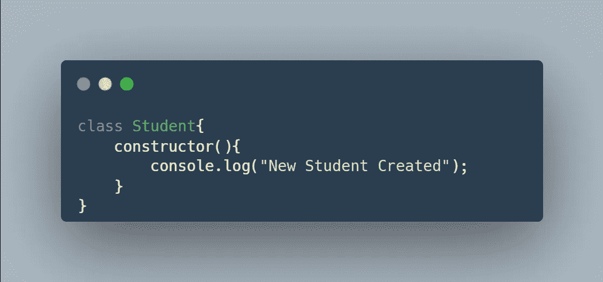

在这种情况下，每当您创建一个新的学生，它将打印到控制台“新学生已创建”。

让我们试一试。要从类`Student`中实例化(或创建)一个对象，你应该写`const variableName = new Student()`

代码如下所示。

```
class Student{
    constructor(){
        console.log("New Student Created")
    }
}   
const Avery = new Student(); //try it in this online [compiler](https://www.programiz.com/javascript/online-compiler/)
```

如果实例化两个学生对象会发生什么？

代码如下所示。

```
class Student{
    constructor(){
        console.log("New Student Created")
    }
}   
const Avery = new Student();
const Bailey = new Student(); //try it in this online [compiler](https://www.programiz.com/javascript/online-compiler/)
```

## 创建属性

现在，我们的`Student`类没有做任何有意义的事情。让我们改变这一点。

所以类有**属性**和**方法**。属性基本上是保存数据的变量。它们是字符串、整数、字母等等。另一方面，方法是函数。

需要注意的是，所有这些属性和方法应该是相关的。这就是使用类的全部意义。

让我们从建立我们的属性开始。

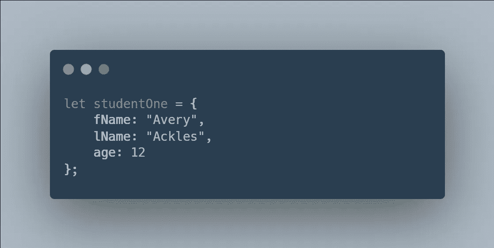

这是之前的一个片段。回想一下，每个学生都有名字、姓氏和年龄。让我们把这些加入到我们的课程中。

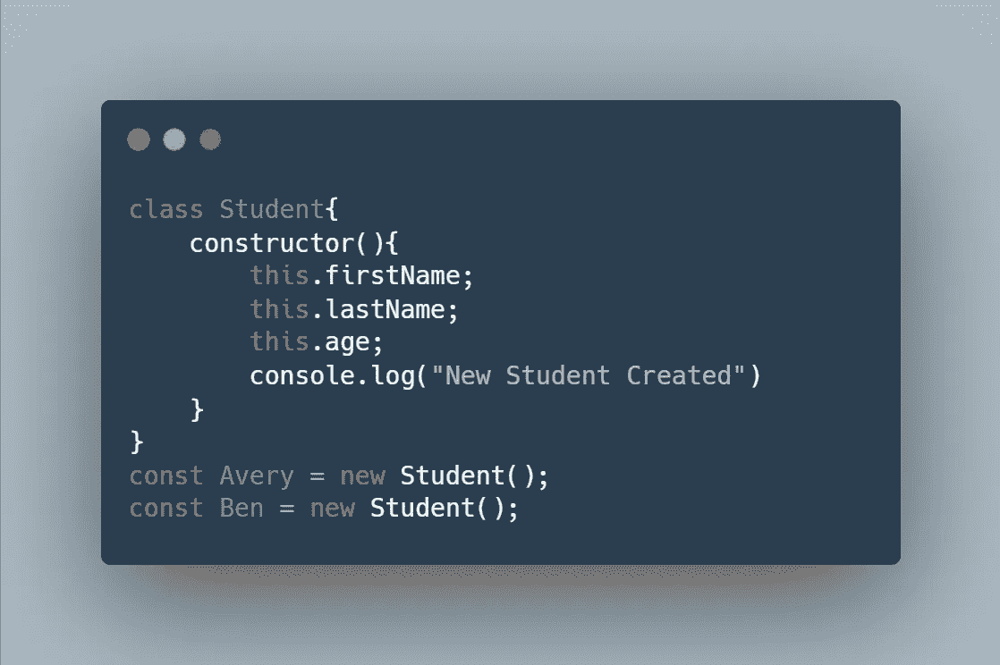

注意一些事情。首先，注意我是如何在构造函数中放置属性或变量的。我们前面说过，一实例化对象就调用构造函数。因此，当我们实例化`Avery`时，我们希望学生有名字、姓氏和年龄。

注意，我们还使用了关键字`this`。关键字`this`确保每个实例(或者像`Avery` 和`Ben`这样的对象)在内存中为它们的属性(名字、姓氏、年龄)有自己的位置。对吗？我们不希望 Avery 和 Ben 有完全相同的名字变量(在内存中)。我们希望他们的名字存储在不同的地方。([更多信息请点击](https://www.vojtechruzicka.com/javascript-this-keyword/#:~:text=This%20keyword%20is%20used%20inside,behaves%20in%20an%20unexpected%20way.))。

## 初始化属性

我们有一个构造函数。我们有我们的财产。现在，是时候初始化我们的属性了。

```
const Avery = new Student();
const Benny= new Student();
const Carrie= new Student();
```

当我实例化这三个对象时，我希望这三个对象的属性值不同。记住，我们的属性是名、姓和年龄。

我们是这样做的:

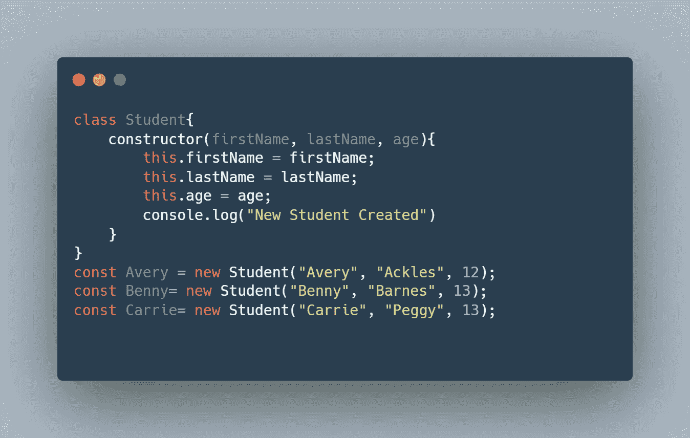

我们做了一些改变。首先，我们的构造函数现在接受三个参数。它接受名字、姓氏和年龄。请注意，在我们的构造函数中，我们使用给定的输入来初始化`this.firstName`、`this.lastName`和`this.age`的值。

下面是相同的代码，只是参数名不同。它做同样的事情，但是也许它对你来说更有可读性。

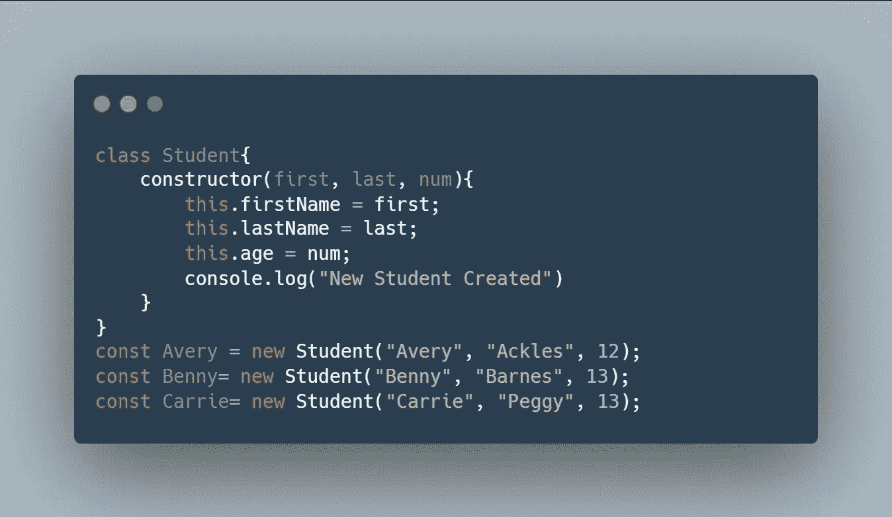

现在让我们看看我们实例化的对象，它们是 Avery、Benny 和 Carrie。注意`Student()`现在有值作为参数传递。所以这些值，如果不清楚的话，会被发送给构造函数。

为了确保我们的代码实际工作，测试它

```
class Student{
    constructor(firstName, lastName, age){
        this.firstName = firstName;
        this.lastName = lastName;
        this.age = age;
        console.log("New Student Created")
    }
} 
//instantiate objects  
const Avery = new Student("Avery", "Ackles", 12);
const Benny= new Student("Benny", "Barnes", 13);
const Carrie= new Student("Carrie", "Peggy", 14);//tests
console.log("Avery's age is " + Avery.age)
console.log("Carrie's name is " + Carrie.firstName)
console.log("Benny's last name is " + Benny.lastName)//try it in this online [compiler](https://www.programiz.com/javascript/online-compiler/)
```

所以，让我们回到之前的列表:

```
let studentOne = {
    fName: "Avery",
    lName: "Ackles",
    age: 12
};
let studentTwo = {
    fName: "Bailey" ,
    lName: "Barnes",
    age: 12
};
let studentThree ={
    fName: "Carter",
    lName: "Peggy",
    age: 13
};
let studentFour = {
    fName: "Daniel" ,
    lName: "Daggiel",
    age: 11
} ;
let studentFive = {
    fName: "Ellie",
    lName: "Goulding",
    age:26
};
```

我们现在可以将其转换为:

```
class Student{
    constructor(firstName, lastName, age){
        this.firstName = firstName;
        this.lastName = lastName;
        this.age = age;
        console.log("New Student Created")
    }
}
const Avery = new Student("Avery", "Ackles", 12);
const Benny= new Student("Bailey", "Barnes", 12);
const Carrie= new Student("Carter", "Peggy", 13);
const Avery = new Student("Daniel", "Daggiel", 11);
const Benny= new Student("Ellie", "Goulding", 26);
//try it in this online [compiler](https://www.programiz.com/javascript/online-compiler/)
```

## 类方法

现在你知道如何实例化对象了。你知道如何创建类和构造函数。您知道如何创建类属性。

现在，让我们看看类方法——这在前面已经简单提到过了。但是，这一次，让我们用一个新鲜的例子:矩形。

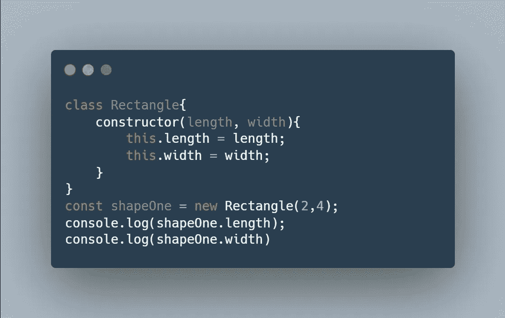

这里，我们有一个名为 Rectangle 的类。我们用长度和宽度实例化了一个名为`shapeOne`的对象。然后最后两行代码基本上确保一切正常。

让我们创建两个方法或函数，称为`getWidth()`和`getLength()`。

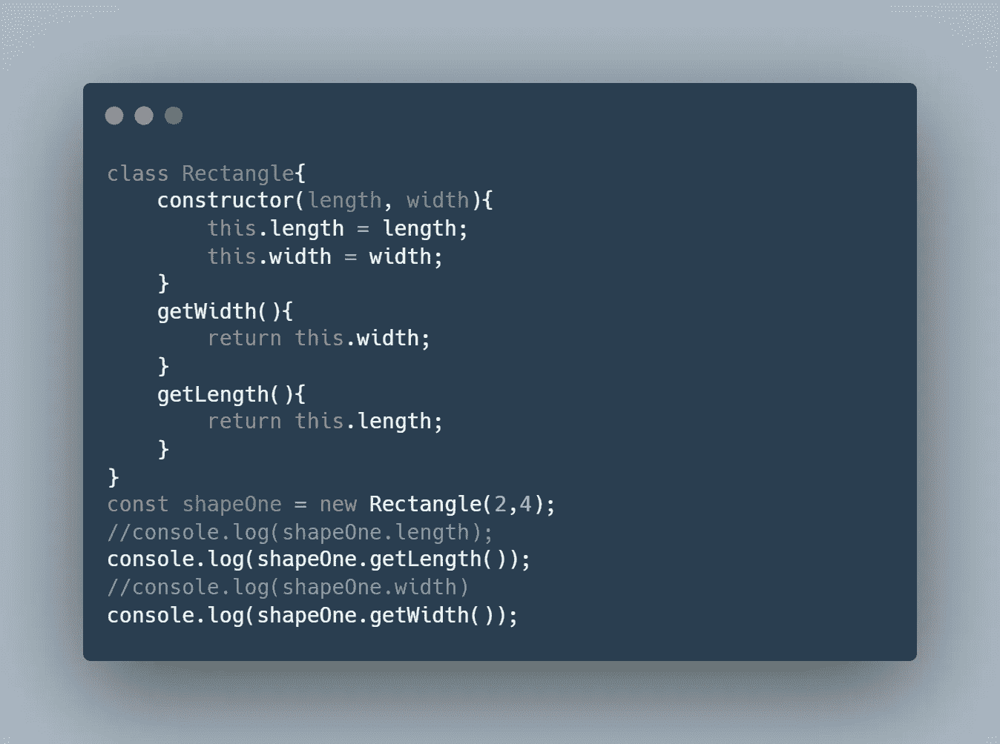

同时，让我们也创建`setWidth()`和`setLength()`方法。

这是代码

```
class Rectangle{
    constructor(length, width){
        this.length = length;
        this.width = width;
    }
    getWidth(){
        return this.width;
    }
    getLength(){
        return this.length;
    }
    setWidth(number){
        this.width = number;
        return "Succesfully set width"
    }
    setLength(number){
        this.length = number;
        return "Succesfully set length"
    }
}
const shapeOne = new Rectangle(2,4);
//console.log(shapeOne.length);
console.log(shapeOne.getLength());
//console.log(shapeOne.width)
console.log(shapeOne.getWidth());console.log(shapeOne.setWidth(400))
console.log(shapeOne.getWidth());
//try it in this online [compiler](https://www.programiz.com/javascript/online-compiler/)
```

`getPerimeter` 和`getArea` 功能怎么样？试试看。

您可能想知道，创建`getWidth`、`setWidth`、`getLength`和`setLength` 方法有什么意义？你可以这样做:

```
shapeOne.width = 5; //to change the width
console.log(shapeOne.width) //to get the width
```

答案是**抽象。这是面向对象编程如此受欢迎的另一个原因。抽象背后的整个思想是建立一个干净的接口，隐藏丑陋的细节。这也是为了可读性。**

例如，当你滑动信用卡时，考虑支付处理。你只需要滑动你的卡片。你不必担心任何隐藏的细节。你不必担心转移资金，确保卡是真实的，或者它是否有足够的钱来支付交易。那是抽象。

要阅读更多关于 getter 和 setter 方法的内容，请查看这个 [StackOverflow Q & A](https://stackoverflow.com/questions/26395055/whats-the-point-of-get-and-set-methods#:~:text=Get%20and%20Set%20methods%20are,the%20easiest%20thing%20to%20do.) 。Getter 和 setter 方法是常用的。

我想这就是我们要停下来的地方。根据所给的信息，你可以做很多事情。试着建造一些东西。

如果您想了解更多，请查看 W3Schools 的 [JavaScript 类继承](https://www.w3schools.com/js/js_class_inheritance.asp)。继承是你应该学习的面向对象编程的另一个支柱。

如果你梦想成为一名软件开发人员，一定要看看 GeeksForGeeks 的 Java 面向对象编程概念。这是一种不同的语言，但概念仍然适用。

这太棒了。祝你们愉快，伙计们。

*更多内容请看*[***plain English . io***](https://plainenglish.io/)*。报名参加我们的* [***免费周报***](http://newsletter.plainenglish.io/) *。关注我们关于*[***Twitter***](https://twitter.com/inPlainEngHQ)*和*[***LinkedIn***](https://www.linkedin.com/company/inplainenglish/)*。加入我们的* [***社区不和谐***](https://discord.gg/GtDtUAvyhW) *。*