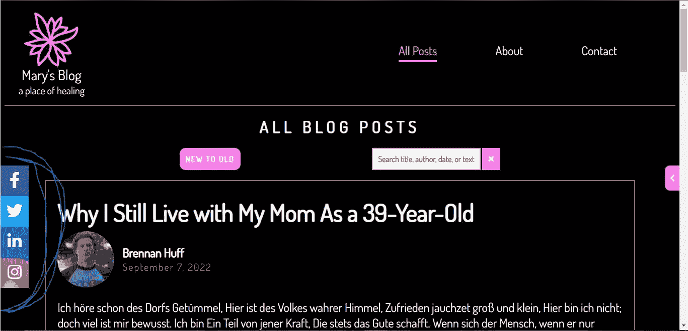

# 如何使用 JavaScript 减少 HTML 代码:一个简单的例子

> 原文：<https://javascript.plainenglish.io/how-to-use-javascript-to-reduce-html-code-a-simple-example-3063259a2f73?source=collection_archive---------9----------------------->

## 在构建博客网站时，我如何使用 JavaScript 使我的代码更高效、更易于调试

作为一名优秀的程序员，最重要的一点是让你的代码尽可能地易于调试，同时写出易于扩展而不出错的代码。比方说，如果你正在做一个博客网站，网站的内容量会随着时间的推移而增长，所以每次你回到这个项目时，你都希望能够快速完成&不要犯错误，因为错误会使网站看起来很糟糕，从而损害你客户的声誉。

对我们来说幸运的是，上帝(或者更确切地说，Brendan Eich)创造了 JavaScript，它可以帮助我们提高代码的效率&更容易调试。在本文中，我将给出一个简单的例子，说明在构建博客网站时，我是如何使用 JS 做到这一点的。

在一个典型的博客网站上，你应该让访问者很容易在社交媒体上找到你，因为这是增加在线追随者的最佳方式。一种方法是在每一页上显示你的社交媒体渠道的链接，可能在页脚，或者在屏幕一侧的面板上，一直显示，如下图所示:

Panel with social links (encircled)

如果您希望该面板显示在站点的所有页面上，一种方法是将几行(本例中为 14 行)相同的代码复制并粘贴到项目中的每个 HTML 页面上。这些线条如下图所示:

HTML to create the social media panel, as seen in the first picture in this article

十四行代码对你来说可能不算多，而且，在某种程度上，你是对的。把这些复制粘贴到你创建的每个新的 HTML 页面上并不困难，尤其是如果项目很小的话。然而，它使代码变得沉闷，这意味着页面不会像使用较少的代码行时那样快地加载，也更难修改或调试。在上面的照片中，我把标签放在锚标签的`href`部分，因为这只是一个演示。

然而，在现实情况下，这些链接会链接到一个真实的社交媒体个人资料的 URL。假设你的客户更改了他们的 Instagram 用户名。这可能导致放入`href`的 URL 与以前不同。作为开发人员，你必须得到那个新链接&并把它粘贴到每一个 HTML 页面&的适当位置。这不仅很麻烦，而且如果你不小心的话，可能会导致错误，尤其是当你厌倦了做这种重复性的工作。

更好的方法是使用 JS。在下面的图片中，我在 JS 中创建了一些功能，将这些链接添加到一个已经出现在所有 HTML 页面上的`div`，它存储在变量`socialsPanel`中。

Functionality to populate the social panel’s HTML

当我们使用这样的函数时，我们只需要在一个地方输入每个链接的信息:在这个函数里面。所以，如果某个特定链接的信息改变了，我们只需要在这里改变它，而不是在每一个 HTML 页面上，如果我们没有使用 JS &而是使用了复制/粘贴方法。如果我们想增加或减少链接，我们只需要在这个函数中这样做。

这不仅节省了大量时间，而且如前所述，它还节省了 HTML 代码行，因为要用这些链接填充页面，我们不需要将 13*行代码复制并粘贴到每个 HTML 文档中，只需在加载页面时调用该函数。在页面上调用这个函数`popSocialsPanel()`，正如你在下一张照片中看到的红色下划线，不会增加新的代码行(暂时忽略其他函数):

**在这种情况下，包含一系列链接的行，因为我们在每个 HTML 文档*上保留了 `*div*` *，我们想向其添加链接*

Call function upon loading of a page where you want the social media panel to display

让我们花一分钟时间对所有这些进行数学计算。不包括注释，我们在 JS 文件中增加了 9 行新的代码，我们只需要写一次，同时减去 13 行 HTML 代码。因此，如果我们的项目只有一个 HTML 文档，我们仍然会保存 4 行代码，这很好，但是我们会保存 13 行代码，同时为我们添加到项目中的每个 HTML 文档实现这个功能，这很好。

在这个特殊的项目中，到目前为止，通过使用这个方法，我已经保存了 56 行代码。对于我添加的每一个博客页面，我都会再保存 13 个。

我希望你会发现这个相对简单的例子很有帮助，但是我想本文的要点是，作为一个程序员，你应该培养某种本能；如果您在编写代码时觉得自己在重复，那么可能有一种更有效的方法来编写代码。

如果您有任何意见或问题，我很乐意回答。如果你觉得这篇文章很有帮助，我会很感激你的评论或者鼓掌，这样我就可以知道我的读者喜欢什么内容。如果您认为其他人会发现这很有用，请与他们分享。

谢谢你的阅读！

*更多内容请看*[***plain English . io***](https://plainenglish.io/)*。报名参加我们的* [***免费周报***](http://newsletter.plainenglish.io/) *。关注我们关于*[***Twitter***](https://twitter.com/inPlainEngHQ)[***LinkedIn***](https://www.linkedin.com/company/inplainenglish/)*[***YouTube***](https://www.youtube.com/channel/UCtipWUghju290NWcn8jhyAw)*[***不和***](https://discord.gg/GtDtUAvyhW) *。对增长黑客感兴趣？检查* [***电路***](https://circuit.ooo/) *。***