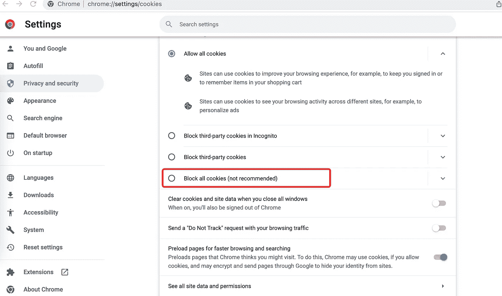
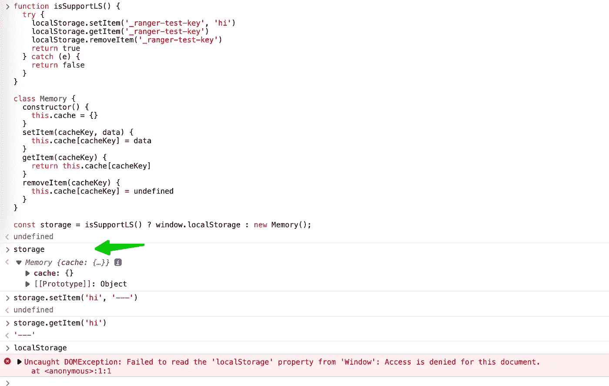

# 如何安全使用 LocalStorage

> 原文：<https://javascript.plainenglish.io/how-to-use-localstorage-safely-a96eb50fbb4e?source=collection_archive---------1----------------------->

## 检测浏览器是否支持本地存储


Photo by [Carlos Muza](https://unsplash.com/@kmuza?utm_source=medium&utm_medium=referral) on [Unsplash](https://unsplash.com?utm_source=medium&utm_medium=referral)

上周，当我专注于编码时，一个生产错误警告消息打断了我。我不得不停止工作，看看发生了什么事。

错误是


我们无法从生产的代码位置知道哪些代码工作不好。javascript 文件都是编译过的，而且很难看。

在搜索问题时，我们可以发现浏览器不支持 localStorage。最简单的解决方案是在使用 localStorage 时捕获错误:

```
try {
  const data = localStroage.getItem(key)
} catch(e) {
  // if localStorage not support, fallback
}
```

但是如果有很多 localStorage 代码片段，这种方式会使我们的代码变得复杂。

更好的方法是提供一个 util 文件来完成:

```
export const storage = {
  getItem(key, fallbackValue) {
    try {
      return localStorage.getItem(key);
    } catch(e) {
      return fallbackValue;
    }
  },
  setItem(key, value) {
    try {
      localStorage.setItem(key, value);
    } catch(e) {
      // 
    }
  }
  removeItem(key, value) {
    try {
      localStorage.removeItem(key, value);
    } catch(e) {
      // 
    }
  }
}
```

在我们的代码中，我们可以导入 util 并使用`storage.getItem`来访问本地存储数据。但是这种方式也可以继续优化，因为它会丢失相同页面上下文中的数据。

如果不支持 localStorage，我们可以退而使用内存。最终的方式会是这样的:

```
function isSupportLS() {
  try {
    localStorage.setItem('_ranger-test-key', 'hi')
    localStorage.getItem('_ranger-test-key')
    localStorage.removeItem('_ranger-test-key')
    return true
  } catch (e) {
    return false
  }
}

class Memory {
  constructor() {
    this.cache = {}
  }
  setItem(cacheKey, data) {
    this.cache[cacheKey] = data
  }
  getItem(cacheKey) {
    return this.cache[cacheKey]
  }
  removeItem(cacheKey) {
    this.cache[cacheKey] = undefined
  }
}
// if not support localStorage, fallback to memory
export const storage = isSupportLS() ? window.localStorage : new Memory();
```

我们可以通过阻止所有 cookie 来禁用 localStorage，请访问 chrome://settings/cookies:



然后在 Chrome 控制台中测试这段代码，它运行良好:



希望这篇文章能帮到你，也期待跟着我学习更多的技巧。

*更多内容尽在* [***说白了. io***](https://plainenglish.io/) *。报名参加我们的* [***免费周报***](http://newsletter.plainenglish.io/) *。关注我们关于* [***推特***](https://twitter.com/inPlainEngHQ) ，[***LinkedIn***](https://www.linkedin.com/company/inplainenglish/)*，*[***YouTube***](https://www.youtube.com/channel/UCtipWUghju290NWcn8jhyAw)*，* [***不和***](https://discord.gg/GtDtUAvyhW) *。对增长黑客感兴趣？检查* [***电路***](https://circuit.ooo/) *。*