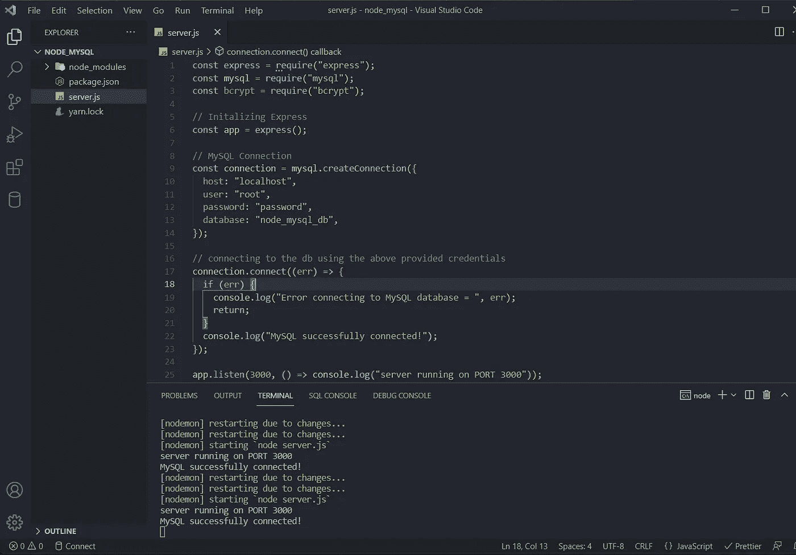

# 如何在 Node.js 中使用 MySQL

> 原文：<https://javascript.plainenglish.io/how-to-use-mysql-with-node-js-fdb84658055b?source=collection_archive---------5----------------------->

## 今天，我们将看看如何通过 Node.js 使用 MySQL 数据库。我们将创建一个简单的 RESTful API 来执行基本的 CRUD 操作。


Photo by [Joshua Aragon](https://unsplash.com/@goshua13?utm_source=medium&utm_medium=referral) on [Unsplash](https://unsplash.com?utm_source=medium&utm_medium=referral)

## 先决条件:

*   了解如何在 Express framework 中使用 Node.js。
*   在您的机器上安装 MySQL 和 MySQL workbench(这只是用于与数据库交互的 GUI)。如果没有，你可以跟随这个[视频](https://www.youtube.com/watch?v=OM4aZJW_Ojs&ab_channel=AmitThinks)，把它安装到你的本地机器上。
*   为了测试 API 路由，我们将使用 Postman。如果你的机器上没有安装 Postman，你可以根据你的操作系统点击这些链接: [Windows](https://www.youtube.com/watch?v=3eHJkcA8mTs&ab_channel=GeekyScript) ， [macOS](https://www.youtube.com/watch?v=sriayOzVaMM&ab_channel=Postman) ， [Ubuntu](https://www.youtube.com/watch?v=XBxtX-tWBr4&ab_channel=ProgrammingKnowledge2) 。您还应该知道如何使用 Postman 来测试您的路线。
*   计算机上安装的 Visual Studio 代码。如果没有，可以去他们的[网站](https://code.visualstudio.com/)看看，流程挺简单的。

## 什么是 MySQL？

MySQL 是一个**关系数据库管理系统(RDMS)，**这意味着 RDMS 由各种表的集合组成，单个表由不同的行和列组成。表中的行也被称为*元组*，而列也被称为*字段*。

为了操作 MySQL 中的数据，我们使用结构化查询语言，这是与 RDMS 交互的标准。

一个 MySQL 数据库可以包含许多表，一个表可以包含许多行和列。关系数据库通过使用*键在数据库内部的不同表之间创建*关系*来工作。*

在一个表中，使用一个叫做*“主键”的东西来惟一地标识一行。在为数据库中的表定义表模式时，我们指定了保存行主键的列(我们将在后面看到)。*

当一个列持有表的主键时，那么这个列*不能为空。*一个表只能有*一列*和*主键*约束。并且该列中的值应该是*唯一的。*

一个数据库可以有许多表，这些表之间可以有关系。两个或多个表之间的关系是通过使用一种叫做*“外键”的东西来创建的。*

*外键*是一个表中的一个(或多个)字段，它保存另一个表的字段值，从而创建一个引用。通常，一个表中保存*外键*的字段会保存另一个表的*主键*，因为*主键*在一个表中是唯一的。

一个表的*外键*不一定要引用另一个表的*主键*，它也可以引用表中其他字段的值，但该值必须是唯一的。与*主键*约束不同，*外键*字段可以保存*空值以及非唯一值。*

请看下图，以便更好地理解*主键和外键。*假设我们有一个基本的网络应用程序，用户可以注册和登录。登录后，用户可以将图像上传到他/她的帐户中的数据库。


image by author

如您所见，我们的 MySQL 数据库中有两个表，一个名为“users”，另一个名为“images”。“users”和“images”表都有一个 **id** 字段，它是各自表的*主键，将保存一些唯一的非空值。*

“images”表将保存用户上传的图像的 URL。“images”表中的“user_id”字段包含对“users”表中“id”字段的引用，以便能够判断哪个用户上传了哪个图像。*“图像”表中的“用户标识”字段是一个外键。*

现在，让我们开始创建 API。

# 设置数据库和创建表:

打开 MySQL workbench，使用您在安装过程中使用的密码登录。登录后，使用以下命令获取 MySQL 本地实例中存在的所有数据库的列表:

```
show databases;
```

键入命令后，使用顶部的*惊雷图标*执行查询:


image by author

您将获得您机器上存在的数据库列表。

现在，我们将为这个项目创建一个名为“node_mysql_db”的新数据库。你可以给它起任何你想要的名字。使用下面的命令创建数据库。


image by author

运行此命令后，如果您在操作输出中没有得到任何错误，那么这意味着数据库已成功创建。创建数据库后，我们必须告诉 MySQL 我们要使用哪个数据库。使用以下命令实现这一点:

```
// use database_name; // in this case it is 'node_mysql'
use node_mysql_db;
```

注意每个命令后的操作输出，以确保没有错误。

选择数据库后，我们将开始在我们的 *node_mysql_db* 数据库中创建表。

要创建表格，我们将使用“创建表格”命令。create table 命令的工作方式如下:

```
CREATE TABLE table_name(
 columnName dataTypeForColumn constraint,
 columnName dataTypeForColumn constraint,
 columnName dataTypeForColumn constraint
 .
 .
 .
)
```

首先，我们定义列的名称，然后定义列将包含的数据类型，如整数、字符串、布尔、日期等。你可以在这里看一下 SQL 拥有的所有数据类型[。](https://www.w3schools.com/sql/sql_datatypes.asp)

指定数据类型后，我们将输入特定列的约束。顾名思义，约束就是为特定的列添加规则/限制。可以使用的一些常见约束有-NOT NULL、DEFAULT、PRIMARY KEY、UNIQUE 等。您可以查看所有的 SQL 约束，并在这里阅读关于它们的详细信息[。](https://www.w3schools.com/sql/sql_constraints.asp)

特定列可以有多个约束。

我将解释我将在文章中使用的所有数据类型和约束。为了更深入的理解，您可以查看上面附加的所有数据类型和约束的链接。

现在使用下面的命令在 *node_mysql_db 数据库中创建一个表:*

```
CREATE TABLE users (
 id int NOT NULL UNIQUE PRIMARY KEY auto_increment,
 email varchar(255) NOT NULL UNIQUE,
 full_name varchar(255) NOT NULL,
 user_password varchar(255) NOT NULL
);
```

**注意:** [**这里的**](https://docs.microsoft.com/en-us/sql/t-sql/language-elements/reserved-keywords-transact-sql?view=sql-server-ver15) **是一些不能用作表名、列名等的 SQL 关键字。**

在 MySQL workbench 中运行该命令后，将在 *node_mysql_db* 数据库中创建一个名为 *users* 的表。

现在，让我们分解“*用户”*表来理解数据类型和约束:

*   第一列名为 *id* ，其数据类型为 *int，*，这意味着 *id* 列可以保存正负整数，但不能保存小数或分数。id 列包含 4 个约束:第一个是 *NOT NULL* ，这意味着该列不能包含 NULL 值。第二个是 *UNIQUE* ，它告诉我们整个列中的值将是唯一的。最后，我们有*主键*约束，这意味着 id 列中的值可以用来惟一地标识表中的记录。第四个是 *auto_increment* ，这意味着我们不必为该列指定值，它会自动添加，并且由于数据类型是 *int* ，该值将是一个整数。
*   第二列名为*电子邮件*，其数据类型为 *varchar(255)* 。*‘varchar’*代表‘可变字符’，‘255 指定该列可以容纳的最大字符串长度。从 1 开始，255 是我们可以对 varchar 使用的最大值。但是如果你有一个比这个更长的字符串，你可以使用*文本*数据类型。该列有两个约束，即， *NOT NULL 和唯一*。 *NOT NULL* 指定列不能有空值，而 *UNIQUE* 表示该值在整个列中应该是唯一的。
*   第三列是 *full_name* ，它与 *email* 列具有相同的数据类型和约束(保留*唯一*约束)。
*   第四列 *user_password* 与 *full_name* 列具有相同的数据类型和约束。

在为列输入值时，如果不满足数据类型或约束条件，则 SQL 查询会抛出错误。

# 在 VS 代码中设置项目:

在机器上的任意位置创建一个名为“node_mysql”的文件夹(可以任意命名)，然后在 VS 代码中打开新创建的文件夹。


image by author

在 windows 上按“Ctrl + J”或在 mac 上按“cmd + J ”,在 VS 代码中打开集成终端。在 VS 代码中使用集成终端的最大好处是它已经导航到我们正在工作的当前目录。


image by author

现在，正如我们对所有 Node.js 项目所做的那样，我们将首先初始化目录以获得我们的*‘package . JSON’*文件。我用*纱线*做项目，如果你愿意，你也可以用 *npm* 。运行以下命令初始化目录。

```
yarn init -y // for NPM - npm init -y
```

初始化目录后，在目录的根目录下创建一个 *'server.js'* 文件。创建文件后，我们将为项目添加依赖项，有 2 个，即: *express(用于创建路线)和 mysql(用于与我们的 MySQL 数据库交互的驱动程序)。*

使用以下命令添加项目的依赖项，

```
yarn add express mysql
// For NPM - npm install express mysql
```

完成上述步骤并添加依赖项后，您的目录应该如下所示:


image by author

如果您使用的是 *npm* ，那么您将收到*‘package-lock . JSON’而不是*‘yarn . lock’*。*

为了简单起见，我将在' server.js '文件中编写所有代码，但在现实世界中，该项目被分成多个文件夹和多个文件。

在编写 server.js 文件中的代码之前，我们将只在 package.json 文件中添加一个“开发脚本”,以使用“nodemon”运行 run server.js 文件。(我在全局范围内安装了 nodemon，这就是为什么我在这里没有将它作为开发依赖项添加进来)。要将 Nodemon 作为全局依赖项添加，请使用以下命令:

```
yarn global add nodemon
For NPM - npm install -g nodemon
```

您的 package.json 文件应该如下所示:


# 编写代码:

看看下面的代码，然后我会解释它。


image by author

*   首先，我们需要我们安装的所有依赖项。然后在第 5 行，我们初始化 express 依赖项，以便能够创建路由、中间件等。由于这种初始化，在第 7 行，我们可以监听端口 3000，回调函数将运行，告诉我们在运行服务器时没有问题。
*   现在，在终端中使用以下命令运行 dev 服务器:

```
yarn run dev // For NPM - npm run dev
```

我们正在运行一个 dev 服务器，因为它将使用 nodemon 来运行文件，当对代码进行任何更改时，服务器将自动重启。

运行“dev”命令后，您应该看到终端上打印的回调函数消息。


image by author

## 正在创建 MySQL 连接:

现在，我们将创建从 server.js 文件到我们创建的数据库的 MySQL 连接，即“node_mysql_db”。


image by author

我们将使用 MySQL 库连接到 MySQL 数据库。

*   *' MySQL . create connection()'*获取一个对象，在该对象中，我们指定它获取一组帮助连接到我们的数据库的键-值对。
*   “host”属性指定数据库所在的主机，在我们的示例中是“localhost”。但是对于生产就绪的应用程序，这将是一个 URL。
*   *‘用户’*和*‘密码’*属性定义了试图访问数据库的用户。它将与您在安装 MySQL 时设置的相同。
*   *‘database’*属性指定了我们试图连接的数据库。我们编写的所有 SQL 查询都将在这个特定的数据库上执行。
*   您还可以在 createConnection 方法中传递其他选项。你可以在这里看看它们[。](https://github.com/mysqljs/mysql#readme)
*   *'connection.connect()'* 方法尝试使用上面提供的凭据连接到数据库。这个方法接受一个回调函数，该函数有助于在连接到数据库时处理任何错误。
*   如果连接到数据库时没有出现错误，则显示消息“MySQL 成功连接！”会被打印到终端上。
*   保存' server.js '文件(你的服务器会因为 nodemon 而自动重启)并检查你的终端，应该是这样的。


Image by author

*   由于消息被打印到控制台，这意味着我们已经成功地创建了与数据库的连接。
*   如果您遇到任何类型的错误，请检查拼写错误，这是最常见的错误，或者尝试阅读打印到终端的错误消息并尝试修复它。
*   现在，您的文件应该如下所示:



image by author

## 创建路线:

在第 5 行初始化 express 模块的下面，我们将开始为 CRUD 应用程序创建路由。

**创建:**

为了使 POST 路由工作，我们将首先使用一个名为 *express.json()* 的中间件，它有助于将传入的 json 对象解析为一个简单的对象。


image by author

现在，看下面创建的 post 路由，然后图片下面会有说明。


image by author

*   首先，我们析构“req.body”对象来提取 name、email 和 password 属性。如果你不知道什么是析构，那么看看这里的。
*   然后，在“try”块中，我们使用作为对象的“connection”变量，并访问其中的“query”方法，以编写我们想要执行的 SQL 查询。
*   “query”对象有 3 个参数，第一个是查询，第二个是值(如果有的话)，第三个是回调函数。
*   “插入”用于在表中插入记录。“users”是我们将要插入一行的表。指定表后，我们将打开括号来指定表中的列名。指定列后，我们使用“VALUES”关键字来声明指定列的值。这些值也在括号内指定，并用逗号分隔。
*   这里的值，我们放了三个“？”，其值将被“query”方法的第二个参数替换，即数组[name，email，password]。列的顺序并不重要，但是值的顺序应该与列的顺序相匹配。
*   假设我们将姓名、电子邮件和密码的值输入为“John Doe”、“jdoe@gmail.com”、“test12”。因此，当查询将被执行时，它看起来像这样:“INSERT INTO users (full_name，email，password)值(' John Doe '，' jdoe@gmail.com '，' test 12 ')”；
*   如果查询方法的第二个参数是[email，name，password]，那么“full_name”列将保存用户的电子邮件，反之亦然。
*   第三个参数是回调函数，用于处理任何错误和查询发送的结果。该函数总共有 3 个参数，但是对于这个查询，我们将只检查错误。你可以 *console.log* 其他参数，看看它们会返回什么，如果它们对你的应用有用的话。
*   在回调中，我们检查是否有任何错误，如果有错误，那么我们 console.log 它并返回 400 错误。
*   如果没有出现错误，那么我们发送一个 201 状态，这意味着 created，并发送一个 JSON 格式的消息，只说 new users created。

现在，它只是一个基本的应用程序，所以我们不做任何验证，只是存储密码，没有哈希。如果你喜欢，你可以这样做，但对于这个项目，我会保持事情简单。

现在，打开 Postman 应用程序，创建一条指向“localhost:3000/create”的投递路线。现在我们必须在我们的主体中发送 JSON 对象，所以点击 Body > Raw > JSON。


image by author

选择输入区域并打开花括号({})来表示一个 JSON 对象，然后我们将添加键值对。看看下面的图片，并阅读下面的解释。


image by author

*   密钥——名称、电子邮件和密码应该准确输入，因为我们希望在我们的 post 路由中输入相同的内容。这些值可以是您喜欢的任何值。
*   输入值后，单击“发送”按钮并等待响应。如果你做了所有的事情，你应该会得到一个成功的回应。使用相同的过程，添加 2 或 3 个使用不同电子邮件的用户。


image by author

现在，一个新用户已经成功地添加到了我们的数据库中的“users”表中。现在用同一封电子邮件尝试一个请求。名称和密码字段可以不同。用同一封电子邮件运行请求后，您将得到一个 400 错误。


image by author

这是因为在我们的表中，我们指定 email 列应该只保存唯一的值，现在出现了重复。因此，会引发一个错误，并且该记录不会输入到数据库中。

**读作:**

现在，我们将读取添加到数据库中的用户。为了读取数据，我们将在 server.js 文件中创建一个 GET route。首先，我们将看看如何获取所有用户，然后我们将看看如何根据条件读取数据。

1.  读取所有用户


image by author

*   这里，我们也将使用“query”方法来编写我们想要执行的 SQL 查询。
*   SQL“SELECT”语句用于从数据库中读取数据。“*”表示选择表中的所有列。在“*”符号之后，我们使用 FROM 命令，该命令用于告诉表应该在哪个表上执行查询。然后我们指定表，在本例中，它是“用户”。
*   我们也可以用我们想要的列名来替换“*”号。然后，列名必须用逗号分隔。例如:“从用户中选择全名、电子邮件、用户密码”。
*   因为我们没有任何需要插入到查询中的值，所以我们将跳过“query”方法的第二个参数，直接进入回调函数。
*   同样，我们将检查错误，如果没有错误，我们将继续。
*   在这种情况下，我们将使用 results 参数，因为该参数将保存从 DB 接收的结果。
*   我们将把收到的结果作为 JSON 文档发送。
*   现在，在 postman 中创建新的 GET 请求，指向这个 get URL，然后单击“send”。您应该会看到数据库中所有用户的列表。


image by author

2.阅读特定用户

为了根据条件获取记录，我们将使用 WHERE 子句。


image by author

*   我们将创建一个新的路由并接受“email”作为参数，然后在我们的请求中提取 email 参数。
*   一切都和上面一样，但是在表名后面，我们将写“WHERE”来帮助过滤记录。在 WHERE 之后，我们将指定列名，列的 for 值将只是一个“？”就像我们之前做的。
*   现在，我们将为“查询”方法添加第二个参数，这是我们想要使用的值，也就是来自参数的电子邮件。
*   其他都一样，现在用 Postman 跑这条路线。


image by author

**更新:**

现在，我们将看看如何更新数据库中已经存在的记录。我们将更新特定用户的密码。


image by author

*   我们将创建一个补丁路由，并将用户的电子邮件作为我们要更新的参数，新密码将输入到请求正文中。
*   “更新”命令用于更新表中已经存在的记录。在 UPDATE 之后，我们指定表名，然后使用 SET 命令指定应该更新哪一列。在 SET 之后，我们再次使用 WHERE 子句来过滤我们想要更新的记录。
*   列“user_password”和“email”的值将再次传递给查询参数的第二个参数。
*   在 Postman 中运行以下请求并查看记录的密码，参数中指定的电子邮件将被更新。


image by author

更新后，您可以再次运行“read”命令，您将看到您指定的用户的密码已被更新。

**删除:**

让我们看一下我们将要创建的最后一条路线。这里我们将删除一个使用电子邮件的用户，我们将再次把它作为一个参数。


image by author

*   从参数中提取电子邮件后，我们将使用“query”方法中的“DELETE”语句删除一条记录。
*   在“DELETE”之后，我们将使用 FROM 关键字来指定要删除的表名。
*   指定表名后，我们将使用“WHERE”子句来过滤我们希望根据电子邮件删除的记录。
*   email 列的值将是“查询”方法的第二个参数，即 email from 参数。
*   在回调函数中，我们将首先检查错误，如果没有错误，那么我们将继续下一步。
*   如果用户已被删除，则“results.affectedRows”将不为 0。如果为 0，则意味着数据库中没有删除任何记录，如果在数据库中没有找到输入电子邮件的记录，就会出现这种情况。
*   现在，在邮差中运行这条路线。


image by author

如果您看到此消息，则意味着该用户已从“用户”表中成功删除。

如果您使用相同的电子邮件运行相同的路线，您将得到 404 错误。

# 结论:

MySQL 是许多大公司使用最广泛的 SQL 数据库，如脸书、Twitter、LinkedIn、Tumblr 等等。学习 MySQL 可以很好地影响你的职业生涯，因为大多数公司要求开发人员具备 MySQL 知识。

这篇文章比预期的要长，但是我希望它值得你花时间，并且你确实从中学到了一些东西。

直到下一次，保持安全和快乐的编码！

*更多内容看* [*说白了。报名参加我们的*](http://plainenglish.io/) [*免费每周简讯*](http://newsletter.plainenglish.io/) *。在我们的* [*社区*](https://discord.gg/GtDtUAvyhW) *获得独家写作机会和建议。*