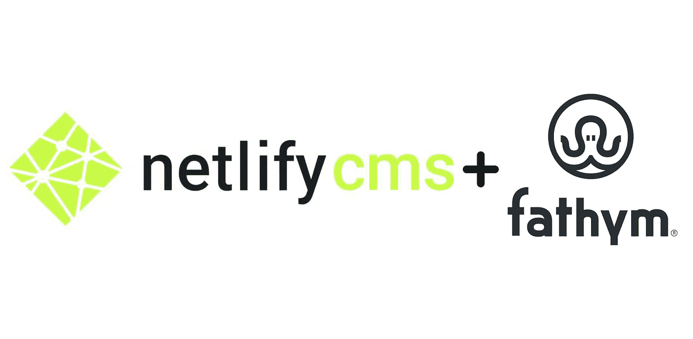

# 如何使用 Netlify CMS 和带有 Fathym 的主机

> 原文：<https://javascript.plainenglish.io/how-to-use-netlify-cms-and-host-with-fathym-853e80193ecf?source=collection_archive---------12----------------------->

从头开始建立一个网站似乎是一项艰巨的任务。

尤其是如果你不是一个网页开发者。

一个解决办法是求助于经验丰富的专业人士，但这需要花费金钱和时间。这就是为什么许多人转向自己建造它。

幸运的是，在 2022 年，做到这一点非常容易。

## CMS 定义

你需要的是一个内容管理系统。CMS 是博客后端的结构。它是添加内容的地方，包括文本、图片和视频。

您可以编辑该内容，甚至就其进行协作，从而允许多个用户向您的媒体库添加内容。这对于拥有多个内容贡献者的企业和团队来说非常有价值。例如，一个想卖东西的小企业可能有一个产品创造者、一个博客写手和一个摄影师。他们每个人都可以通过 CMS 添加自己的内容。

最后，CMS 也存储所有这些内容。继续把大量的照片放进去，以后需要的时候再用。

一些受欢迎的选择是 WordPress——我们已经写了很多关于如何创建无头 WordPress 站点的文章——还有 Squarespace 和 Drupal。WordPress 和 Drupal 是免费的，但都需要付费插件，设计选择有限，而 Squarespace 意味着使用他们的主机平台，这很昂贵，而且他们的主机会把你锁在里面。

所以，今天我们就来看看免费使用的 Netlify CMS。

## 网络 CMS

他们开始澄清不是所有的 Netlify 网站都使用 Netlify CMS，也不是所有使用 Netlify CMS 的网站都位于 Netlify.com。

[他们的网站解释说:](https://www.netlifycms.org/docs/intro/#netlify-cms-vs-netlify)

“Netlify 的人创建了 Netlify CMS 来填补静态站点生成管道中的空白。有一些很棒的专有无头 CMS 选项，但没有真正的竞争者是开源的和可扩展的——可以变成像 WordPress 或 Drupal 那样的社区构建的生态系统。出于这个原因，Netlify CMS 是由社区驱动的，从来没有被锁定到 Netlify 平台上(尽管有这个名字)。”

因此，Netlify 希望在免费、开源和社区驱动方面追随 WordPress 和 Drupal 的脚步，这很好。如果有希望的话，事情会变得比以前更好。

Netlify CMS 的伟大之处在于，他们在前端提供了与多个不同的静态站点生成器协同工作的模板。根据他们的网站，你可以使用:Gatsby，11ty，Hugo 或类似 Next 的 JavaScript 框架。JS 等。唯一的缺点是您需要托管到 Netlify 才能使用这些模板。

如果托管在其他地方，有文档指导你如何使用上面提到的站点生成器建立并运行一个站点。

在你把网站建立起来并进入公共领域之前，你必须找到一个主机。

## Fathym.com 的主持人

把网站带到 Fathym，让我们来主持。

[Fathym 通过利用 Microsoft Azure](https://www.fathym.com/blog/articles/2022/april/2022-04-04-fastest-way-to-evaluate-azure) 作为我们的云平台来使用无服务器托管。

一个巨大的优势是不需要用户管理，我们为您处理。

此外，无服务器意味着按需扩展。如果因为你创造和分享了一些神奇的东西而导致流量激增，它会自动响应并扩大规模。在传统的基于服务器的架构中，巨大的流量峰值会使服务器不堪重负，导致网站崩溃。

说到作为一个站点的扩展和成长:对于那些需要“企业”级解决方案的人，我们也有一个计划。在这种情况下，如果你的公司想摆脱与 Fathym 的“共享”计划，你仍然可以使用 Fathym 的所有基础设施，但在你自己的 Azure 云上。

无服务器也意味着更快的部署、更新和升级，因为没有原始服务器。当谈到微型或模块化前端时，这些好处也是真实的，因此这两者是相辅相成的。

## 结论

简单概括一下:在后端使用 Netlify CMS 作为输入、存储和格式化所有内容的地方。

然后，使用像 Gatsby 或 11ty 这样的静态站点生成器，或者甚至是 JavaScript 框架——如果你有编码经验的话——比如 Next.js 作为你的前端。在那里，你会找到模板，风格的想法和网站的外观和感觉的选项。

最后，使用微软 Azure 在 Fathym 上托管你的新站点。

[立即加入 fat hym](https://www.fathym.com/dashboard)托管您的网站，使用我们的微前端平台构建您自己的网站，和/或利用[物联网套装](https://www.fathym.com/iot/)提供的一切。

*原载于*[*https://www.fathym.com*](https://www.fathym.com/blog/articles/2022/july/2022-07-07-use-netlify-cms-host-with-fathym)*。*

*更多内容请看*[***plain English . io***](https://plainenglish.io/)*。报名参加我们的* [***免费周报***](http://newsletter.plainenglish.io/) *。关注我们关于*[***Twitter***](https://twitter.com/inPlainEngHQ)*和*[***LinkedIn***](https://www.linkedin.com/company/inplainenglish/)*。查看我们的* [***社区不和谐***](https://discord.gg/GtDtUAvyhW) *加入我们的* [***人才集体***](https://inplainenglish.pallet.com/talent/welcome) *。*