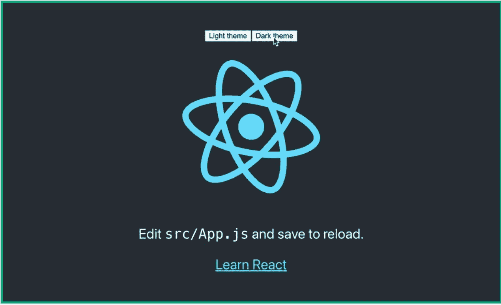
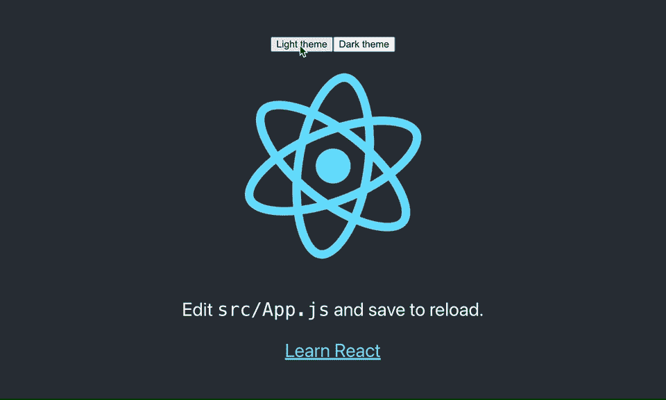

# 如何使用带有钩子的 React 上下文进行全局状态管理

> 原文：<https://javascript.plainenglish.io/how-to-use-react-context-with-hooks-for-global-state-management-8d7d3526c5af?source=collection_archive---------0----------------------->

## 用 React 的 useContext 创建一个自定义上下文挂钩

# 内容

1.  **为什么**您希望使用 React 的上下文 API 进行全局状态管理？
2.  反应上下文能代替 **Redux** 吗？
3.  **什么时候**我应该使用 React 上下文？
4.  如何使用 React 上下文:显示代码

## 为什么要使用 React 的上下文 API 进行全局状态管理？

答案很简单，尽管您可以通过 *props* 将状态从主父组件一直传递到所有子组件，但在 2 级= > **深度 props drilling**之后，这将变得非常麻烦，这是一种糟糕的做法，会导致代码难以阅读和维护。这时你应该看看状态管理库(例如 **Redux** 或内置 **React Context** )。

## React 上下文能代替 Redux 吗？

嗯，看情况。【Redux 和 React 上下文在 React 应用中仍然有其合理的位置，用于不同的目的。Redux 是 React 最流行的状态管理库，但它不是 React 的一部分。另一方面，React Context 是一个内置的 React API，但它不是一个状态管理系统。Redux 旨在用于更动态的数据，而 **React Context 应该用于不经常改变的静态数据**，例如主题、语言、区域设置。与简单的 React 上下文相比，Redux 可能需要一些初始样板文件，在您习惯这种模式之前可能需要一些时间。所以， **Redux 和 React 语境不是同一个**。

此外， **Redux 提供了一些现成的好处**。首先，使用 Redux 存储中的状态的组件只有在连接部分发生变化时才会重新呈现。与 React 上下文不同，**由您来优化订阅 React 上下文**的组件，例如，通过用 [*useMem* o()](https://reactjs.org/docs/hooks-reference.html#usememo) 或 [*React.memo()*](https://reactjs.org/docs/react-api.html#reactmemo) 来记忆它们。其次，Redux 为 [DevTools 提供了时间旅行调试](https://chrome.google.com/webstore/detail/redux-devtools/lmhkpmbekcpmknklioeibfkpmmfibljd?hl=en)，这非常有用。尽管如此，如果你使用 React Context 和 [*useReducer* ()](https://reactjs.org/docs/hooks-reference.html#usereducer) 钩子，一个类似的项目叫做 [react-rewind](https://github.com/reactrewind/react-rewind) 是可用的。

## 什么时候应该使用 React 上下文？

正如我之前提到的，对于不经常改变并且真正是全球性的(例如，主题、语言、地区)的**数据，这是一个很好的选择。否则，让状态只局限于它所属的组件，或者使用 Redux 可能是更好的选择。**

# 如何使用 React 上下文:显示代码

下面你可以看到一个 gif 图片，展示了一个简单的演示，我们将构建它来查看 React 上下文的运行情况。这将是一个最小的[*create-react-app*](https://reactjs.org/docs/create-a-new-react-app.html)项目，有一点小小的变化——我们将用两个主题(亮和暗)使它主题化，其中当前的**主题通过上下文**共享。

Themeable React app with a custom context hook

虽然为了简单起见，这篇文章只展示了最重要代码的要点，但是如果你想运行这个应用程序并仔细看看，你可以在 GitHub 上看到完整的演示:

 [## GitHub-pix ochi/react-context-theme-example:一个 React 应用程序，展示了一个简单的例子，说明如何使用…

### 你可以在 Medium 上找到完整的解释。在项目目录中，您可以运行:在开发中运行应用程序…

github.com](https://github.com/pixochi/react-context-theme-example) 

## 使用 React 上下文的 5 个步骤

下面你可以找到一个要点，它展示了在你的应用中开始使用 React 上下文所需的所有(最少)代码。gist 中的注释更详细地解释了代码，但可以总结为 **5 个简单的步骤**:

1.  创建一个*上下文对象*(第 5 行)。
2.  创建*一个定制钩子*，用于以后在其他组件中消费*上下文*的值(第 8 行)。
3.  为*上下文提供者*创建一个包装器(第 12–20 行)。
4.  用*上下文提供者*包装应用程序，这样所有组件都可以访问上下文值(第 38–40 行)。
5.  在任何需要访问*上下文*的组件中使用*定制钩子*(第 52 行)。

那么剩下唯一要做的事情就是使用上下文中的值，就像第 58、64–65 和 71 行的要点所示。

Code with React Context for sharing the current theme

现在，您可以对需要在整个应用程序中共享的任何数据使用相同的 React Provider 模式！🎉

## **如果你喜欢这篇文章，请关注我，了解更多关于 React、JavaScript、TypeScript 等开发的技巧:】**

## 成为会员

*如果你喜欢看这样的故事，想支持我这个作家，* [*考虑报名成为中会员*](https://jakub-kozak.medium.com/membership) *。一个月 5 美元，给你* ***无限制访问*** *媒体上的故事。如果你用我的链接* *注册，我会赚一小笔佣金*🙌

 [## 通过我的推荐链接加入 Medium 雅各布·科萨克

### 阅读雅各布·科萨克(以及媒体上成千上万的其他作家)的每一个故事。您的会员费直接支持…

jakub-kozak.medium.com](https://jakub-kozak.medium.com/membership) 

## 工作机会——来加入我吧

我在 Tjekvik 的团队正在寻找更多的开发者！你有使用 React 和 Ruby on Rails 的经验吗？那就不要犹豫，马上在这里申请:[https://www.tjekvik.com/careers](https://www.tjekvik.com/careers)。你可以在欧洲的任何地方工作！🌍

 [## 停止在 React 中使用“&&”进行条件渲染

### 通过在 React 组件中不使用` && '来避免错误

jakub-kozak.medium.com](https://jakub-kozak.medium.com/stop-using-for-conditional-rendering-in-react-a0f7b96200f8)  [## React 挂钩—何时使用 useLayoutEffect 而不是 useEffect

### useEffect 和 useLayoutEffect 的区别——用一个真实的例子来解释。

javascript.plainenglish.io](/react-hooks-when-to-use-uselayouteffect-instead-of-useeffect-3271a96d881a)  [## 如何使用 React、TypeScript 和 Webpack 构建 Chrome 扩展

### 从创建样板文件到发布 Chrome 网络商店的完整扩展

medium.com](https://medium.com/swlh/how-to-build-a-chrome-extension-with-react-typescript-and-webpack-92e806ce2e16)  [## 最佳时刻。JS 替代方案

### 比较大小、性能、类型脚本支持等

medium.com](https://medium.com/swlh/best-moment-js-alternatives-5dfa6861a1eb) 

*更多内容请看*[***plain English . io***](https://plainenglish.io/)*。报名参加我们的* [***免费周报***](http://newsletter.plainenglish.io/) *。关注我们关于*[***Twitter***](https://twitter.com/inPlainEngHQ)*和*[***LinkedIn***](https://www.linkedin.com/company/inplainenglish/)*。查看我们的* [***社区不和谐***](https://discord.gg/GtDtUAvyhW) *加入我们的* [***人才集体***](https://inplainenglish.pallet.com/talent/welcome) *。*