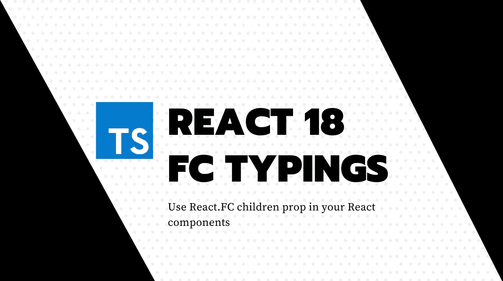

# 如何使用 React？React 18 中的“FC”子道具与 TypeScript

> 原文：<https://javascript.plainenglish.io/how-to-use-react-fc-children-prop-in-react-18-with-typescript-6ab7b2c901ce?source=collection_archive---------2----------------------->

## 打字稿和反应提示

## 如何应对新 React 18 "React？FC”类型和 TypeScript 的“子”属性



🇫🇷这篇文章在 Coding Spark 博客上有法语版本，还有一些很酷的东西！

使用新的 React。FC 组件类型，您可能会以以下错误结束:

```
Property ‘children’ does not exist on type <YourCustomTypeProps>
```

这是因为在 React 的最新版本中**类型签名发生了变化。**

# FC 签名为什么变了？

从`React.FunctionComponent` ( `React.FC`)中移除了`children`属性，因此您必须在组件属性中显式声明它。

TLDR；它可以防止这样的错误:

```
const ComponentWithNoChildren: React.FC = () => <>Hello</>;
...
<ComponentWithNoChildren>
   // passing children is wrong since component does not accept any
   <UnusedChildrenSinceComponentHasNoChildren /> 
</ComponentWithNoChildren>
```

这样，您可以确定您使用的组件正在处理子组件，甚至改进您的代码库和质量。

# 如何玩 React？FC 和 React 18+中的儿童

## 以前

在之前的版本中，`children`道具已经被定义为`React.FC`类型中的可选属性。

```
import * as React from 'react';

type Props = {};
const Component: React.FC<Props> = ({children}) => {...}
```

## 在...之后

在最近的版本中，这一点已被删除。现在，您必须根据您的需要明确地指定它。它可以是可选的，也可以是必需的，这取决于你自己的逻辑。

```
import * as React from 'react';

type Props = {
  children?: React.ReactNode
};
const Component: React.FC<Props> = ({children}) => {...}
```

# 但是如果我想保持以前的反应呢。有儿童行为的 FC？

您可以通过创建自定义类型定义文件来覆盖 react 类型。它可以是您已经存在的全局变量，或者您可以创建一个新的名为 arbitrary `react.d.ts`的变量，该变量在您的 TypeScript 编译器的范围内。

以下定义会将类型恢复为`@types/react v17`:

```
import * as React from '@types/react';

declare module 'react' {
  interface FunctionComponent<P = {}> {
    (props: PropsWithChildren<P>, context?: any): ReactElement<any, any> | null;
  }
}
```

现在让我们享受强类型定义！

*更多内容请看*[***plain English . io***](https://plainenglish.io/)*。报名参加我们的* [***免费周报***](http://newsletter.plainenglish.io/) *。关注我们关于*[***Twitter***](https://twitter.com/inPlainEngHQ)[***LinkedIn***](https://www.linkedin.com/company/inplainenglish/)*，以及* [***不和***](https://discord.gg/GtDtUAvyhW) *。*