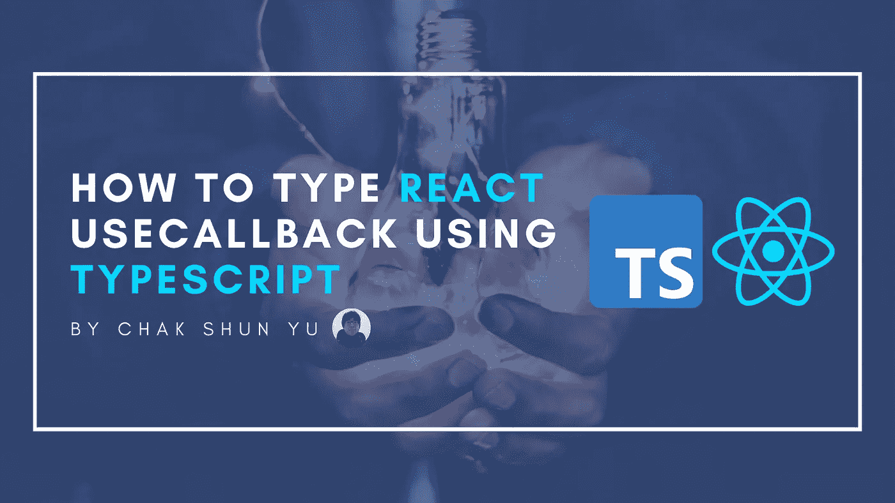

# 如何将 React 的 useCallback 与 TypeScript 一起使用

> 原文：<https://javascript.plainenglish.io/how-to-use-reacts-usecallback-with-typescript-355afc82c77f?source=collection_archive---------9----------------------->



React 开发中最常用的钩子之一是`useCallback`。钩子允许开发人员容易地实现回调的记忆化，这可以用于各种性能优化的原因。它最突出的用例是避免组件不必要的重新渲染。

由于 TypeScript 的广泛使用和流行，人们将不可避免地遇到使用 TypeScript 键入`useCallback`用法的任务。然而，有各种方法可以做到这一点，每种方法都有自己不同的优点和缺点。本文涵盖了这些不同的方法，以及它们的特点和潜在问题。

在我们深入研究不同的选项之前，让我们看看典型的`useCallback`调用是什么样子的，以及我们希望正确输入它的原因之一。`useCallback`钩子的一个常见用例是创建一个事件处理程序，它在重新渲染时保持稳定，除非它的依赖关系发生变化。

然而，我们还想访问回调中的交互事件。不幸的是，没有正确的类型，TypeScript 不知道回调参数的类型。因此，它将默认为`any`类型。然而，这意味着我们在开发过程中没有关于`event`变量的有用的类型信息。

这是我们希望在`useCallback`调用中正确输入的原因之一。虽然这个原因将是本文中探索不同的类型`useCallback`调用方法的主要驱动力，但是还有其他原因。考虑返回类型或函数类型本身的对齐，这在回调用作属性值时是相关的。

```
import { useCallback } from "react";
import { doSomething } from "./utils";const ComponentA = ({ content, depA, depB }: ComponentProps) => {
  const handleClick = useCallback(
    (event) => {
      doSomething(depA, depB, event);
    },
    [depA, depB]
  ); return <div onClick={handleClick}>{content}</div>;
};
```

# 键入回调参数

获取回调参数类型的最直接的方法是将类型直接放在回调参数上。这可以通过直接告诉 TypeScript 参数的类型来实现，在本例中是`MouseEvent<HTMLElement>`。

```
import { MouseEvent, MouseEventHandler, useCallback } from "react";
import { doSomething } from "./utils";const ComponentB = ({ content, depA, depB }: ComponentProps) => {
  const handleClick = useCallback(
    (event: MouseEvent<HTMLElement>) => {
      doSomething(depA, depB, event);
    },
    [depA, depB]
  ); return <div onClick={handleClick}>{content}</div>;
};
```

虽然这是向函数回调参数添加类型的短期解决方案，但它并不是真正可伸缩的解决方案。如果将来添加了任何参数，就需要对所有参数进行额外的输入。最重要的是，这样做并不会将类型引入到整个回调中。因此，TypeScript 无法根据回调所使用的属性类型来正确验证回调的类型。

# 键入返回的回调

我们可以用适当的类型来输入返回的回调，而不是单独输入函数参数。这避免了前一种方法的缺点，因为将类型放在回调中会覆盖函数类型定义中的任何更改，并且有一个类型来验证它所用于的属性的类型。

这个解决方案唯一的缺点是它需要一个变量来存储`useCallback`值。没有它，就没有办法将输入转换成回调。在钩子被内联使用或者作为自定义钩子的返回值的情况下，这可能会有问题。

```
import { MouseEvent, MouseEventHandler, useCallback } from "react";
import { doSomething } from "./utils";const ComponentD = ({ content, depA, depB }: ComponentProps) => {
  const handleClick: MouseEventHandler<HTMLElement> = useCallback(
    (event) => {
      doSomething(depA, depB, event);
    },
    [depA, depB]
  ); return <div onClick={handleClick}>{content}</div>;
};
```

# 键入 useCallback 调用

一个非常相似的结果可以通过一种不同的并且可以说稍微干净一点的方式来实现，那就是键入`useCallback`调用。就类型而言，我还没有发现 TypeScript 处理这种方法与前一种方法有什么不同，在前一种方法中，我们将类型放在返回值上。然而，这种方法确实解决了以前方法的所有不便。

就我个人而言，我发现这种方法更具可读性和结构化，因为`useCallback`调用与其输入捆绑得更紧密。不涉及类型转换，与自然阅读流程顺利集成，具有所有类型的优点，并避免了其他方法的所有不便。

```
import { MouseEvent, MouseEventHandler, useCallback } from "react";
import { doSomething } from "./utils";const ComponentC = ({ content, depA, depB }: ComponentProps) => {
  const handleClick = useCallback<MouseEventHandler<HTMLElement>>(
    (event) => {
      doSomething(depA, depB, event);
    },
    [depA, depB]
  ); return <div onClick={handleClick}>{content}</div>;
};
```

# 最后的想法

每个 React 开发人员都知道`useCallback`钩子，并试图将其与 TypeScript 集成。然而，有各种方法可以做到这一点。本文介绍了三种不同的方法，即只键入回调参数、键入返回值或调用本身。它们中的每一个都建立在前一个的特征、潜在问题和不便之上。

```
**Want to Connect?**If you liked this article, consider checking out the other entries in the [Uncommon React](https://www.getrevue.co/profile/chakshunyu) newsletter and my [Twitter](https://twitter.com/keraito) for future updates.
```

*更多内容请看*[***plain English . io***](https://plainenglish.io/)*。报名参加我们的* [***免费周报***](http://newsletter.plainenglish.io/) *。关注我们关于*[***Twitter***](https://twitter.com/inPlainEngHQ)*和*[***LinkedIn***](https://www.linkedin.com/company/inplainenglish/)*。查看我们的* [***社区不和谐***](https://discord.gg/GtDtUAvyhW) *加入我们的* [***人才集体***](https://inplainenglish.pallet.com/talent/welcome) *。*