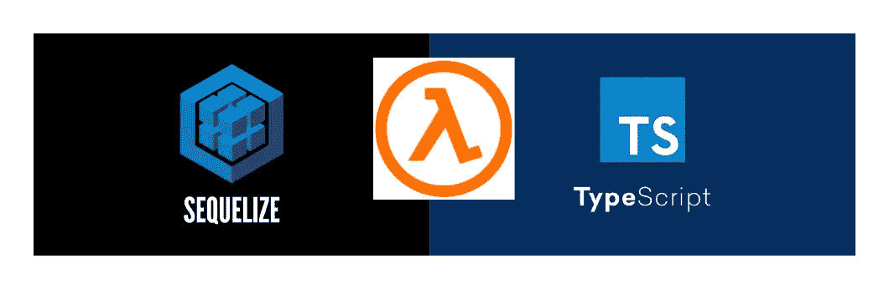
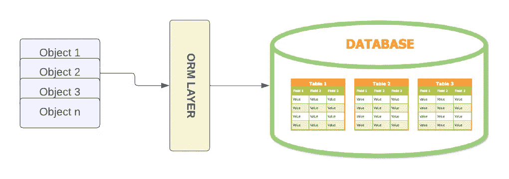
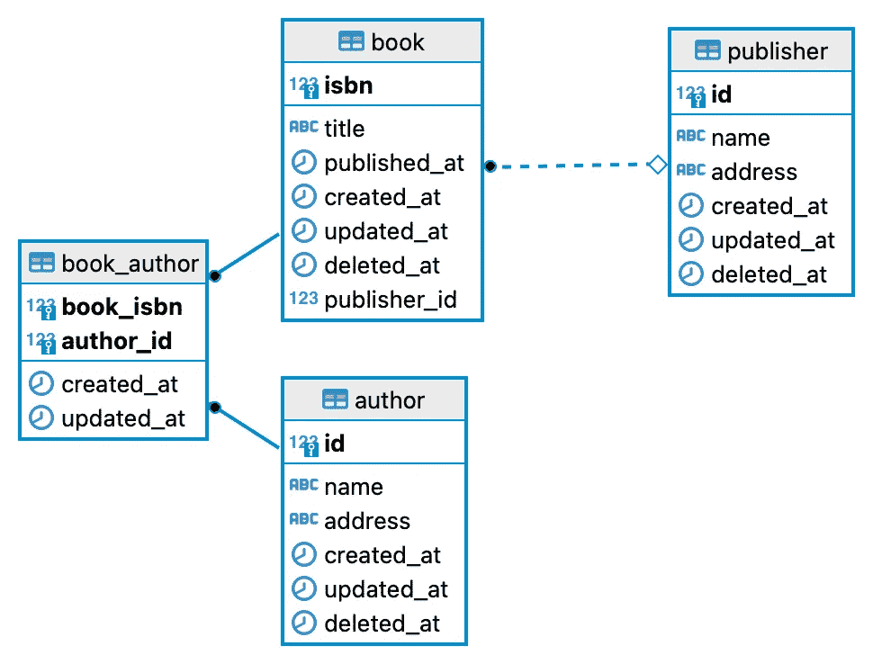
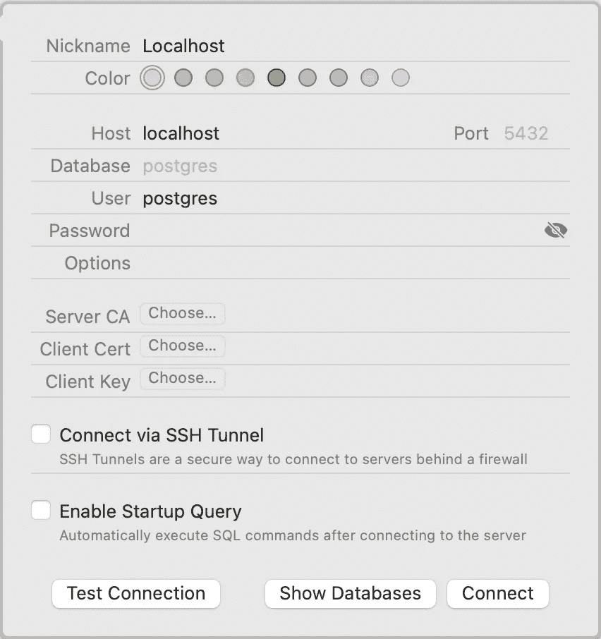
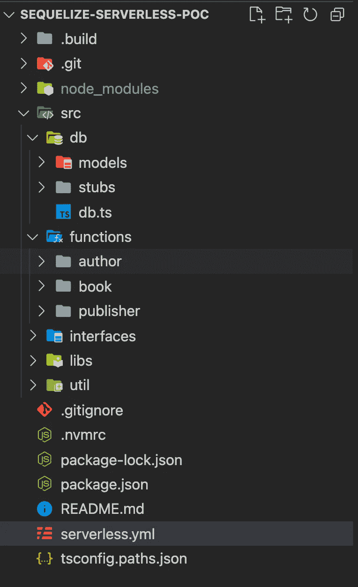
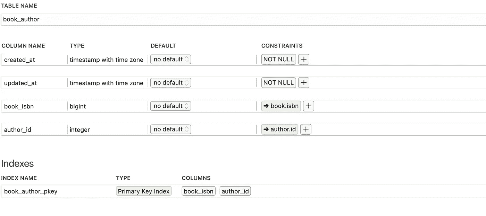
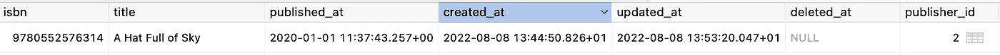

# 如何使用 sequel ize(V6)ORM(Lambda With TypeScript)

> 原文：<https://javascript.plainenglish.io/how-to-use-sequelize-v6-orm-lambda-with-typescript-2dfc56dee6a1?source=collection_archive---------2----------------------->

## 1.建立一个本地数据库。2.设置无服务器框架模板。3.设置序列模型和数据库连接。4.使用无服务器创建端点。



Lambda functions using Sequelize ORM with TypescriptS

# 什么是顺序化？

Sequelize 是一个现代的 TypeScript 和 Node.js ORM，用于 Postgres、MySQL、MariaDB、SQLite、SQL Server 等等。具有可靠的事务支持、关系、急切加载和延迟加载、读取复制等特性。

【https://sequelize.org/】来源:[](https://sequelize.org/)

*Sequelize 是一个用 nodeJS 编写的 ORM，支持 TypeScript。那么接下来的问题就是，ORM 是什么？*

# *什么是 ORM(对象关系映射)？*

****对象-关系映射****(****ORM****，****O/RM****，以及* ***O/R 映射工具*** *)中的* [*计算机科学*](https://en.wikipedia.org/wiki/Computer_science) *是* [这实际上创建了一个“虚拟的](https://en.wikipedia.org/wiki/Computer_programming) [*对象数据库*](https://en.wikipedia.org/wiki/Object_database) *”，可以在编程语言*中使用*

**来源:* [*维基*](https://en.wikipedia.org/wiki/Object%E2%80%93relational_mapping)*

*基本上，这意味着 ORM 将允许您的应用程序以面向对象的方式与数据库交互。您可以使用 OMR 库定义表及其关系，然后与数据库表进行通信。*

*您的应用程序将能够根据对象与数据库进行交互，其中每个表将由一个模型类表示。这些类可以访问 ORM 库中的许多函数，这些函数将执行特定的数据库操作，如创建、读取、更新、删除等。*

*作为一名应用程序开发人员，最好的一点是用自己选择的编程语言来完成所有这些工作(例如:Sequelize 的 Node.js)。*

**

*Object-relational mapping (ORM)*

# *我们要实现什么？*

*现在，让我们定义这篇文章的范围:*

*   *设置本地 Postgres 数据库*
*   *使用无服务器框架的 TypeScript 模板设置一个空项目*
*   *安装 Sequelize 和其他相关的软件包*
*   *使用顺序化 ORM 定义以下模式*

**

*   *公开一些端点来对这 3 个模型/表执行 CRUD 操作*

# *1.建立本地数据库*

*这很简单。你可以根据你的操作系统从这里下载相关的安装程序-[https://www.postgresql.org/download/](https://www.postgresql.org/download/)*

*如果你遇到困难，这段视频可以帮助你:*

*How to install Postgres*

*一旦你在本地安装了 Postgres，它的服务器应该在端口 5432 上运行，你应该能够通过一个像 [DBeaver](https://dbeaver.io/) 或 [Postico](https://eggerapps.at/postico/) 这样的客户端连接到它。我在 Mac 上使用 Postico，它的连接管理器看起来像这样(如果你有不同的设置，请更改用户&密码)。*

**

*最后，创建一个新的数据库，并将其命名为 **mytestdb。**您还不需要创建任何表格。我们将使用 Sequelize 来为我们构建它。*

# *2.设置无服务器框架模板*

*我们将使用[无服务器框架](https://www.serverless.com/)来编写我们的 lambda 函数。(如果你有兴趣更好地了解这个框架，那么我有另一篇关于如何充分利用它的文章[在这里](https://aws.plainenglish.io/5-tips-to-master-the-serverless-framework-1ecd97fc48d0))。*

*全局安装无服务器:*

```
*npm install -g serverless*
```

*然后在您的机器上创建一个新文件夹，并使用终端导航到该文件夹。这里，我们将使用以下命令创建一个带有 TypeScript 的无服务器模板项目:*

```
*sls create --template aws-nodejs-typescript*
```

*您将需要一些其他的包来构建这个 API，所以请继续安装这些节点包:*

*   *[pg](https://www.npmjs.com/package/pg)([https://www.npmjs.com/package/pg](https://www.npmjs.com/package/pg))*
*   *[无服务器离线](https://www.npmjs.com/package/serverless-offline)(让你在本地运行 lambda 函数的插件)*
*   *[无服务器插件类型脚本](https://www.serverless.com/plugins/serverless-plugin-typescript)(支持零配置类型脚本的无服务器插件)*

# *3.设置序列模型和数据库连接*

*在这个阶段，如果您想直接进入代码，看看它看起来像什么，那么您可以从这里得到它:*

 *[## GitHub -元集合 9/sequelize-无服务器-poc

### 这个项目是使用 aws-nodejs-typescript 模板从无服务器框架中生成的。有关详细信息…

github.com](https://github.com/metacollective9/sequelize-serverless-poc)* 

*就文件夹结构而言，它是这样的:*

**

*我所有的数据库模型和连接类都在 **db** 文件夹中，而每个特定模型的所有 API 处理程序都在 **functions** 文件夹中。*

*首先，我们需要配置`serverless.yml`文件，我们将在其中添加本地主机的数据库连接细节，如下所示:*

*现在，让我们按照上面的 ERD 图创建我们的模型。*

*第一个是 Author，看起来像这样:*

*author.ts*

*`Author`类定义了`Sequelize`的模型，而`initAuthor`函数将接收一个`sequelize`对象，然后创建一个定义了数据类型的表。其中大部分是不言自明的，但是请注意像`paranoid`这样的属性被设置为`true`，这将添加 3 个基于时间戳的列`created_at, updated_at, deleted_at`，并且这些将基于您通过 Sequelize 执行的活动自动更新。*

*与此类似，我们将添加一个这样的`Publisher`模型:*

*publisher.ts*

*最后是`book`表的模型:*

*book.ts*

*注意在`Book`类中，我们有 2 个引用属性，`publisher_id` & `Authors`。我们将在我们的`db`文件中这样设置这些引用:*

*db.ts*

*`db`类的构造函数用我们在`serverless.yml`文件中设置的 DB 连接细节创建了一个新的`sequelize`对象。*

*`associate`功能将创建模型之间的关联。*

*如果你回头参考《ERD》，我们可以有一本由许多作者写的书(例如-[https://www . Amazon . co . uk/Good-Omens-Neil-Gaiman/DP/0552171891](https://www.amazon.co.uk/Good-Omens-Neil-Gaiman/dp/0552171891))。这将需要一个包含图书作者参考的连接表。我们通过使用`belongsToMany`关联将我们的`book`模型与`author`模型相关联来实现这一点。使用这个关联`Sequelize`将生成如下表格:*

**

*然后我们有一个从`books`表到`publisher`表的`foreign key`关联。这是通过使用`belongsTo`关联实现的。注意,`foreignKey`属性的名称将是数据库表中的列名。像这样:*

**

*类似于`book`表，设置`author`表和发布者表与`book`表的关联。这将允许您使用`sequelize`直接从关联的表中获取数据。*

*最后，我们为每个模型调用`seed`函数。这只会在表为空时将数据填充到表中。*

*注意，`db`对象是如何被传递的，然后使用`sequelize`的`bulkCreate`函数(ORM 的助手函数):*

*Seeding of a table*

# *4.使用无服务器创建端点*

*我们现在已经完成了模型和数据库连接的设置。让我们创建一些端点来访问这些表。*

*在您的`serverless.yml`文件中，您可以像这样声明您的函数:*

*这些端点是我们到目前为止构建的 3 个模型/表的 REST API 端点。*

*在每个端点的`handlers`中，我们将拥有使这些 API 工作的逻辑。*

*我现在不打算逐一介绍它们(您可以在 [GitHub](https://github.com/metacollective9/sequelize-serverless-poc) 上查看完整的实现)，但是这里有一个示例，说明如何使用`sequelize`来获取数据，包括来自相关表的数据:*

*请注意如何使用`DB`对象从`book`表中获取数据，以及如何使用`findAll`函数从该表中获取所有数据，包括来自`publisher` & `author`表的相关数据。*

*当我调用该端点时，得到的响应是 JSON 格式的数据，如下所示:*

*response.json*

*如你所见`sequelize`是一个非常强大的 ORM 库。它有大量的特性和实用方法，可以使使用数据库变得非常容易。我强烈推荐在这里浏览他们的文档:*

 *[## 开始|序列

### 在本教程中，你将学习制作一个简单的序列设置。Sequelize 可通过 npm(或 yarn)获得。你会…

sequelize.org](https://sequelize.org/docs/v6/getting-started/)* 

*从这里查看工作示例:*

 *[## GitHub -元集合 9/sequelize-无服务器-poc

### 这个项目是使用 aws-nodejs-typescript 模板从无服务器框架中生成的。有关详细信息…

github.com](https://github.com/metacollective9/sequelize-serverless-poc)* 

*并运行`npm install && sls offline`在本地运行&测试这些 API。*

*感谢您的阅读，如果您想支持我，请关注我，成为会员，支持我们这个平台上的所有人。*

*[](https://medium.com/@metacollective/membership) [## 通过我的推荐链接加入媒体 Meta Collective

### 作为一个媒体会员，你的会员费的一部分会给你阅读的作家，你可以完全接触到每一个故事…

medium.com](https://medium.com/@metacollective/membership)* 

**更多内容看* [***说白了。报名参加我们的***](https://plainenglish.io/) **[***免费周报***](http://newsletter.plainenglish.io/) *。关注我们关于* [***推特***](https://twitter.com/inPlainEngHQ) ，[***LinkedIn***](https://www.linkedin.com/company/inplainenglish/)*，以及* [***不和***](https://discord.gg/GtDtUAvyhW) *。****