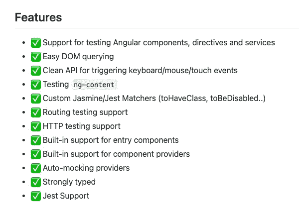
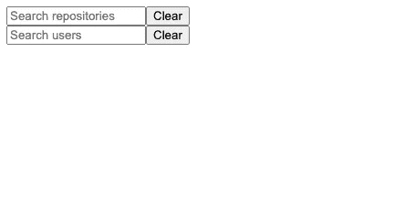
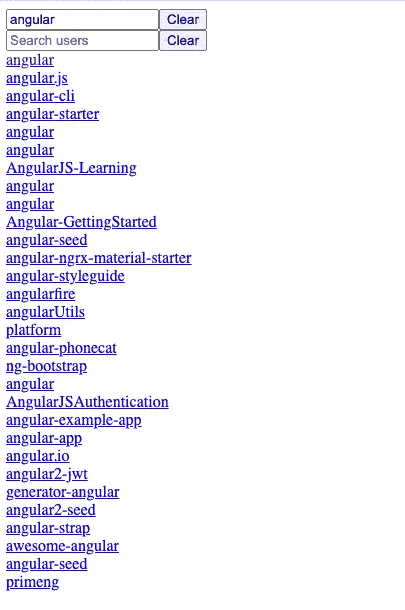
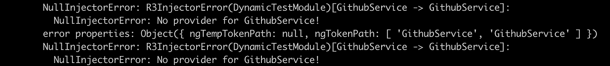
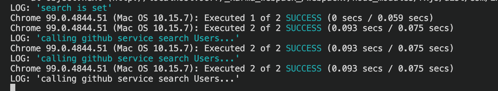

# 如何使用旁观者测试您的角度分量

> 原文：<https://javascript.plainenglish.io/how-to-use-spectator-to-test-your-angular-components-a125c95cf24b?source=collection_archive---------2----------------------->

## 使用示例应用程序的操作指南。


Photo by [Austin Distel](https://unsplash.com/@austindistel?utm_source=unsplash&utm_medium=referral&utm_content=creditCopyText) on [Unsplash](https://unsplash.com/collections/96621150/software-development-and-testing?utm_source=unsplash&utm_medium=referral&utm_content=creditCopyText)

我一直在用[旁观者](https://ngneat.github.io/spectator/)来测试我的 Angular 应用程序。它是我在目前公司和个人项目中的测试工具。它的特点足以解释为什么。



Spectator’s features from github.com/ngneat/spectator.

在这篇文章中，我将带您了解如何使用旁观者来测试一个带有使用服务的组件的角度应用程序。关于如何使用旁观者，有很好的文档。然而，本文将把重点放在如何在一个示例的 Angular 应用程序中使用它。希望这能帮助您在现有应用程序中快速开始使用旁观者测试。我的帖子假设你有一些用 RxJS 构建 Angular 应用程序的经验。

# 示例应用程序

我们将在我之前的一篇博客文章 [*中的示例应用程序的修改版本中添加旁观者测试如何在角度*](https://betterprogramming.pub/unsubscribing-multiple-observables-in-angular-46c9c4833ffc) 中自动取消多个可观察项的订阅。

快速回顾一下。

## 看起来怎么样

> 我们有一个带有两个 GitHub 搜索框的 web 应用程序，一个用于搜索存储库，另一个用于搜索用户。



Screenshot of the sample web app by the author.

> 搜索结果将显示在搜索框下方。



Screenshot of the sample web app by the author.

## 它在引擎盖下是如何工作的

让我们简单回顾一下我们的示例应用程序是如何在幕后工作的。

> 在任何搜索框中输入文本后，我们的 web 应用程序都会调用 GitHub Search API。为了实现这一点，我们需要订阅我们的 formControls valueChanges。


AppComponent and GithubService.

Source code example on GitHub by the author.

> 线路`*this.searchSubject$.next(searchString)*`“发出”调用 GitHub 搜索应用编程接口的信号。

Source code example on GitHub by the author.

> 我们的结果将在我们的模板中呈现。

```
<div *ngFor="let result of results$ | async">
  <div>
    <a [href]="result.html_url" target="_blank">{{
      result.name || result.login
    }}</a>
  </div>
</div>
```

# 安装观众

安装很简单。从他们的医生那里:

> NPM
> 
> `npm install @ngneat/spectator --save-dev`
> 
> 故事
> 
> `yarn add @ngneat/spectator --dev`

# 设置观众

在我们的单元测试文件`[app.component.spec.ts](https://github.com/ardydedase/spectator-sample/blob/main/src/app/app.component.spec.ts)`中，我们将导入我们的组件和旁观者依赖项。

## 设置组件工厂

我们的检测需要《旁观者》包装中的`Spectator`和`createComponentFactory`。

```
import { AppComponent } from './app.component';
import { Spectator, createComponentFactory } from '[@ngneat/spectator](http://twitter.com/ngneat/spectator)';
```

使用`createComponentFactory`初始化我们的组件工厂。

```
let spectator: Spectator<AppComponent>;
const createComponent = createComponentFactory(AppComponent);
```

在每次测试之前创建我们的组件工厂。

```
beforeEach(() => spectator = createComponent());
```

## 导入依赖项

我们的`AppComponent`依赖于`GithubService`来调用 GitHub 的 API。

```
import { GithbService } from './github.service';
```

当我们创建观众组件时，声明`GithubService`为提供者。

```
const createComponent = createComponentFactory({
    component: AppComponent,
    providers: [
      { provide: GithubService, useValue: {} }
    ],
});
```

如果我们不像上面的`GithubService`那样导入组件的依赖项，我们将在下面的截图中得到类似的错误消息。



Error message when there’s a missing dependency in the unit test file.

## 验证它是否工作

我们可以通过添加一个测试来验证我们的基本设置是否正常工作，这个测试将检查我们的组件是否被成功创建。

```
it('should create', () => {
  expect(spectator.component).toBeTruthy();
});
```

我们的基本设置如下所示。我们现在可以运行一个测试来检查是否成功创建了一个观众组件。

Source code example by the author.

# 使用 init 方法进行单元测试

我的示例应用程序初始化了`ngOnInit`中的所有可观察对象。让我们先重写这段代码，让我们的应用程序更容易测试。

Source code example on GitHub by the author.

我们将把我们的`formControl`可观察订阅`searchUsersFormControl`和`searchRepoesFormControl`分别转移到单独的方法`initSearchUsers()`和`initSearchRepos()`中。

下面是为搜索用户，这将是类似的搜索库。

this.initSearchUsers() will be called from ngOnInit().

我们的方法`initSearchUsers()`和`initSearchRepos()`将从`ngOnInit()`调用。

```
ngOnInit(): void {
  //...
  this.initSearchUsers();
  this.initSearchRepos();
}
```

# 向我们的组件添加测试

在我们引入了`initSearchUsers()`和`initSearchRepos()`来分解我们的`ngOnInit`声明之后，我们的组件更容易测试。这两种方法的测试是相似的。我将为`initSearchUsers()`添加测试，这只是一个例子。

## 断言从可观测量发出的值

当测试 observables 时，有时我们需要在调用我们想要测试的方法之前，首先在`subscribe`回调中声明断言。

为了测试`initSearchUsers()`是否正常工作，必须满足两个条件:

1.  作为输入输入到`searchUsersFormControl`的搜索值应该触发`searchSubject$` observable。如果搜索值为空，那么它不应该触发`searchSubject$`可观察值。
2.  搜索结果是从`results$`可观察点发出的。

我们将订阅`searchSubject$`来检查发出的值是否正确。无论输入到`searchUsersFormControl`的搜索值是多少，都应该触发`searchSubject$`观察值:

```
spectator.component.searchSubject$.subscribe(res => {
  expect(res).toBe(searchTerm);
  done();
});
```

我们将对可观测的`results$`做同样的事情。我们的组件将根据搜索类型返回搜索结果:存储库或用户。

例如，如果我们有一个 mock 为用户搜索返回 100 个结果。

```
spectator.component.results$.subscribe(res => {
  expect(res.total_count).toBe(100);
  done();
});
```

那么我们应该期望我们的用户搜索的总结果是 100。

## 嘲笑服务

在我们的断言被设置在我们的 observables 中之后，让我们模拟服务的搜索结果。使用 Spectator 模仿服务很简单。

从注入服务开始。

```
const githubService = spectator.inject(GithubService);
```

然后，分配模拟返回值。

```
githubService.searchUsers.andReturn(of({
  total_count: 100,
}));
```

## 调用方法

有了我们的断言和模拟，我们现在就可以调用我们想要测试的方法了。这就是`initSearchUsers`和`initSearchRepos`派上用场的地方。

初始化我们的`searchUsersFormControl`可观测性。

```
spectator.component.initSearchUsers();
```

最后设置我们的`searchUsersFormControl`的值。就像用户在我们的搜索输入中键入搜索文本一样。

```
spectator.component.searchUsersFormControl.setValue(searchTerm);
```

这是我们完整的测试文件。

# 你自己试试

代码可以在 GitHub 上找到。

[](https://github.com/ardydedase/spectator-sample) [## GitHub-ardydedase/旁观者-示例

### 此项目是使用 Angular CLI 版本 13.2.0 生成的。为开发服务器运行 ng serve。导航到…

github.com](https://github.com/ardydedase/spectator-sample) 

克隆 repo 后，安装软件包。

```
npm install
```

进行测试。

```
ng test
```

您应该会得到下面类似的输出。



如果你喜欢这个故事，你可能也会喜欢我关于 Angular 的其他故事:

[](https://betterprogramming.pub/unsubscribing-multiple-observables-in-angular-46c9c4833ffc) [## 如何在 Angular 中自动退订多个可观测量

### 让我们使用异步管道和 RxJS 操作符的力量

better 编程. pub](https://betterprogramming.pub/unsubscribing-multiple-observables-in-angular-46c9c4833ffc) [](https://betterprogramming.pub/why-i-prefer-to-use-the-parameter-object-pattern-in-angular-pipes-7fd999060cb5) [## 为什么我喜欢在角形管道中使用参数对象模式

### 而不是直接传递参数

better 编程. pub](https://betterprogramming.pub/why-i-prefer-to-use-the-parameter-object-pattern-in-angular-pipes-7fd999060cb5) [](https://blog.ardy.me/membership) [## 通过我的推荐链接加入媒体

### 阅读 Ardy Gallego Dedase(以及媒体上成千上万的其他作家)的每一个故事。您的会员费直接…

blog.ardy.me](https://blog.ardy.me/membership) 

*更多内容看* [***说白了就是***](https://plainenglish.io/) *。报名参加我们的* [***免费周报***](http://newsletter.plainenglish.io/) *。关注我们关于*[***Twitter***](https://twitter.com/inPlainEngHQ)*和*[***LinkedIn***](https://www.linkedin.com/company/inplainenglish/)*。加入我们的* [***社区***](https://discord.gg/GtDtUAvyhW) *。*