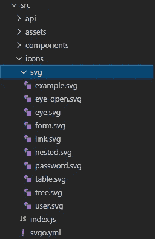

# 如何在 Vue.js 中优雅地使用 SVG

> 原文：<https://javascript.plainenglish.io/how-to-use-svg-elegantly-in-vue-js-b79e43510b35?source=collection_archive---------3----------------------->

## 在 Vue.js 中优雅地使用 SVG


# 1.安装和配置

## 1.1 安装 svg-sprite-loader

```
npm i svg-sprite-loader
```

安装 svg-sprite 加载程序。默认情况下，通过 vue-cli 搭建创建的项目将使用 url-loader 来处理 SVG，因此需要对其进行处理。

## 1.2 在 webpack.base.conf 中配置 svg 依赖项和加载器

用 include，include，img 来区分。然后修改 webpack.base.conf.js 配置，使 svg-sprite-loader 只处理我们指定的 src/icons 下的文件。

```
//vue-cli 2.x
{
   test: /\.svg$/,
   loader: 'svg-sprite-loader',  //Configure the loader to process svg files
   include: [resolve('src/icons')],  //Specify the folder processed by the loader, and later we will put the svg file in the src/icon folder
   options: {
       symbolId: 'icon-[name]' //correspond<use:xlink:href="iconName"/>
   }
},
{
   test: /\.(png|jpe?g|gif|svg)(\?.*)?$/,
   loader: 'url-loader',
   exclude: [resolve('src/icons')],   //url-loader Do not process this folder
   options: {
     limit: 10000,
     name: utils.assetsPath('img/[name].[hash:7].[ext]')
   }
}  
//vue-cli 3.x
//Create a new vue.config.js file in the root directory
const path = require('path');
const { config } = require('process');
function resolve(dir) {
    return path.join(__dirname, dir)
}
module.exports = {
    //base path
    publicPath: './',  //The default '/' is an absolute path, if you are not sure about the root path, change it to a relative path './'
    // output file directory
    outputDir: 'dist',
    assetsDir: 'static',
    chainWebpack: (config) => {
         //Configure aliases
            config.resolve.alias
              .set('@', resolve('src'))
              .set('assets', resolve('src/assets'))
              .set('components', resolve('src/components'))
              .set('utils', resolve('src/utils'));
            config.module  
              .rule('svg')
              .exclude.add(resolve('src/icons'))
              .end();
            config.module
              .rule('icons')   
              .test(/\.svg$/)
              .include.add(resolve('src/icons'))
              .end()
              .use('svg-sprite-loader')
              .loader('svg-sprite-loader')
              .options({
               symbolId: 'icon-[name]'
              })
              .end();
        },
};
```

## 1.3 创建的文件目录(在 src 文件夹下创建一个图标文件夹)



# 2.使用

## **2.1 注册一个感兴趣的组件**

在 components 下创建 SvgIcon 文件夹，并创建 Svg.vue 文件

```
<template>
  <svg :class="svgClass" aria-hidden="true" v-on="$listeners">
    <use :xlink:href="iconName"/>
  </svg>
</template><script>
export default {
  name: 'SvgIcon',
  props: {
    //<svg-icon icon>
    iconClass: {  
      type: String,
      required: true
    },
    className: {
      type: String,
      default: ''
    }
  },
  computed: {
    iconName() {
      return `#icon-${this.iconClass}`   //icon-class='.svg file name' ==> '#icon-.svg file name'
    },
    svgClass() {
      if (this.className) {
        return 'svg-icon ' + this.className  //className for the added style
      } else {
        return 'svg-icon'
      }
    }
  }
}
</script><style scoped>
.svg-icon {
  width: 1em;
  height: 1em;
  vertical-align: -0.15em;
  fill: currentColor;
  overflow: hidden;
}
</style>
```

## 2.2 在图标下写入 index.js

使用 require.context 自动导入文件，而无需逐个导入

```
import Vue from 'vue'
import SvgIcon from '@/components/SvgIcon' // svg component**// register globally**
Vue.component('svg-icon', SvgIcon)const requireAll = requireContext => requireContext.keys().map(requireContext)
const req = require.context('./svg', false, /\.svg$/)
requireAll(req)
```

## 2.3 在 main.js 中引入图标

介绍 main.js 中的 index.js 文件

```
import '@/icons' // icon
```

## 2.4 在页面中使用组件

每次使用图标都很方便，你只需要一行代码就知道了

```
<svg-icon icon-class="user" />
```

就这些，谢谢。

*更多内容看* [***说白了。报名参加我们的***](https://plainenglish.io/) **[***免费周报***](http://newsletter.plainenglish.io/) *。关注我们关于* [***推特***](https://twitter.com/inPlainEngHQ)[***领英***](https://www.linkedin.com/company/inplainenglish/) *和* [***不和***](https://discord.gg/GtDtUAvyhW) ***。*****