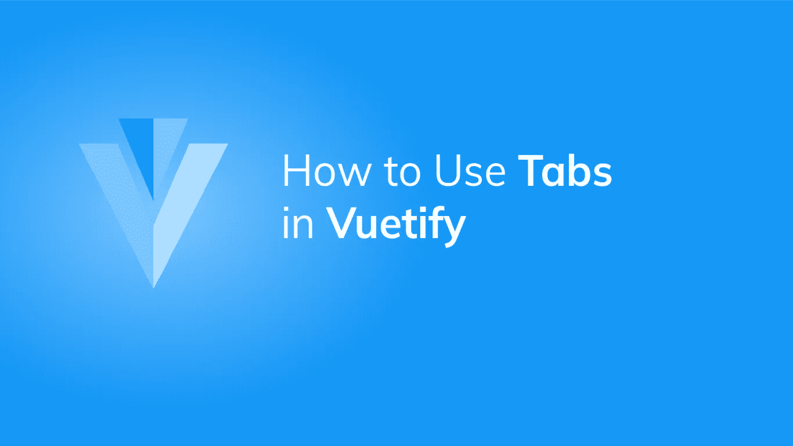
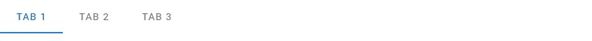
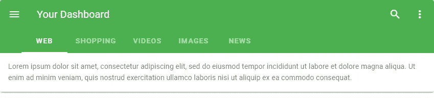
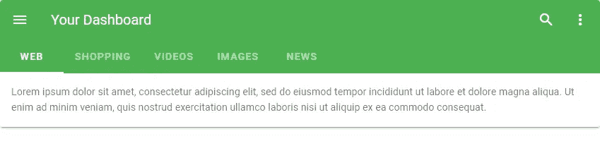
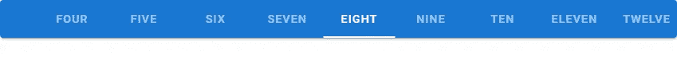
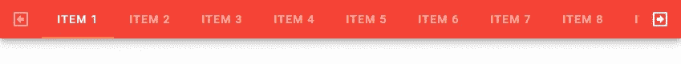
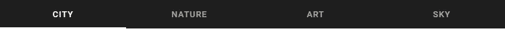
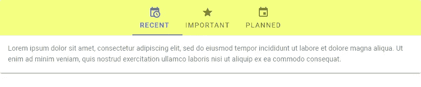

# 如何使用 Vuetify 创建选项卡

> 原文：<https://javascript.plainenglish.io/how-to-use-tabs-in-vuetify-d7b0c78ded0a?source=collection_archive---------10----------------------->



选项卡是组织内容和向应用程序添加额外导航层次的好方法。在本文中，我们将学习如何在 Vuetify 中创建它们。

# 垂直调整片和垂直调整片

Vuetify 选项卡是用`v-tab`组件创建的，包装在`v-tabs`组件中:

```
<template>
  <v-app>
    <v-tabs>
      <v-tab>Tab 1</v-tab>
      <v-tab>Tab 2</v-tab>
      <v-tab>Tab 3</v-tab>
    </v-tabs>
  </v-app>
</template><script>
export default {
  name: 'App',
};
</script>
```



# 将标签与工具栏标题对齐

我们可以使用`align-with-title`道具将`v-tabs`与`v-toolbar-title`组件排成一行:

```
<template>
  <v-app>
    <v-card>
      <v-toolbar color="green" dark flat>
        <v-app-bar-nav-icon></v-app-bar-nav-icon> <v-toolbar-title>Your Dashboard</v-toolbar-title> <v-spacer></v-spacer> <v-btn icon>
          <v-icon>mdi-magnify</v-icon>
        </v-btn> <v-btn icon>
          <v-icon>mdi-dots-vertical</v-icon>
        </v-btn> <template v-slot:extension>
          <v-tabs v-model="tab" align-with-title>
            <v-tabs-slider color="white"></v-tabs-slider> <v-tab v-for="item in items" :key="item">
              {{ item }}
            </v-tab>
          </v-tabs>
        </template>
      </v-toolbar> <v-tabs-items v-model="tab">
        <v-tab-item v-for="item in items" :key="item">
          <v-card flat>
            <v-card-text v-text="text"></v-card-text>
          </v-card>
        </v-tab-item>
      </v-tabs-items>
    </v-card>
  </v-app>
</template><script>
export default {
  name: 'App',
  data() {
    return {
      tab: null,
      items: ['web', 'shopping', 'videos', 'images', 'news'],
      text: 'Lorem ipsum dolor sit amet, consectetur adipiscing elit, sed do eiusmod tempor incididunt ut labore et dolore magna aliqua. Ut enim ad minim veniam, quis nostrud exercitation ullamco laboris nisi ut aliquip ex ea commodo consequat.',
    };
  },
};
</script>
```



如果没有在 v-tabs 组件上设置`align-with-title` prop，它应该是这样的:



# 用美化来美化

使用 Vuetify 材料设计框架创建优雅 web 应用程序的完整指南。


在这里免费下载[](https://mailchi.mp/583226ee0d7b/beautify-with-vuetify)****！****

# **中心活动支柱**

**将`v-tabs`组件上的`center-active`支柱设置为`true`将使活动标签始终居中。例如:**

```
<template>
  <v-app>
    <v-card>
      <v-tabs background-color="primary" center-active dark>
        <v-tab>One</v-tab>
        <v-tab>Two</v-tab>
        <v-tab>Three</v-tab>
        <v-tab>Four</v-tab>
        <v-tab>Five</v-tab>
        <v-tab>Six</v-tab>
        <v-tab>Seven</v-tab>
        <v-tab>Eight</v-tab>
        <v-tab>Nine</v-tab>
        <v-tab>Ten</v-tab>
        <v-tab>Eleven</v-tab>
        <v-tab>Twelve</v-tab>
        <v-tab>Thirteen</v-tab>
        <v-tab>Fourteen</v-tab>
        <v-tab>Fifteen</v-tab>
        <v-tab>Sixteen</v-tab>
        <v-tab>Seventeen</v-tab>
        <v-tab>Eighteen</v-tab>
        <v-tab>Nineteen</v-tab>
        <v-tab>Twenty</v-tab>
      </v-tabs>
    </v-card>
  </v-app>
</template><script>
export default {
  name: 'App',
};
</script>
```

****

**单击另一个选项卡将激活它并使其居中:**

****

# **自定义选项卡图标**

**使用`next-icon`和`prev-icon` 道具，我们可以定制用于导航所有标签标题的图标。**

```
<template>
  <v-app>
    <v-sheet elevation="6">
      <v-tabs
        background-color="red"
        dark
        next-icon="mdi-arrow-right-bold-box-outline"
        prev-icon="mdi-arrow-left-bold-box-outline"
        show-arrows
      >
        <v-tabs-slider color="orange"></v-tabs-slider>
        <v-tab v-for="i in 20" :key="i" :href="'#tab-' + i">
          Item {{ i }}
        </v-tab>
      </v-tabs>
    </v-sheet>
  </v-app>
</template>
...
```

****

# **固定标签**

**使用`fixed-tabs`道具，我们可以让`v-tab`组件填满所有可用空间，直到它们达到最大宽度(300 像素):**

```
<template>
  <v-app> <v-tabs fixed-tabs dark>
      <v-tab> City </v-tab>
      <v-tab> Nature </v-tab>
      <v-tab> Art </v-tab>
      <v-tab> Sky </v-tab>
    </v-tabs> </v-app>
</template>
...
```

****

# **成长道具**

**在`v-tabs`组件上将`grow`属性设置为 true 与设置`fixed-tabs`属性的作用相同。它使选项卡占据所有可用空间，最大宽度可达 300 像素:**

```
<template>
  <v-app>
    <v-tabs grow dark>
      <v-tab> City </v-tab>
      <v-tab> Nature </v-tab>
      <v-tab> Art </v-tab>
      <v-tab> Sky </v-tab>
    </v-tabs>
  </v-app>
</template>
...
```

****

# **在标签标题中使用图标**

**我们可以定制 Vuetify 标签组件，允许图标在标题中使用`icons-with-text`属性。将此属性设置为`true`会将`v-tabs`组件的高度增加到 72px，以允许使用图标和文本。**

****

# **摘要**

**Vuetify 允许我们使用`v-tabs`和`v-tab`组件创建和定制选项卡。我们可以定制这些标签的某些属性，比如它们的颜色和宽度。**

**[*注册*](http://eepurl.com/hRfyJL) *订阅我们的每周时事通讯，了解我们最新的精彩内容！***

***在*[*【codingbeautydev.com】*](https://codingbeautydev.com/blog/vuetify-tabs/)*获取更新文章。***