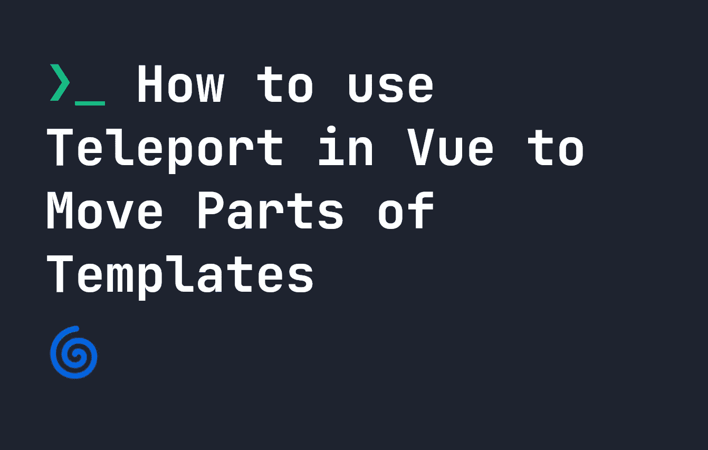
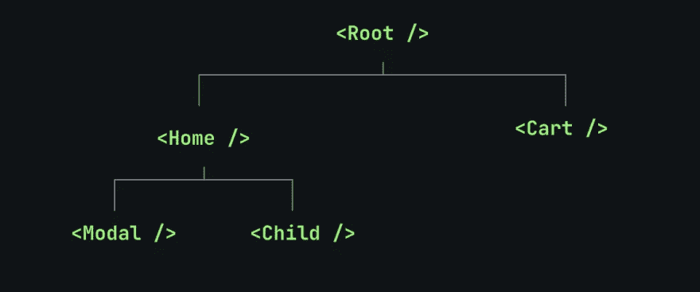

# 如何在 Vue.js 中使用 Teleport 来移动部分模板

> 原文：<https://javascript.plainenglish.io/how-to-use-teleport-in-vue-js-to-move-parts-of-templates-74da53297327?source=collection_archive---------6----------------------->



通常，当我们在 Vue.js 中创建组件时，它们会自然地出现在我们所期望的 DOM 结构中。然而，有时候这并没有意义。一个很好的例子是模态— **通常是**,模态应该出现在页面上所有东西的顶部——所以如果我们在一个逻辑上有意义的组件中创建它，它可能会出现在某些 HTML 元素的后面，或者需要一些奇怪的 CSS 样式才能出现在顶部。

好在 Vue.js 中有一个简单的方法可以解决这个问题，叫做`<Teleport>`。标签让我们在一个组件中定义一些东西，然后**【传送】**它到代码中我们想要的任何地方。让我们看看它是如何工作的。

# 传送在 Vue.js 中如何工作

假设我们在 Vue.js 中有一个名为`Modal.vue`的简单组件，它包含一个模态。它看起来有点像这样:

```
<script>
export default {
    data() {
        return {
            display: false
        }
    }
}
</script>
<template>
    <button id="show-modal" @click="display == true ? display = false : display = true">Show Modal</button>
    <div class="modal" v-if="display">
        My Modal
    </div>
</template>
```

在我们的结构中，这个模型位于应用程序结构的很深处:



由于`Modal.vue`在我们的结构中如此之深，它可能不会像我们希望的那样出现在我们其余内容的顶部。因此，我们希望它是`body`标签的直接子标签。使用`<Teleport>`，我们可以将我们的组件调整为**“传送”**它是`body`标签的直接子标签，如下所示:

```
<script>
export default {
    data() {
        return {
            display: false
        }
    }
}
</script>
<template>
    <button id="show-modal" @click="display == true ? display = false : display = true">Show Modal</button>
    <Teleport to="body">
        <div class="modal" v-if="display">
            My Modal
        </div>
    </Teleport>
</template>
```

`Teleport`的`to`属性应该是有效的 CSS 选择器。现在我们的 div 将被传送到 body 的直接子体，所以它将总是出现在顶部，而不是深深地嵌套在我们的 Vue 结构中。

# 禁用传送标签

我们可以使用`:disabled`属性基于某种逻辑禁用`Teleport`标签。例如，我们可以通过使用以下代码来检查`myToggle`的值是否被设置为 true:

```
<Teleport :disabled="myToggle"></Teleport>
```

如上所述，如果`myToggle`被设置为`true`，那么`Teleport`就不会工作，这意味着我们只能在需要的时候启用它。因此，`Teleport`是 Vue.js 中一个非常有用的标签，用于在看到某些内容时调整**的位置**和**。在同一个 Vue.js 模板中使用多个`Teleport`标签也是可以的。**

*更多内容请看*[***plain English . io***](https://plainenglish.io/)*。报名参加我们的* [***免费周报***](http://newsletter.plainenglish.io/) *。关注我们关于*[***Twitter***](https://twitter.com/inPlainEngHQ)**和*[***LinkedIn***](https://www.linkedin.com/company/inplainenglish/)*。查看我们的* [***社区不和谐***](https://discord.gg/GtDtUAvyhW) *加入我们的* [***人才集体***](https://inplainenglish.pallet.com/talent/welcome) *。**