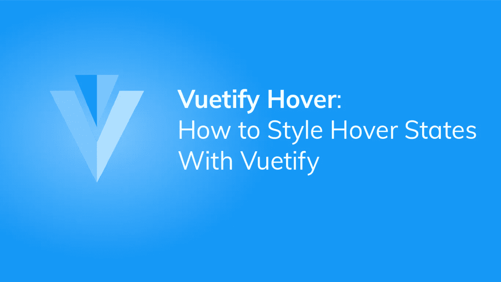
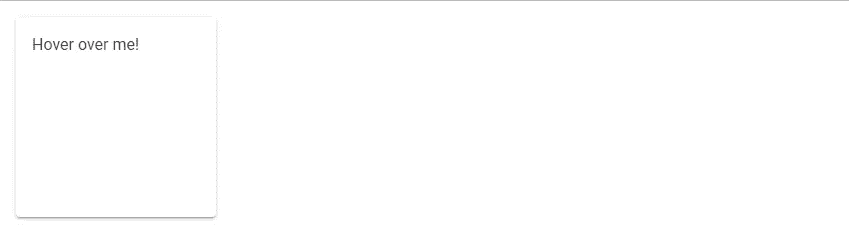
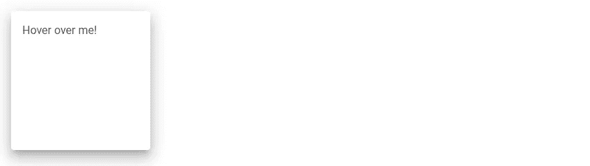
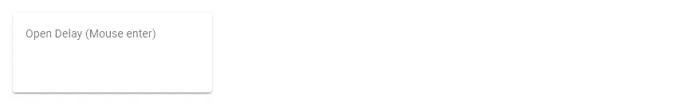
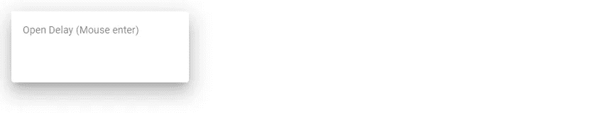
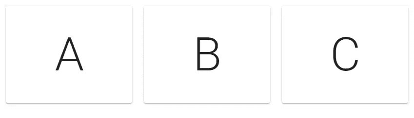
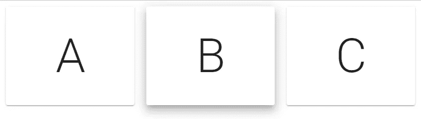

# Vuetify Hover:您需要知道的一切

> 原文：<https://javascript.plainenglish.io/how-to-use-the-hover-component-in-vuetify-7059cf8724d2?source=collection_archive---------10----------------------->



虽然我们可以使用 CSS `:hover`伪类来定制鼠标悬停时的元素样式，但是 Vuetify 提供了一种简洁的方式来完成这项工作，它使用了`v-hover`组件。让我们看看如何在本文中使用它。

# 垂直悬停组件

```
<template>
  <v-app>
    <v-hover v-slot="{ hover }">
      <v-card
        class="ma-4 pa-4"
        width="200"
        height="200"
        :elevation="hover ? 12 : 2"
      >
        Hover over me!
      </v-card>
    </v-hover>
  </v-app>
</template><script>
export default {
  name: 'App',
};
</script>
```

`v-hover`默认槽提供了一个`hover`道具，其值根据悬停组件的子组件的当前悬停状态而变化；当鼠标没有悬停在它上面时，`hover`保持`false`。在我们的例子中，这将把[卡](https://codingbeautydev.com/blog/how-to-use-cards-in-vuetify/)的仰角设置为 2:



当我们悬停在它上面时，悬停变为真，并且[卡](https://codingbeautydev.com/blog/how-to-use-cards-in-vuetify/)仰角变为 12:



# 悬停开放延迟

我们可以用`open-delay`道具延迟`hover`道具从`false`到`true`的变化。在下面的代码中，我们使用`open-delay`为`hover`道具从鼠标悬停变为`true`设置 200 毫秒的延迟:

```
<template>
  <v-app>
    <v-hover v-slot="{ hover }" open-delay="200">
      <v-card
        :elevation="hover ? 16 : 2"
        :class="{ 'on-hover': hover }"
        class="ma-4"
        height="100"
        max-width="250"
      >
        <v-card-text> Open Delay (Mouse enter) </v-card-text>
      </v-card>
    </v-hover>
  </v-app>
</template><script>
export default {
  name: 'App',
};
</script>
```



The [card](https://codingbeautydev.com/blog/how-to-use-cards-in-vuetify/) in its default state.



The [card](https://codingbeautydev.com/blog/how-to-use-cards-in-vuetify/) becomes elevated when you hover over it

# 悬停关闭延迟

同样，我们可以在鼠标离开后，用`close-delay`道具将`hover`道具从`true`延迟到`false`。所以鼠标离开[卡](https://codingbeautydev.com/blog/how-to-use-cards-in-vuetify/)后，需要 200 毫秒的时间来降低高度:

```
<template>
  <v-app>
    <v-hover v-slot="{ hover }" close-delay="200">
      <v-card
        :elevation="hover ? 16 : 2"
        :class="{ 'on-hover': hover }"
        class="ma-4"
        height="100"
        max-width="250"
      >
        <v-card-text> Open Delay (Mouse enter) </v-card-text>
      </v-card>
    </v-hover>
  </v-app>
</template>
...
```

# 用美化来美化

使用 Vuetify 材料设计框架创建优雅 web 应用程序的完整指南。


在这里免费下载[](https://mailchi.mp/583226ee0d7b/beautify-with-vuetify)****！****

# **残疾人道具**

**我们可以用`disabled`道具禁用悬停功能:**

```
<template>
  <v-app>
    <v-hover v-slot="{ hover }" disabled>
      <v-card
        :elevation="hover ? 12 : 2"
        class="mx-auto"
        height="100"
        max-width="250"
      >
        <v-card-text class="my-4 text-center text-h6">
          Hover disabled
        </v-card-text>
      </v-card>
    </v-hover>
  </v-app>
</template>
...
```

**当你悬停在[卡](https://codingbeautydev.com/blog/how-to-use-cards-in-vuetify/)上时，什么也不会发生。**

# **悬停列表**

**我们可以将`v-hover`和`v-for`结合起来，在用户与列表交互时突出显示单个项目:**

```
<template>
  <v-app>
    <v-container>
      <v-row class="fill-height" align="center" justify="center">
        <v-col v-for="(letter, index) in letters" :key="index">
          <v-hover v-slot="{ hover }">
            <v-card
              height="200"
              elevation="hover ? 12 : 2"
              :class="{ 'on-hover': hover }"
            >
              <div
                class="text-h1 d-flex justify-center align-center fill-height"
              >
                {{ letter }}
              </div>
            </v-card>
          </v-hover>
        </v-col>
      </v-row>
    </v-container>
  </v-app>
</template><script>
export default {
  name: 'App',
  data() {
    return {
      letters: ['A', 'B', 'C'],
    };
  },
};
</script>
```

****

**当我们将鼠标悬停在其中一张[卡](https://codingbeautydev.com/blog/how-to-use-cards-in-vuetify/)上时，比如说 B，它会突出显示:**

****

# **悬停转换**

**使用`hover`组件，我们可以创建以高度定制的方式响应用户交互的组件。例如:**

```
<template>
  <v-app>
    <v-hover v-slot="{ hover }">
      <v-card class="ma-4 pa-4" width="300">
        <p class="mb-4">Free music for everyone!</p>
        <v-expand-transition>
          <div v-if="hover"><v-btn color="primary" dark>Sign up</v-btn></div>
        </v-expand-transition>
      </v-card>
    </v-hover>
  </v-app>
</template>
...
```

****

**当您将鼠标悬停在[卡](https://codingbeautydev.com/blog/how-to-use-cards-in-vuetify/)上时，包含“注册”[按钮](https://codingbeautydev.com/blog/how-to-use-buttons-in-vuetify/)的额外部分会滑出(感谢`v-expand-transition`组件):**

****

# **摘要**

**Vuetify 提供了`v-hover`组件，用于根据组件当前的悬停状态处理切换组件样式。它提供了定制选项，例如延迟检测悬停事件所需的时间。**

**[*注册*](http://eepurl.com/hRfyJL) *订阅我们的每周简讯，了解更多精彩内容。***

***在*[*codingbeautydev.com*](https://codingbeautydev.com/blog/vuetify-hover/)*获取更新文章。***