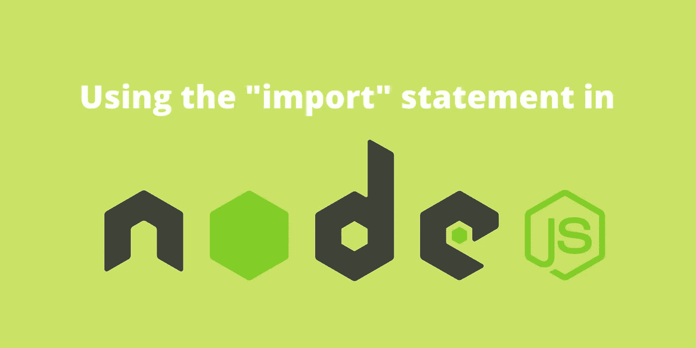
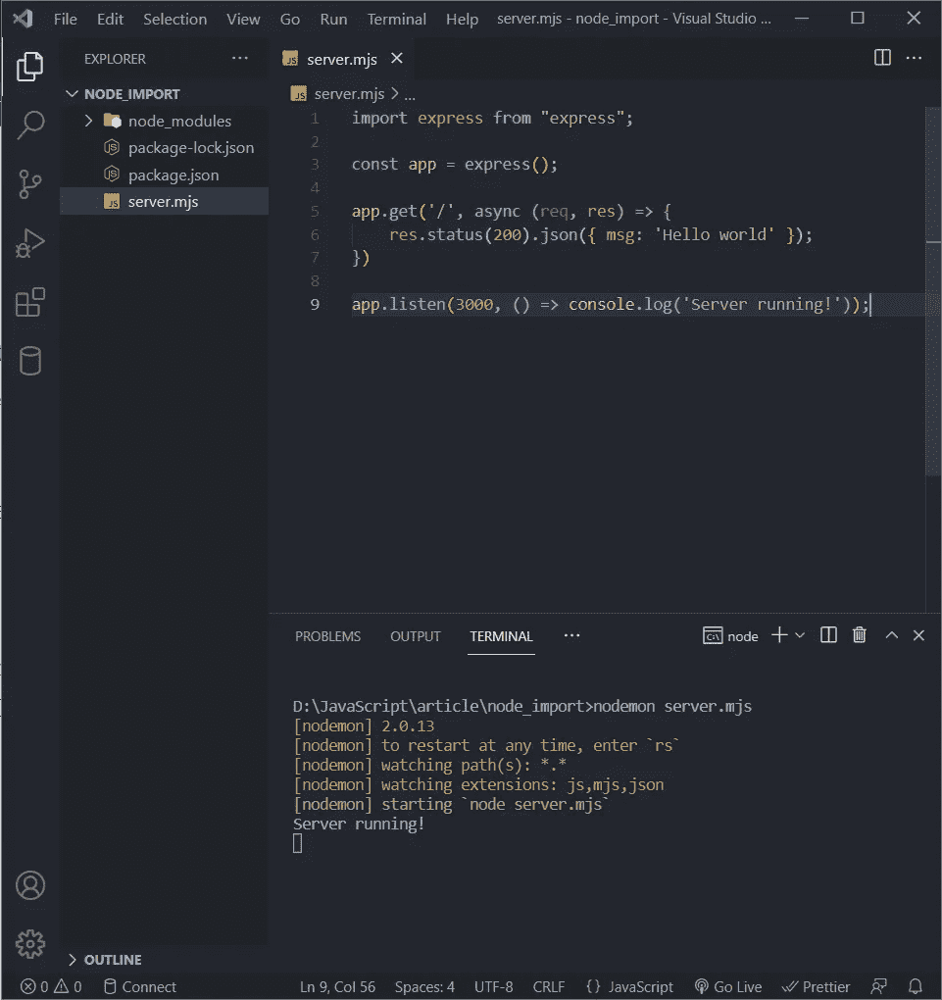
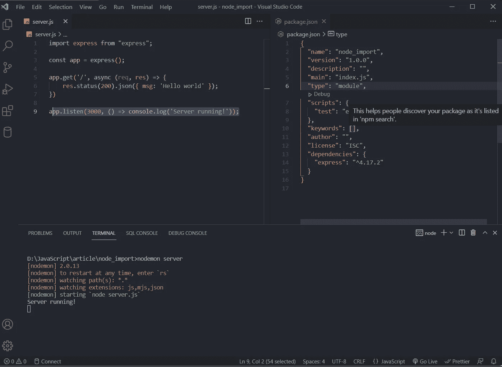

# 如何在 Node.js 中使用“import”语句

> 原文：<https://javascript.plainenglish.io/how-to-use-the-import-statement-in-node-js-d43ce83e5b44?source=collection_archive---------5----------------------->

## 看看 Node.js 中如何用“import”代替“require”。

Image by Author

node . js——一个 JavaScript 运行时环境，它使我们能够在浏览器之外编写 JavaScript，是开发人员编写服务器端代码的首选之一。

Node.js 是编写服务器端代码的一个很好的工具，因为它是 JavaScript，而且 JavaScript 本身是一种初学者友好的语言。就像其他服务器端语言允许我们向项目添加外部依赖一样，Node.js 允许我们通过 NPM 和 YARN 做同样的事情。

如果您使用过 React 或 Vue.js 等其他 JavaScript 框架，那么您会知道这些框架使用“import”关键字来导入文件和模块，而不是 Node.js 使用的“require”关键字。

但是如果您想在 Node.js 代码中使用“import”语句，而不是“require”关键字，那么有一个解决方案。

# →使用”。mjs”扩展

在 JavaScript 中使用“import”语句的第一种方法是用“.”保存 JavaScript 文件。mjs "扩展，而不是使用典型的"。js”扩展名。

Node.js 默认使用名为 [CommonJS](https://medium.com/@cgcrutch18/commonjs-what-why-and-how-64ed9f31aa46) 的模块系统，这就是我们必须使用“require”和“module.exports”来导入和导出模块的原因。

".mjs”使我们能够使用 ECMAScript 模块系统，该系统与 React 使用的系统相同，从而在 Node.js 文件中启用“导入”和“导出，导出默认值”。

看看下面的例子:

Image by Author

上面的代码成功运行，没有在控制台中抛出任何错误。试着改变一下。mjs“简单地扩展到”。并且服务器将崩溃，在控制台中抛出一个错误。

# →编辑“package.json”文件

如果你想用这个”。js "扩展名代替了"。mjs”扩展名，并且仍然希望在文件中使用“import”语句，那么仍然有一个选项可用。

您可以编辑您的“package.json”文件，并添加一个值为“module”的属性“type”。

Image By Author

“类型”属性有助于决定项目应该使用的模块系统。“类型”可以取两者之一:“模块”或“公共”。“module”系统启用 ECMAScript 模块系统，而“commonjs”是 CommonJS 模块系统。

如果省略该属性(这是默认值)，则模块系统被假定为 CommonJS。

# 结论:

您可能希望也可能不希望在 Node.js 项目中使用“import”语句，但是如果您的工作需要您使用“import”而不是“require ”,那么您可以使用上面指定的方法。

在 Node.js 中使用“import”语句而不是“require”语句背后的整个概念是从 CommonJS 模块系统转移到 ECMAScript 模块系统。

*更多内容请看*[***plain English . io***](http://plainenglish.io/)*。报名参加我们的* [***免费周报***](http://newsletter.plainenglish.io/) *。在我们的* [***社区***](https://discord.gg/GtDtUAvyhW) *获得独家获得写作机会和建议。*