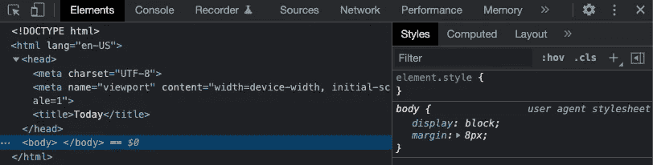
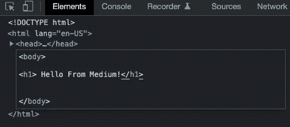
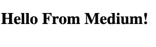

# 编码初学者如何像专业人士一样使用 JavaScript 开发者控制台

> 原文：<https://javascript.plainenglish.io/how-to-use-the-javascript-developer-console-like-a-pro-for-coding-beginners-f64f9ece2c5f?source=collection_archive---------8----------------------->

## 在 Chrome 或 Firefox 中使用它来帮助你成为最好的开发者


How to Use JavaScript Developer Console in Chrome and Firefox Made by Author via Canva

浏览器内置了使用 JavaScript 的开发工具。

这些工具包括一个类似外壳的控制台界面和用于 DOM 检查、调试和网络活动分析的工具。作为 JavaScript 开发过程的一部分，控制台可用于记录信息，并允许您通过在页面上下文中执行 JavaScript 表达式来与网页进行交互。本质上，控制台为您提供了按需编写、管理和监控 JavaScript 的能力。

您将了解如何在浏览器环境中使用 JavaScript 中的 Console，并回顾其他内置的开发工具，这些工具可以作为 web 页面开发过程的一部分。

# 在浏览器中使用控制台

支持 HTML 和 XHTML 标准的 Web 浏览器将允许您访问开发人员控制台，在类似终端包装器的界面中使用 JavaScript。

## 如何在 Firefox 中访问控制台

要在 Firefox 中打开控制台，你可以导航到地址栏旁边右上角的☰菜单。

在那里，单击“更多工具”条目。


将会打开第二个菜单。打开后，点击“Web 开发工具”菜单项。


这样做后，浏览器窗口底部会打开一个托盘:


在 Linux 和 Windows 上也可以通过键盘快捷键`CTRL` + `SHIFT` + `I`进入 Web 控制台，在 macOS 上可以通过键盘快捷键`COMMAND` + `OPTION` + `I`进入 Web 控制台。**一个更“短”的快捷键是 F12 键。**

现在您已经访问了控制台，您可以开始用 JavaScript 在其中工作了。

## 如何在 Chrome 中访问控制台

要在 Chrome 中打开 JavaScript 控制台，您可以导航到浏览器窗口右上角的菜单，该菜单由一行中的三个垂直点表示。从那里，您可以选择更多的工具，然后开发工具。


这将打开一个面板，您可以在其中单击顶部菜单栏中的控制台来打开 JavaScript 控制台(如果它尚未突出显示):


还可以在 Linux 和 Windows 上使用键盘快捷键`CTRL` + `SHIFT` + `I`，或者在 macOS 上使用`COMMAND` + `OPTION` + `I`来访问 JavaScript 控制台。**更“短”的快捷键:F12 键。**

一旦您可以访问控制台，您就可以开始使用 JavaScript 了。

# 在控制台中工作

在控制台中，您可以键入 JavaScript 代码。

让我们从一个输出字符串`Hello, Medium!`的警告开始:

```
>> alert("Hello, Medium");
```

在 JavaScript 行后按 ENTER 键后，您的浏览器中应该会出现以下警告窗口:


**注意:**控制台还会打印一个表达式求值的结果，当表达式没有显式返回某个东西时，这个结果会被读取为未定义。


**你可以用 *console.log* 将 JavaScript 写到控制台，而不是弹出警告**让你一直点击。

打印字符串 Hello，Medium！，您可以在控制台中键入以下内容:

```
**>>** console.log("Hello, Medium!");
```

在控制台中，您将收到以下输出:

```
***Output***Hello, Medium!
```

您还可以使用 JavaScript 在控制台中执行数学运算:

```
**>>** console.log(7 * 4);
```

结果再次打印到控制台:

```
***Output***28
```

你也可以尝试一些更复杂的数学:

```
**>>** console.log(99871.1237894675168514324651 * 1337.21535841334);
```

同样，结果如下:

```
***Output***33549200.59327585
```

此外，您可以处理多行代码。甚至整个程序都可以粘贴并输入控制台:

```
let d = new Date();
console.log(d);
```

打印输出:

```
Sun Mar 06 2022 15:01:27 GMT+0100 (Central European Time)
```

**专业提示:**如果您需要更改通过控制台发送的命令，您可以按键盘上的向上箭头键↑返回上一个命令。这将允许您编辑命令并重新发送它。

JavaScript 控制台**为您提供了一个空间来实时试验 JavaScript 代码**，允许您使用一个类似于终端包装器界面的环境。

**注意:**如果你想从 console.log 语句中获得最大收益:[JavaScript 中的 10 个未知控制台命令:3 分钟指南#05](https://medium.com/nerd-for-tech/10-unknown-commands-of-console-log-in-javascript-3-minute-guide-05-2303a7d35ef1) 将遍历你的游戏到光速。

# 使用 HTML 文件

您还可以在控制台中的 HTML 文件或动态呈现的页面的上下文中工作。这允许您在现有的 [HTML](/8-memorable-html-secrets-that-let-you-turn-tables-at-your-job-interview-f405743e2c0e) 、 [CSS](/10-exclusive-css-facts-you-should-know-to-confidently-land-a-junior-developer-job-33581198375b) 和 [JavaScript](/5-hugely-beneficial-javascript-essentials-to-pass-your-interview-655540ffc1d1) 的上下文中试验 JavaScript 代码。

**注意:**使用控制台修改页面后，只要重新加载页面，它就会恢复到文档被修改前的状态，所以一定要保存任何想要保存到其他地方的更改。

让我们从我以前的文章中取出一个空白的 HTML 文档，比如下面的 index.html 文件，看看如何使用控制台来修改它。在您喜欢的文本编辑器中，创建一个 index.html 文件，并添加以下 HTML 行:

如果您保存了上面的 HTML 文件，并将其加载到您选择的浏览器中，您应该会看到一个标题为“今天”的空白页


## 通过控制台添加标题

然后，您可以打开控制台，开始使用 JavaScript 修改页面。您将使用 JavaScript 在 HTML 文件中插入标题。

```
**>>** let d = new Date();
**>>** document.body.innerHTML = "<h1>Today's date is " + d + "</h1>"
```

您将在控制台中获得类似于以下内容的输出:

```
***Output***"<h1>Today's date is Sun Mar 06 2022 15:01:27 GMT+0100 (Central European Time) </h1>"
```

在这一点上，你的页面应该看起来像这样:


## 通过控制台修改页面的样式

您还可以继续修改页面的样式，例如背景颜色:

```
document.body.style.backgroundColor = "lightblue";
```


以及页面上文本的颜色:

```
document.body.style.color = "white";
```


## 修改页面的 [DOM](https://medium.com/front-end-weekly/html-dom-guide-for-everyone-ec07fdca93a1)

从这里，您可以创建一个`<p>`段落元素:

```
let paragraph = document.createElement("P");
```

创建了这个元素后，您可以继续创建一个文本节点，然后可以将它添加到段落中:

```
let text = document.createTextNode("Paragraph text.");
```

您将通过将文本节点追加到变量`parapgraph`来添加它:

```
paragraph.appendChild(text);
```

最后，将`paragraph`及其段落`<p>`元素和追加的文本节点追加到文档中:

```
document.body.appendChild(paragraph);
```

自己去试试，打开控制台，看看你能用这些线做些什么😉

控制台允许你尝试用[修改 HTML 页面](https://medium.com/front-end-weekly/html-dom-guide-for-everyone-ec07fdca93a1)，但是重要的是要记住，当你在控制台中做一些事情的时候，你并没有改变 HTML 文档。一旦重新加载页面，它将恢复到最初加载的文档。

# 了解其他开发工具

根据您使用的浏览器开发工具，您将在 web 开发工作流程中使用其他工具来帮助您。让我们来看看其中的一些工具。

## DOM —文档对象模型

每次加载网页时，浏览器都会创建一个页面的[文档对象模型，或 DOM，](https://medium.com/front-end-weekly/html-dom-guide-for-everyone-ec07fdca93a1)。

DOM 是一个对象树，以层次结构显示 HTML 元素。DOM 树可以在 Firefox 的检查器面板或 Chrome 的元素面板中看到。

这些工具允许您检查和编辑 DOM 元素，还允许您识别与页面的某个方面相关联的 HTML。DOM 可以显示文本片段或图像是否具有 ID 属性，并让您确定该属性的值。

在从上面修改它之前，初始页面将有一个如下所示的 DOM 视图。


此外，您将在侧面板或 DOM 面板下看到 CSS 样式，这允许您查看在 HTML 文档中或通过 CSS 样式表使用了什么样式。

这是 Chrome 检查器中我们上面的样本页面上的风格主体:



要实时编辑 DOM 节点，请双击选定的元素并进行更改。点击上图中标签左侧的三个点，该上下文菜单打开:


点击标记的条目并添加，例如,

# 标签和文本“Hello Medium！”：



The Result after Entering The New Html <h1> Tag.

自己去试试吧，打开控制台，看看你能用这些功能做些什么😉

与控制台一样，如果重新加载页面，您将返回到 HTML 文档的保存状态。

# 网络

浏览器内置开发工具的网络选项卡可以监控和记录网络请求。

此选项卡显示浏览器发出的网络请求，包括何时加载页面、每个请求需要多长时间，并提供每个请求的详细信息。这可以优化页面加载性能并解决请求问题。

您可以将 Web 选项卡与 JavaScript 控制台一起使用。这意味着您可以使用控制台开始调试页面，然后切换到 Network 选项卡来查看网络活动，而无需重新加载页面。

要了解更多关于使用网络标签的信息，你可以阅读关于使用 [FirefoFirefox 的 srk Monitor](https://developer.mozilla.org/en-US/docs/Tools/Network_Monitor) 或者[开始用 ChromeChrome 的 sols](https://developer.chrome.com/docs/devtools/network/) 分析网络性能。

# 响应式设计

当网站具有响应性时，它们被开发为在各种设备上正确地显示和运行。

手机、平板电脑、台式机和笔记本电脑的屏幕尺寸、像素密度和触摸支持各不相同。为不同设备开发时需要考虑的所有因素。作为一名网站开发人员，应该牢记响应式设计原则，这样无论人们使用什么设备，他们都可以完全访问您的网站。

Firefox 和 Chrome 都为你提供了一些模式，确保你在创建和开发网站和网络应用时考虑到响应式设计原则。这些模式将模拟不同的设备，您可以在开发过程中探索和分析这些设备。

阅读更多关于[响应式网页设计](https://levelup.gitconnected.com/responsive-web-design-in-a-nutshell-for-web-developer-beginners-281927de35fc)、 [FirefoFirefox 的 sive 设计模式](https://developer.mozilla.org/en-US/docs/Tools/Responsive_Design_Mode)或 [ChromeChrome 的 se 模式](https://developer.chrome.com/docs/devtools/device-mode/)来学习如何使用这些工具。

# 结论

本教程提供了在现代 web 浏览器中使用 JavaScript 控制台的概述，以及关于您可以在工作流中使用的其他开发工具的一些信息。

获取网站开发者备忘单，只研究你第一份工作真正需要的东西！


[26 Web Dev Cheats Anyone Should Have To Land A Job](https://arnoldcodeacademy.ck.page/26-web-dev-cheat-sheets)

*更多内容看* [***说白了。报名参加我们的***](https://plainenglish.io/)***[***免费周报***](http://newsletter.plainenglish.io/) *。关注我们关于*[***Twitter***](https://twitter.com/inPlainEngHQ)*和**[***LinkedIn***](https://www.linkedin.com/company/inplainenglish/)*。加入我们的* [***社区不和谐***](https://discord.gg/GtDtUAvyhW) *。*****