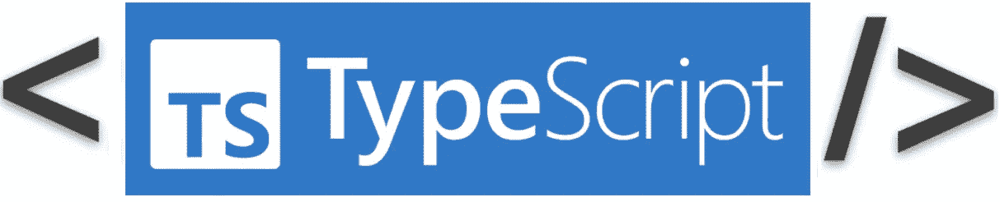
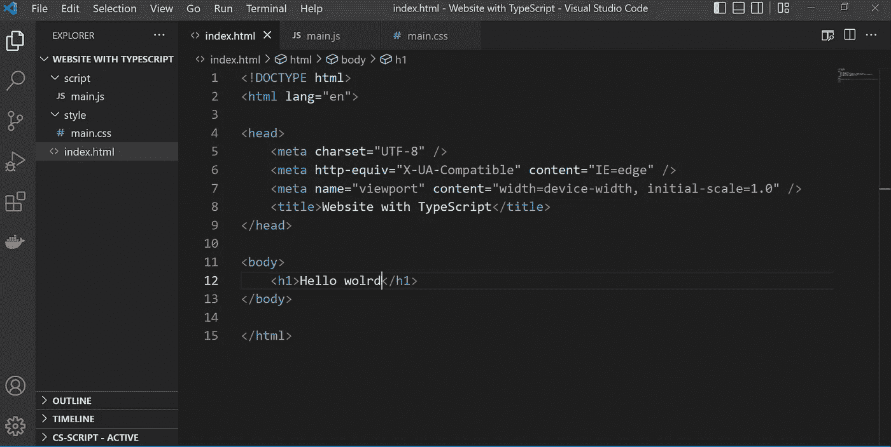
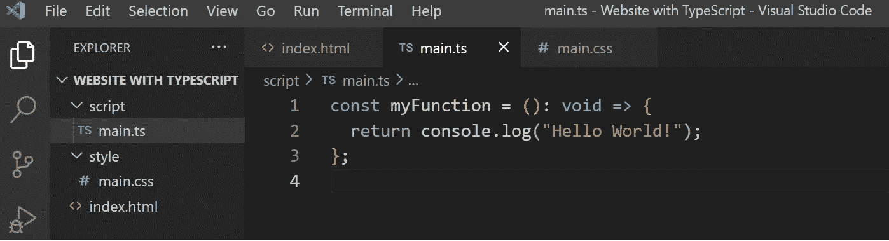
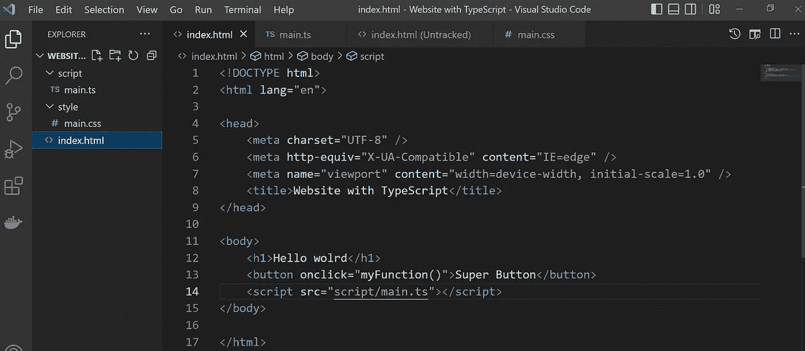
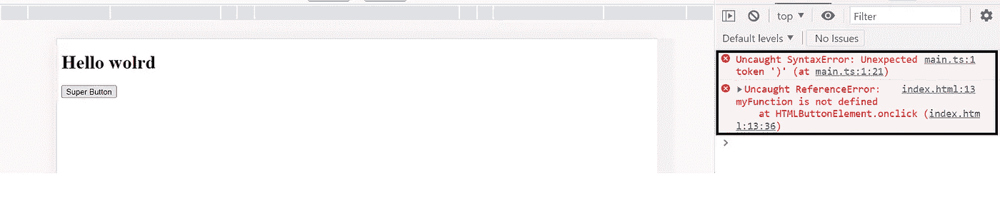
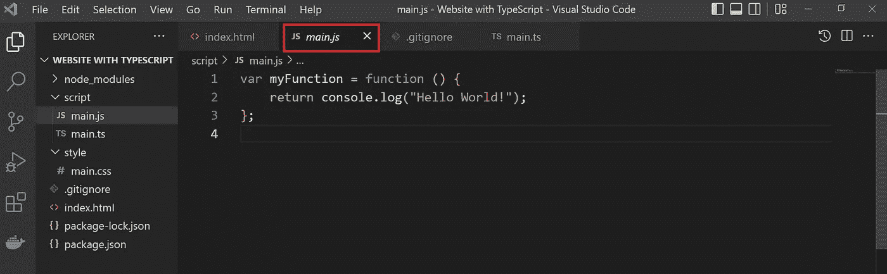
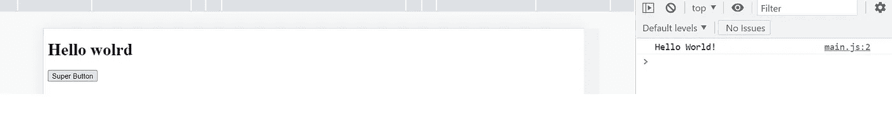

# 如何在 HTML 中使用 TypeScript

> 原文：<https://javascript.plainenglish.io/how-to-use-typescript-in-html-2df0be436d8b?source=collection_archive---------3----------------------->



JavaScript 是程序员在前端和后端最常用的语言。然而，不清楚普通 JavaScript 中的数据是什么类型，因为函数、参数和变量没有类型。这使得阅读和维护项目变得困难。

如果你正在用 **JavaScript** 开发一个项目，并且有这种问题， **TypeScript** 是最适合解决它们的语言。

TypeScript 是 JavaScript 的语法超集，增加了静态类型。这意味着您可以在使用 TypeScript 时向数据添加类型；其实这无非就是用 JavaScript 写代码。

在本文中，我将介绍如何使用 TypeScript 而不是 JavaScript 开发一个简单的网站。

我将使用 VS 代码作为 IDE。

让我们从创建基本文件开始。



如你所知，基本上就是这样一个简单的项目外观。但是我想把文件 *main.js* 换成 *main.ts* ，因为 TypeScript 文件有扩展名“*。ts* ”。我在 *main.ts* 中创建了一个简单的函数。



我将*类型脚本*文件添加到文件*index.html*中，就像一个 *JavaScript* 文件一样。我用文件*index.html*中的按钮调用这个函数。



结果是:



它给出了两个错误。第一个原因是因为函数有类型(这里是 void)。第二个来源于第一个。由于文件 *main.ts* 中的函数有一个类型，它在 HTML 文件中是未知的。

为了解决这个问题，我们必须安装 [**Node.js**](https://nodejs.org/en/) (如果不可用)，然后安装 *typescript* 包。跟随[这个](https://nodejs.org/en/)链接就可以安装 *Node.js* 。您可以通过在终端中键入下面的命令来安装 *typescript* 包。

```
npm install typescript
```

安装完软件包后，我在终端中键入以下命令:

```
tsc script/main.ts
```

通过这个命令，你会在文件夹*脚本*中看到一个新的 **main.js** 文件。**生成的文件是由 *TypeScript* transpiler 生成的等效 *JavaScript* 文件。**



而现在在*index.html*文件中，我调用生成的 ***main.js*** 文件而不是 ***main.ts*** 文件。

```
<script src=”script/main.js”></script>
```

但是在编译之后，你可能会得到这个错误:“*不能重新声明块范围的变量‘my function’。*”

为了解决这个问题，我在 *main.ts* 的最后一行添加了代码“ **export{}** ”。它应该如下所示:

```
const myFunction = (): void => {
return console.log(“Hello World!”);
};export {};
```

结果是:



答对了。

我应该运行下面的代码来转换。ts 文件到。js 文件？

```
tsc script/main.ts
```

不要！有一种方法可以实现自动化:

我创建了 ***tsconfig.json*** 文件，并添加了下面的代码:

```
{
    "compilerOptions": {
        "module": "commonjs",
        "target": "ES5",
        "outDir": "ts-built",
        "rootDir": "script"
    }
  }
```

我在终端中运行下面的命令。

```
tsc -w 
```

该命令侦听项目中的更改。如果向 ***main.ts*** 文件添加一个新代码或者添加一个新的 ***。ts*** 文件添加到项目中，检测并传输变更，并将其添加到***ts-build***文件中。

并且我在 ***package.json 文件*** 中添加了下面的命令:

```
 "scripts": {       
        "start": "live-server"     
    },
```

如果您运行此代码:

```
npm start
```

您在项目中所做的所有更改都会被监听，并且代码会自动编译。

如果你同时运行这两个代码，你的代码会在你写代码的时候自动转换和编译。

好好享受吧！

*更多内容请看*[***plain English . io***](https://plainenglish.io/)*。报名参加我们的* [***免费每周简讯***](http://newsletter.plainenglish.io/) *。关注我们* [***推特***](https://twitter.com/inPlainEngHQ) ，[***LinkedIn***](https://www.linkedin.com/company/inplainenglish/)***，***[***YouTube***](https://www.youtube.com/channel/UCtipWUghju290NWcn8jhyAw)***和****[**对成长黑客感兴趣？检查**](https://discord.gg/GtDtUAvyhW) *[***电路***](https://circuit.ooo/) ***。*****