# 像专家一样使用 TypeScript 模板文本类型

> 原文：<https://javascript.plainenglish.io/how-to-use-typescript-template-literal-types-like-a-pro-2e02a7db0bac?source=collection_archive---------2----------------------->

## 通过学习如何使用模板文本类型来编写更优雅的 TypeScript 代码。用动画解释。

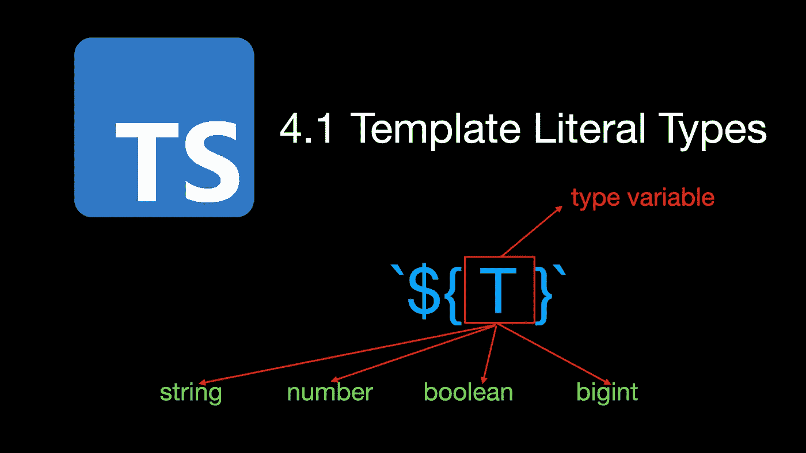

欢迎来到**掌握打字稿**系列。本系列将以动画的形式介绍打字稿**的核心知识和技巧。让我们一起学习吧！以前的文章如下:**

*   [**TypeScript 泛型中的 K，T，V 是什么？**](https://medium.com/frontend-canteen/what-are-k-t-and-v-in-typescript-generics-9fabe1d0f0f3)
*   [**使用 TypeScript 像 Pro 一样映射类型**](/using-typescript-mapped-types-like-a-pro-be10aef5511a)
*   [**使用 TypeScript 条件类型像亲**](/use-typescript-conditional-types-like-a-pro-7baea0ad05c5)
*   [**使用 TypeScript 交集类型像亲**](/using-typescript-intersection-types-like-a-pro-a55da6a6a5f7)
*   [**利用打字稿像专家一样推断**](https://levelup.gitconnected.com/using-typescript-infer-like-a-pro-f30ab8ab41c7)
*   [**使用 TypeScript 模板字面类型像亲**](https://medium.com/javascript-in-plain-english/how-to-use-typescript-template-literal-types-like-a-pro-2e02a7db0bac)
*   [**可视化打字稿:15 种最常用的实用类型**](/15-utility-types-that-every-typescript-developer-should-know-6cf121d4047c)
*   [**关于类型脚本类你需要知道的 10 件事**](https://levelup.gitconnected.com/10-things-you-need-to-know-about-typescript-classes-f58c57869266)
*   [](/purpose-of-declare-keyword-in-typescript-8431d9db2b10)**中‘declare’关键字的用途**

**你听说过 TypeScript 的模板文字类型吗？您想知道如何使用模板文字类型来编写更优雅的 TypeScript 代码吗？如果你愿意，看完这篇文章，也许你会。**

**在开发网页时，我们通常会使用 Tooltip 或 Popover 组件来显示一些提示信息或说明性信息。为了满足不同的使用场景，Tooltip 或 Popover 组件将允许用户设置其放置位置。例如，顶部、底部、左侧、右侧等。**

**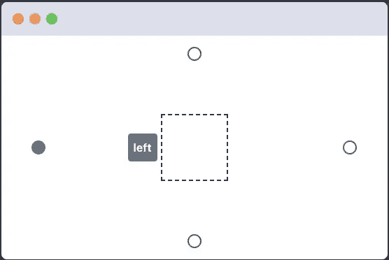**

**因为字符串文字类型基本上可以对我们的字符串值进行拼写检查，所以我们使用 TypeScript 的类型别名定义了一个`Side`类型。**

```
type Side = 'top' | 'right' | 'bottom' | 'left';let side: Side = "rigth"; // Error
// Type '"rigth"' is not assignable to type 'Side'. 
// Did you mean '"right"'?ts(2820)
```

**对于以上 4 个位置，已经可以满足大部分场景。但是如果您想要更精确地设置工具提示的放置位置，例如，让工具提示显示在指定元素的左上角区域:**

**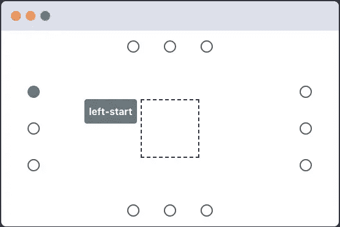**

**那么现有的边类型不能满足要求，那么我们定义一个新的`Placement`类型:**

```
type Placement = Side
  | "left-start" | "left-end" 
  | "right-start" | "right-end" 
  | "top-start" | "top-end" 
  | "bottom-start" | "bottom-end"
```

**在放置类型中，除了原来的 4 个位置，我们增加了“左开始”、“左端”和“右端”等 8 个新位置，分别对应 8 个字符串文字类型。查看这些字符串类型，我们发现一些重复的代码"-start "和"-end "。另外，在定义这些字符串文字类型时，一不小心就可能出现拼写错误。**

**那么如何更好的解决以上问题呢？这就是我们可以使用 TypeScript 4.1 中引入的新模板文字类型的地方，其使用方式如下。**

```
type Alignment = 'start' | 'end';
type Side = 'top' | 'right' | 'bottom' | 'left';type AlignedPlacement = `${Side}-${Alignment}`;
type Placement = Side | AlignedPlacement;
```

**看了上面的代码，是不是觉得简单多了？类似于 JavaScript 中的模板字符串，模板文字类型包含在反斜杠中，可以包含形式为`${T}`的占位符。类型变量 T 的实际类型可以是 **string、number、boolean 或 bigint** 。**

**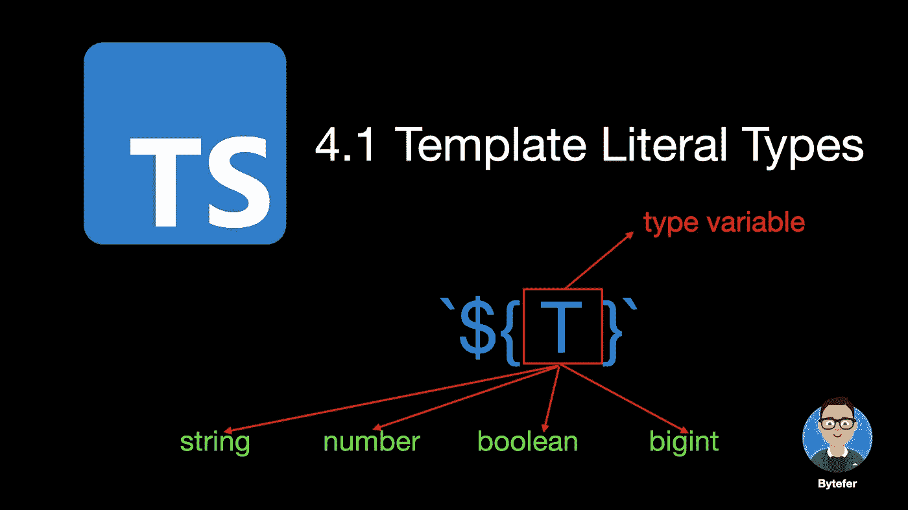**

**模板文字类型为我们提供了连接字符串文字和将非字符串原始类型的文字转换为相应的字符串文字类型的能力。以下是一些例子:**

**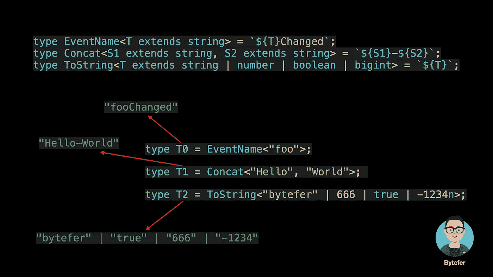**

```
type EventName<T extends string> = `${T}Changed`;
type Concat<S1 extends string, S2 extends string> = `${S1}-${S2}`;
type ToString<T extends string | number | boolean | bigint> = `${T}`;type T0 = EventName<"foo">; // 'fooChanged'
type T1 = Concat<"Hello", "World">; // 'Hello-World'
type T2 = ToString<"bytefer" | 666 | true | -1234n>; 
// "bytefer" | "true" | "666" | "-1234"
```

**对于上面的例子，它并没有那么复杂。但是现在问题来了，如果传入的`EventName`或`Concat`实用程序类型的实际类型是联合类型，会有什么结果呢？接下来，让我们验证一下。**

**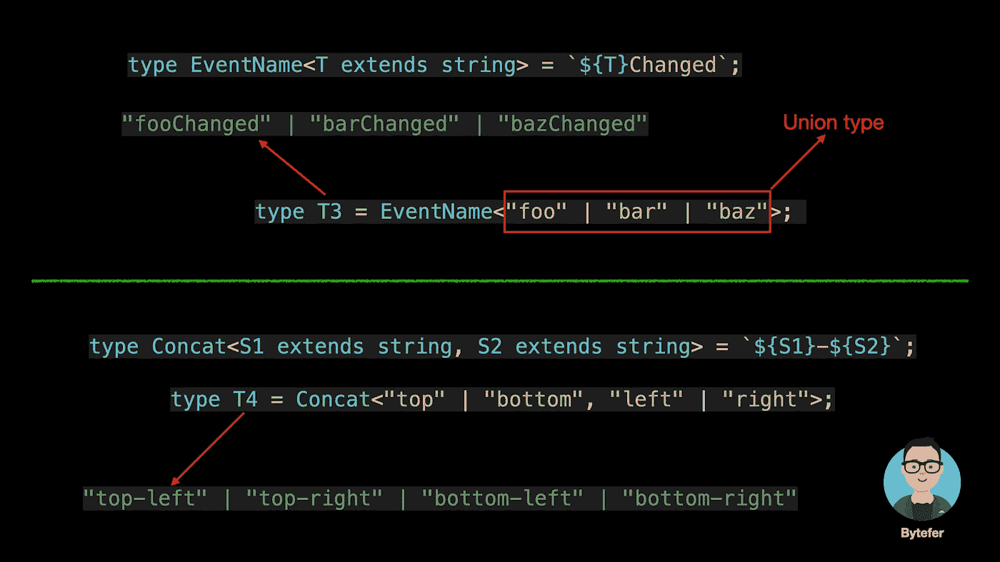**

```
type T3 = EventName<"foo" | "bar" | "baz">; 
// "fooChanged" | "barChanged" | "bazChanged"type T4 = Concat<"top" | "bottom", "left" | "right">;
// "top-left" | "top-right" | "bottom-left" | "bottom-right"
```

**为什么会产生这样的类型？这是因为，对于模板文字类型，占位符中的联合类型分布在整个模板文字类型中。**

```
`[${A|B|C}]` => `[${A}]` | `[${B}]` | `[${C}]`
```

******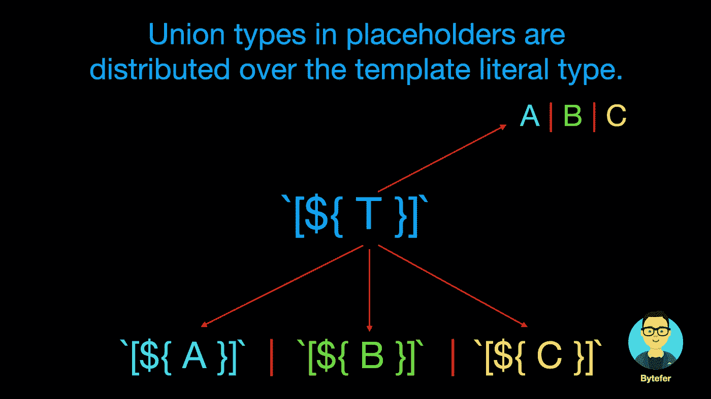**

**对于带有多个类型占位符的情况，如`Concat`实用程序类型。多个占位符中的联合类型解析为叉积。**

```
`${A|B}-${C|D}` => `${A}-${C}` | `${A}-${D}` 
  | `${B}-${C}` | `${B}-${D}`
```

******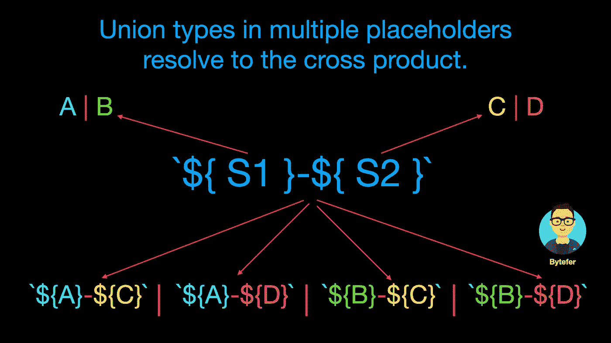**

**理解了上面的操作规则，应该就能理解生成的 T3 和 T4 类型了。**

**在处理模板文字类型时，我们还可以使用 TypeScript 提供的内置实用程序类型来处理字符串类型，如**大写、小写、大写和非大写**，如下所示。**

```
type GetterName<T extends string> = `get${Capitalize<T>}`;
type Cases<T extends string> = `${Uppercase<T>} ${Lowercase<T>} 
  ${Capitalize<T>} ${Uncapitalize<T>}`;type T5 = GetterName<'name'>;  // "getName"
type T6 = Cases<'ts'>;  // "TS ts Ts ts"
```

**事实上，模板文字类型的能力是非常强大的。结合 TypeScript 的条件类型和 infer 关键字，我们还可以实现类型推断。**

```
type InferSide<T> = T extends `${infer R}-${Alignment}` ? R : T;type T7 = InferSide<"left-start">; // "left"
type T8 = InferSide<"right-end">; // "right"
```

**在上面的代码中，`InferSide`实用程序类型除了使用模板文字类型之外，还使用了 TypeScript 条件类型和 infer。如果你不熟悉这个内容，你可以像亲一样使用 TypeScript 条件类型阅读[，像亲](/use-typescript-conditional-types-like-a-pro-7baea0ad05c5)一样使用 TypeScript 推断阅读[。](https://levelup.gitconnected.com/using-typescript-infer-like-a-pro-f30ab8ab41c7)**

****TypeScript 4.1 也允许我们使用 as 子句来重新映射映射类型中的键**。其语法如下:**

**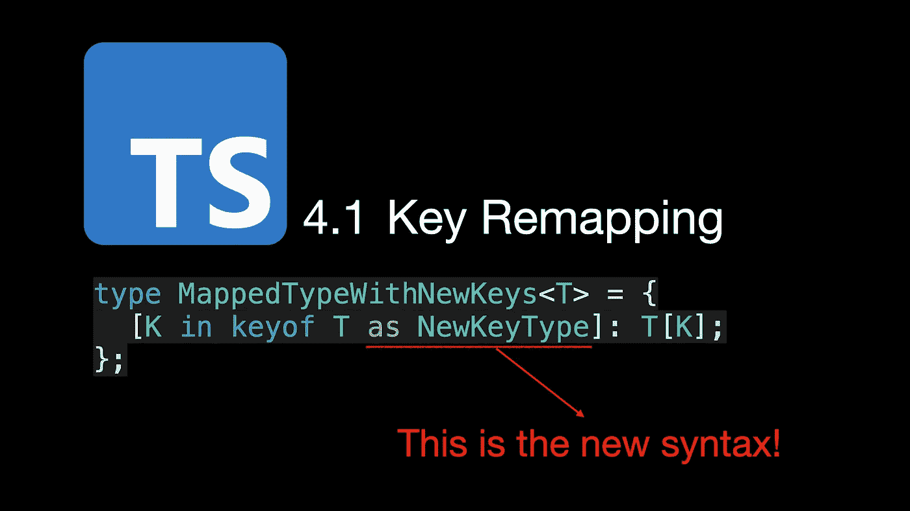**

**其中 NewKeyType 的类型必须是**字符串|数字|符号**联合类型的子类型。在重映射的过程中，结合模板文字类型提供的能力，我们可以实现一些有用的实用工具类型。**

**例如，我们可以定义一个`Getters`实用程序类型来为对象类型生成相应的 Getter 类型:**

******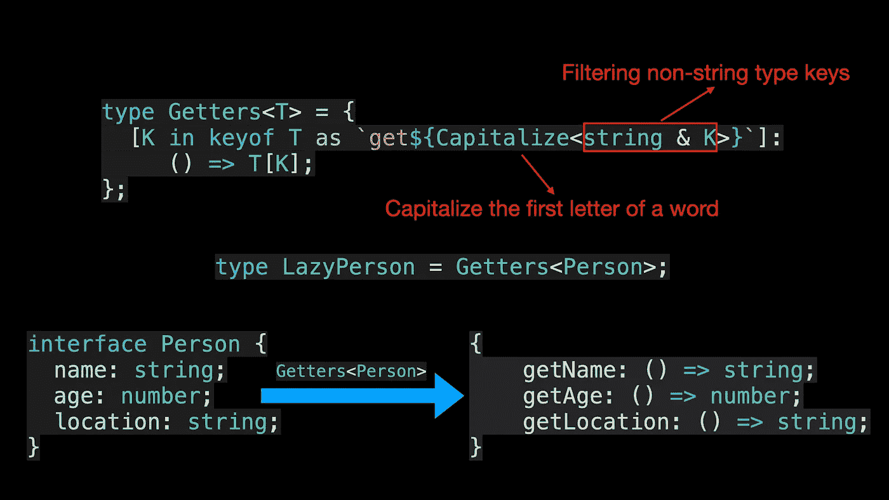**

**在上面的代码中，由于`keyof T`返回的类型可能包含符号类型，而大写实用程序类型要求要处理的类型需要是字符串类型的子类型，所以需要用`&`运算符对其进行类型过滤。**

**除了实现简单的实用程序类型，我们还可以实现更复杂的实用程序类型。例如，获取具有任意层次属性的对象类型。**

**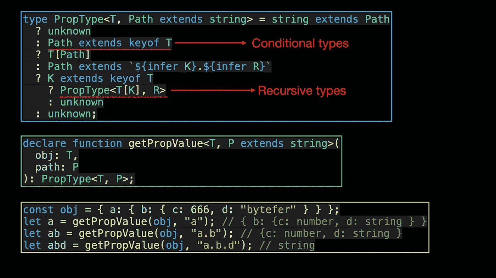**

```
type PropType<T, Path extends string> = string extends Path
  ? unknown
  : Path extends keyof T
  ? T[Path]
  : Path extends `${infer K}.${infer R}`
  ? K extends keyof T
    ? PropType<T[K], R>
    : unknown
  : unknown;declare function getPropValue<T, P extends string>(
  obj: T,
  path: P
): PropType<T, P>;
```

**在上面的代码中，PropType 实用工具类型涉及到 TypeScript 中的几个核心知识。除了递归类型之外，条件类型、条件链和推断类型推断都在我以前的文章中讨论过。**

**我将在以后关于递归类型的文章中介绍它。如果你想学习打字稿，那么就不要错过**掌握打字稿**系列。**

**在 [Medium](https://medium.com/@bytefer) 或 [Twitter](https://twitter.com/Tbytefer) 上关注我，阅读更多关于 TS 和 JS 的内容！**

**

[Bytefer](https://medium.com/@bytefer?source=post_page-----2e02a7db0bac--------------------------------)** 

## **掌握打字稿系列**

**[View list](https://medium.com/@bytefer/list/mastering-typescript-series-688ee7c12807?source=post_page-----2e02a7db0bac--------------------------------)****47 stories**************

# **资源**

**[](https://devblogs.microsoft.com/typescript/announcing-typescript-4-1/) [## 发布 TypeScript 4.1

### 今天，我们自豪地发布了 TypeScript 4.1！如果您不熟悉 TypeScript，这是一种建立在…

devblogs.microsoft.com](https://devblogs.microsoft.com/typescript/announcing-typescript-4-1/)** 

***更多内容请看*[***plain English . io***](https://plainenglish.io/)*。报名参加我们的* [***免费周报***](http://newsletter.plainenglish.io/) *。关注我们关于*[***Twitter***](https://twitter.com/inPlainEngHQ)[***LinkedIn***](https://www.linkedin.com/company/inplainenglish/)*[***YouTube***](https://www.youtube.com/channel/UCtipWUghju290NWcn8jhyAw)*[***不和***](https://discord.gg/GtDtUAvyhW) *。*****