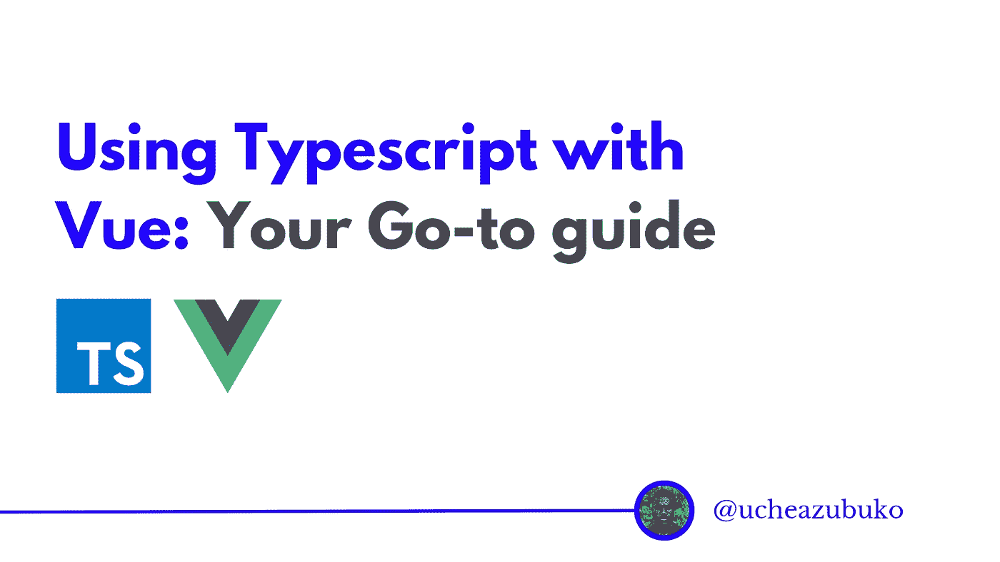
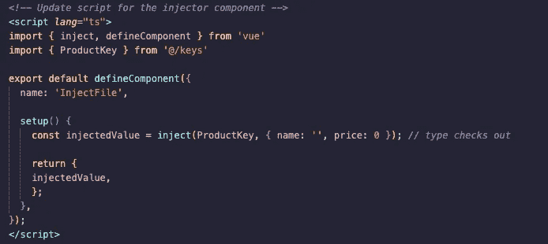

# 如何在 Vue.js 中使用 TypeScript:您的首选指南

> 原文：<https://javascript.plainenglish.io/how-to-use-typescript-with-vue-js-your-go-to-guide-7b40f40cc3c4?source=collection_archive---------1----------------------->

## 关于如何在 Vue.js 应用程序中使用 TypeScript 的教程。

TypeScript 现在已经成为招聘人员、图书馆、维护人员或数字产品的一个重要指标。阅读本文，了解如何在 Vue.js 应用程序中使用 TypeScript。



# 介绍

Vue.js 开发人员通常可以选择使用普通的 ol' JavaScript 或者更严格的类型安全超集 TypeScript 来开发应用程序。然而，Vue 3.0 提供了增强的 TypeScript 支持，提供了更简单、更高效、更健壮的类型推断，使得编写可靠的代码成为可能。

Vue.js 支持的应用程序中的类型检查是本文背后的核心概念。在本教程中，我们将浏览在最常见的用例中使用 TypeScript 和 Vue.js 的初学者指南。让我们开始我们的旅程吧。

# 先决条件

本教程需要的内容:

1.  JavaScript 知识。
2.  节点和 NPM——要开始这个项目，您需要在本地机器上安装 Node v12.22.0 和 NPM。要确认它们已安装，请在您的终端中运行以下命令:

`node -v && npm --v`

Node 包管理器随 Node 一起安装，它允许我们安装各种应用程序依赖项。如果你没有安装它们，你可以按照官方 [Node.js](https://nodejs.org/) 网站上的说明进行操作。

3.[建立 Vue.js 项目](https://cli.vuejs.org/guide/installation.html)的知识。

# 目录

以下是我们今天要讲的内容:

*   什么是打字稿
*   项目设置
*   键入参考
*   分型反应
*   打字道具
*   计算打字
*   打字发出
*   键入模板参考
*   输入提供和注入
*   键入事件
*   结论

# 什么是 TypeScript？

根据微软的说法，TypeScript 是 JavaScript 的超集，它编译以清理 web 浏览器和任何主机都可以理解的 JavaScript 输出。TypeScript 使得严格执行变量类型成为可能，以便在构建大规模 JavaScript 应用程序时干净地编码并使代码库更具可伸缩性。

# 项目设置

Vue.js 提供了一流的 TypeScript 支持，而`**vue-create**`仍然是开始创建一个支持 TypeScript 的 Vue.js 项目的最佳方式。

让我们创建本教程的项目，并将其命名为 **vue-typescript-sandbox** ，使用下面的命令:

`vue create vue-typescript-sandbox`

PS:如果你愿意，你可以给你的项目取一个不同的名字。

创建项目时，您会被问及一系列问题。对于本教程，我们采用以下配置:


此时，我们有了一个由 TypeScript 支持的 Vue.js 项目。


如果您看一下项目中的`**App.vue**`文件或任何其他单个文件组件，您会看到它使用了令人惊奇的`**defineComponent()**`方法，这使得 TypeScript 可以正确地推断组件选项中的类型。

在项目文件夹中，有三个带有**的唯一文件。ts** 扩展:

*   `**main.ts**`文件是普通 JavaScript Vue.js 项目中`**main.js**`文件的类型脚本版本。
*   `**shims-vue.d.ts**`文件告诉 TypeScript 如何理解 Vue.js 单个文件组件。
*   `**tsconfig.json**`文件保存了 TypeScript 编译器的配置选项。

此时，下一件事是在`**App.vue**`中的`**defineComponent()**`方法中返回一个`**setup()**`对象，这样就可以声明反应状态，并在模板上为各种演示访问它们，如下所示:


# 键入参考

要在 Vue.js-TypesScript 项目中指定 ref 值的类型，请在调用`**ref()**`时传递一个泛型参数:


如果 ref 没有初始值，那么泛型类型参数将是包含`**undefined**`的联合类型，如下所示:

```
const age = ref<number | undefined>();
```

如果需要从同一文件中的接口或对象文字类型推断类型，如下所示:


# 分型反应

为`**reactive()**`指定类型的推荐方法是使用接口，如下所示:


# 打字道具

假设我们正在创建一个博客，我们需要将我们在`**App.vue**`中创建的**年龄**和**姓名**数据传递到另一个具有不同布局的 Vue.js 文件中，以表示一篇博客文章。使用道具可以拯救我们。

为了给 Vue.js 项目中的道具赋予类型，我们需要使用 Vue.js 的`**PropType**` generic 对道具的 type 属性进行类型转换，从`**vue**`包中导入:

更新本演示的`**App.vue**`,使其变为:


然后，将以下内容复制/粘贴到在名为`**PropsFile.vue**`的`**components**`文件夹中创建的新文件中，在这里我们传递我们的道具:


但是当处理更复杂的类型时，比如接口，我们在接口中定义我们想要的类型，然后将数据属性转换为接口，并将接口作为 PropType 的泛型类型参数传递。

# 计算打字

对于`**computed()**`，类型是根据 getter 的值推断出来的。

假设，目标是将名和姓组合成全名。在 Vue.js 中，我们可以实现这一点，如下所示:


在上面的演示中，如果我们试图用例如`**number**`类型替换`**string**`，我们将得到一个错误:**没有重载匹配这个调用**，类型“()= > string”的**参数不能赋给类型“ComputedGetter < number >”的参数。**这是因为，如前所述，计算属性的适当类型已经从初始值中推断出来。

在 computed 属性有 setter 的情况下，setter 不需要有返回类型，因为我们设置的值已经有类型了。

# 打字发出

假设在一个给定的项目中，需要从子项目向父项目发出一个`**close()**`函数，`**defineComponent()**`能够推断出在设置上下文中暴露的`**emit**`函数的允许事件:


# 键入模板参考

为了使用组合 API 键入模板引用，我们需要在`**setup()**`中声明一个同名的引用，并确保考虑到引用具有`**null**`值的情况。这是因为在安装组件之前，模板引用具有初始值`**null**`。

如果被引用的元素还没有挂载，我们可以通过将模板 ref 设置为`**null**`来解决这个问题，并在访问模板 ref 的值时使用可选的链接或类型保护。

演示用以下代码显示:


这里，我们可以看到使用了显式泛型类型参数`**HTMLElement**`，它可用于任何模板引用。一旦组件被安装，我们访问按钮的`**click**`事件。在演示中使用了`**verify()**`函数来验证插图是否有效。

# 输入提供和注入

为了在 TypeScript-Vue.js 项目中启用提供/注入值的类型，我们将使用从`**vue**`包中导入的`**InjectionKey**`接口。`**InjectionKey**`接口是一个扩展了`**Symbol**`的通用类型，可以用来在提供者和消费者之间同步注入值的类型。

理想的做法是将符号导出到一个专用文件中，以便它们可以导入到多个组件中，如下所示:

以下是为特定产品键入提供和注入的演示:

在`**src**`文件夹中，创建名为`**keys.ts**`的文件:


接下来，将以下内容复制/粘贴到提供者组件中:


然后，将以下内容复制/粘贴到注射器组件中:


需要注意的一点是，`**inject**`函数总是与`**undefined**`联合产生已解析的类型。发生这种情况是因为存在注射尚未解决的可能性。现在就看你想怎么处理了。

要去掉`**undefined**`，您需要向`**inject**`函数传递一个回退值。令人惊奇的是，回退值也是经过类型检查的:



# 键入事件

在 Vue.js 合成 API 中处理原生 DOM 事件时，我们可以输入传递给事件处理程序的参数，如下所示:


一个`**event**`对象(没有类型注释)隐式具有`**any**`类型。

要事先找出事件的类型，您可以首先使用事件处理程序的按钮来记录`**event**`对象以获取其类型。您将看到该类型是给定事件对象的构造函数:


# 结论

在本教程中，我们学习了如何在 Vue.js 开发人员在开发过程中可能遇到的各种用例中应用 Vue.js 项目中的 TypeScript。

如果你是打字新手，坚持住！(哈哈！这可能相当吓人，对我来说就是如此🙈。)对您来说，刚刚开始的 TypeScript 之旅是值得的，值得付出努力，因为它将打开一个全新的开发体验和好处的世界。

最好的部分是 TypeScript 是一个进步的工具；你可以一步一步来，不知不觉中，它就成了你新的首选语言。

如果您在 Vue.js 项目中使用 TypeScript 时遇到困难，请随时联系 [me](https://github.com/UcheAzubuko) 或在 Github 上上传您的项目以获得其他开发人员的反馈！这是一个非常活跃的大型 Vue.js 社区！

[关注我](https://medium.com/@ucheazubuko)获取更多关于更好的生活和工作方式的帖子。谢谢你。

# 资源

[Vue.js 文档](https://vuejs.org/guide/introduction.html)

[打字稿文档](https://www.typescriptlang.org/)

*更多内容看* [***说白了。报名参加我们的***](https://plainenglish.io/) **[***免费周报***](http://newsletter.plainenglish.io/) *。关注我们关于*[***Twitter***](https://twitter.com/inPlainEngHQ)*和*[***LinkedIn***](https://www.linkedin.com/company/inplainenglish/)*。查看我们的* [***社区不和谐***](https://discord.gg/GtDtUAvyhW) *加入我们的* [***人才集体***](https://inplainenglish.pallet.com/talent/welcome) *。***