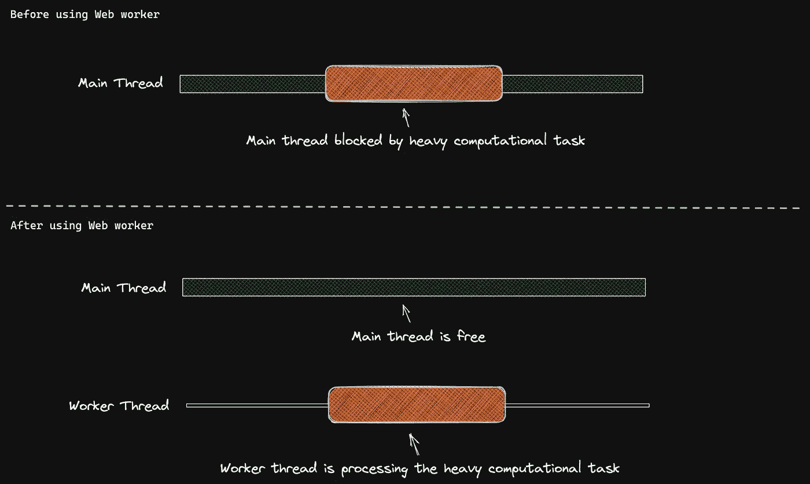
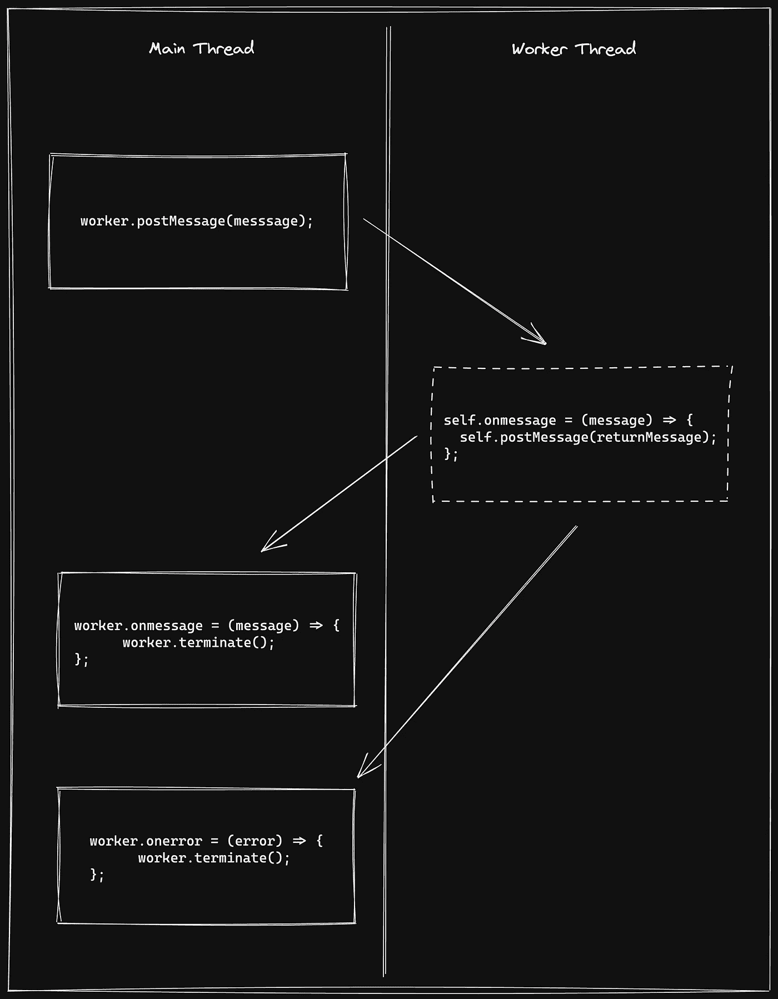
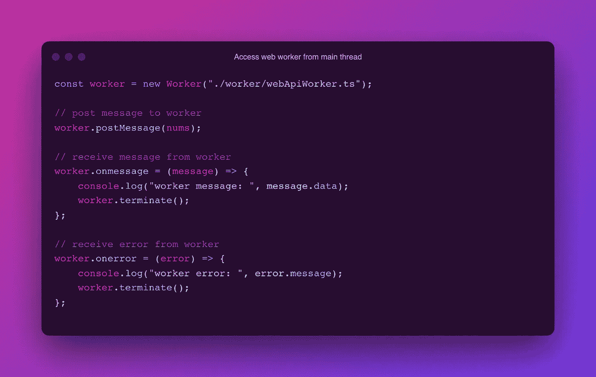
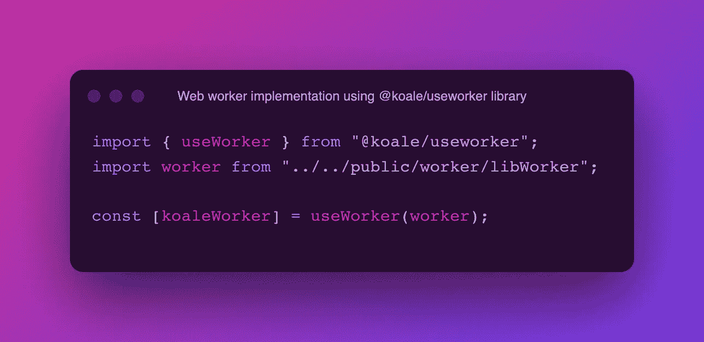
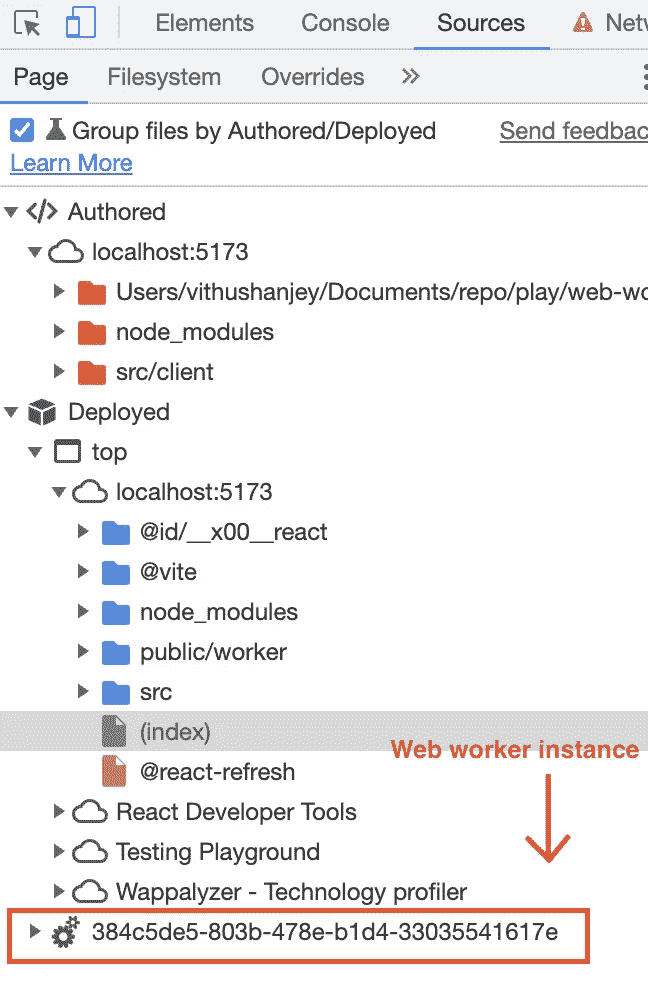

# 如何在 React 中使用 Web Workers

> 原文：<https://javascript.plainenglish.io/how-to-use-web-workers-in-react-9de15a006e89?source=collection_archive---------1----------------------->

## React 生态系统中的 web workers 简介

## **什么是网络工作者？**

web worker 帮助在后台的独立线程中运行脚本，而不会干扰 web 应用程序的主线程。

Web Workers in React

## **React 为什么需要网络工作者？**

JavaScript 是一种单线程语言。这意味着 JavaScript 有一个调用栈来一个接一个地执行任务。每个任务等待它的前一个任务被执行。因此 JavaScript 不能同时执行多个脚本/任务。此外，如果它执行繁重的计算脚本/任务，它将阻塞用户界面和其他功能。

Web workers in React

众所周知，React 是一个 JavaScript 库，它是按照 JavaScript 范式设计的。所以，它跟 JavaScript 的脚步是一样的。因此，我们在 React 中使用 web workers 来执行线程阻塞的繁重计算脚本。它将帮助用户与用户界面进行交互，并在没有任何中断的情况下执行其他功能。

因此，现在 React 可以在主线程中执行一个函数，同时，它可以在 web worker 支持的独立线程中执行一个脚本。因此，像 JavaScript 这样的内部构建为并发执行代码的编程语言现在也可以通过使用 web workers 来并行执行代码。

# 它是如何工作的

要记住的最重要的事情是我们的应用程序和 web worker 是两回事。它们不共享状态库和依赖库。他们只是通过某种方式相互交流。

在 React 应用程序中有许多使用 Web workers 的方法。

## **1。使用 Web Workers API**

我们可以使用 web workers 使用已经可用的`[**Web Workers API**](https://developer.mozilla.org/en-US/docs/Web/API/Web_Workers_API)`，并且可以从我们的 React 应用程序中使用，就像 Fetch API 一样。许多浏览器都支持 Web Workers API，但是请检查`[here](https://caniuse.com/webworkers)`是否适合您的浏览器。

## **Web Workers API 如何在主线程&工作线程**之间通信

在 Web Workers API 中，主线程和工作线程之间的通信使用一种简单的机制。我们需要启动一个工作者实例，并传递工作者脚本的路径。主线程必须通过使用 **postMessage** 方法发送消息来启动连接，工作线程将使用 **onmessage 来监听该消息。**当工作线程使用 **postMessage** 发送消息时，主线程将使用 **onmessage** 接收消息。此外， **onerror** 回调用于捕获来自工作线程的任何错误。

Web worker communication

下面的代码片段显示了使用代码执行上述流程

Access web worker from the main thread

## **2。使用第三方库**

此外，我们可以使用像`[@koale/useworker](https://github.com/alewin/useworker)`这样的第三方库来使用 web workers。该库在其实现下使用了 **Web Workers API** 。他们给了我们一个简单的抽象层来运行一个工作者脚本。所以我们必须传递一个简单的函数，它会在工作线程上运行。

Using @koale/web-worker library

## 如何在浏览器中调试 web worker？

当我们启动一个 web worker 时，会有一个 worker 线程在运行 worker 脚本后被创建和终止。我们可以在浏览器开发者工具下的 **Sources** 标签下见证。

Sources tab under developer tool

# 网络工作者的局限性

Web Workers 令人印象深刻，使用简单，但它有自己的局限性，我们在使用它之前必须知道。Web worker 的实例将被限制在浏览器的单个选项卡中。所以工人拿走了标签的寿命。当我们从一个新的选项卡使用一个工人执行一个脚本时，它将创建一个新的工人。

由于 Web worker 是一个独立的线程，我们无法从 worker 脚本中访问**窗口对象**、**文档对象**、和**父对象**。同样，我们不能通过 **postMessage** 传递函数。

我们只能在 worker 脚本中使用有限数量的函数和类。下面是一些重要和有用的。你可以在这里看到其他人的`[docs](https://developer.mozilla.org/en-US/docs/Web/API/Web_Workers_API/Functions_and_classes_available_to_workers)`。

*   导航对象
*   位置对象
*   取得
*   setTimeout，setInterval，clearTimeout，clearInterval
*   数组、日期、数学和字符串
*   使用**导入脚本**()导入其他脚本

# 结论

Web Workers 通过在后台执行线程阻塞和繁重的计算任务来帮助开发高性能和高效的 React 应用程序。通过并行执行任务和脚本，它使开发人员的生活变得更加轻松。此外，使用 Web Workers 也有缺点，因为它的启动性能成本和每个实例的内存成本都很高。但是考虑到权衡利弊，这是一个方便的解决方案。我肯定会在我未来的项目中使用它。

请随意使用下面我的 Web Workers GitHub repo。该代码是开源的，如果有人有兴趣贡献，请将您的 PRs 发送给我。

**⭐️** 回购如果你觉得有用。

可以联系我@ [www.vithushan.me](https://www.vithushan.me/)

 [## GitHub - VithuJey/web-worker:如何在 React 中使用 web worker？🕸

### 在这个项目中，你会看到以下文件夹和文件:/ ├──公共/ │ └──工人/│└──图书馆工人. ts │ │…

github.com](https://github.com/VithuJey/web-worker/) 

*更多内容看* [***说白了就是***](https://plainenglish.io/) *。报名参加我们的* [***免费周报***](http://newsletter.plainenglish.io/) *。关注我们关于* [***推特***](https://twitter.com/inPlainEngHQ) ， [***领英***](https://www.linkedin.com/company/inplainenglish/) *，*[***YouTube***](https://www.youtube.com/channel/UCtipWUghju290NWcn8jhyAw)*，以及* [***不和***](https://discord.gg/GtDtUAvyhW) *。对增长黑客感兴趣？检查* [***电路***](https://circuit.ooo/) *。*