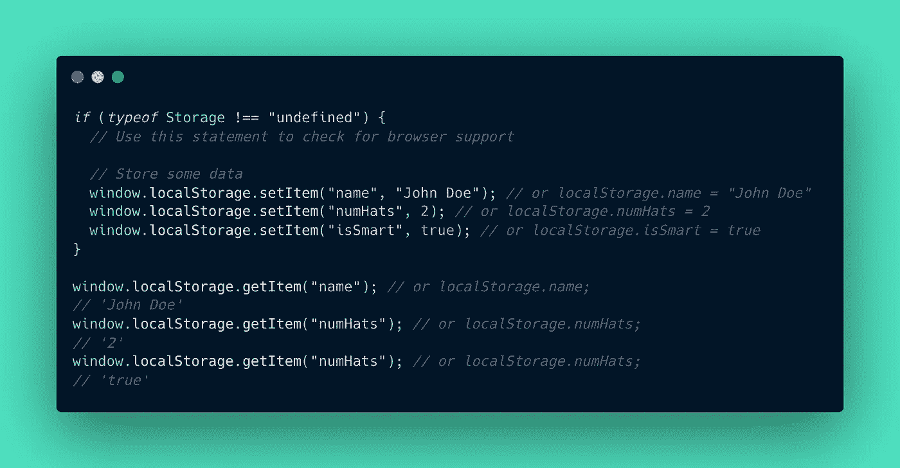
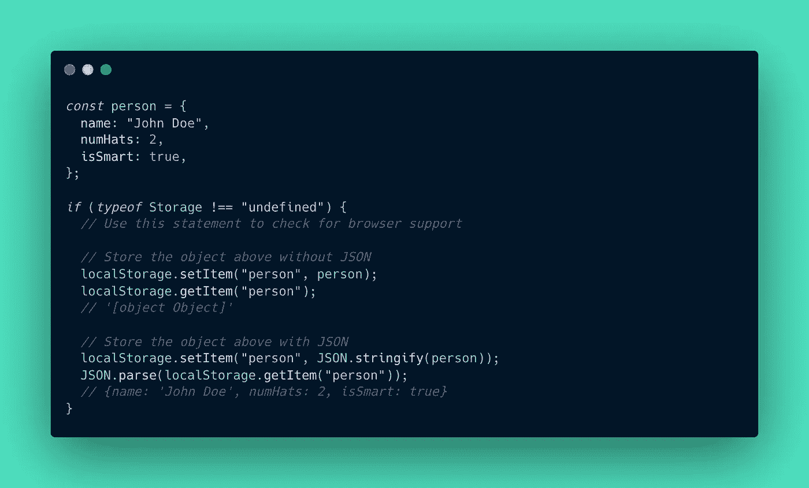
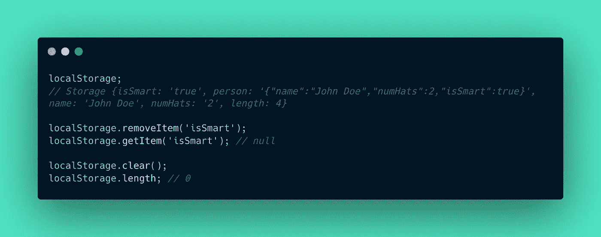

# 如何在 JavaScript 中利用 Web 存储

> 原文：<https://javascript.plainenglish.io/how-to-utilize-web-storage-in-javascript-18e9c4718e75?source=collection_archive---------2----------------------->

Image by [Valdas Miskinis](https://pixabay.com/ko/users/valdasmiskinis-12049839/?utm_source=link-attribution&utm_medium=referral&utm_campaign=image&utm_content=4203677) from [Pixabay](https://pixabay.com/ko//?utm_source=link-attribution&utm_medium=referral&utm_campaign=image&utm_content=4203677)

在 web 开发中，即使是最简单的应用程序也需要在某个地方存储数据。在这种情况下，通常，数据存储在数据库(DB)服务器上，如 *MySQL* 或 *MongoDB* 。但是，如果存储的数据不是非常重要，那么将数据发送到服务器可能会浪费资源。这篇文章将着眼于允许你在客户端或浏览器上存储数据的 JavaScript Web 存储 API。

# 本地存储与会话存储

Web 存储包括两种类型:`localStorage`和`sessionStorage`。这两者的区别在于数据保留和持续的时间。

*   在**会话存储**中，当浏览器或标签关闭时，存储的数据被删除。
*   在**本地存储器**中，数据甚至在会话结束后仍然存在。仅当通过 JavaScript 清除或用户删除浏览器数据或缓存时。

由于基本的 API 语法对于`localStorage`和`sessionStorage`是相同的，我将提供基于`localStorage`的例子。当应用会话存储时，只需用`sessionStorage`替换`localStorage`关键字。

# 存储和检索数据

存储数据的语法是`*window.localStorage.setItem(****<variable>****,* ***<data>****)*`或`window.*localStorage.****<variable>*** *=* ***<data>***`。检索存储数据的语法是`window.localStorage.getItem(**<variable>**)`或`window.localStorage.**<variable>**`。

> *注意* `*window*` *部分可以忽略，就像其他许多窗口功能一样。*

## ❗️Caution: Web 存储将数据存储为字符串类型

注意，`numHats`数字数据和`isSmart`布尔数据被保存为**字符串**。web 存储 API 将所有数据存储为字符串，因此如果您将任何非字符串数据写入本地存储并再次重新读取，您将看到以下字符串形式的输出。

✅ ️To 重用上面的两个变量，我们将需要使用函数来解析它们，比如对整数类型使用`parseInt()`和对布尔类型使用恒等运算符`=== 'true'`。

✅对于数组、对象等特殊的对象类型，数据不会像下面这个例子预期的那样被正确保存，所以我们可以使用 JSON `stringify()`和`parse()`方法来解决这个问题。

# 删除数据

要删除数据项，使用`window.localStorage.removeItem(<variable>)`语法。要删除本地存储器中的所有项目或完全清除存储器，使用`window.localStorage.clear()`。

还可以获取`localStorage.length`来获取`localStorage`中存储的项目数。注意，我用这个来检查`localStorage`是否如预期的那样被完全清除。

# 好了

现在我们有了。我希望您发现这有助于理解 web 存储在 JavaScript 中是如何工作的。这个 API 覆盖了高达 5MB 的存储空间，所以如果你需要客户端存储，它会派上用场。感谢您的阅读！

点击此处了解更多信息:

*   [https://developer . Mozilla . org/en-US/docs/Web/API/Window/local storage](https://developer.mozilla.org/en-US/docs/Web/API/Window/localStorage)
*   [https://developer . Mozilla . org/en-US/docs/Web/API/Window/session storage](https://developer.mozilla.org/en-US/docs/Web/API/Window/sessionStorage)
*   [https://www.youtube.com/watch?v=nmLwQyWzkXU](https://www.youtube.com/watch?v=nmLwQyWzkXU)

*更物在* [***素朴***](https://plainenglish.io/) *。报名参加我们的* [***免费周报***](http://newsletter.plainenglish.io/) *。*[***Twitter***](https://twitter.com/inPlainEngHQ)[***LinkedIn***](https://www.linkedin.com/company/inplainenglish/)*[***YouTube*****和**](https://www.youtube.com/channel/UCtipWUghju290NWcn8jhyAw)*[*不和*](https://discord.gg/GtDtUAvyhW) *对 Growth Hacking 感兴趣吗？查看* [***电路***](https://circuit.ooo/) ***。*****