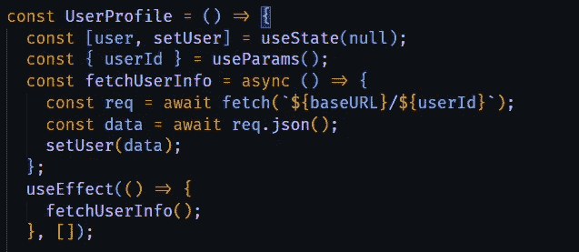
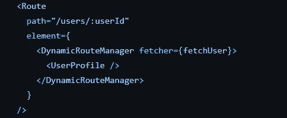
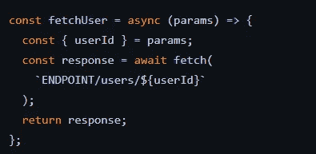
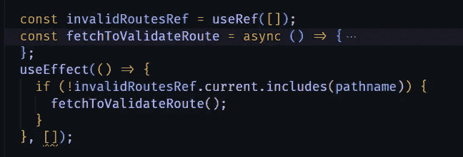
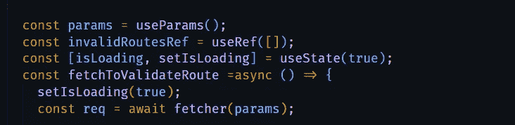
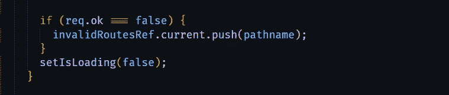
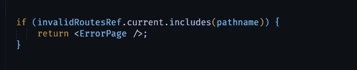

# 如何在 React 路由器中验证动态路由

> 原文：<https://javascript.plainenglish.io/how-to-validate-dynamic-routes-in-react-router-8f399ace1d4e?source=collection_archive---------8----------------------->

## 在呈现组件之前获取并验证数据

Photo by [Ferenc Almasi](https://unsplash.com/@flowforfrank?utm_source=medium&utm_medium=referral) on [Unsplash](https://unsplash.com?utm_source=medium&utm_medium=referral)

源代码:[https://github . com/AbdelrhmanAmin/React-Dynamic-Routes-Manager](https://github.com/AbdelrhmanAmin/React-Dynamic-Routes-Manager)

# 问题是:

为了说明这个问题，让我们以用户档案为例。

我将使用参数`users/:userId`定义动态路线，并呈现配置文件组件，在组件内部，我将从`useParams`获取`userId`，在`useEffect`内部，我将发出获取请求以获取用户信息。

问题是，`userId`真的可以是任何东西。它可能是`12`或`hellomom`…因为 React 在客户端做所有事情，所以即使有人将 URL 更改为无效内容(例如`users/hilol`)或有人试图访问已被删除的用户配置文件的 URL，页面组件也会呈现。

当然，拥有良好的结构很重要，在获取数据时在页面组件中显示加载指示器以及获取失败时的错误消息是至关重要的。但是，如果我们可以在呈现组件之前获取并验证数据，那会怎么样呢？

# 我的解决方案

我构建了一个管理器组件，它负责验证获取响应是否正常，如果是，则呈现页面组件，否则显示 404 页面。

让我带你看一下代码。

首先，我会将页面组件包装在管理器组件中，如下所示:

然后，我将传递给管理器一个名为`fetcher`的属性，它是一个接收路由参数并返回获取请求的函数。

当用户进入页面时，首先会发生的事情是，管理器将执行第一个 useEffect，即进行验证的那个。仅当路径名不在`invalidRoutesRef`内时。

> 注意:这在每次挂载时都是空的，我建议你使用 Redux 或 React context 来存储`invalidRoutes`以避免无效的验证路径。
> 
> 我之所以使用`*invalidRoutesRef*`而不是简单地使用像`*isValid*`这样的标志，是因为我注意到在导航到一个不同的配置文件后,`*isValid*`的值将保持为“false ”,因此即使`*userId*`有效，页面也会显示 404。

该函数首先将`isLoading`设置为 true(提示:默认设置为 true，以便在第一次渲染时显示加载指示器😄)并将路由的`params`传递给`fetcher`函数，并等待直到获取解决。

`isLoading`将在获取数据时显示加载屏幕。

如果请求失败，则按下`pathname`至`invalidRoutesRef`。然后，将`isLoading`设置为假。

最后。

我希望这能使你受益。

*更多内容看* [***说白了。报名参加我们的***](https://plainenglish.io/) **[***免费周报***](http://newsletter.plainenglish.io/) *。关注我们关于* [***推特***](https://twitter.com/inPlainEngHQ) ，[***LinkedIn***](https://www.linkedin.com/company/inplainenglish/)*，*[***YouTube***](https://www.youtube.com/channel/UCtipWUghju290NWcn8jhyAw)*，* [***不和***](https://discord.gg/GtDtUAvyhW) *。***