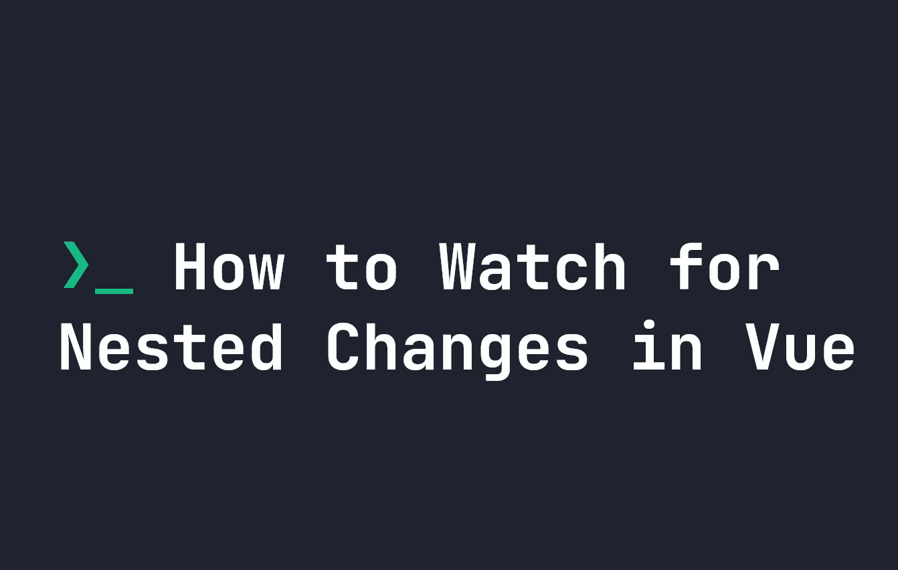

# 如何观察 Vue.js 中的嵌套变化

> 原文：<https://javascript.plainenglish.io/how-to-watch-for-nested-changes-in-vue-js-4a43148206e6?source=collection_archive---------17----------------------->



Vue.js 是一种反应式语言，这意味着当数据发生变化时，我们可以自动在 HTML 中表现出来。为了帮助我们做到这一点，我们可以使用 Vue 中的[观察器来观察数据的变化，然后对 HTML 做一些事情，或者向用户发送一条消息。](https://fjolt.com/article/vue-how-to-watch-for-changes)

这对于简单的数据集来说很好，但是如果我们开始拥有比一个级别更深的数据，就很难正确地观察它的变化。

# 观察 Vue 中嵌套的数据变化

为了理解这个问题，我们需要了解观察器在 Vue 中是如何工作的。Vue 仅观察**较浅的变化**例如，在下面，我们观察`count`的变化，而`console.log`这些变化:

```
<script>
export default {
    data() {
        return {
            count: 1
        }
    },
    watch: {
        count(data) {
            console.log(data);
        }
    }
}
</script><template>
    <h1>{{ count }}</h1>
    <button @click="++this.count">
        Click Me
    </button>
</template>
```

每次用户点击按钮，我们`++this.count`，我们的观察者观察`count`的任何变化。然后`console`记录数据，所以我们可以看到新的计数值。这意味着**任何时候点击按钮，计数的值都会显示在控制台日志**上。

然而，**浅层变化**意味着 Vue 只检查属性值的变化。如果我们的数据深度超过一个级别，Vue 将不会检查更新。例如，更新下面的`count.number`不会触发我们的`count`观察器，因为 Vue 不会检查任何比`count`更深的变化:

```
data() {
    return {
        count: {
            number: 1,
            type: 'number'
        }
    },
    watch: {
        // This doesn't get triggered when count.number!
        count(data) {
            console.log(data);
        }
    }
}
```

相反，我们需要特别提到哪个元素在变化。我们可以通过将我们的观察器改为观察`count.number`来继续观察上面`count.number`中的变化:

```
data() {
    return {
        count: {
            number: 1,
            type: 'number'
        }
    },
    watch: {
        // This gets triggered when count.number changes!
        "count.number" : function(data) {
            console.log(data);
        }
    }
}
```

使用上面的方法，我们可以很容易地检查属性中的属性变化，这样我们就可以触发适当的观察器，但是这可能会很麻烦。如果我们想简单地观察任何`count`变化，我们需要使用**深度**属性。

# 使用深层属性

deep 属性可以添加到任何观察器中，它强制 Vue 观察特定数据属性中的任何变化。这意味着我们必须以稍微不同的方式编写我们的`watcher`:

```
data() {
    return {
        count: {
            number: 1,
            type: 'number'
        }
    },
    watch: {
        count: {
            handler(data) {
                console.log(data);
            },
            deep: true
        }
    }
}
```

现在，每当`count`中的任何属性发生变化，`count`观察器就会触发。当我们这次`console.log(data)`时，整个`count`对象将被控制台记录，即`{ number: 1, type: 'number' }`。

这比针对属性中的特定属性要容易得多，但是代价很高。由于 Vue 每次都必须遍历每个属性，对于非常大的对象，这会导致严重的性能问题。因此，只有当你有一个已知的小物体时才使用这个。对于其他情况，坚持以特定属性为目标，比如`count.number`。

*更多内容尽在* [***说白了. io***](https://plainenglish.io/) *。报名参加我们的* [***免费周报***](http://newsletter.plainenglish.io/) *。关注我们关于* [***推特***](https://twitter.com/inPlainEngHQ) *和*[***LinkedIn***](https://www.linkedin.com/company/inplainenglish/)*。加入我们的* [***社区不和谐***](https://discord.gg/GtDtUAvyhW) *。*