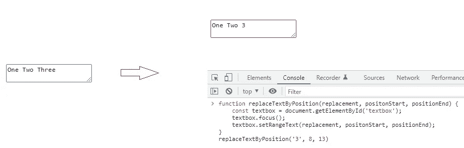

# 如何使用“选择”和“光标”

> 原文：<https://javascript.plainenglish.io/how-to-work-with-selection-cursor-175dfe7d8be6?source=collection_archive---------2----------------------->

关于“选择”和“光标”的教程


Photo by [Patrick Fore](https://unsplash.com/@patrickian4?utm_source=unsplash&utm_medium=referral&utm_content=creditCopyText) on [Unsplash](https://unsplash.com/s/photos/selection?utm_source=unsplash&utm_medium=referral&utm_content=creditCopyText)

在 web 开发中，有时候我们会和“选择”和“光标”打交道。也许是关于突出显示文本，控制光标的位置，或者更高级的东西，如处理编辑器…我已经加入了一个项目，关于一个需要选择的编辑器。我将在本文中讨论它。

# 什么是“选择”和“光标”？

这里是“选择”——选择文本或元素。


Selection

而“光标”是输入区中闪烁的垂直线(或水平线)。


Cursor

但这只是从用户角度的定义，从开发者角度，我们有两个重要的对象不得不提:[选择](https://developer.mozilla.org/en-US/docs/Web/API/Selection)和[范围](https://developer.mozilla.org/en-US/docs/Web/API/Range)。这是两个具有许多属性和方法的对象。要了解更多信息，您可以查看官方文档。在这里，我为他们引用一段简短的介绍:

1.  **"selection"** 对象代表用户选择的文本范围或插入符号的当前位置。它表示页面上的文本选择，可能跨越多个元素。通常由用户在文本上拖动鼠标生成。
2.  **Range** 对象表示包含节点和部分文本节点的文档片段。通过`range`a 对象获得的`selection`对象是我们操作光标的焦点。

要获取对象`selection`，我们可以使用 window 中的方法`getSelection`。这里有一个例子:

```
window.getSelection();
```


Object selection from window

在实际情况中，我并不经常直接与对象`selection`打交道。因为我经常使用用户选择的`range`。为了得到这个`range`,我们只需要调用一个简单的代码:

```
const selection = window.getSelection();
selection.getRangeAt(0);
```


Object from range

在上面的代码中，我们需要带数字的`getRangeAt`,因为在一些浏览器(Firefox)中，用户可以选择多个文本。使用`selection`和`range`，我们将使用两个主要对象:普通输入(input，textarea)和可编辑元素。在下一部分，我会用它们做一些例子。

# 普通输入(输入和文本区域)

在这一部分，我们将通过一些简单的例子来使用输入和文本区域。因为它们几乎是一样的，所以我将用 textarea 做例子。为了开始我们的示例，我们需要创建一个包含 ID 为的 textarea 的简短 HTML。在我的代码中，我将 id 设置为“textbox”。事情就是这么简单:

```
<textarea id="textbox">One Two Three</textarea>
```

在接下来的例子中，我将创建一些函数来运行它。你可以在控制台运行这个功能，或者把它绑定到按钮上……总之你喂得很好。

**选择一个范围**

第一个例子是一个简单的活动，选择一个文本。为了在输入中选择文本，我们有一个来自 HMTLInputElement 的方法`[setSelectionRange](https://developer.mozilla.org/en-US/docs/Web/API/HTMLInputElement/setSelectionRange)`。如果要使用它，只需要用两个参数`positionStart`和`positionEnd`从 HTMLInputElement 调用它。根据输入字符的索引，在你想要选择的区域有起始位置和终止位置。下面是一个示例代码，其 textarea 的 ID 为“textbox”:

```
function selectText() {
  const textbox = document.getElementById('textbox');
  textbox.focus();
  textbox.setSelectionRange(0, 3);
}
```

下面是我用这个函数得到的结果:


您可以看到前三个字符(一个)被选中。如果你想选择所有的文本，你可以像这样调用方法`select``textbox.select()`。如果你只是想把光标放在一个位置，让用 postionStart 调用`setSelectionRange`，positionEnd 是你想放光标的位置。这是我给他们的结果:


Put cursor position


Select all text of input

**获取位置起点和位置终点**

以上是一些修改输入选择的方法。如果你想在某个输入中得到当前位置选择的开始和结束，你可以用属性`selectionStart`和`selectionEnd`试试。它会帮助你得到那个值。


**修改选中的文本**

处理完选定的范围后，我们将转到一个重要的方法来替换选定范围的文本。为此，我们可以使用方法`[setRangeText](https://developer.mozilla.org/en-US/docs/Web/API/HTMLInputElement/setRangeText)`。如果您只想用另一个文本替换所选的文本，您只需要调用只有一个参数的方法，即您想要替换的单词。如果你想用位置开始和结束来替换文本，你只需要再填充两个参数位置开始和结束。以下是替换选定文本和按位置替换文本的两个函数示例:

以下是其中两个函数的结果:


Replace selected text



Replace by postion

对于 HTMLInputElement，有一些基本的示例可供选择。这是我用灵活的元素修改后的完整代码。

我想和你分享一些关于如何在普通输入中使用选择的简单例子。在下一部分中，我们将使用内容可编辑的元素。

# 内容可编辑元素

在开始使用它之前，我认为我们需要了解内容可编辑元素。你以前用过编辑器吗？许多编辑器使用内容可编辑元素构建。要使内容成为可编辑的元素，我们只需要创建一个 HTML 元素(div，span…)并启用该元素的属性`contenteditable="true"`，或者 CSS 属性`-webkit-user-modify`。

```
<div contenteditable="true" id="editor">Here is content editable element</div>
```

或者使用 CSS:

```
div {
    -webkit-user-modify: read-write;
}
```

它看起来像一个普通的输入:


如果它看起来像正常的输入，为什么我们需要它？如此简单，有了内容可编辑的元素，我们可以做出更高级的东西，从粗体、斜体、下划线……到变量、链接和表格。很多东西！在上面，我已经提到了`getSelection`和`range`。但是我们使用的是 HTMLInputElement 的方法，而不是`getSelection`和`range`。因为这是使用 HTMLInputElement 的好方法。我们将把它们用于内容可编辑的元素。我们走吧。

**选中一个区域**

像前一部分一样，我们将从选定的区域开始工作。因为内容可编辑元素的选择比表单复杂得多，所以我们需要不止一个步骤来选择一个区域。对于正常输入，我们只需要定位选择的开始和结束。但是对于内容可编辑元素，我们需要两个步骤来制作一个`range`并将其应用于选择。这只是一个简单的例子:

```
range.setStart(startNode, startOffset);
range.setEnd(endtNode, endOffset);
selection.removeAllRanges();
selection.addRange(range);
```

因为一个元素内部可以有很多节点。这就是为什么我们需要两步来设置开始和结束节点的开始和结束位置。在开始一个有多个子节点的元素之前，我认为我们应该用一个有一个子节点的元素做一个简单的例子。只需使用我们在上面创建的`div`标签。下面是选择具有开始和结束位置的区域的 JavaScript 代码:

让我们尝试使用这个函数来选择元素中的“内容”。结果如下:


它工作了。在这个例子中，我对`setStart`和`setEnd`使用了`firstChild`，因为我们的元素只有一个子节点。现在我们将移动到一个有许多子节点元素，也就是“富文本”。

**在富文本中选择了一个区域**

我认为我们需要更新一下，例如我们的 div `editor`如下所示:

```
<div id="editor" contenteditable="true" id="editor">Hello, my name is <b>Tasy</b>. And you?</div>
```

我认为理解这个元素的 DOM 结构是一个很好的开端。首先，我们可以使用属性`childNodes`来获取这个元素的子节点:


根据结果，我们可以看到这个元素有三个子节点。我们可以看到下面的图像来更容易地理解它:


我们举个简单的例子。选择包含“我的名字是 Tasy”的文本。这个元素中有三个子节点(text、bold、text)。“我的名字是”在第一个节点。第二个节点中的“Tasy”。根据前面的示例，我们可以看到，我们的范围可以从位置为 6 的第一个节点开始，到位置为 3 的第二个节点结束。下面是实现这一点的代码:

来测试一下吧！


我们得到了这个错误。因为我们在第二个子节点中没有偏移量为 4 的子节点。让我们尝试用#text 元素替换第二个节点。


感谢上帝。有用！这意味着方法`setEnd`和`setStart`中的第二个参数是子方法的偏移量。如果我们想访问某个元素内部的内容，我们应该使用这个元素的子元素。下面我画一个简单的树。我希望它能帮助你更容易理解我们的例子。


按照这个结构，我想你可以找到自己的方式来选择任何你想要的区域。

**删除并替换选中的文本**

这是本文的最后一部分。我将向您展示修改所选内容的一种方法。为此，我们需要使用 Range 的方法。第一种方法是`deleteContents`，它允许我们删除选定的内容。让我们用这段代码试一试:

```
const range = document.getSelection().getRangeAt(0);
range.deleteContents();
```

结果如下:


选定的文本已被删除。这很容易。在下一个例子中，我将向您展示用其他内容替换所选内容的方法。在开始这样做之前，我想我们可以注意到 Range 的内容和 Node 的内容几乎是一样的。这意味着我们可以在 Range 的内容中插入一个节点。如果你想在选中的内容后插入新的内容，你可以使用 Node 作为参数的方法`insertNode`。现在，让我们尝试替换本例中的选定内容:

```
const range = document.getSelection().getRangeAt(0);
const newText = document.createTextNode('I am');
range.deleteContents();
range.insertNode(newText);
```

在这个例子中，我用上面的源代码中的“我是”替换了“我的名字是”。我们来看一个结果。


让我们为替换选择中的多个元素的情况再举一个例子。


它仍然有效。这意味着我们可以将这种方式应用于两种情况。除此之外，我认为在进入下一部分之前，我们需要知道一件小事。在第一个例子中，当我们用“我是”替换“我的名字”时，它不仅替换了内容，还创建了一个新的文本元素。我拍了一张照片来比较运行我们的代码前后的子节点:


让我们记住它以避免意想不到的问题。让我们进入下一部分。

**将选中的文本换行**

在以上示例中，我们学习了替换选定内容的方法。在这一部分，我们将学到一件重要的事情。您是否在编辑器中使文本变成粗体、斜体或改变颜色？在这一部分，我们将学习一种方法。基于我们在上一部分所做的关于如何替换所选文本的工作。我们只需要了解一件事，获取选定内容的方法。然后将这些内容放入一个元素中，我们想在删除旧内容后将其插入到范围中。下面是将所选内容颜色更改为绿色的示例代码:

我们可以在这里看到结果:


选定的文本颜色已更改为绿色。当然，我们不仅改变了文本的颜色，还创建了一个新的元素(就像上面的例子)。下面是运行我们的代码后的子节点:


我们可以看到，又有一个节点被创建并添加到子节点列表中。在该节点中，我们可以看到两个子节点，分别是之前选择的`text`和`b`。我想我可以用这张纸条来结束这一部分。这也是关于如何使用内容可编辑元素的最后一部分。

# 结论

过去，我有机会在我以前的公司从事一个项目。在这个项目中，我们的目标是构建一个具有多种功能的编辑器。由于流程开发很弱，我们选择并切换了许多库来构建这个编辑器。每次遇到问题，我们只能在谷歌上搜索，希望找到解决方案。我想如果我把时间花在学习`selection`和`range`上，我会做得更好。

所以我想我可以写一篇关于如何与`selection`和`range`合作的简单文章。我希望这篇文章对你有所帮助。在这里阅读更多关于选择和范围的内容:

[](https://developer.mozilla.org/en-US/docs/Web/API/Range) [## 范围-网络 APIs | MDN

### Range 接口表示文档的片段，它可以包含节点和部分文本节点。

developer.mozilla.org](https://developer.mozilla.org/en-US/docs/Web/API/Range) [](https://developer.mozilla.org/en-US/docs/Web/API/Selection) [## 选择-Web API | MDN

### 本节中使用的其他关键术语。选区的锚点是选区的起点。当做决定时…

developer.mozilla.org](https://developer.mozilla.org/en-US/docs/Web/API/Selection) 

Photo by [Anders Nord](https://unsplash.com/@annoand?utm_source=unsplash&utm_medium=referral&utm_content=creditCopyText) on [Unsplash](https://unsplash.com/s/photos/draw?utm_source=unsplash&utm_medium=referral&utm_content=creditCopyText)

谢谢你的阅读。

通过[领英](https://www.linkedin.com/in/thaisangnguyen3894/)或[推特](https://twitter.com/tasyit)与我联系。

*更多内容请看*[***plain English . io***](https://plainenglish.io/)*。报名参加我们的* [***免费周报***](http://newsletter.plainenglish.io/) *。关注我们关于*[***Twitter***](https://twitter.com/inPlainEngHQ)**和**[***LinkedIn***](https://www.linkedin.com/company/inplainenglish/)*。查看我们的* [***社区不和谐***](https://discord.gg/GtDtUAvyhW) *加入我们的* [***人才集体***](https://inplainenglish.pallet.com/talent/welcome) *。***