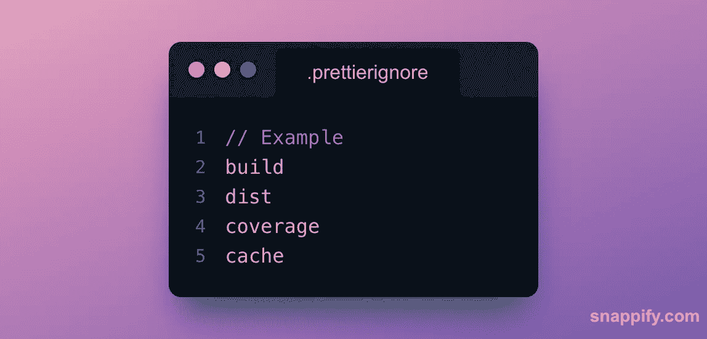
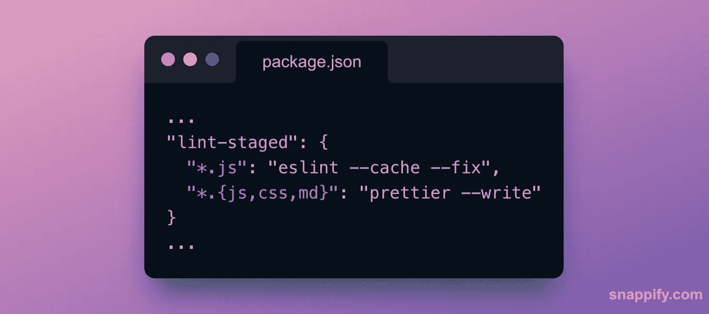
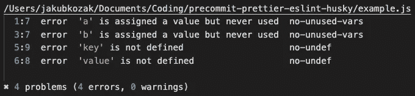

# 如何用预提交钩子写出更好的 JavaScript 代码

> 原文：<https://javascript.plainenglish.io/how-to-write-better-javascript-code-with-a-pre-commit-hook-b505909f01de?source=collection_archive---------1----------------------->

## 如何用 Git 预提交钩子设置更漂亮的和 ESLint


Photo by [Kenny Eliason](https://unsplash.com/@neonbrand?utm_source=medium&utm_medium=referral) on [Unsplash](https://unsplash.com?utm_source=medium&utm_medium=referral)

了解如何防止不良代码进入您的代码库。我们将看一个 JavaScript 的例子，但是同样的概念可以用于任何语言或框架。**这种快速而轻松的改进将通过使用 pre style、ESLint 和 Git 预提交钩子来实现。**

## 内容

1.  如何设置更漂亮(可选，如果已经设置)
2.  如何设置 ESLint(如果已经设置，则为可选)
3.  **如何用 Git 预提交钩子运行得更漂亮和 ESLint**

# 1.如何设置得更漂亮

> 是一个固执己见的代码格式化程序，它能自动保持你的代码风格一致。当您与其他开发人员在一个项目上合作时，这尤其有用。有了更漂亮的设置，你可以花更多的时间实际构建东西，而不是毫无意义地争论什么样的代码风格是正确的。

## 1.1 安装美观

**同** `**npm**` **:**

```
npm install --save-dev --save-exact prettier
```

**同** `**yarn**` **:**

```
yarn add --dev --exact prettier
```

## 1.2 创建一个更漂亮的配置文件

在项目根目录下放置一个空的`**.prettierrc.json**`文件，这样你的代码编辑器就能识别出你使用的是更漂亮的:


## 1.3 忽略一些文件和文件夹

在项目根目录中放置一个`**.prettierignore**`文件，如果你想在自动格式化时跳过某些文件和文件夹:



## 1.4 测试更漂亮的设置

**同** `**npm**` **:**

```
npx prettier --write .
```

**同** `**yarn**` **:**

```
yarn prettier --write .
```

# 2.如何设置 ESLint

> [ESLint](https://eslint.org/) 是一款对你的代码进行静态分析的工具，可以快速发现 JavaScript 代码中的问题，让你避免 bug。

## 2.1 安装和配置 ESLint

运行以下命令(对`npm`和`yarn`都适用),系统会提示您项目的几个选项:

```
npm init @eslint/config
```

## 2.2 测试 ESLint 设置

**同** `**npm**` **:**

```
npx eslint .
```

**同** `**yarn**` **:**

```
yarn run eslint .
```

# 3.**如何用 Git 预提交钩子运行得更漂亮和 ESLint**

> 这是本文的主要观点。一旦你设置好了 pre-commit 钩子，你就可以在每次提交之前运行检查了。这样，就不会有风格不正确的代码或有问题的 JavaScript 代码进入您的代码库。

## 3.1 添加预提交挂钩

运行以下命令来设置预提交挂钩。**钩子将运行得更漂亮，ESLint 只针对暂存文件(文件您** `**git add)**` **，**这使得检查速度极快:

```
npx mrm@2 lint-staged
```

**该命令:**

*   安装和配置`[husky](https://www.npmjs.com/package/husky)`和`[lint-staged](https://www.npmjs.com/package/lint-staged)`
*   将`"prepare": “husky install”`添加到`package.json`的脚本中
*   将`lint-staged`的配置对象添加到`package.json`(见下图)

`package.json`中的配置对象是您唯一想要定制的东西。对象键可以是 glob 模式，对象值可以是针对暂存文件运行的任何脚本，因此自定义由您决定:



## 3.2 测试提交前挂钩

这部分很简单:

1.  对任何 JS 文件进行更改。
2.  运行`git add <PATH_TO_THE_EDITED_JS_FILE>`
3.  运行`git commit -m "<YOUR_COMMIT_MESSAGE>"`
4.  如果在代码中发现任何错误，提交将被取消，这意味着没有任何错误提交到您的存储库中。除此之外，ESLint 没有在 JavaScript 代码中发现任何问题，并且更漂亮地正确格式化了代码。



The output of the pre-commit hook with error.

# 技巧

1.  将`.eslintcache`添加到您的`.gitignore`文件中。
2.  使用`[stylelint](https://github.com/stylelint/stylelint)`林挺你的 CSS 文件。
3.  [考虑对暂存文件运行测试。](https://benmccormick.org/2017/02/26/running-jest-tests-before-each-git-commit/)
4.  如果你很忙，你可以用`--no-verify`选项跳过预提交钩子:`git commit -m "<YOUR_COMMIT_MESSAGE>" --no-verify`。

## 有用的链接

*   [更漂亮的](https://prettier.io/):固执己见的代码格式化程序
*   ESLint:一个帮助你发现和修复 JavaScript 代码问题的项目
*   [lint-staged](https://github.com/okonet/lint-staged) :针对 staged git 文件运行 linters，不要让💩滑入你的代码库！
*   [哈士奇](https://github.com/typicode/husky) : Git 挂钩变得简单🐶汪汪！
*   [mrm-task-lint-staged](https://www.npmjs.com/package/mrm-task-lint-staged) :我们使用的命令。

如果您喜欢这篇文章，请关注我，了解更多关于软件开发的未来技巧！


## 成为会员

*如果你喜欢看这样的故事，想支持我这个作家，* [*考虑报名成为一个中等会员*](https://jakub-kozak.medium.com/membership) *。一个月 5 美元，你可以无限制地阅读媒体上的***。如果你* [*用我的链接*](https://jakub-kozak.medium.com/membership) *注册，我会赚一小笔佣金*🙌*

*[](https://jakub-kozak.medium.com/membership) [## 通过我的推荐链接加入媒体-雅各布·科萨克

### 阅读雅各布·科萨克(以及媒体上成千上万的其他作家)的每一个故事。您的会员费直接支持…

jakub-kozak.medium.com](https://jakub-kozak.medium.com/membership) 

## 工作机会——来加入我吧

我在 Tjekvik 的团队正在寻找更多的开发者！你有使用 React 和 Ruby on Rails 的经验吗？那就不要犹豫，马上申请吧:[https://www.tjekvik.com/careers](https://www.tjekvik.com/careers)。你可以在欧洲的任何地方工作！🌍* *[](/react-hooks-when-to-use-uselayouteffect-instead-of-useeffect-3271a96d881a) [## React 挂钩—何时使用 useLayoutEffect 而不是 useEffect

### useEffect 和 useLayoutEffect 的区别——用一个真实的例子来解释。

javascript.plainenglish.io](/react-hooks-when-to-use-uselayouteffect-instead-of-useeffect-3271a96d881a) [](https://levelup.gitconnected.com/10-best-vs-code-extensions-for-development-with-react-bb1bc9851818) [## 使用 React 进行开发的 10 个最佳代码扩展

### 使用 JavaScript 和 TypeScript 改善您的开发人员体验

levelup.gitconnected.com](https://levelup.gitconnected.com/10-best-vs-code-extensions-for-development-with-react-bb1bc9851818) [](https://medium.com/swlh/build-a-real-time-chat-app-with-react-hooks-and-socket-io-4859c9afecb0) [## 用 React Hooks 和 Socket.io 构建一个实时聊天应用

### 有源代码和现场演示

medium.com](https://medium.com/swlh/build-a-real-time-chat-app-with-react-hooks-and-socket-io-4859c9afecb0) 

*更多内容请看*[***plain English . io***](https://plainenglish.io/)*。报名参加我们的* [***免费周报***](http://newsletter.plainenglish.io/) *。关注我们关于*[***Twitter***](https://twitter.com/inPlainEngHQ)[***LinkedIn***](https://www.linkedin.com/company/inplainenglish/)*[***YouTube***](https://www.youtube.com/channel/UCtipWUghju290NWcn8jhyAw)*[***不和***](https://discord.gg/GtDtUAvyhW) *。对增长黑客感兴趣？检查* [***电路***](https://circuit.ooo/) *。****