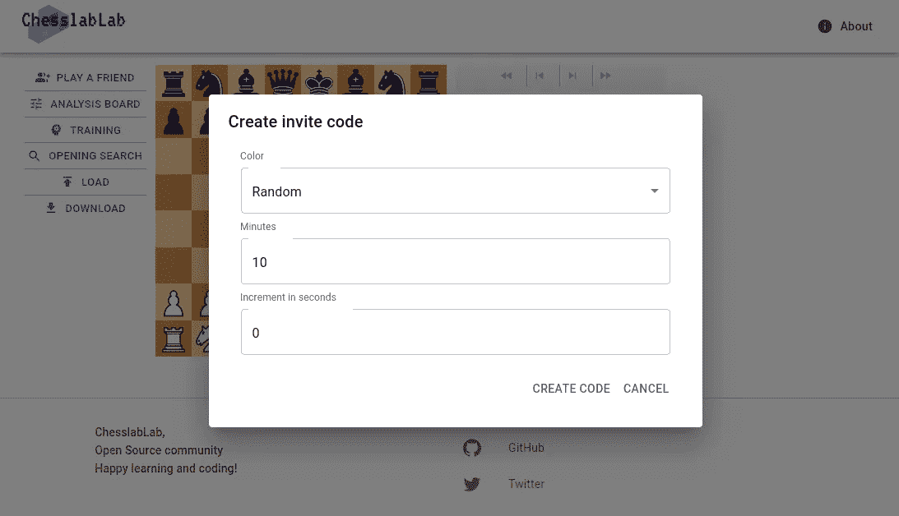
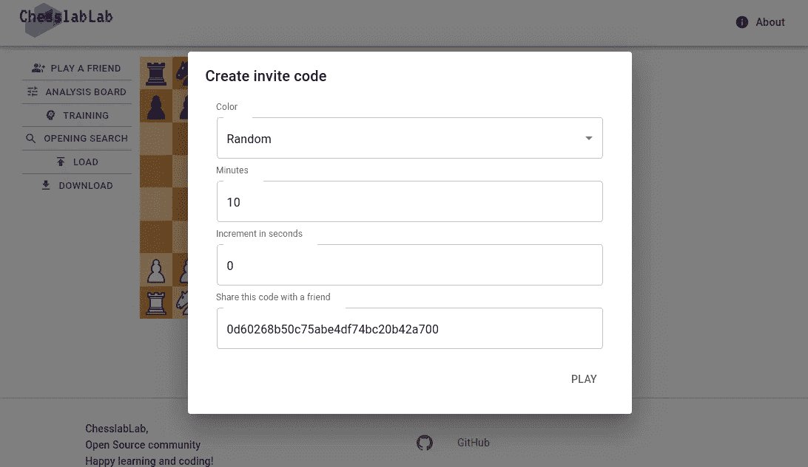
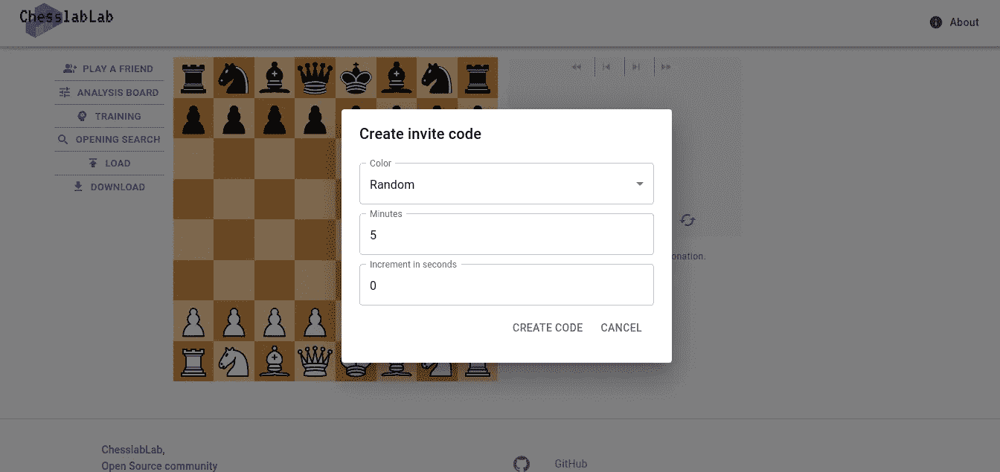
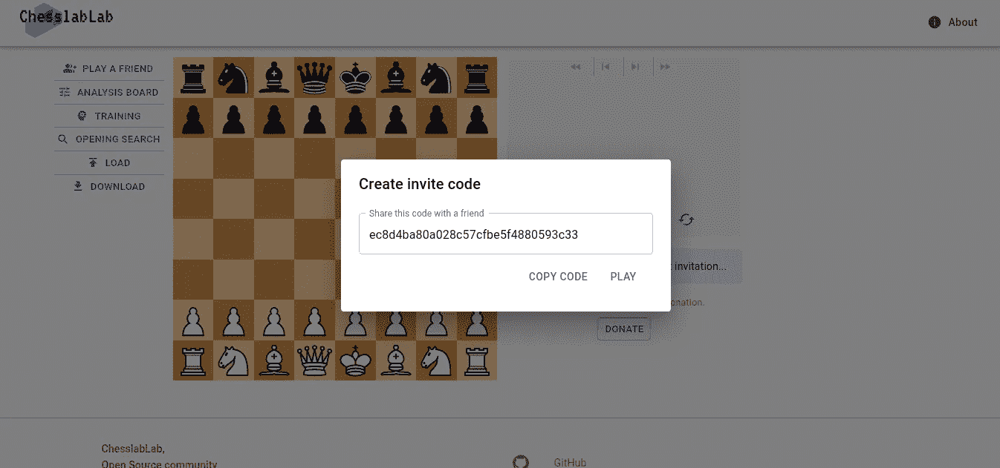
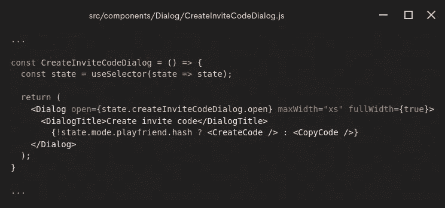

# 如何编写更好的 React Redux 组件

> 原文：<https://javascript.plainenglish.io/how-to-write-better-react-redux-components-d4b05e593f28?source=collection_archive---------8----------------------->

## 为了编写更好的代码，您应该实现这两个原则。

Photo by [Joe Caione](https://unsplash.com/@joeyc?utm_source=unsplash&utm_medium=referral&utm_content=creditCopyText) on [Unsplash](https://unsplash.com/s/photos/happy?utm_source=unsplash&utm_medium=referral&utm_content=creditCopyText)

你被分配了一项重构任务，现在你想知道如何以最好的方式开始。完成它的步骤是什么？

我们都经历过。

可能没有成为一名优秀程序员的神奇秘方。

今天，当重构一个 React Redux 组件时，我试图应用两个基本的软件开发原则，希望最终的代码会更好，因为我想人们愿意这样做。

这里有两条有效的原则，你也可以用来编写更好的代码:

*   把一个复杂的问题分解成较小的部分
*   编写您的代码时，就好像别人会阅读它一样

当然，有两个以上的软件开发原则可以帮助你成为一名优秀的程序员，然而，并不是所有的原则都同时适用于一个特定的任务。这与国际象棋非常相似:一个好的位置移动总是根据一定的原则进行，但却准确地应用于特定的位置。

# 例子

因此，让我向您展示以下问题是如何在 GitHub 上的 Redux Chess repo 上关闭的——请随意查看所做的更改。

 [## 添加一个按钮，允许将邀请代码复制到剪贴板问题#306 …

### 此时，当与朋友一起玩时，用户必须手动选择并复制邀请代码，如…

github.com](https://github.com/chesslablab/redux-chess/issues/306) 

此任务是关于添加一个按钮，允许用户将邀请代码复制到他们的剪贴板。

# 看下面的数字

这是最终用户在完成任务之前看到的 UI。

Figure 1\. **Play a Friend** > **Create Invite Code**

Figure 2\. The **Create Code** button is clicked on

这是它完成后的样子。

Figure 3\. **Play a Friend** > **Create Invite Code**

Figure 4\. The **Create Code** button is clicked on

请注意一旦用户点击**创建代码**按钮，对话框内容是如何变化的。

问题是，在这次重构中，只有一个文件发生了变化:

*   [src/components/Dialog/createinvitecodedialog . js](https://github.com/chesslablab/redux-chess/commit/ebe547f8544fefa6a6a1b89013da14578a7a2a49)

基本上`CreateInviteCodeDialog.js`已经被分成两个更小的部分:`CreateCode`和`CopyCode`。

# 重构前后的代码

在 Redux 的帮助下，很容易根据应用程序的状态定制组件的呈现方式，如下例所示，在重构发生之前。

不幸的是，当 React 组件变得越来越复杂时，它也变得越来越难以理解。在这个例子中，只要还没有创建邀请代码，**创建代码**按钮总是与**取消**按钮一起显示；否则，显示**播放**按钮。虽然这种方法没有错，但是您不希望最终编写一个带有太多 if 语句或三元运算符的 Hook 组件，就像这样。如果是这种情况，您可能希望将原始组件拆分成更小的组件，以便您的同事和您自己都能轻松理解代码。

通过分而治之的方法，只需在`CreateInviteCodeDialog`中编写一个三元运算符，就可以根据应用程序的状态呈现组件，而不是编写多个三元运算符。

记住，重要的是编写可读的代码。这是目前所有的，非常感谢您的阅读！

 [## 为什么 TypeScript 和 PHP 是好朋友

### 完整指南

medium.com](https://medium.com/geekculture/why-typescript-and-php-are-good-friends-964360fb75f6)  [## 如何编写一个可重用的反应负载指示器

### 使用 Redux 和 MUI 组件

medium.com](https://medium.com/codex/how-to-write-a-reusable-react-loading-indicator-9e576ba84ce3)  [## 查看 Redux 国际象棋演示

### 请坐下来，享受一杯你最喜欢的啤酒

javascript.plainenglish.io](/check-out-the-redux-chess-demo-acbea003d710) 

*更多内容看* [***说白了。报名参加我们的***](https://plainenglish.io/) **[***免费周报***](http://newsletter.plainenglish.io/) *。关注我们关于*[***Twitter***](https://twitter.com/inPlainEngHQ)*和*[***LinkedIn***](https://www.linkedin.com/company/inplainenglish/)*。加入我们的* [***社区***](https://discord.gg/GtDtUAvyhW) *。***