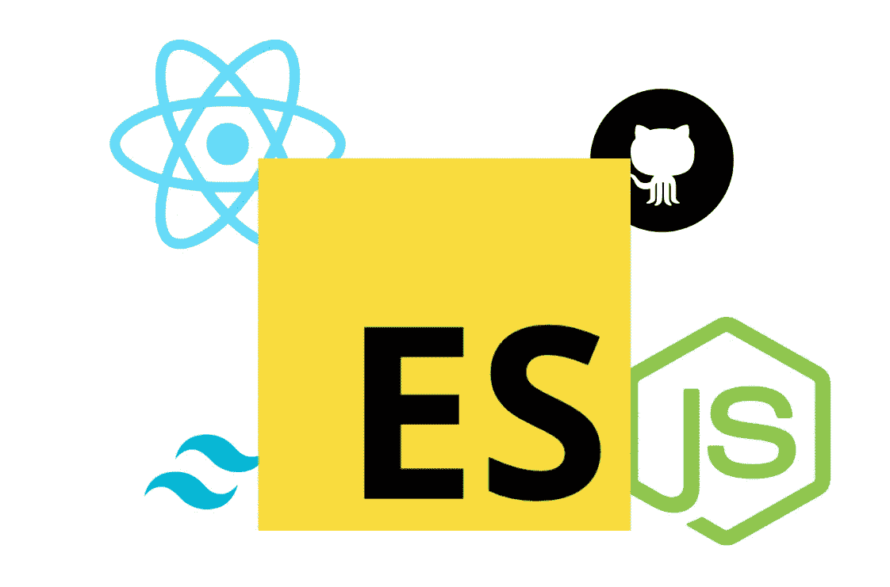

# 如何写出人们想读的 Dev 文章

> 原文：<https://javascript.plainenglish.io/how-to-write-dev-articles-that-people-want-to-read-66f35bd471c5?source=collection_archive---------3----------------------->

## 在我的中型博客上获得 50 万点击率后的写作技巧

在我的中型博客上写了大约 ***1.5*** 年后，我达到了 50 万次浏览的目标。写作从来不是我的习惯之一，这里有一些有用的技巧，是我在经营一个成功的媒体博客后从经验中学到的。

 [## 如何为开发者创造更好的内容

### 开发人员是很难为其创建内容的受众。天生的怀疑论者，开发者倾向于重视真实性…

电路. ooo](https://circuit.ooo/blog/how-to-create-better-content-for-developers) 

## 1.趋势是你的朋友

几年前，当我开始写 ***Dev 文章*** 时，我总是习惯于写我喜欢的东西，而不关心趋势是什么。我会建议所有的新作家在开始写作之前对他们所写的领域做适当的研究。

万一，如果你是一个正在学习新技术的人，那么确保你遵循正确的利基，否则，你必须克服这种趋势，这并不容易。

*   试着写一些让人们对你的文章更感兴趣的话题。
*   如果你是一个写作初学者，总是写一些基本的技术。

## 2.保持简单

你写作的方式很重要，如果你让别人更难读懂，那么你可能不会有一个好的读者。我没能经营一个成功的博客的最大原因之一是我糟糕的写作格式&我过去在博客上乱写东西的方式。

我强烈建议每个人用一个好的格式保持事情简单和整洁&坚持下去。如果你经常改变事物，在这种情况下，建立一个观众群将会是一个更困难的任务。

*   尽量用点而不是大段来解释事情。
*   写开发文章时，总是使用 ***粗体文本*** 来突出细节。
*   不要使用看起来干巴巴的代码示例，你可以使用 ***carbon.sh*** 和许多其他选项来获得漂亮的代码示例。

## 3.建立观众群

当你在互联网上创作内容时，建立受众是一个重要的部分，而在撰写技术文章时，你应该始终关注受众更关注的是什么&如何尽可能频繁地传递内容。

在我写作的早期，如果不知道人们想要什么，建立一个读者群是相当困难的。我已经列出了一些要点，它们将帮助你在更短的时间内建立起你的观众群&更多的参与。

*   选择一个特定的时间来发布你的文章&坚持在那个时间发布，这样可以让更多的人关注你的内容。
*   尽量写得更好而不是更多，因为高质量的内容比明显的长文章更受欢迎。
*   总是写下你在学习编码时面临的问题，因为这有助于你的读者理解你的旅程&如何完成事情。

## 4.钉上你的标题

写了 2 年左右，我才知道，80%的人看了你的 ***标题*** ，20%的人看了你的 ***内容*** 。尽量选择与问题更相关的标题，而不是选择一个容易引起点击的标题。

你的标题应该是:

*   超级具体。
*   短。
*   好奇心驱使。

 [## 6 个最佳反应数据可视化库

### 立即升级您的 React 项目

javascript.plainenglish.io](/6-best-react-data-visualization-libraries-fc155b573168)  [## 开发人员永不过时的 4 项技能

### 提升自信的技巧

javascript.plainenglish.io](/4-skills-that-never-gets-old-for-developers-6c90ef901fb8)  [## 2022 年自学成才的开发者赚钱的 5 种方式

### 2022 年挣得比全职工作还多

javascript.plainenglish.io](/5-ways-to-make-money-as-a-self-taught-developer-in-2022-54e18603c8e0) 

*更多内容看* [***说白了。报名参加我们的***](https://plainenglish.io/) **[***免费周报***](http://newsletter.plainenglish.io/) *。加入我们的* [***不和谐***](https://discord.gg/GtDtUAvyhW) *社区，关注我们的*[***Twitter***](https://twitter.com/inPlainEngHQ)[***LinkedIn***](https://www.linkedin.com/company/inplainenglish/)*和**[*YouTube*](https://www.youtube.com/channel/UCtipWUghju290NWcn8jhyAw)***

****用*** [***电路***](https://circuit.ooo/?utm=publication-post-cta) *学习如何为你的创业建立认知和采用。**