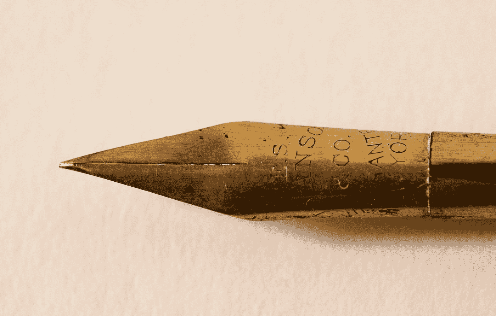

# 如何写科技博客:新手友好指南

> 原文：<https://javascript.plainenglish.io/how-to-write-tech-blogs-a-newbie-friendly-guide-9d8ffef56812?source=collection_archive---------22----------------------->

## 大多数技术人员不是作家，但可以成为作家！

Photo by [MJ S](https://unsplash.com/@mjseka?utm_source=medium&utm_medium=referral) on [Unsplash](https://unsplash.com?utm_source=medium&utm_medium=referral)

对于技术人员来说，写技术博客是个好主意。你一定从网上很多人那里听说过，从你的朋友和同事那里。

毫无疑问，这是分享您的知识、帮助开发人员社区的一个很好的方式，并且这也可以让您赚一些钱。

几个月前开始这段旅程的时候，我很犹豫，不确定能不能写，写什么，怎么写。将我的知识转化为博客的道路对我来说并不清晰。

这篇文章试图帮助你组织你的技术文章，让你开始成为一名作家。

# 吸引人的标题

标题是你的读者看的第一样东西，决定点击与否。

今天，互联网和手持设备渴望得到每个人的关注。标题是唯一能让用户阅读你的作品的东西。

你需要为一篇文章写下多个标题。花些时间回顾一下标题，决定哪一个最适合，最能吸引用户的注意力。

# 介绍

如果一个好的标题能够吸引用户的注意力，你需要用一个好的主题介绍来吸引他。

***不要让简介太长或者无聊*** 。一个写得不好的介绍会让读者瞬间离开。

确切地说，你需要做到以下几点:

*   帮助用户理解主题/问题
*   从你个人关于这个话题的故事开始。
*   解释题目的相关性。

# 你文章的结构

> post 的结构相当于你在程序中使用的数据结构。

你写什么并不重要，结构是最重要的。在开始写博客之前，你需要努力定义博客的结构。它为你的读者定义了流程。

如果读者对你的介绍感兴趣，他会进入下一部分。现在，文章的流程应该让读者不会失去兴趣。

心流就像一个神经网络，其中的点与信息、逻辑或情感相连。就科技博客而言，它是信息或逻辑。

如果流量断了，很有可能读者会选择看别的。

# 以亮点结束

我建议，不要在没有结论或只有一封感谢信的情况下结束你的帖子。你不想在你的读者快要看完的时候突然结束这篇文章。

为了让读者对结论感兴趣，你可以用几句话总结博客，或者突出文章的重要方面。

如果有人正在阅读结论，很可能他喜欢这个主题，或者这个主题对他有益。所以你可以冒昧的在结论的最后加上行动号召。

# 最重要的是重写

> 重写是写好文章的关键——这是游戏的输赢。
> 
> —威廉·津瑟

威廉·津瑟(William Zinsser)在他的书——《论写得好的》中写下了上述引文。他强调重写/编辑是写作中最重要的部分。它改善了你正在制作的作品。

首先，把你想到的都扔掉。在对文章进行修改时，您需要对其进行几次解析。

大声朗读可以帮助你理解读者对你的文章的感受。对流程进行修改并调整标题是一个好主意。

# 包装它

这不是写科技博客的唯一方法。这是我写博客几个月后发现的格式。

每个人都有自己的风格。你可以通过自己写一些技术文章来找到自己的风格。

***我希望你喜欢读这篇文章。如果你愿意支持我当作家，可以考虑报名*** [***成为中等会员***](https://singhamrit.medium.com/membership) ***。每月只需 5 美元，你就可以无限制地使用 Medium。***

*更多内容请看* [***说白了就是***](http://plainenglish.io/) *。报名参加我们的* [***免费每周简讯***](http://newsletter.plainenglish.io/) *。在我们的* [***社区不和谐***](https://discord.gg/GtDtUAvyhW) *获得独家获取写作机会和建议。*