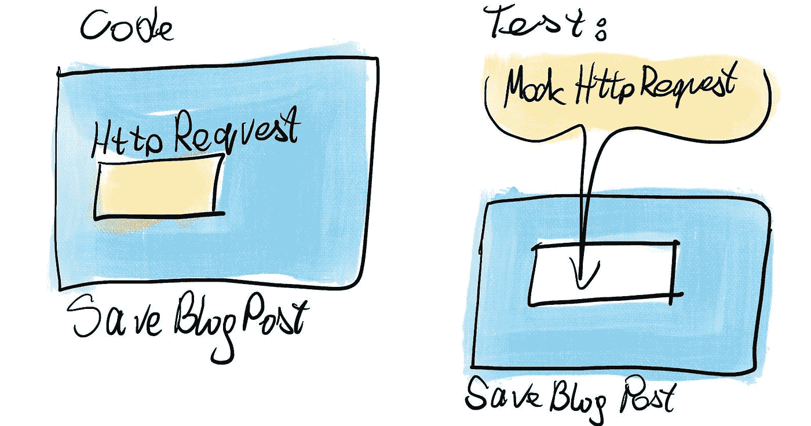
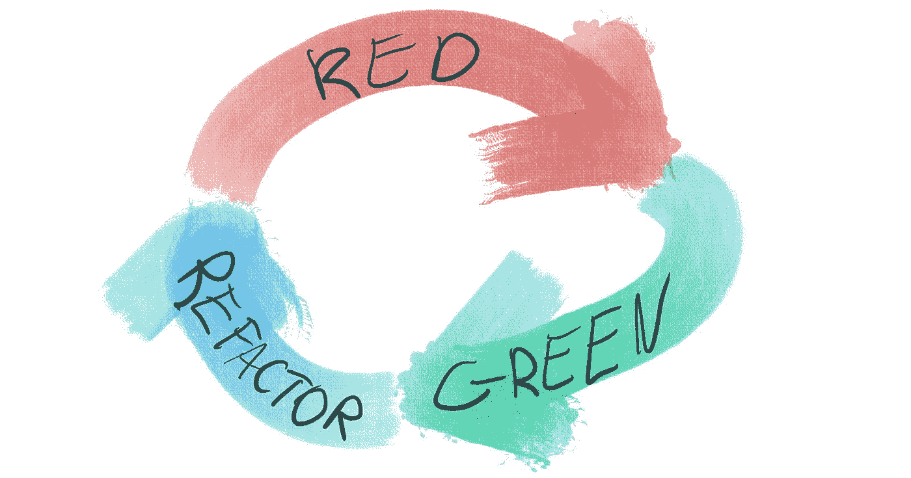

# 如何为您的代码编写单元测试

> 原文：<https://javascript.plainenglish.io/how-to-write-unit-tests-for-your-code-b21b620870de?source=collection_archive---------10----------------------->

## 编写代码单元测试指南。

作为一个初学程序员，你经常会听到测试代码的建议。这是个好建议。让我们来看看你如何开始做这件事！

# 什么是单元测试

测试是明确设定对代码期望的一种方式。您建立它们是为了让机器检查您的代码是否符合预期。

它是一个验证你的程序的程序。

通常，在 JavaScript 项目中，你会用到一些测试库，比如:

*   玩笑，
*   茉莉，或者
*   柴

但那些只是工具。重要的是，您有一些自动验证应用程序的方法。

# 单元测试如何帮助你

有四种方法可以让你的编码生活变得更简单:

1.  这是检查代码是否按预期工作的快速可靠的方法。你不需要考虑边缘情况就可以让单元测试覆盖所有的边缘情况。
2.  良好的测试覆盖率是一个安全网，它允许你以更大的勇气重构代码。因此，您更有可能采取必要的步骤来保持代码库的良好状态。
3.  编写*单元*测试迫使你考虑单元以及它们之间应该如何分配责任，使你的代码更加模块化，更易于维护。
4.  单元测试可以让你成为更快的编码者。首先，您必须投入时间来创建测试用例，但是一旦它准备好了，您就可以非常便宜地重新运行它。即使在最初的开发阶段，投资也能获得回报。

# 搭建脚手架

在测试功能之前，确保您可以测试*任何东西*。安装测试库并设置您的测试脚本。一旦您运行了一些东西，您就可以开始为您的一些测试搭建脚手架了。您需要决定一个命名约定。例如，如果你的代码是`my-project/plane-ticket.js`，你的测试代码可以位于`my-project/plane-ticket.spec.js`。

构建测试给定类所需的一切，然后检查一些琐碎的方面:

*   如果对象是对象，或者
*   如果一个函数是一个函数

这样，你会证明你可以测试东西。

# 设置嘲讽

模拟是被创建来代替你正在测试的单元的依赖关系的对象。例如，如果您测试`saveBlogPost`函数，您将希望在函数发送 HTTP 请求之前拦截它。您将希望找到您的函数用于发送请求的内容，并用一个 mock 替换它。如果您使用依赖注入模式构建代码，模仿应该很容易。

# 保持结构

如您所见，每次测试都有很多事情要做。您可以区分三个主要阶段:

1.  设置模拟
2.  要检查的运行代码
3.  检查期望值

在代码中保持这种分离是有意义的；这样读起来会比较容易。一个简单的组织方法是将所有的行组合在一起，并添加一个注释来说明是哪一部分。

# 测试驱动开发

测试驱动开发是创建具有良好测试覆盖率的优秀代码的常用方法。在实现一个函数之前，先为它添加一个测试。您运行测试，它应该会失败——如果没有，那么就有严重的问题，您需要调查它。测试失败，您将缺少的实现添加到代码中。同样，人们的期望是仅这一点就能修复故障。如果一切顺利，您可以在不改变逻辑的情况下，在代码和测试方面投入一些时间来改进您的解决方案。这种方式允许您在创建代码及其测试时快速迭代。

如果你遵循这种做法，你永远不会错过任何测试你的逻辑。没有诱惑可以跳过编写测试——当你在 sprint 结束时离开编写测试时，这是一个常见的问题。

# 反建议

要领导，你必须知道你要去哪里。如果您需要探索可行的解决方案，请暂时忽略测试。一旦你有了清晰的路径，你可以添加测试或者以测试驱动的方式再次处理问题。

# 缺失测试

如果你运气不好，你可能会在没有测试和任何其他质量相关度量的情况下处理遗留代码——就像我在这里描述的一样。在这种情况下，迟到总比不到好；您可以在处理代码库的同时开始编写测试。通过这种方式，你将为未来改善情况，也许你会发现一些隐藏在一些罕见的边缘情况下的令人讨厌的错误。

# 你呢？

你觉得学习如何考试有多难？我在网上看到一些人抱怨说他们很难找到好的资源。让我知道你到目前为止有哪些经历。

*最初发布于*[*https://how-to . dev*](https://how-to.dev/how-to-write-unit-tests)*。*

*更内容于* [***普通英语***](https://plainenglish.io/) *。报名参加我们的* [***免费周报***](http://newsletter.plainenglish.io/) *。* [***推特***](https://twitter.com/inPlainEngHQ) *和*[***LinkedIn***](https://www.linkedin.com/company/inplainenglish/)*追随我们。加入我们的* [***社群不和***](https://discord.gg/GtDtUAvyhW) *。*