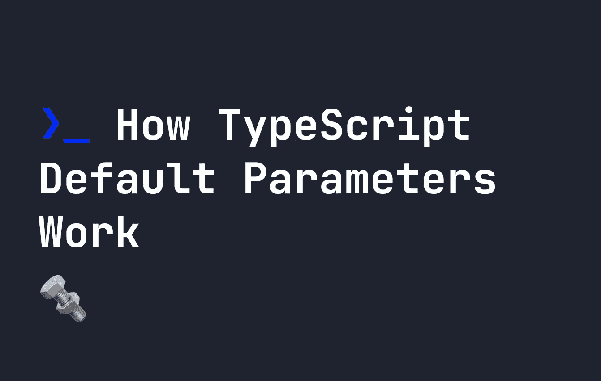

# TypeScript 默认参数如何工作

> 原文：<https://javascript.plainenglish.io/how-typescript-default-parameters-work-8c5038bfb639?source=collection_archive---------15----------------------->

## 什么是默认参数，为什么我们应该使用它们，它们在 TypeScript 中是如何工作的？



在上一篇文章中，我介绍了 TypeScript 中[可选参数的概念。在该指南中，我们使用了`?`问号符号来表示函数的参数是否可选。](https://fjolt.com/article/typescript-optional-parameters)

在本指南中，让我们看看实现这一点的另一种方法——使用默认参数。

# 默认参数

在研究这些参数在 TypeScript 中如何工作之前，让我们回顾一下它们在 JavaScript 中是如何工作的。JavaScript 中已经广泛支持默认参数。当我们谈论**默认参数**时，我们谈论的是给出应该使用的参数值，如果该参数未定义的话。例如:

```
let myFunction = (x, y = "World") => {
    console.log(x + " " + y);
}myFunction("Hello");
```

在上面的例子中，因为当我们调用`myFunction`时`y`是未定义的，所以使用默认值。这就避免了如果用户在函数中没有提到`y`可能是`undefined`的问题。如果我们在这里没有定义`y`，那么上面的函数将控制台日志`Hello undefined`。

# 为什么使用默认参数？

上面的例子很好地解释了为什么您可能想要使用默认参数。这里，我们不希望用户看到一个`undefined`值。所以我们将用默认值替换`y`，这意味着我们永远不会向用户显示这个。想象一个类似的场景，我们显示一个用户名。在这个例子中，我们可能并不总是姓。这里，我们可以使用默认值省略它，不向用户显示文本`undefined`:

```
let showName = (firstName, lastName = "") => {
    return firstName + " " + lastName
}
```

因此，默认参数让我们在某些情况下改善用户体验。它们也可以用在其他地方，比如在 HTML 画布上设置[形状的默认位置。](https://fjolt.com/article/html-canvas-shapes)

# TypeScript 中的默认参数

幸运的是，对于默认参数，TypeScript 并没有增加太多的复杂性。我们可以用同样的方式将它们添加到我们的代码中——我们只需定义类型。

```
let myFunction = (x: string, y: string = "World") => {
    console.log(x + " " + y);
}myFunction("Hello");
```

这里，我们期望两个参数都是字符串，但是实际上，我们甚至不需要给`y`一个类型。TypeScript 的引擎将推断出`y`是一个字符串，因为它的默认值是一个字符串:

```
let myFunction = (x: string, y = "World") => {
    console.log(x + " " + y);
}myFunction("Hello");
```

这意味着运行`myFunction("Hello", 1)`仍然会导致一个类型错误- **甚至**，如果我们没有明确定义`y`的类型:

```
Argument of type 'number' is not assignable to parameter of type 'string'.
```

# 结论

总之，默认参数可以像在 JavaScript 中一样使用。唯一要考虑的额外事情是，我们不必总是在有默认值的参数上定义类型，如果我们不这样做，TypeScript 将根据默认值假定类型。因此，如果默认值是`1`，那么 TypeScript 将假设该参数是一个`number`。

*更多内容看* [***说白了。报名参加我们的***](https://plainenglish.io/)***[***免费周报***](http://newsletter.plainenglish.io/) *。关注我们关于* [***推特***](https://twitter.com/inPlainEngHQ) ， [***领英***](https://www.linkedin.com/company/inplainenglish/) *，*[***YouTube***](https://www.youtube.com/channel/UCtipWUghju290NWcn8jhyAw)*[***不和***](https://discord.gg/GtDtUAvyhW) *。*****