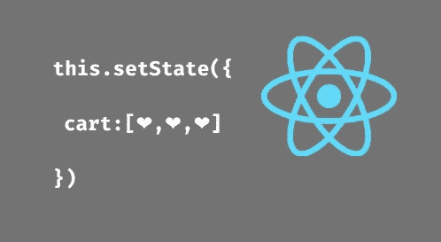

# 如何更新状态中的数组和对象

> 原文：<https://javascript.plainenglish.io/how-updating-array-object-in-state-e471e1cd605d?source=collection_archive---------9----------------------->



在本教程中，我们将看到如何使用 **React JS** 来处理数组。我们可以在 **React Native** 中使用 JavaScript 标准数组函数。然而，我们必须做一些额外的工作来操作 **React Native** 中的数组，这是因为 **React Native** 使用 **useState** 钩子来更新变量值。

在本教程中，我们将看到以下主题。

1.  向数组中添加新行。
2.  更新数组中的一行。
3.  删除数组中的一行。
4.  Fatch 数组中的一行。
5.  将数组从一个屏幕导航或传递到另一个屏幕
6.  使用状态数组中的搜索功能

申报

首先，我们将看到如何遍历数组并在 UI 中显示它。

使用 useState 钩子在你的 **App.js** 文件中使用下面的代码创建一个新的字符串数组。

```
 const [artists, setArtists] = useState([]);
```

1.  **向数组添加新行。**

```
setArtists([
                ...artists,
                {
                  id: item.id,
                  name: item.name,
                  price: item.price,
                  image: item.image,
                  qantity: 1,
                  type: "normal",
                },
              ])
```

2.**更新数组中的一行。**

```
setArtists([...artists.filter((x) => x.id !== item.id),
                      {
                        id: item.id,
                        name: item.name,
                        type: item.type,
                        price: item.price,
                        image: item.image,
                        product_id: 0,
                        qantity:
                          [...artists].find((a) => a.id === item.id).qantity -
                          1, //If increment + 1 & decrement - 1 
                      },
                    ])
```

**3。删除数组中的一行。**

```
setArtists([...artists.filter((x) => x.id !== item.id)])
```

4. **Fatch 数组中的一行。**

```
setArtists([...artists.filter((x) => x.id !== item.id)])
```

**5。导航或将数组从一个屏幕传递到另一个屏幕**

```
navigation.navigate(screenB, { art: artists, }) 
```

当更新和执行 CRUD 并返回屏幕时，创建焦点。所以不需要 API 调用就可以更新数据

```
import { useIsFocused } from "@react-navigation/native";

const isFocused = useIsFocused();

  useEffect(() => {
 // Call only when screen open or when back on screen 
    if(isFocused){ 
      fetchData();
    }
  }, [isFocused]);
```

**注意:**有些时候用户回来，而不是 api 调用，这时候使用吸种挂钩。

6.**使用状态数组搜索特征**

```
 const handleSearch = (text) => {
    setsearch(text);
    console.log(
      "Artists Array",
      [...artists].find((a) => a.name === text)
    );

    let newData = artists.filter((item) => {
      const itemData = `${item.name.toUpperCase()}`;
      const textData = text.toUpperCase();
      if (text.length > 0) {
        return itemData.indexOf(textData) > -1;
      }
    });
    setSearchArtists(newData);
  };
```

参考

[](https://beta.reactjs.org/learn/updating-arrays-in-state) [## 更新状态中的数组

### 数组在 JavaScript 中是可变的，但是当您在 state 中存储它们时，应该将它们视为不可变的。就像…

beta.reactjs.org](https://beta.reactjs.org/learn/updating-arrays-in-state) 

*更多内容请看*[***plain English . io***](https://plainenglish.io/)*。*

*报名参加我们的* [***免费周报***](http://newsletter.plainenglish.io/) *。关注我们上* [***推特***](https://twitter.com/inPlainEngHQ) ， [***领英***](https://www.linkedin.com/company/inplainenglish/) ***，***[***YouTube***](https://www.youtube.com/channel/UCtipWUghju290NWcn8jhyAw)***，以及****[***不和***](https://discord.gg/GtDtUAvyhW) *

****想看看你的软件启动规模*** *？检查* [***电路***](https://circuit.ooo/?utm=publication-post-cta) *。**