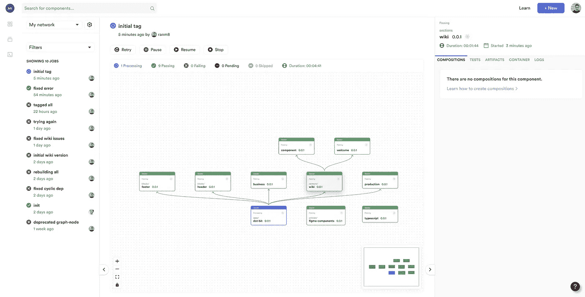
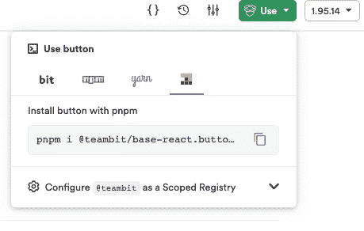

# 我们如何构建组件库

> 原文：<https://javascript.plainenglish.io/how-we-build-a-component-library-12735d09e131?source=collection_archive---------4----------------------->

## 我们如何在我们的 web 设计系统中使用 React、TypeScript、Bit 和 Design 标记实现 web UI 组件库


视觉一致性通常被认为是数字产品的“外观和感觉”。然而，在 web 应用的现代世界中，用户界面和 UX 之间的界限是模糊的，组件是视觉语言和用户体验的关键。

当用户遇到不一致的设计或用户体验时，他们会感到困惑，这反过来会损害他们期望的目标完成率。简而言之，UI/UX 的一致性对商业有益。它还能建立你的品牌，鼓励用户对你的产品和应用的热爱和忠诚。

为了培养这种一致性，组织致力于建立一个设计系统。

传统上，设计系统是作为 Figma 等设计工具上的一组可视元素、风格指南以及 React 和 TypeScript 等技术实现的组件库来构建的。但那不是设计系统。

设计系统远不止这些。这是组织中的组件经济，有助于每个人——设计师、开发人员、组件构建人员、产品构建人员——更快、更一致地协作和构建。

在这篇文章中，我将分享我们自己的团队是如何构建一个共享组件系统，并以此为基础来构建和设计我们的产品。

# 开发库:从单个包到可组合的组件系统

在构建组件库时，您将构建一组组件，这些组件将随着时间的推移而变化和发展，并将分发给其他开发人员和团队，供他们在产品和应用程序中使用。

对大多数人来说，它始于创建一个新的回购协议，并在其中构建一些组件。几乎瞬间，这就变成了“单一回购”，具有讽刺意味的是，它主要用于解决其他回购之间的代码共享。

这篇文章讲述了我们如何构建一个共享组件系统。我们使用开源工具链 [Bit](https://bit.dev/) 来构建和使用它。

我们采用了一种不同的范式，将组件而不是回购放在第一位。我们利用 [**可组合性**](https://bit.dev/) 和[开源工具链位](https://bit.dev)来开发和共享作为独立实体的组件。

这意味着，开发人员不会因为不想放弃对产品路线图和开发的控制而采用包含一系列组件的包，他们将拥有一个组件市场，可以在他们的应用程序中找到、使用和扩展这些组件。

由于大约 1000 种不同的原因，一个可组合的范例更好；模块化软件更好，更易维护，更容易理解和修复，构建更快，测试更简单，扩展更快，协作更顺畅，等等。

但是在设计系统的背景下，它有一个更大的优势:更容易被采用。对于设计系统来说，采用就是一切。

可组合性还开启了许多伟大的工作流，以解决和改进各种领域，如主题化、标记和样式化；我们用标记创建主题，这些标记可以用“无样式”的组件组合来创建任何东西。

这里有一个例子:

看看我们的可组合组件的“基本反应”范围。

[](https://bit.cloud/teambit/base-react)[](https://bit.cloud/teambit/base-react) [## teambit / base-react:用于可组合应用程序的非风格化、共享的 react 基础组件

### 用于模块化 web 的无样式、通用的 React 基础组件。实验性的。组件:主题提供者，图像，网格…

bit.cloud](https://bit.cloud/teambit/base-react) 

这些是我们共享的基本 ui 组件，但是没有样式。为了对它们进行样式化，我们使用了来自“设计”范围的主题和标记。

[](https://bit.cloud/teambit/design)[](https://bit.cloud/teambit/design) [## teambit / design: Bit 的设计组件，用于跨产品设计我们的 UI 元素

### Bit 的设计组件，用于构建 bit.dev 和 bit.cloud。组件:复选框-项目，按钮，颜色选择器，反应…

比特云](https://bit.cloud/teambit/design) 

通过可组合性，我们创建了一个共享组件的系统，我们可以跨产品使用它来更快地开发并确保一致性。

甚至依赖它们的具体功能也可以在许多不同的应用程序中共享和使用，因为它们都只是(经过验证、发布的)组合。

我们的图书馆更像“iTunes ”,而不是一个硬包装的 CD-Rom，这意味着我们的组织享受着一个活跃的、不断增长的、协作的组件经济，这些组件被快乐开发的跨组织采用。

# 我们如何开发和版本化组件

我们不会讨论如何[开始使用组件工作空间](https://bit.dev/docs/getting-started/installing-bit/installing-bit)，而是向您展示当您以模块化方式构建组件时，开发、共享和协作组件是多么容易。

Bit 的工作空间让我们可以动态地创建和获取我们想要开发的组件。它可以在任何文件夹中生成，不管您正在处理哪个 repo。这对开发组件非常有用。

简而言之:我们建造像乐高一样的组件，我们不会在一个回购中把它们粘在一起，除非有一个好的理由。

可以使用`bit create`开发新组件，或者可以使用`bit fork`派生和修改现有组件，如下所示:

```
$ bit fork teambit.base-react/buttons/button
```

每个工作空间都会跟踪 bit.map 文件中的组件:

```
{
    "buttons/button": {
        "scope": "",
        "version": "",
        "mainFile": "index.ts",
        "rootDir": "component-library/buttons/button"
    },
```

任何时候你都可以运行`bit start`来打开工作区 UI 并可视化组件，查看代码、文档、版本、测试、例子等等。

您还可以运行`bit status`来查看工作区中所有组件的状态。这里有一个虚构的例子，显示了对这样一个工作区的快速状态检查:

```
$ bit statusstaged components
 (use "bit export <remote_collection> to push these components to a remote Collection") > buttons/button. versions: 0.0.1, 0.0.2, 0.0.3 ... ok
 > layout/grid. versions: 0.0.1 ... ok
 > pages/page. versions: 0.0.1, 0.0.2 ... okmodified components
 (use "bit tag --all [version]" to lock a version with all your changes)
 (use "bit diff" to compare changes)> navigation/link ... ok
```

您可以在任何时候运行[位状态](https://bit.dev/docs/workspace/workspace-status)来获得您的工作空间的概述:哪些组件已经被修改并且正在等待标记，哪些组件已经暂存并且正在等待导出，以及是否遇到了任何错误。

是时候给[贴上](https://bit.dev/docs/components/tags)我们按钮的第一个版本了。键入以下命令:

```
$ bit tag buttons/button -m "first version"
```

在没有指定组件的情况下运行`tag`命令将标记工作区中所有修改的组件。

当标记一个组件时，编译、测试和构建就完成了。这不仅适用于您编辑和标记的组件；依赖于该组件每个组件也将被标记为新版本。

[](https://bit.cloud/teambit/base-react/buttons/button)

Travel back to older versions of any component; Rollback in production!

每个组件的版本控制对于设计系统非常有用。更多[此处](https://medium.com/eightshapes-llc/versioning-design-systems-48cceb5ace4d)和[此处](https://blog.bitsrc.io/versioning-independent-ui-components-why-and-how-7ea60d8be5f2)阅读。你能希望的最好的事情是组织中的其他团队采用你的组件；如果所有的组件都被一起版本化，那么这就不会发生，安装 lib 的人将会在每一个不相关的变更上获得版本更新(触发他们项目的 CI)。

注意:要在项目/开发人员之间共享组件，您需要在远程范围内托管它们。你可以在自己的服务器上设置一个，或者免费使用 [bit.cloud](https://bit.dev) 。你的选择。

# 我们如何处理组件依赖关系

[依赖关系](https://bit.dev/docs/dependencies/dependencies-overview)是组件(最终是应用程序)组合和集成的方式。

Bit 简化了定义和更新工作空间中组件之间的依赖关系的过程。

这是按钮组件的例子，这一次是在单击“依赖项”选项卡视图时。如您所见，它导入了“link”组件，该组件又使用了“compare-url”组件。


每当您修改一个组件并用新版本对其进行位标记时，所有依赖于它的组件(工作区)也将被测试、构建和更新。这意味着“增量”图驱动构建将触发所有组件，这些组件受到它们所依赖的组件的任何变化的影响。

例如，在上面的例子中，如果您分叉并修改“link”组件，然后运行`bit status`，您将看到“button”也将挂起一个新版本:

```
modified components
(use "bit tag --all [version]" to lock a version)
(use "bit diff" to compare changes)

     > navigation/link ... ok

components pending to be tagged automatically (when their dependencies are tagged) > buttons/button ... ok
```

如果您正在使用 bit.cloud，那么很快您就可以使用 Ripple CI(现在处于封闭测试阶段),它将这一传播过程扩展到组织中的所有组件和团队，以持续集成一切。

我们已经使用它来更新我们不同项目的共享组件。下面先睹为快:



# 我们如何主题化和样式化组件

这里有些很酷的东西。使用主题化和标记以模块化的方式设计组件，就像乐高积木一样。这意味着我们的组件(参见上面的 base-react 范围)基本上没有样式(无意冒犯，组件)，我们的[使用设计令牌的主题化组件](https://bit.cloud/blog/design-tokens-in-components-with-react-and-bit-l28qlxq6)为它们提供了可以跨许多组件、页面和应用程序轻松更改或替换的样式。

[](https://bit.cloud/teambit/design/themes/base-theme) [## 设计/主题/基础主题

### 钻头设计语言的标准主题。标上位，主题，设计，底座。属性:覆盖，子级…

比特云](https://bit.cloud/teambit/design/themes/base-theme) [](https://bit.cloud/teambit/design/themes/base-theme)

使用这样的主题，我们可以随心所欲地“即插即用”主题和风格，这使得设计师也很容易成为积极的贡献者(感谢我们的主题中的[设计标志)。让我们看看如何使用一个主题！](https://blog.bitsrc.io/how-we-use-design-tokens-in-react-5396dd897ace?gi=8e35db851566)

在一个工作区中(有一些像上面的按钮一样的组件),克隆主题和主题提供者:

```
$ bit fork teambit.base-react/theme/theme-provider$ bit fork teambit.design/themes/base-theme
```

然后只需将主题导入主题提供程序，并更改标记以匹配您的风格！可组合性使一切变得非常简单。

# 我们如何构建和测试组件

这是一个非常有趣的问题。

在 Bit 中，每个组件都是在一个“[开发环境](https://bit.dev/docs/envs/envs-overview)中开发的，这个开发环境也是一个组件。这听起来很复杂，但实际上非常简单。

这意味着你可以定义你希望组件如何被编译、测试等等，然后很容易地重用这些配置。

每个组件都是在各自的环境中独立开发、构建和测试的。因此，当某个东西失败时，您可以准确地了解它是在哪里以及是什么原因造成的。而且，您只构建了发生变化的组件——其他什么都没有。)因此，在 avg 项目上，构建可以快 10 倍。

构建在标签上运行。由于 Bit 知道组件之间所有依赖关系的图，它可以确保当一个组件被标记上新版本时，该组件及其所有依赖组件(沿着图向上传播)也将被标记并被构建和测试。

回头看看上面的按钮示例:

```
$ bit build --list-tasks buttons/buttonTasks List
id: nitsan770.component-library/buttons/button@0.0.5
envId: teambit.react/react

Build Pipeline Tasks:
teambit.harmony/aspect:CoreExporter
teambit.compilation/compiler:TSCompiler
teambit.defender/tester:TestComponents
teambit.pkg/pkg:PreparePackages
teambit.harmony/application:build_application
teambit.preview/preview:GenerateEnvTemplate
teambit.preview/preview:GeneratePreview

Tag Pipeline Tasks:
teambit.pkg/pkg:PackComponents
teambit.pkg/pkg:PublishComponents
teambit.harmony/application:deploy_application

Snap Pipeline Tasks:
teambit.pkg/pkg:PackComponents
teambit.harmony/application:deploy_application
```

测试组件的[也是如此。](https://bit.dev/docs/dev-services/tester/tester-overview)

您可以使用任何您喜欢的工具(例如 Jest)来测试组件，并将测试定义为标记过程的一部分，这样，无论何时您对组件进行更改，依赖关系图中所有受影响的组件都将被单独测试。

事实上，您可以使用:

```
bit test --watch
```

让测试在本地工作区中对您的组件所做的每一个更改上运行，并在工作区 UI 中看到它，这样您就可以总是知道哪些组件(在图中)可能会在您所做的每一个更改上中断——在开发时间期间**！赋予了 TDD 新的含义，不是吗？**

[](https://bit.cloud/teambit/base-react/buttons/button/~tests)

# 保持更新的可定制文档

所以接下来的部分被广泛忽视了，因为大多数人认为添加视觉例子或故事就可以了，仅此而已。诚然，可视化的例子和故事是开发和记录组件的好方法，但是文档实际上远不止这些。

1.  文档必须是组件的一部分，而不是外部的，应该包括道具、测试和返回旧版本的选项
2.  它们必须根据需要随组件的每个新版本(在 Bit 中进行版本控制)进行更新
3.  它们应该是可定制的和可扩展的，由于 MDX，它们可以包含任何特性或其他组件。

那个；这正是 Bit 的作用——当您在本地工作区开发组件并运行“bit start”打开工作区 UI 时，您可以查看在您编码时实时生成和更新的文档。

[](https://bit.cloud/teambit/base-react/buttons/button)

您可以在文档本身中添加可视示例、道具表、描述或任何其他类型的文档特性/组件。

此外，在您将您的组件共享到一个范围后，这些文档提供了组件的可见性和可用性，而无需创建和维护任何外部或额外的文档网站。而且，它们将随着每个新组件版本的发布而更新。太好了。

这是 React 中真正的基本 UI 组件集，我们将其用作基础。

[](https://bit.cloud/teambit/base-react)

# 我们如何分发和共享组件

这里事情变得更加有趣。

我们不仅仅是构建和发布一个组件库。

说实话，我们用组件构建一切，前端和后端都一样。团队拥有业务职责(“搜索”、“ui”、“计费”等)，并使用 Bit 将它们构建在组件中，而每个团队在“范围”中共享其组件——我们所有的范围[都托管在 bit.cloud](https://bit.cloud/teambit/~scopes) 上，但也可以放在任何其他服务器上，就像 Git 一样。如果你看一下我们的范围，你会清楚地看到我们构建了什么特性，以及哪些团队构建了它们。

[](https://bit.cloud/teambit/~scopes)

此外，您可以通过在图表上查看谁在使用谁的组件来可视化所有范围(和团队)之间的依赖关系。

[](https://bit.cloud/teambit/~scope-graph)

如果我们看一下[base-react scope](https://bit.cloud/teambit/base-react)——我们的样式 UI 组件“库”——你可以看到它与“设计”有着密切的联系，这是有意义的，这是所有主题的所在，并且与其他 UI 密集型项目有着密切的联系。

[](https://bit.cloud/teambit/~scope-graph)

这里有几个非常酷的望远镜。这两种产品都使用我们的设计系统(base-react + design)中的组件作为依赖项来创建集成和协作。

1.  社区范围——我们用来在 bit.dev 上构建开源社区网站的组件。自然，这个范围使用了 base-react 和 design scopes 中的一些组件。

[](https://bit.cloud/teambit/community) [## teambit / community:开发者社区开源网站。

### 开发者社区开源网站。组件:文本工具提示，创建部分，功能，github-明星。72…

比特云](https://bit.cloud/teambit/community) [](https://bit.cloud/teambit/community)

2.博客范围，我们主机的所有组件用于建立在 bit.cloud/blog.的博客，我们也使用从那里的设计系统组件。

[](https://bit.cloud/teambit/blog) [## teambit /博客

### 组件:英雄，组件可扩展性，引入组件驱动软件，后列表。52 个组件和 3 个…

比特云](https://bit.cloud/teambit/blog) [](https://bit.cloud/teambit/community)

范围是组件所在的位置:

1.  款待
2.  共享的
3.  版本化和更新
4.  使可见成为可发现的
5.  消费和使用自

您可以使用“位导出”将组件直接共享到远程作用域，然后在许多不同的项目和人员之间共享和访问它们。

您可以[在 bit.cloud(免费)上创建一个远程作用域，并在您工作区的 workspace.json 文件中配置它](https://bit.dev/docs/getting-started/collaborate/remote-scope)，如下所示:

```
{
  "teambit.workspace/workspace": {
    "defaultScope": "your-username.demo-scope"
  }
}
```

后来，在改变作用域时，“位链接”可以派上用场。

在创建并定义了一个范围之后，这里有一个将上述组件从您的本地工作区导出到您创建的范围的示例

```
$ bit exportexported the following 4 component(s):
nitsan770.component-library/navigation/link
nitsan770.component-library/themes/base-theme
nitsan770.component-library/theme/theme-provider
nitsan770.component-library/buttons/button=
```

一旦在范围内，组件可以在许多不同的项目中使用——并且可以用范围内的新版本进行更新！

# 我们如何发现、消费和使用组件

云上的每个组件都有一个“使用”按钮。


“使用”按钮为开发人员提供了多种使用组件的方式。例如，他们可以从免费的 bit.cloud 注册表或任何其他注册表中将它作为一个包安装。他们还可以使用“bit fork”将组件分支到他们的工作区中，并对其进行编辑，然后标记一个新版本。



将一个组件提取到您的工作区之后，您也可以从任何其他组件导入并使用它。)—创建无限量的不同组件扩展并放在一起的组合。

这是一个非常酷的例子(拖放组件):

[](https://bit.cloud/blog/extendable-uis-how-to-build-better-uis-for-developers-l1jkl1pc) [## 可扩展的 UI 组件

### 我最近受命为 bit.cloud 平台构建一个用户卡组件。我还负责建造…

比特云](https://bit.cloud/blog/extendable-uis-how-to-build-better-uis-for-developers-l1jkl1pc) 

## 收养收养收养

当你告诉人们“嗨，用这个包吧！”—他们愿意，但他们真的不能。为什么？因为他们不能放弃对产品开发的控制权。

他们中的一些人甚至想使用设计系统组件；但是，如果他们产品的 PM 需要改变，会发生什么呢？

因此，DSs 努力争取被采用。

Bit 对我们帮助创建共享组件的采用大有帮助:

A.通过使使用任何包管理器或位来安装组件变得容易，这也提供了将组件“分支”到本地工作区以供使用和根据需要进行编辑的选项——这确实有助于采用。


b.当人们只安装一个组件时，他们不会给他们的项目增加多余的重量，也不会得到他们不使用的代码的更新(触发 CI)。而且，他们不必添加多余的依赖项。

# 组件更新

每当设计系统团队想要发布更新时，他们可以简单地将组件分支到他们的工作区，并对代码进行更改。

然后，他们所要做的就是标记一个新版本(注意，bit 也会自动标记所有受影响的依赖组件)并将其导出到范围中。

然后，当团队和开发人员使用该组件时——仍然在旧版本上——将运行“位安装”,他们将获得所有最新版本的更新！

简单吧？然而，大规模的工作流程可能会很累。因此，我们目前正在使用我们开发的一个新工具，名为“Ripple CI”，它将更新跨范围传播到组件，持续集成组织…


Ripple 目前正处于封闭测试阶段，由我们自己的团队和一些选定的组织使用它在全球范围内进行构建。它应该会在 2022 年晚些时候发布，同时还有一个免费版本。

# 治理和协作

组件经济意味着你“民主化”,鼓励组件的采用和协作，同时提供监管工具。

在 Bit Cloud 上，我们可以“验证”我们信任的组件，并推荐开发人员在他们的项目中使用:


Bit 还提供了一些工具，如称为“开发环境”的可重用模板，帮助开发人员标准化组件的开发、构建、测试、链接、文档化、发布等方式(和工具)。

我们使用许多这样的工具和工作流，但是现在我想分享两个:一个用于治理组件，另一个用于协作。

第一个特性是“经过验证的组件”——这非常简单，它让组织中的管理员可以验证哪些组件可以使用。


第二个特性是建议改变和协作，它被称为:“ [Lanes](https://bit.dev/docs/lanes/lanes-overview) ”。

Lanes 基本上类似于 Git 分支，只是对于组件图而言。

因此，如果“按钮”依赖于“链接”,而你想改变两者，把它们分支到你的工作区，打开一个通道，[捕捉](https://bit.dev/docs/lanes/switching-lanes)这些改变，[导出改变](https://bit.dev/docs/lanes/export-lane)。

这听起来很容易也很简单——如果你有许可的话。

如果没有，您可以捕捉并发送建议的更改，而不发送版本以供审阅。

这比去另一个库，一头扎进一个巨大复杂的代码库，最终制作一个 PR 然后等待要容易得多。

# 结论

设计系统不是一个内部实现了一堆组件和一个匹配包的仓库。

它是一个活的、振动的、协作的、变化的、高度可组合的组件集，您最终希望您组织中的人们去发现、理解、选择、使用，甚至理想地为之做出贡献。

这意味着你不仅仅是在构建一个组件库；你正在建立一个组件经济。你越早意识到这一点并致力于构建它，你的共享组件系统就越有用。

对我们来说，这意味着在 React 中构建一组基本的 UI 组件，它们都是无样式的，同时为主题(带有设计符号)和样式构建一组类似的组件。当人们可以将两者结合在一起，并使用他们自己的组件时，对他们来说，采用共享组件系统并更快地构建新东西，同时确保设计和体验的一致性，变得有趣而简单。

感谢阅读，请随时评论或询问任何事情！

🍻 🍺 💁‍♂

## 进一步阅读

[](https://bit.cloud/blog/how-to-build-a-composable-blog-l1jkl9f4) [## 如何建立一个可组合的博客

### 从头开始创建一个博客需要很多。有许多移动的部件组合在一起形成一个…

比特云](https://bit.cloud/blog/how-to-build-a-composable-blog-l1jkl9f4) [](https://bit.cloud/blog/meet-component-driven-content-applicable-composable-l24cw7ku) [## 满足组件驱动的内容:适用的、可组合的

### 自从 React 和 Angular 等技术出现以来，我们经常将术语“组件”与…

比特云](https://bit.cloud/blog/meet-component-driven-content-applicable-composable-l24cw7ku) 

*更多内容看**[***说白了。报名参加我们的***](https://plainenglish.io/)***[***免费周报***](http://newsletter.plainenglish.io/) *。关注我们*[***Twitter***](https://twitter.com/inPlainEngHQ)*和*[***LinkedIn***](https://www.linkedin.com/company/inplainenglish/)*。*****