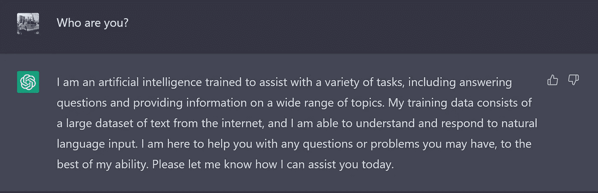
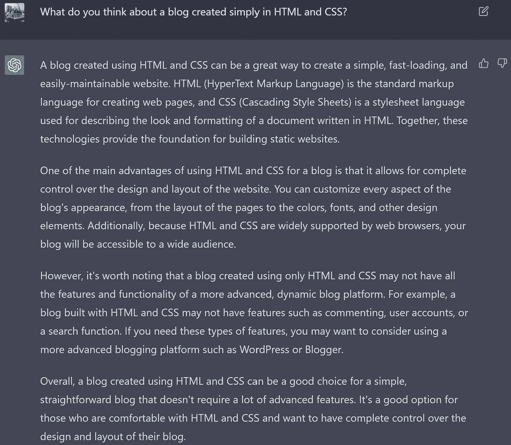
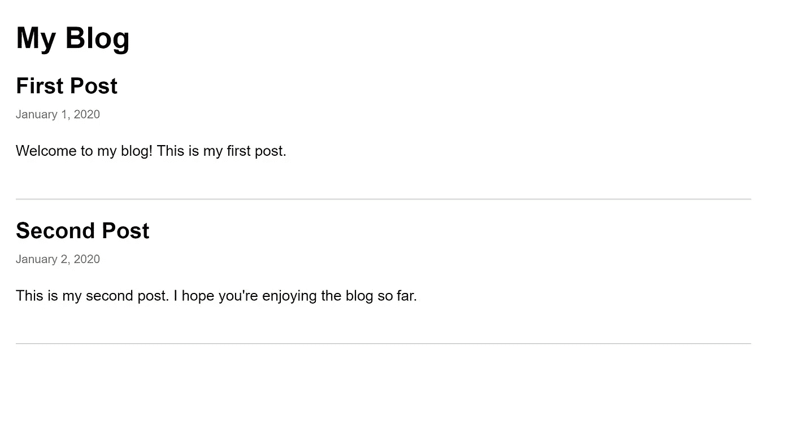
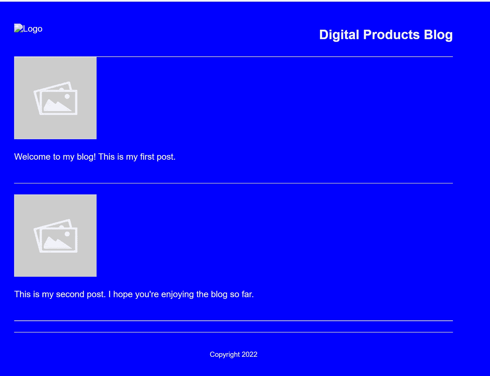
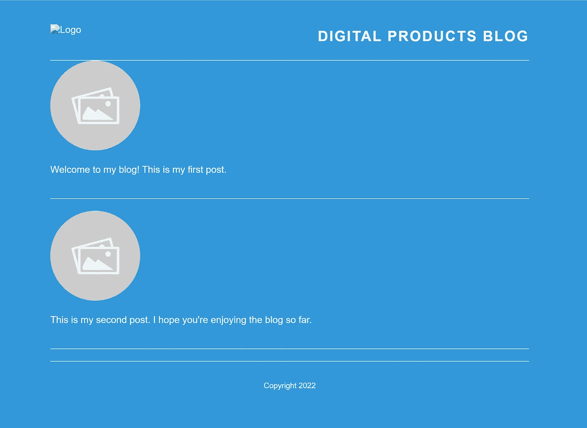
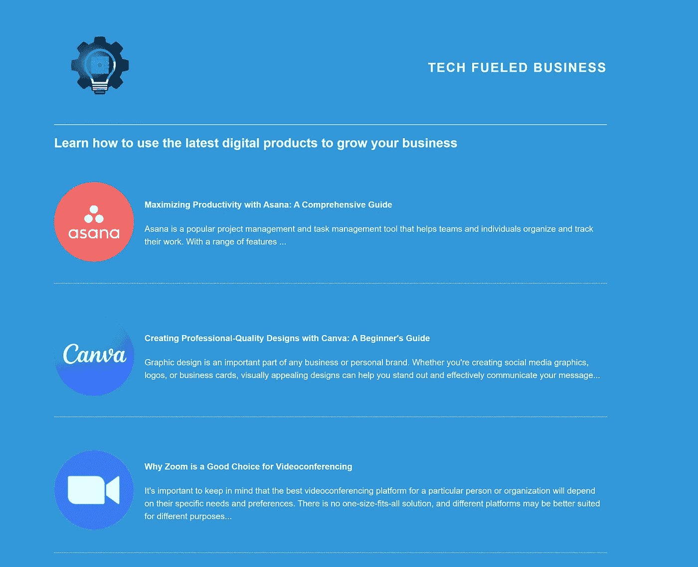

# 我们如何使用 ChatGPT 在大约一小时内免费从头开始创建博客

> 原文：<https://javascript.plainenglish.io/how-we-used-chatgpt-to-create-a-blog-from-scratch-in-about-an-hour-for-free-c5b586a7ab6a?source=collection_archive---------10----------------------->

## 从选择主题到为网站生成文章和开发代码:ChatGPT 的全部力量。

Picture of [Yuyeung Lau](https://unsplash.com/@yuyeunglau?utm_source=unsplash&utm_medium=referral&utm_content=creditCopyText) on [Unsplash](https://unsplash.com/it/s/foto/bot?utm_source=unsplash&utm_medium=referral&utm_content=creditCopyText)

在一个沉闷的周日，我和乔瓦尼·瓦尔迪兹决定联系一下，尝试一下 [ChatGPT](https://chat.openai.com/) 的能力。结果如何？一个关于数字工具的在线**博客。*一切都在大约**一个小时内创造出来。** 
如果你不知道 ChatGPT 是什么，让它自己呈现吧:*

**

*[https://chat.openai.com/chat](https://chat.openai.com/chat)*

*酷吧。*

## *我们是怎么做到的*

*我们决定分配任务:虽然[乔瓦尼·瓦尔数据](https://medium.com/u/685930c560fe?source=post_page-----c5b586a7ab6a--------------------------------)使用人工智能为博客和**文章**生成**想法**，但我使用它在 **HTML** 和 **CSS** 中开发博客。*

*如果你有兴趣从乔瓦尼的角度来看这个项目，点击[后面的链接](https://giovanni-valdata.medium.com/how-we-used-chatgtp-to-create-a-blog-website-and-its-content-in-about-an-hour-for-free-6fac1ec01234)。*

*我选择这种技术堆栈是因为我想使用一些简单明了的东西，ChatGPT 似乎也同意我的观点:*

**

*[https://chat.openai.com/chat](https://chat.openai.com/chat)*

*首先，我们要求人工智能为博客生成一个基本的模板，这就是所创建的代码:*

*一点也不坏！这个模板已经包括了一个博客的基本布局，有一个标题，一个博客文章列表，以及一些基本的样式，以使页面有一些结构和设计。*

**

*The preview of the blog so far*

*为了改进它，我们要求 ChatGPT 进行一些更改:*

*   *修改背景颜色。*
*   *创造在新页面上详细阅读文章的可能性。*
*   *创建页眉和页脚。*
*   *有一个带有标题的图片作为每篇文章的预览。*
*   *单独创建文件，这样我们就可以在外部文件中使用 CSS 样式。*

> *我想改进这个模板。我想博客的背景是蓝色，白色的文字。此外，我想你创建一个标题。页眉应该显示一个徽标和一个标题，上面写着“数字产品”这个博客是关于数码产品的。此外，博客必须有页脚。此外，文章的预览，必须包括一个描述文章标题的图像。通过点击这个预览，用户必须导航到另一个页面，在那里他们可以详细阅读整篇文章。此外，我希望你单独生成文件。index.html 档案应该是登陆页。详细描述文章的文件将被称为-文章名-.html 最后，CSS 文件必须是单独的。*

*结果令人印象深刻，通过一些调整，我们实现了我们所要求的一切。*

**

*The blog after the second prompt*

*然而，还需要做进一步的调整。由于不是优秀的设计师，我们让 AI 重写 CSS 文件，让博客看起来更“现代”。*

> *谢谢你。然而，我想给它一个更现代的外观。您可以在 CSS 文件中根据自己的喜好更改颜色和样式，让博客看起来更现代。*

*几秒钟之内，它就为我们生成了一个新版本的博客:*

**

*The blog after the third prompt*

*我们现在有了一个很好的起点。*

*与此同时，Giovanni 撰写了文章，为博客选择了一个名字(再次使用 ChatGPT)，并创建了一个标志。对于徽标，我们使用了另一个来自 Open AI 的 AI，名为 [DALL-E 2](https://openai.com/dall-e-2/) ，这是一个新的 AI 系统，可以根据自然语言的描述创建逼真的图像和艺术。*

**

*Our logo generated by DALL-E 2*

*检索到文章后，我使用 ChatGPT 的模板为每篇文章创建了一个 HTML 文件。我们还在 CSS 中做了一些样式修正。*

*想想花在这上面的一点点时间，最终的结果是惊人的。*

*在这个[链接](https://5ebs.github.io/ChatGPT-Blog/index.html)亲自看看吧！*

**

*The final result*

*你也可以查看整个[代码库](https://github.com/5ebs/ChatGPT-Blog)。*

## ***结论***

*总之，ChatGPT 被证明是一个强大而高效的工具，可以在一个小时内从头开始创建一个博客。通过使用提示和特定请求，我们能够生成一个基本模板，进行样式更改，并为每篇文章创建单独的 HTML 文件。此外，我们使用了另一个人工智能系统 DALL-E 2 来为博客创建一个徽标。
最终产品是一个功能齐全、视觉上吸引人的博客，涵盖了一系列与数字工具相关的主题。*

*我们发现，提示的特异性越高，回答的质量就越高。这种体验凸显了人工智能技术的潜力及其简化内容和设计元素创建流程的能力。虽然它是一个非常有效的工具，但它仍然需要一个指挥者来有效地协调和组装各种组件，以实现预期的结果。*

*总的来说，ChatGPT 是这个小项目的宝贵资源，我们期待着在未来探索它的能力。*

*你认为人工智能会如何改变我们的未来？*

**考虑* [***成为中等成员***](https://ebelinggianmarco.medium.com/membership)**如果你喜欢看这样的故事，并且想帮助我这个作家。每月 5 美元，你可以无限制地访问媒体内容。如果你通过* [***我的链接注册，我会得到一点佣金。***](https://ebelinggianmarco.medium.com/membership)**

## **更多内容请访问 [PlainEnglish.io](https://plainenglish.io/) 。**

***报名参加我们的* [***免费每周简讯***](http://newsletter.plainenglish.io/) *。关注我们* [***推特***](https://twitter.com/inPlainEngHQ) ， [***领英***](https://www.linkedin.com/company/inplainenglish/) ***，***[***YouTube***](https://www.youtube.com/channel/UCtipWUghju290NWcn8jhyAw)***，****[***不和谐***](https://discord.gg/GtDtUAvyhW)***

## **希望扩大你的科技创业公司的知名度和采用率吗？检查[电路](https://circuit.ooo/?utm=publication-post-cta)。**