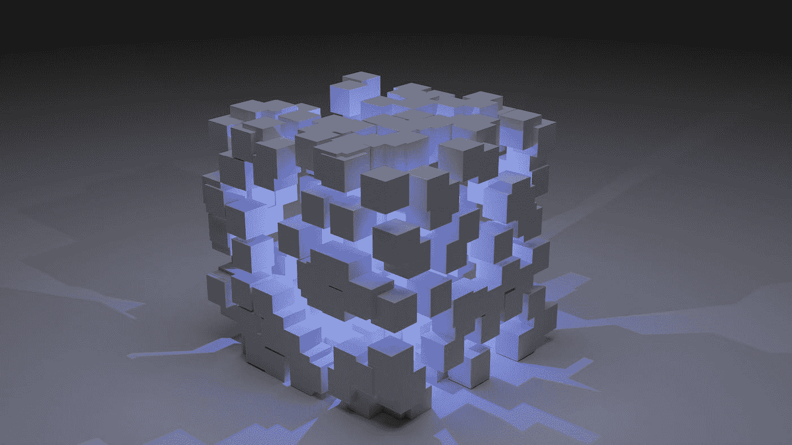

# 2022 年 Web 3.0 如何工作

> 原文：<https://javascript.plainenglish.io/how-web-3-0-works-in-2022-291f21294682?source=collection_archive---------8----------------------->

## 了解 Web 3.0

Photo by [Shubham Dhage](https://unsplash.com/@theshubhamdhage?utm_source=medium&utm_medium=referral) on [Unsplash](https://unsplash.com?utm_source=medium&utm_medium=referral)

Web 3.0 被称为去中心化互联网，也被称为第三版互联网。

目前，我们使用的是互联网的第二个版本 Web 2.0。这里最主要的问题是用户为了换取服务而免费提供数据。因此，一旦你的数据被用于个性化，你就不再拥有它。

您的数据随后会被广告公司用于根据您的兴趣和参与度为您提供最佳广告。

使用您的数据并不违法，因为您已经授权 Web 2.0 将您的数据用于个性化和基于兴趣的广告推荐。因此，如果我们已经允许他们使用我们的数据，我们就不能责怪他们使用我们的数据。

目前，谷歌、YouTube 和脸书是用户访问最多的网站，2021 年的访问量超过 1000 亿次。

Chart from the author referring to Statista

所以准确地说，主要网站都在不假思索地运行互联网。另一方面，机构有权在特定地区屏蔽任何网站或应用程序。因此，他们也可以阻止某人使用服务。

目前 Web 2.0 中有多个领导者控制着互联网的不同方面，并在不同地区阻止不同的应用程序。有时他们还会控制你的支付交易，阻止你购买某些东西。

## 接下来是什么？

Web 3.0 是第三个完全去中心化的互联网版本。在 Web 3.0 中，没有人拥有互联网，也没有人能够阻止任何人使用 Web 3.0。因此，任何有互联网连接的人都可以使用 Web 3.0 进行任何交易，而不需要中央当局的许可。

简单来说，你永远不会在 Web 3.0 上写“*该服务在你的地区*被阻止”，因为没有人有权阻止一个地区或其人民使用 Web 3.0 上的服务，因为一切都是分散的。

Web 3.0 将让一切去中心化，没有统治者或中央机构为特定地区做决定。它将把互联网和人类之间的互动带到一个新的高度。

所以第三代互联网是完全开放的，不需要许可。Web 3.0 运行在区块链上，这使得它不可改变。

Layers of Web3.0 from [author](https://aniketz.medium.com/)

[区块链](/what-is-blockchain-and-why-all-programmers-should-know-about-it-897d73c24a75)是一种技术，其中信息记录存储在分布在广泛网络上的区块中，使数据几乎不可能被更改或篡改。它是一个数据块链，在许多系统上存储着大量相同的副本。

因此，改变或入侵区块链的任何区块都变得不可能，因为这个星球上没有人有这样的计算能力来改变或篡改数据。每个块都有一个唯一的标识，称为哈希。

每当创建一个数据块时，都会创建一个唯一的哈希，如果有人篡改了数据，哈希就会再次更改，从而丢弃该区块链的整个拷贝。有许多副本存储在不同的网络上，因此丢弃一个不会在区块链引起问题，皇家区块链仍然是安全的。

## Web 3.0 上的更多单词

在 Web 3.0 中，网站和应用程序部署在许多系统上。因此，它不依赖于单一的云平台。有强大的区块链技术支持 Web 3.0，它真正成为有史以来最强大的互联网技术。

它完全在包含对等节点的分散网络上工作。Web 3.0 中的任何支付交易都不需要您的个人信息，因此非常安全。它对每个人都是完全可靠和透明的。

没有人控制 Web 3.0，这使得它可以自我管理。

Web 3.0 将计算能力和去中心化提高到一个新的水平，这使得它完全安全。Web 3.0 崩溃或宕机的可能性非常小，因为它在使用对等节点技术的区块链上工作。

Web 3.0 中的所有支付系统都从传统的集中支付被替换为分散支付，如以太坊、比特币、USDT(保持稳定并类似于其价值 1 美元的系绳)

Web 3.0 是一项非常有前途的技术，它将为用户提供安全性和可靠性。

我们还应该考虑这样一个事实，Web 3.0 仍然处于非常早期的开发阶段，因此它目前还没有得到广泛的受众的青睐。这是由于许多原因造成的，其中最主要的原因可能是没有意识到。

除了安全之外，Web 3.0 还由于去中心化而提供了广泛的连接性。

从 Web 2.0 过渡到 Web 3.0 需要时间，没有人确切知道这种过渡何时对大量受众完全可能。Web 3.0 将赋予每个人决定和使用互联网的权力，使互联网对每个人开放。

*本文不应被视为财务或法律建议。请注意，这篇文章只是为了知识的目的，并创造意识。*

就这样，这是文章的结尾。希望它对你有价值。[如果你喜欢这篇文章，点击这里订阅我的邮件列表。我会通过电子邮件给您发送技术相关的文章。](https://aniketz.medium.com/subscribe)

[**通过邮件获取此类文章点击此处**](https://aniketz.medium.com/subscribe) **|** [**购买 5 美元中等会员资格**](https://aniketz.medium.com/membership)

[如果你觉得这篇文章有价值，那么点击这里阅读更多的技术文章](https://aniketz.medium.com/)

 [## 通过我的推荐链接加入 Medium-Aniket

### 作为一个媒体会员，你的会员费的一部分会给你阅读的作家，你可以完全接触到每一个故事…

aniketz.medium.com](https://aniketz.medium.com/membership) 

*更多内容请看*[***plain English . io***](http://plainenglish.io/)*。报名参加我们的* [***免费周报***](http://newsletter.plainenglish.io/) *。在我们的* [***社区***](https://discord.gg/GtDtUAvyhW) *获得独家获得写作机会和建议。*