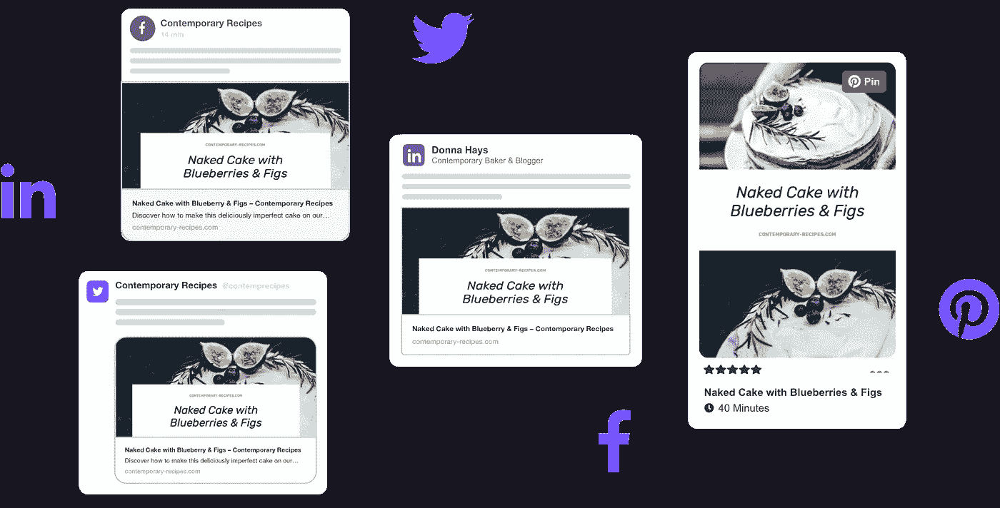
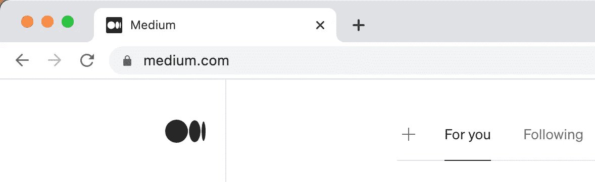
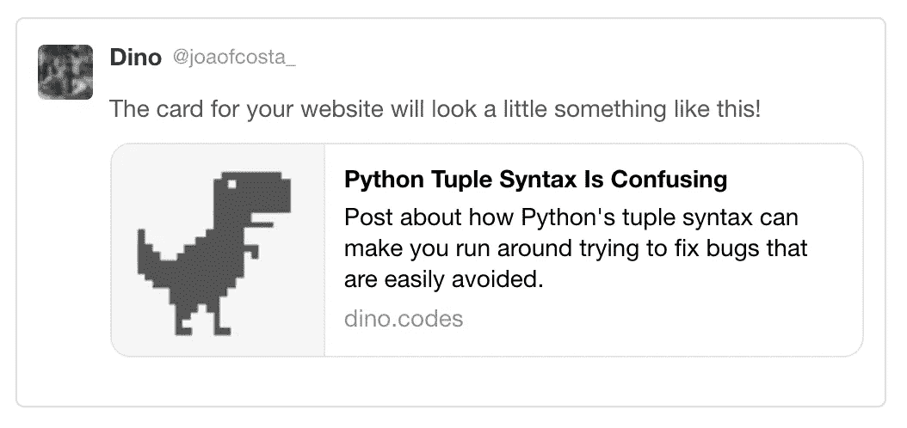
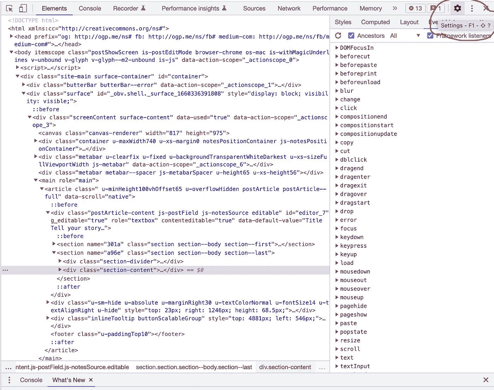
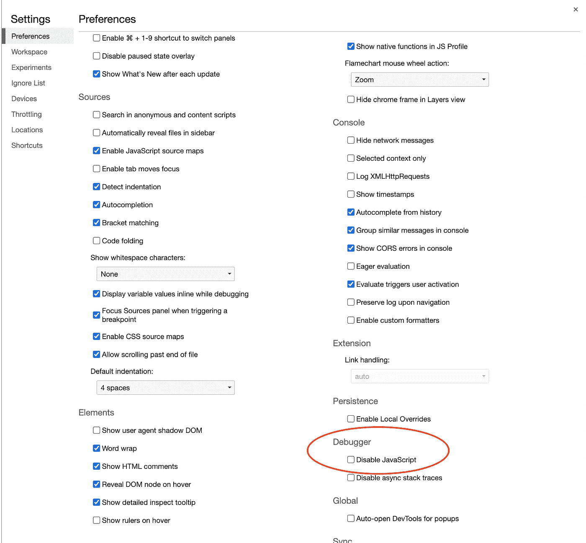

# 网页共享的工作原理

> 原文：<https://javascript.plainenglish.io/how-web-page-sharing-works-80ef78bd2e90?source=collection_archive---------15----------------------->


Photo by [Sebastian Dumitru](https://unsplash.com/@sebastiandumitru) on [Unsplash](https://unsplash.com/s/photos/hands)

网络浏览就是把人们联系起来，就像诺基亚的标语一样。因此，我们经常有朋友互相分享好奇的页面。

分享页面链接可以有很多不同的方式，例如，鸽子邮件，但我猜你可能更喜欢一些 messenger 或社交网络应用程序。

应用程序为你的保留而战，这意味着一个人分享的链接应该是好奇的，漂亮的，有信息的。为此，应用程序会检测你信息中的链接，并尝试为它们创建预览。



Naked Cake in Apps from [https://socialsharepreview.com/](https://socialsharepreview.com/)

这对你的网站有好处，因为它增加了点击和链接导航。

一个正确的 HTML 文档已经有了一些元标签、标签标题等，它们在页面的标签上显示为标题。

```
<title>Medium</title>
```



Medium title

HTML 也有元标签，比如描述、作者等等。

```
<meta name="description" content="In its most basic form, a story on Medium consists of a title and a body text.">
```

这些标签在主场景—网页视图中是不可见的。它们只是为了元的目的，用于预览共享链接，屏幕阅读器等。

每个 meta 标签都有一个名称和内容属性，就像 JavaScript 中的键/值对一样。

为了改善用户体验，已经使用[开放图协议](https://ogp.me/)开发了预览链接。

```
<meta property="og:title" content="The Rock" />
<meta property="og:type" content="video.movie" />
<meta property="og:url" content="https://www.imdb.com/title/tt0117500/" />
<meta property="og:image" content="https://ia.media-imdb.com/images/rock.jpg" />
```

但是网络的发展比协议更快，足够大的应用程序可以拥有扩展的基本 HTML 和开放的图形标签，例如，[“Twitter:card”](https://developer.twitter.com/en/docs/twitter-for-websites/cards/overview/abouts-cards)或“vk:image”属性。

```
...
<meta name="twitter:description" content="In its most basic form, a story on Medium consists of a title and a body text.">
<meta name="twitter:site" content="[@Medium](http://twitter.com/Medium)">
...
```



From [https://dinojoaocosta.medium.com/how-to-make-twitter-preview-your-website-links-5b20db98ac4f](https://dinojoaocosta.medium.com/how-to-make-twitter-preview-your-website-links-5b20db98ac4f)

## 因此，给你的站点添加链接预览的简单算法是:

1.  添加 HTML meta 标签(标题、描述)；
2.  为你的站点添加尽可能多的[开放图元标签](https://ogp.me/)(你可能不想支持每个场景或者没有足够的数据给某人，比如视频、音频、文章等)；
3.  创建要维护的应用程序列表；
4.  测试并向这些应用程序添加自定义标签。

# **如何测试 HTML 预览？**

测试 HTML 预览是很棘手的，因为要测试你的下一个 HTML 版本，你需要在网络中发布这个 HTML(机器人无法到达你的 localhost)。

另一方面，如果你只是在生产中测试，机器人可以缓存你的坏预览，在修复这个问题后，你不能为地球上的每个应用程序重置缓存。

## 如何清除 App 的 HTML 解析缓存？

为了清除缓存，应用程序通常有自己的 API。但是这些都不是标准化的，每个 app 都有它的机制。

## 那又怎样？

要开发和测试 HTML 链接预览，您可以只在与您在生产中使用的主机不同的主机上发布带有 meta 标签的空 HTML。

## 工具？

是啊！幸运的是，人类创造了扩展。其中一些向网络发布你的本地主机的元标签一小段时间，例如 [open graph checker](https://chrome.google.com/webstore/detail/localhost-open-graph-chec/gcbnmkhkglonipggglncobhklaegphgn) 。

# JavaScript 呢？

社交网络和 messenger 应用程序不会从您的页面执行 JavaScript。因此，如果您使用 SPA(单页面应用程序)和 JavaScript 客户端执行(没有服务器端渲染)，那么您的 JavaScript 添加的漂亮的 meta 对爬虫程序来说是不可见的。你只能在你的 HTML 模板中添加一些静态的公共元。

这对于一些有不同“对象”的网页来说是非常坏的消息，比如文章、电影、歌曲等，因为每个对象都有其独特的元，但是会有相同描述和图像的预览！

幸运的是，对于这个问题，我们有一些不同的酷的解决方案！

这些解决方案我们将在下一篇文章中考虑！敬请期待！

要在没有客户端 JavaScript 的情况下检查任何网页的 HTML，您可以在 [ChromeDevTools](https://developer.chrome.com/docs/devtools/overview/) 、(尝试 F12)设置(然后尝试 F1)、调试器部分—禁用 JavaScript 标志中禁用 JavaScript。重新加载页面并检查 HTML。



Chrome Dev Tools



# 资源

*   medium.com
*   [https://dinojoaocosta . medium . com/how-to-make-Twitter-preview-your-website-links-5b 20 db 98 AC 4f](https://dinojoaocosta.medium.com/how-to-make-twitter-preview-your-website-links-5b20db98ac4f)
*   [https://socialsharepreview.com/](https://socialsharepreview.com/)
*   [https://developer . Mozilla . org/en-US/docs/Learn/HTML/Introduction _ to _ HTML/The _ head _ metadata _ in _ HTML](https://developer.mozilla.org/en-US/docs/Learn/HTML/Introduction_to_HTML/The_head_metadata_in_HTML)
*   [https://ogp.me/](https://ogp.me/)

日安！

*更多内容请看*[***plain English . io***](https://plainenglish.io/)*。报名参加我们的* [***免费周报***](http://newsletter.plainenglish.io/) *。关注我们关于*[***Twitter***](https://twitter.com/inPlainEngHQ)[***LinkedIn***](https://www.linkedin.com/company/inplainenglish/)*[***YouTube***](https://www.youtube.com/channel/UCtipWUghju290NWcn8jhyAw)*[***不和***](https://discord.gg/GtDtUAvyhW) *。***