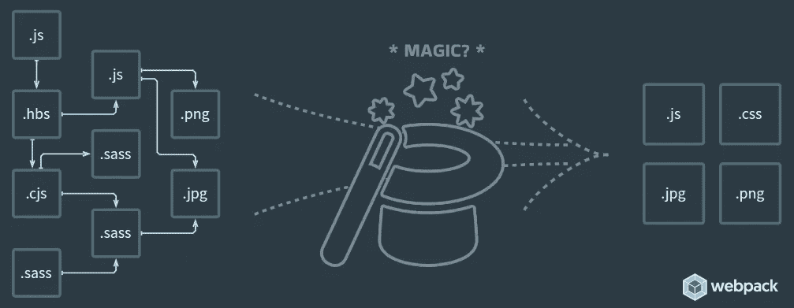

# Webpack 如何处理带有可变路径的动态导入

> 原文：<https://javascript.plainenglish.io/how-webpack-handles-dynamic-imports-with-variable-paths-9c598a2aa4e3?source=collection_archive---------2----------------------->

## 探索 Webpack 如何处理带有可变路径的动态导入。

Webpack 是最流行的 JavaScript 模块捆绑器，它是一个将模块捆绑到一个文件中的工具。

一直困扰我的一件事是它如何处理带有可变路径的动态导入，我的意思是，我知道这不是魔术，但我不知道它是如何工作的，我总是忘记研究它…直到现在。

# 文件导入的工作方式

每当您在代码中导入一个文件时，Webpack 将在项目目录中查找该文件，并以新的名称将其复制到`build`文件夹中，然后 Webpack 用新复制文件的路径替换绑定的 JavaScript 文件中的导入代码。

这里有一个超级简化的例子:

# 什么是动态导入？

有时你不想让浏览器立即下载文件，你想只在需要的时候加载它，为此，你可以使用动态导入。

几乎任何类型的文件都可以使用动态导入，因此对于大型图像或音频文件非常有用。

但是当你想导入一个路径可变的文件时会发生什么呢？

Webpack 如何知道将哪个文件复制到`build`文件夹？嗯，有一种方法可以告诉 Webpack 忽略导入，让浏览器用注释`/* webpackIgnore: true */`来处理它。

这很好，但不知何故也可以不这样做，让 Webpack 找出文件的路径。但是怎么做呢？

# 魔术

它真的没有那么复杂，但是有一些注意事项。例如，如果导入一个具有可变路径的文件，该路径中至少有一部分需要在字符串中显式显示，例如:

get

这是为什么呢？Webpack 的做法是在构建过程中分析插入的字符串路径，然后从字符串中获取显式路径部分，在本例中为`assets/images/`，然后将该文件夹中的所有文件复制到`build`文件夹中。

Webpack 也以一种非常聪明的方式做到了这一点，如果`import`语句包含文件扩展名，它将只复制具有该扩展名的文件，例如`import(`./assets/images/${fileName}.png`)`将只复制`PNG`文件。

因为 Webpack 是通过分析`import`语句中的字符串来完成的，所以当整个路径是一个没有显式字符串部分的变量时，它无法知道要复制哪些文件。

# 结论

Webpack 可能有一个繁琐的配置，有时它可能看起来像黑暗魔法，但它是一个非常强大的工具，具有许多功能，如果你深入研究，你会发现它的实现并不复杂。

如果你想了解更多关于 Webpack 的内容，你可以查阅[官方 Webpack 文档](https://webpack.js.org/)，你可以在这里阅读更多关于[模块方法](https://webpack.js.org/api/module-methods/)和[动态导入](https://webpack.js.org/guides/code-splitting/#dynamic-imports)。

*最初发布于*[*https://pablo . gg*](https://pablo.gg/en/blog/coding/how-webpack-handles-dynamic-imports-with-variable-paths/)*。*

*更多内容看* [***说白了就是***](https://plainenglish.io/) *。报名参加我们的* [***免费周报***](http://newsletter.plainenglish.io/) *。关注我们* [***推特***](https://twitter.com/inPlainEngHQ) *和*[***LinkedIn***](https://www.linkedin.com/company/inplainenglish/)*。加入我们的* [***社区不和谐***](https://discord.gg/GtDtUAvyhW) *。*