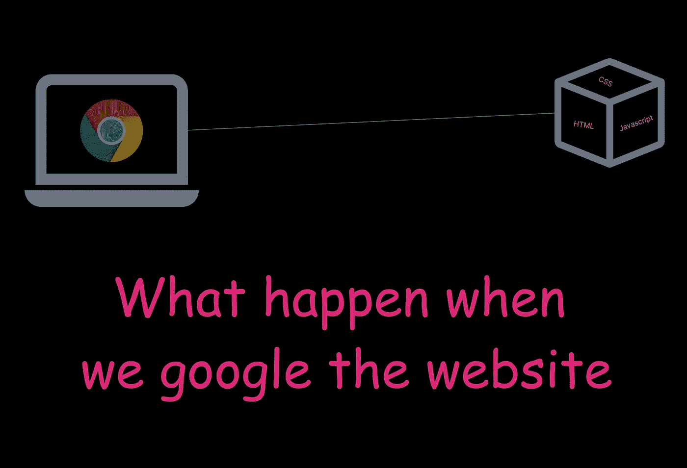

# 如何在互联网上提供网站服务

> 原文：<https://javascript.plainenglish.io/how-websites-are-served-over-the-internet-c0b6a2dd2bdd?source=collection_archive---------8----------------------->

## 当我们搜索一个网站时会发生什么

## 在后台

想过为什么我从引擎盖下开始所有的故事吗？

嗯，引擎盖下的意思是什么意图，写这个故事的思维过程是什么？

我写这个故事的动机在引擎盖下部分有所阐述。我的上一个故事在 dev.to 上获得了很多意见和喜爱。

 [## 为什么我们的网站速度慢——捆绑包大小的重要性

### 不是 Reactjs，不是框架，不是服务器，不是 API，也不是互联网是它背后的原因。故事开始于…

开发到](https://dev.to/shreyvijayvargiya/why-our-websites-are-slow-importance-of-bundle-size-1le4) 

我写过一篇关于为什么网站速度慢的文章，讨论了包大小的重要性。我已经提出了一些观点或说新的方法来解决网站性能或优化问题。

这个故事是关于捆绑包和网站如何加载的阅读灵感，以及浏览器如何解析和编译它们等等。

## 捆绑是关键

我读得越多，关联的点就越多。当桑德尔·皮帅在谷歌开发浏览器时，即使创始人不同意他的观点，他也能神奇地做到这一点。

除非完成，否则似乎很难。

我习惯于认为，从服务器到浏览器为网站提供服务并不太重要，因为我们经常只需要处理编写代码。

但是我从事的软件开发旅程越多，出现在焦点上的点就越多。现在是时候把这些点联系起来，从基础开始更好地理解事情了。

捆绑是指通过您家中安装的用于互联网连接的电缆在互联网上为网站提供服务的方式。

奇怪，捆绑，说真的？

是的，包是在互联网上提供的 HTML、CSS 和 JavaScript 文件的集合。这些包包含了你的网站的网页。

如果你有关于，主页和个人资料页面，包括 CSS，图片和 HTML 文件，那么这些被捆绑，缩小，或者让我们假设被分割成小块，通过网络发送到你的浏览器。

## 惊人的快

想象一下这些东西在引擎盖下工作的速度有多快，因为加载整个 medium.com 网站或网站的大部分只需要不到 3/4 秒的时间。

我的意思是，即使在那 3/4 秒之后，我们人类还在为网站优化和性能问题而斗争，真奇怪。

人们甚至不能等待 4 秒钟来加载网站，我甚至不能想象第一个网站用户🥸.的反应是什么

## 互联网及其工作原理

首先，互联网不是浏览器。如果你也这么想，那么让我来纠正这个错误。电子邮件、TCP 和浏览器是互联网的服务或所谓的子集。

互联网意味着将两台电脑连接在一起或在两台电脑之间进行对话。

因此，如果一个服务器位于太平洋，而你正在加拿大浏览，这些服务器和你的计算机相互通信，给你结果。

在这种情况下，结果是包含您的网站的 HTML 文件或网页。

## 谷歌 Chrome 登录

这就是谷歌 chrome 或浏览器的用武之地。

一旦你的电脑从服务器上获得网页，你的电脑仍然需要软件或工具来打开、加载、解析或编译网页。

Chrome 为我们做到了这一点，甚至没有从我们这里拿走任何东西，这是一项非常好的工作。

## Chrome 及其内部党

现在 chrome 收到了网页，并准备为我们组织聚会。Chrome 主要解析和编译网页并加载网站。

不仅仅是这个铬合金-

*   呈现 HTML 文件
*   执行 Javascript 文件
*   使用 CSS 绘制网站

我甚至无法想象，但我希望我能在有生之年开发出这样的软件。

## 当我搜索域名时会发生什么？

如果搜索[www.medium.com](http://www.medium.com/)，那么中型域名将为我的浏览器提供中型服务器所在的 IP 地址。从中型服务器，我的浏览器将获取中型网站或网页块称为捆绑。

然后，这些包在浏览器上被解析、编译和执行，以加载网站。

域名只给出 IP 地址。以前我们只知道 IP 地址，但是很难记住域名。

这就是技术如何随着时间的推移而演变，太神奇了。

现在我们有了一个给出服务器 IP 地址的域名。从 IP 地址，我们得到服务器的位置或纬度和经度，并通过电缆，我们与服务器交谈，并要求与域名相关的网站。

服务器然后以任何方式返回网站，以前它是 HTML 文件，现在它更多的是以包的形式。

最后，一旦文件被接收到，浏览器就可以毫无怨言地工作了。

这是最基本的，已经完成了。

## 未来的演变

这一过程将基本保持不变。为了使事情更快，更好的服务器位于附近，并安装更多的服务器来快速服务于网站。

否则，对于我来说，从位于太平洋的服务器上请求网页要比从印度洋的服务器上请求网页花费更多的时间，因为我位于印度，所以需要行进的距离更短，可以发生更快的事情。

甚至没有更多的服务器，在未来，我们将有一个分散的系统，其中每台计算机将互相交谈，并帮助彼此服务。

如果我已经搜索了 medium.com 的网站，而任何一个在我电脑附近的陌生人试图用谷歌搜索 medium.com，我的电脑会把这个网站提供给他。

了解区块链和 web3 世界的 IPFS 技术。

 [## 星际文件系统-维基百科

### 编辑描述

en.wikipedia.org](https://en.wikipedia.org/wiki/InterPlanetary_File_System) 

我们不必依赖单一的中央服务器来服务我们的网站。我们可以简单地把它推到链条上，世界上所有的计算机都将充当服务器和消费者。

相当奇怪但相当强大的概念。

## 结论

尽管如此，还有很多需要理解的地方，因为我们只有 chrome 来解析网站，它不是开源的，所以我们不能优化或改变底层逻辑。

到目前为止，我们可以照顾捆绑包，大量的服务器和代码优化，以及良好的实践，但在未来，我们可能会很好地控制网站的服务方式。

下次见，祝你愉快。
继续发展
Shrey

*更多内容看* [***说白了。报名参加我们的***](https://plainenglish.io/) **[***免费周报***](http://newsletter.plainenglish.io/) *。关注我们关于* [***推特***](https://twitter.com/inPlainEngHQ)[***LinkedIn***](https://www.linkedin.com/company/inplainenglish/)*[***YouTube***](https://www.youtube.com/channel/UCtipWUghju290NWcn8jhyAw)*[***不和***](https://discord.gg/GtDtUAvyhW) *。对增长黑客感兴趣？检查* [***电路***](https://circuit.ooo/) *。*****