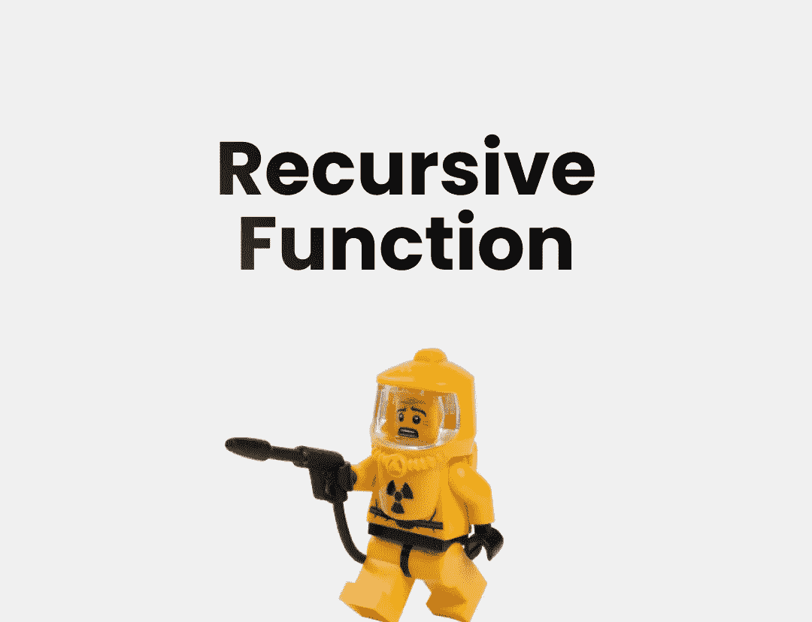

# 如何在 JavaScript 中使用递归函数

> 原文：<https://javascript.plainenglish.io/how-you-should-use-a-recursive-function-in-javascript-619b3306cbab?source=collection_archive---------7----------------------->

## 小心超过调用堆栈！



Image by author and [Mulyadi](https://unsplash.com/photos/wQRCaurCX3k) at [unsplash](https://unsplash.com/photos/wQRCaurCX3k)

**通过在**[**【https://twitter.com/antondevv】**](https://twitter.com/antondevv)**的 Twitter 上关注我，保持反应和打字的前沿。**

递归函数是调用自身的函数。虽然您可能不相信这有任何可行的用例，但我将向您展示一个完美的用例。

但是到底什么是递归函数呢？根据定义，它是一个调用自身的函数，但是如果我们这样做了，它永远不会返回，调用栈最终会被填满，我们的程序会停止。递归函数必须在某个时刻返回。

例如，这个递归函数会导致我们的应用程序崩溃:

```
function recursive(){
console.log("i invoke my self")
recursive()
}
```

默认情况下，当一个函数到达函数作用域的末尾时，它会返回 undefined，除非您显式定义一个 return 语句，所以这里发生的情况是，它永远不会到达末尾，因为它一直在调用自己。

## 递归函数有什么好的用例？

运行文件夹并获取文件的函数是一个合适的用例。

我到底是什么意思？假设您有一个函数，它需要返回目录中的每个文件名，但是目录包含文件和包含文件的文件夹。你不能只循环遍历目录并返回文件，因为有些文件在目录内的目录中。

我们如何确保该函数搜索所有目录并返回它找到的所有文件？递归函数就是答案。

目标是有一个函数，它接受一个目录路径，遍历入口点，检查它是否是一个目录，然后从内部调用该函数并传递目录路径，否则将文件名添加到文件数组中。

**这是我们将这个概念写入代码后得到的结果:**

在我的一个客户的项目中，我有一个使用`fs` & `path`节点模块的函数，它试图在一个文件夹中找到所有的`.scss`文件，将它们编译成 CSS。这是代码看起来的样子，它几乎和上面的代码一样:

*你好，如果你想体验灵媒，请考虑支持我和所有其他作家，注册成为* [***会员***](https://medium.com/@anton.franzen/membership) *每月 5 美元，以保持独立写作，在这里注册；)*

除了支持他人，Medium 还可以通过写作和在这里找到家的强大、积极参与的社区来支持你。

# 如果你喜欢这件作品，我希望你也会喜欢:

[](/4-killer-ways-to-write-typescript-with-react-6a66b32764f1) [## 用 React 编写打字稿的 4 种黑仔方法

### 4 个黑仔打字稿，带反馈提示+ 1 个额外提示

javascript.plainenglish.io](/4-killer-ways-to-write-typescript-with-react-6a66b32764f1) [](/5-typescript-lessons-that-will-pay-off-911d35974c8) [## 将会有回报的 5 堂打字课

### 你知道第五条吗？

javascript.plainenglish.io](/5-typescript-lessons-that-will-pay-off-911d35974c8) [](/stop-learning-from-react-tutorials-that-suck-5e2031d9bdc7) [## 停止从糟糕的 React 教程中学习

### 不受欢迎的观点

javascript.plainenglish.io](/stop-learning-from-react-tutorials-that-suck-5e2031d9bdc7) [](https://betterprogramming.pub/callbacks-vs-promises-vs-async-await-a-step-by-step-guide-f93d13447604) [## 回调 vs .承诺 vs .异步 Await:逐步指南

### 引擎盖下也有点。

better 编程. pub](https://betterprogramming.pub/callbacks-vs-promises-vs-async-await-a-step-by-step-guide-f93d13447604) 

*更多内容看* [***说白了。报名参加我们的***](https://plainenglish.io/) **[***免费周报***](http://newsletter.plainenglish.io/) *。关注我们关于*[***Twitter***](https://twitter.com/inPlainEngHQ)*和*[***LinkedIn***](https://www.linkedin.com/company/inplainenglish/)*。加入我们的* [***社区***](https://discord.gg/GtDtUAvyhW) *。***