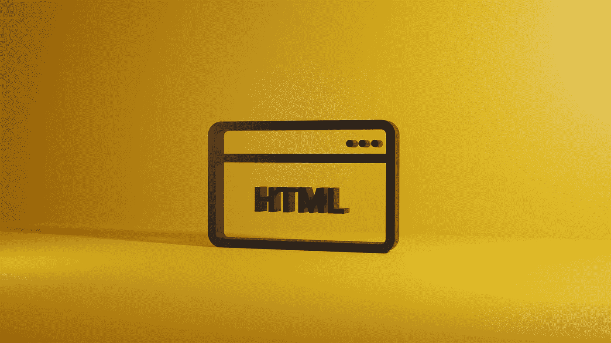

# HTML 和 CSS 面试问题

> 原文：<https://javascript.plainenglish.io/html-and-css-interview-questions-d3659aa58187?source=collection_archive---------0----------------------->

## 必须知道 HTML 和 CSS 的面试问题



Photo by [Jackson Sophat](https://unsplash.com/@jacksonsophat?utm_source=medium&utm_medium=referral) on [Unsplash](https://unsplash.com?utm_source=medium&utm_medium=referral)

HTML 是网页的标准标记语言。它代表**超文本标记语言**。它指示 web 浏览器如何显示网页。
HTML 对于网络开发者来说是不够的。作为 web 开发人员，我们需要亲自操作 HTML 和 CSS。因此，在准备 web 开发人员面试时，准备 HTML 和 CSS 问题变得非常重要。下面是我在多家公司面试时遇到的一些面试问题。希望对你的备考有所帮助。

# HTML 面试问题

1.  **HTML 中的 DOCTYPE 是什么？**

**DOCTYPE** 是文档类型声明。它告诉浏览器页面是用 HTML 编写的，以及使用的 HTML 版本。是 HTML5 的语法。
每个 HTML 页面都必须以 DOCTYPE 开头。如果未指定 DOCTYPE，网络浏览器将无法获取 HTML 版本，并将进入**模式。**

**2** 。**`**<!DOCTYPE html>**`**和** `**<!Doctype html>**` **有什么区别？哪个语法是有效的？****

**这两种语法都是有效的，它们之间没有区别，因为 doctype 声明不区分大小写。**

****3。HTML 中的 void 元素或 singleton 标签是什么？****

**单例标记/void 元素是不需要结束标记的元素。
、**

* * *

**标签是单例标签的一些例子。

```
<br> tag 
<hr> tag
``` 

****4。HTML 中的语义元素是什么？****

****语义成分=有意义成分。他们以一种对开发者和网络浏览器都有意义的方式描述他们持有的信息。
例如，< p >，页脚标签被认为是语义标签，因为它们非常清楚地说明了它们的用途和内容类型。****

**示例:**

```
 <p>
        <header>
        <footer>
        <table>
```

****5。div 和 span 有什么区别？****

*   **div 用于将网页分成块，而 span 用于对元素进行分组，不会对网页产生任何副作用。**
*   **div 是块级元素，而 Span 是内联元素。**
*   **开发人员可以通过使用 div 标签来保存网页的部分并应用样式，而 span 可以很容易地用于样式化段落中的任何单词/短语。**

****6。版权符号的代码是什么？****

```
Use &copy; or &#169; in an HTML file for copyright symbol.
```

****7。HTML5 有哪些特性？****

****HTML5 特性:****

*   **标题元素**
*   **页脚元素**
*   **截面元素**
*   **音频和视频插件**
*   **本地数据存储**
*   **电子邮件输入**
*   **图形元素**
*   **帆布**

****8。** `**Localstorage**` **和** `**Sessionstorage**` **有什么区别？****

**本地存储和会话存储几乎相同，唯一的区别是在窗口/选项卡关闭后，会话存储数据将被自动删除。
`Localstorage` 标签页/窗口关闭时数据不会被清除，只有当用户删除数据或 web 应用程序清除数据时，数据才会被删除。
借助本地/会话存储，我们可以存储比 cookies 多得多的数据。也比 cookies 更安全。**

****9。我们可以在 HTML 页面上使用多个 body 标签吗？****

**我们不能在一个 HTML 文档中使用多个 body 标签。如果在一个 HTML 文档中有多对 body 标签，那么它将被认为是无效的 HTML。大多数时候，它不会给出错误，直到用户在其中添加一些脚本或 CSS。**

****10。HTML 中的列表元素是什么？****

****HTML 列表元素:****

*   **列表项:**
*   **定义列表项。**
*   **有序列表:** 
*   **无序列表:** 
*   **描述列表:定义描述列表。**

# **CSS 面试问题**

****

**Photo by [KOBU Agency](https://unsplash.com/@kobuagency?utm_source=medium&utm_medium=referral) on [Unsplash](https://unsplash.com?utm_source=medium&utm_medium=referral)**

1.  ****CSS 中的** `**vh**` **单位是什么？****

**`vh`代表**视口高度**。它以相对于视口的百分比来测量高度。对于全页高度，它将是 100vh。`vh`常用于我们想要为整个页面设置背景色的时候。**

****2。inline 元素和 block 元素有什么区别？****

*   **Span 是内联元素的一个例子，div 是块级元素的一个例子。**
*   **内联元素主要用在一些父元素中，如

    ，它是一个块级元素，用于对特定的行/短语应用样式。行内元素从同一行开始影响。
    块级元素用于将网页划分成块，并对其应用样式/执行操作。它们跳过定义它们的那一行，从新的一行开始影响。** 

****3。CSS 中的盒子模型是什么？****

**顾名思义，你可以说 CSS 盒子模型是一个包装每个 HTML 元素的盒子，包括内容、填充、边框和边距。内容是包含网页实际内容的最里面的部分。然后是边框环绕的填充。边距是清除边框之外区域的最外面部分。**

```
//Inspect TnS_box class,You can clearly check how box model is using below properties     
        TnS_box{
          padding : 15px;
          border : 20px solid black;
          margin : 25px;
          color : red;
          font-size : 20px;
        }
```

****4。**`**em**`**`**rem**`**`**pixel**`**有什么区别？什么时候不应该使用像素单位？********

*   ****`**pixel(px)**`被认为是一个绝对单位。`**Rem**`和`**em**`被认为是相对单位。****
*   ****像素单元是固定的，不相对于其他元素调整大小。****
*   ****根元素(`**rem**`)是相对于根元素的。****
*   ****元素(`**Em**`)相对于其父元素。****
*   ****在处理响应性网页时使用像素单位会导致糟糕的用户体验，因为像素不会根据其他元素来调整它们的大小。****

******5。什么是不同的职位属性？******

****CSS 位置属性如下:****

*   ******静态:**当位置静态时，元素不受左、右、上、下属性的影响。通过**默认**所有元素都是**静态**。****
*   ******相对:**相对位置应用于一个元素时，会受到左、右、上、下属性的影响。****
*   ******绝对:**当元素位置为绝对时，将相对于其父元素定位。****
*   ******固定:**当元素定位为固定时，不会受到滚动的影响。它将保持固定在其位置。
    如 App 头。****
*   ******Sticky:** 当元素被定位为 Sticky 时，它将显示相对位置和固定位置的组合属性。
    例如，如果我们有多个应用程序标题，并且粘性位置应用于标题 2，则标题 2 将表现为相对的，直到标题 1 的滚动结束，然后它将表现为固定的，不会从其位置移动。****

******6。** `**visibility :hidden**` **和** `**display :none**` **有什么区别？******

****`**Visibility : hidden**`表示我们要求使该元素在网页上不可见，但这里要注意的一点是，该元素只是被隐藏，但它占用了网页上的空间/尺寸。****

****`**Display : none**`表示我们根本没有在网页上显示该元素，因此，在这种情况下，它不会占用网页上的空间，其他元素也会相应地进行调整。****

******举例:**假设你的网页上有三个按钮**登录、注销和简介**。当`visibility : hidden`应用于登录按钮时，它将被隐藏，但仍会占据其在屏幕上的空间，其他按钮不作调整。
当`display : none`应用于登录按钮时，它将从页面中移除，现在注销将在登录按钮的位置进行调整，个人资料按钮将移动到注销按钮的位置。****

******7。CSS 中的特异性是什么？优先顺序是什么？******

****web 浏览器使用特殊性来决定哪个 CSS 属性应该应用于给定的元素。当同一个元素被多个 CSS 类声明作为目标时，特殊性就出现了。****

****内联 CSS 样式比 ID 具有更高的优先级，ID 后面是类名。****

******8。在网页中集成 CSS 的不同方式？******

****有三种方法可以将 CSS 集成到网页中:****

*   ******内部**:内部 CSS 将应用于单个网页。它被定义在页面<头>部分的顶部。****
*   ******外部**:创建外部 CSS 文件并全局应用于所有页面。我们需要在<链接>元素中配置外部 CSS 文件的路径。****
*   ******Inline** : Inline CSS 应用于网页中的单个块/元素。****

```
**//Internal CSS
     <head>
     <style>
     p { font-size : 30px; }
     </style>
     </head> <p style="font-size : 30px">This is Inline CSS.</p> //Inline CSS**
```

******9。** `**margin : 10px 20px 30px 40px**` **，margin-top 的值是多少？******

****对于 margin 和 padding 属性，您可以将其记为— Margin 从顶部开始以顺时针方向获取元素的值。它将是右上左下。
在代码中，给定的页边距顶部将是 **10px** 。****

****10。塌陷扩展的默认行为是什么？怎么改？****

****折叠到展开的默认行为是从上到下。为了更好的理解，你可以把它和手风琴的行为联系起来。我们可以很容易地改变这种行为。如果我们将 flex-direction 指定为 column-reverse，折叠将从下到上向上展开。****

```
**display: flex;      
flex-direction: column-reverse;**
```

****11。边距和填充有什么区别？****

****按照 CSS box 模型，填充是实际页面内容和边框之间的空白空间。边距是边界之外的区域。换句话说，相对于应用于元素的边框，我们可以说填充在内，边距在外。****

****本文到此为止。如果你发现这篇文章对你的准备有帮助，请不要忘记检查其他文章！****

*****更多内容请看*[***plain English . io***](https://plainenglish.io/)*。报名参加我们的* [***免费周报***](http://newsletter.plainenglish.io/) *。关注我们关于*[***Twitter***](https://twitter.com/inPlainEngHQ)[***LinkedIn***](https://www.linkedin.com/company/inplainenglish/)*[***YouTube***](https://www.youtube.com/channel/UCtipWUghju290NWcn8jhyAw)*[***不和***](https://discord.gg/GtDtUAvyhW) *。对增长黑客感兴趣？检查* [***电路***](https://circuit.ooo/) *。*******